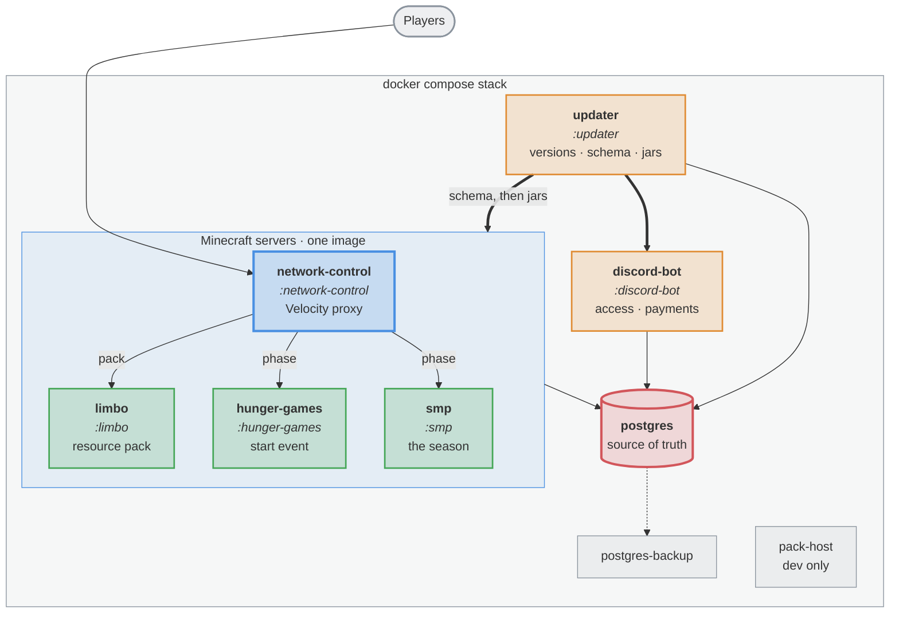

# season-2

Everything nordtal.eu season 2 deploys: four Minecraft plugins, a Discord bot, a version updater and
the resource pack. One Gradle multi-module build, one version in `gradle.properties`, one
`docker compose` stack.

## The network

A Velocity proxy in front of three Paper backends. Every login lands on `limbo`, is offered the
resource pack, and is released onto whichever backend the current season phase names.



Italic names are Gradle modules; every other box is a container in `compose.yml`. The four library
modules — `:common`, `:commands`, `:paper-common` and `:resource-pack` — have no container of their
own: they are compiled into the jars above.

**The database is the source of truth** for access, language, season phase and event state. Discord
roles are a projection of it, never the other way round.

## Modules

| module | platform | what it owns |
|---|---|---|
| `network-control` | Velocity | The login gate, the season phase, and which backend a player belongs on. |
| `limbo` | Paper | The waiting room: applying and enforcing the resource pack before a player goes anywhere. |
| `hunger-games` | Paper | The start event — registration, teams, border, loot, HUD, winning. |
| `smp` | Paper | The SMP: Nordtal, the farm world, the Nether and the End, milestones, aura, prestige, duels, graves. |
| `discord-bot` | JVM app | Sells access periods, books bunq payments, mirrors admins. |
| `updater` | JVM app | Resolves platform and plugin versions, migrates the schema, swaps jars, restarts the stack. |
| `common` | library | Access API, message system, glyph constants, the phase enum, the `LISTEN`/`NOTIFY` loop, the migration SQL. |
| `paper-common` | library | What the three Paper plugins share and Velocity cannot use. |
| `commands` | library | Every command in the network, declared once. |
| `resource-pack` | assets | The pack, its fonts, and the zip + SHA-1 a release ships. |

`DisplayTags` also runs on this network but ships from its own repo,
[nordtal/papermc-display-tags](https://github.com/nordtal/papermc-display-tags).

## How the pieces fit

**A command is declared once, in `:commands`, and appears on every surface that can carry it.** An
admin command works in game and in Discord alike; where its effect belongs to another process it
travels as a row in `command_request`. A player command must additionally be on the allowlist in
`network.yml`, or it does not exist — everything unlisted is refused with the same line a typo gets.

**The season runs through four phases** — `PRE_EVENT`, `START_EVENT`, `SMP`, `MAINTENANCE` — which
decide who gets in and where they land. The phase is one database row, switched from either the proxy
or Discord and propagated by `NOTIFY`, with polling as the guarantee behind it.

**Access is paid, and only from the `SMP` phase onwards**; the start event is free for every linked
member. A purchase is a bunq payment matched back to an open reference; the resulting access period
is a row, and the plugins only ever read it.

**Everything a player reads is translated.** German and English ship; a further language is a config
entry and a bundle, not a release. The lookup happens once per join, off the main thread.

**The SMP's design is distance.** There is no `/home`, `/tpa`, `/back` or `/spawn` and there never
will be; the balloon is the only fast travel given. Milestones are network-wide objectives that pay
out *aura*, the season's currency — earned by contributing, lost on death.

**The resource pack and the plugins are one artefact in two halves.** Glyph code points are allocated
in [`resource-pack/README.md`](resource-pack/README.md), mirrored by `:common`'s `Glyphs` and the font
files, and held against each other by a test on every build. Change one, change all of them.

## Building

Requires JDK 25.

```bash
./gradlew build
```

Each module builds its own artefact; there is no combined one. To produce exactly what a release
ships:

```bash
./gradlew releaseArtifacts
```

A Paper module has a local test server:

```bash
./gradlew :hunger-games:runServer
```

The proxy has none. Anything involving the proxy, the login path, the resource pack or two servers at
once wants the whole network, which runs on your own machine off the same `compose.yml` the
production host uses:

```bash
deploy/dev init && deploy/dev up
```

`deploy/dev deploy smp` then rebuilds one module and restarts one container. The runbook is
[deploy/README.md](deploy/README.md).

## Releasing

The version in `gradle.properties` is the single source of truth, and **a release is a published
GitHub release, not a pushed tag** — pushing the tag alone builds nothing:

```bash
git tag v0.1.0 && git push origin v0.1.0
gh release create v0.1.0 --title v0.1.0 --generate-notes
```

The `release` workflow refuses a tag that disagrees with `gradle.properties`, runs
`./gradlew check releaseArtifacts`, verifies the pack zip against its own SHA-1, attaches the plugin
jars, the bot jar and the pack, and pushes `ghcr.io/nordtal/discord-bot:<version>`. A failed build is
re-run against the same release with `gh workflow run release.yml -f tag=v0.1.0`.

## Configuration

Every config file is commented YAML described by a `@ConfigSpec` interface and loaded through
`eu.nordtal.jcore.config`. Reading one, next to its interface, is the fastest way to learn what a
module does.

This repository is public and contains no secrets. Every credential — the Discord bot token, the bunq
API key, database access — arrives through environment variables at runtime; committed configuration
files are examples only.
