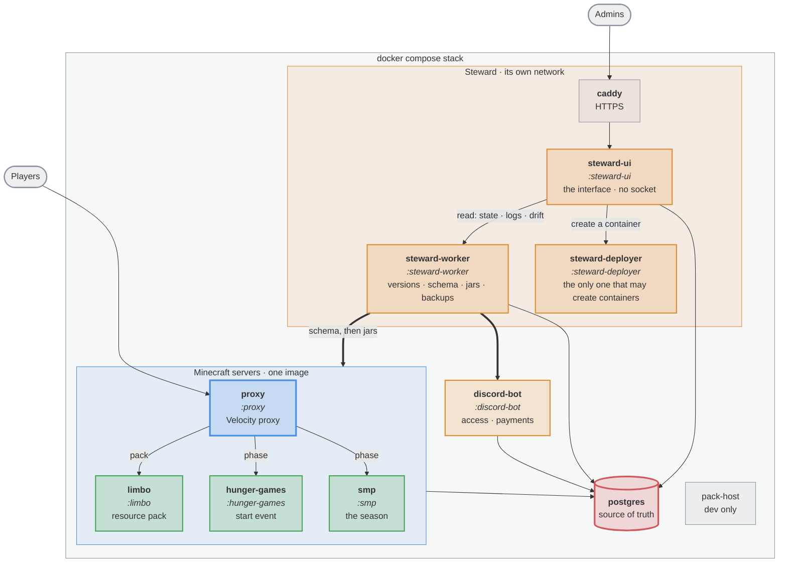

# season-2

Everything nordtal.eu season 2 deploys: four Minecraft plugins, a Discord bot, the three Steward
services and the resource pack. One Gradle multi-module build, one version in `gradle.properties`,
one `docker compose` stack.

**Steward is the name of the system that runs this deployment**, and it is three services, not one:
`steward-worker` does versions, the schema, jars and backups; `steward-ui` is the web interface;
`steward-deployer` is the only service allowed to create a container. Until 2026-09-13 the last two
were a third-party management panel, and the deployment was a checkout on the host that its GitOps
sync could overwrite. `steward-worker` was called `updater` until 2026-09-12.

## Installing it

On a host with a Docker daemon and nothing else, in the directory the installation should live in:

```bash
curl -fsSL https://raw.githubusercontent.com/nordtal/season-2/main/deploy/nordtal.sh | bash
```

It asks whether that directory is really the right one, then for the handful of things only a
person knows, and deploys. **The installation is that directory**: every world, the database, every
plugin's configuration and the nightly backups are folders in it, which is what makes SFTP a way in
to them. The secrets are the one thing that is not there - they go to `/etc/nordtal/season-2.env`,
mode 600.

The script stays behind as `./nordtal.sh`. Running it again lists what is set, lets one be changed
and deploys; it fetches the current version of itself on every run and says which one it is running.
[`deploy/README.md`](deploy/README.md) is the runbook.

## The network

A Velocity proxy in front of three Paper backends. Every login lands on `limbo`, is offered the
resource pack, and is released onto whichever backend the current season phase names.



Italic names are Gradle modules; every other box is a container in `compose.yml`. The four library
modules — `:common`, `:commands`, `:paper-common` and `:resource-pack` — have no container of their
own: they are compiled into the jars above.

**A service is named after its role, and a replacement instance of one is that name plus `-standby`**
— `proxy-standby`, `limbo-standby`. That is the whole rule, and it is a rule rather than a colour
pair because a standby always takes the ordinary role of the service it stands in for: it runs the
same jar under the same configuration, and nothing outside the run that created it has to learn a
second identity. (The module is `proxy` and not `velocity` for the same reason — the name has to
survive the day the proxy is a different piece of software.)

**The Steward box is a second Docker network, and the Minecraft services are not on it.** Otherwise
"the internal API is only reachable from inside" would also read "any plugin may deploy". `postgres`
is on both, because it is the one thing both halves genuinely share. `steward-ui` is the part facing
the internet and therefore the part that can do the least: it owns no Docker socket, and everything
it knows about a container it asks one of the other two for, with a different shared secret for each.

**The database is the source of truth** for access, language, season phase and event state. Discord
roles are a projection of it, never the other way round.

## Modules

| module | platform | what it owns |
|---|---|---|
| `proxy` | Velocity | The login gate, the season phase, and which backend a player belongs on. |
| `limbo` | Paper | The waiting room: applying and enforcing the resource pack before a player goes anywhere. |
| `hunger-games` | Paper | The start event — registration, teams, border, loot, HUD, winning. |
| `smp` | Paper | The SMP: Nordtal, the farm world, the Nether and the End, milestones, aura, prestige, duels, graves. |
| `discord-bot` | JVM app | Sells access periods, books bunq payments, mirrors admins. |
| `steward-worker` | JVM app | Resolves platform and plugin versions, migrates the schema, swaps jars, stops and starts the servers around a run, and takes the nightly backup. |
| `steward-ui` | JVM app + React | The web interface: state, logs, configuration, seasons, access, payments, the journal. No Docker socket, ever. |
| `steward-deployer` | JVM app | The only service allowed to create a container. Carries `compose.yml` inside its own image. |
| `common` | library | Access API, message system, glyph constants, the phase enum, the `LISTEN`/`NOTIFY` loop, the migration SQL. |
| `paper-common` | library | What the three Paper plugins share and Velocity cannot use. |
| `commands` | library | Every command in the network, declared once. |
| `resource-pack` | assets | The pack, its fonts, and the zip + SHA-1 a release ships. |

`DisplayTags` also runs on this network but ships from its own repo,
[nordtal/papermc-display-tags](https://github.com/nordtal/papermc-display-tags).

## How the pieces fit

**A command is declared once, in `:commands`, and appears on every surface that can carry it.** An
admin command works in game and in Discord alike; where its effect belongs to another process it
travels as a row in `command_request`. A player command must additionally be on the allowlist in
`network.yml`, or it does not exist — everything unlisted is refused with the same line a typo gets.

**The season runs through four phases** — `PRE_EVENT`, `START_EVENT`, `SMP`, `MAINTENANCE` — which
decide who gets in and where they land. The phase is one database row, switched from either the proxy
or Discord and propagated by `NOTIFY`, with polling as the guarantee behind it.

**Access is paid, and only from the `SMP` phase onwards**; the start event is free for every linked
member. A purchase is a bunq payment matched back to an open reference; the resulting access period
is a row, and the plugins only ever read it.

**Everything a player reads is translated.** German and English ship; a further language is a config
entry and a bundle, not a release. The lookup happens once per join, off the main thread.

**The SMP's design is distance.** There is no `/home`, `/tpa`, `/back` or `/spawn` and there never
will be; the balloon is the only fast travel given. Milestones are network-wide objectives that pay
out *aura*, the season's currency — earned by contributing, lost on death.

**The resource pack and the plugins are one artefact in two halves.** Glyph code points are allocated
in [`resource-pack/README.md`](resource-pack/README.md), mirrored by `:common`'s `Glyphs` and the font
files, and held against each other by a test on every build. Change one, change all of them.

**The deployment deploys itself, and `compose.yml` travels inside an image.** `steward-deployer`
carries the file it runs, so "which compose file is live" has a version number for an answer rather
than a directory on the host that somebody edited during an incident. The cost is stated plainly: a
change to the deployment needs a new image of that service, and the one thing that cannot renew it
is that service — so [`deploy/nordtal.sh`](deploy/nordtal.sh) does, from outside the stack. That script
is also what resolves the interface's host name and **waits** until it points at this host, rather
than deploying an interface whose certificate can never be issued.

## Building

Requires JDK 25.

```bash
./gradlew build
```

Each module builds its own artefact; there is no combined one. To produce exactly what a release
ships:

```bash
./gradlew releaseArtifacts
```

A Paper module has a local test server:

```bash
./gradlew :hunger-games:runServer
```

The proxy has none. Anything involving the proxy, the login path, the resource pack or two servers at
once wants the whole network, which runs on your own machine off the same `compose.yml` the
production host uses:

```bash
deploy/dev init && deploy/dev up
```

`deploy/dev deploy smp` then rebuilds one module and restarts one container. The runbook is
[deploy/README.md](deploy/README.md).

## Releasing

The version in `gradle.properties` is the single source of truth, and **a release is a published
GitHub release, not a pushed tag** — pushing the tag alone builds nothing:

```bash
git tag v0.1.0 && git push origin v0.1.0
gh release create v0.1.0 --title v0.1.0 --generate-notes
```

The `release` workflow refuses a tag that disagrees with `gradle.properties`, runs
`./gradlew check releaseArtifacts imageContexts`, verifies the pack zip against its own SHA-1,
attaches the plugin jars, the bot jar and the pack, and pushes **all five images** —
`discord-bot`, `steward-worker`, `minecraft`, `steward-ui` and `steward-deployer` — each tagged with
the version and with `latest`. A failed build is re-run against the same release with
`gh workflow run release.yml -f tag=v0.1.0`.

**A deploy pulls and never builds**, so an image that exists only in one host's daemon fails with
`denied` from the registry — which is also what a package that is still private answers. A new
package under an organisation is private on its first push, and **three of the five have never
been pushed**: `steward-ui`, `steward-deployer` and — less obviously — `steward-worker`, because
renaming `updater` renamed the package with it. `TopologyTest` holds every image `compose.yml`
defaults to against the workflow that pushes it, but only a registry can answer the other half;
[`deploy/README.md`](deploy/README.md) has what was measured and when.

## Configuration

Every config file is commented YAML described by a `@ConfigSpec` interface and loaded through
`eu.nordtal.jcore.config`. Reading one, next to its interface, is the fastest way to learn what a
module does.

This repository is public and contains no secrets. Every credential — the Discord bot token, the bunq
API key, database access — arrives through environment variables at runtime; committed configuration
files are examples only.

### The one thing that leaves the deployment

Steward's identity display draws a player's Minecraft head from an image service, by default
[Crafatar](https://crafatar.com) (`steward-ui.yml`, `avatars.minecraft-head-base-url`). That means
**every render sends a third party the `mc_uuid` being looked at** — on the strength of an admin
merely opening a page, with no consent step in front of it. Nothing else about the player goes with
it, and no image is ever stored: a face is a pure function of the uuid and that base URL, which is
why it is a config value and never a column.

It is written down here rather than only in the spec's comment because it is the only outbound
dependency the season has on a service nobody here runs. Crafatar makes no uptime promise, so a
non-answer is drawn as a placeholder and never blocks the page. Pointing the setting somewhere else,
or at an empty string, is a config edit and needs no build (steward/44, steward/45).
