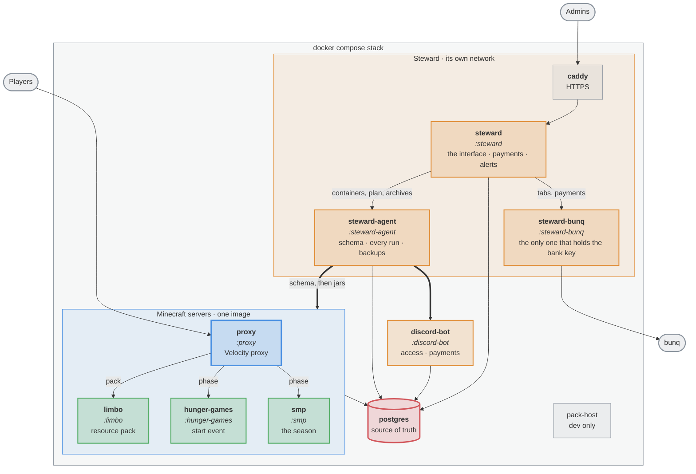

# season-2

Everything nordtal.eu season 2 deploys: four Minecraft plugins, a Discord bot, the three Steward
services and the resource pack. One Gradle build, one version in `gradle.properties`, one
`docker compose` stack.

## Installing

On a host with Docker, in the directory the installation should live in:

```bash
curl -fsSL https://raw.githubusercontent.com/nordtal/season-2/main/deploy/nordtal.sh | bash
```

The installation is that directory: worlds, database, plugin configuration and backups are folders
in it. Secrets go to `/etc/nordtal/season-2.env`, mode 600. The script stays behind as
`./nordtal.sh` to change a setting and redeploy. [`deploy/README.md`](deploy/README.md) is the
runbook.

## The network

A Velocity proxy fronts three Paper backends. Every login lands on `limbo`, gets the resource pack,
and moves on to the backend the current season phase names.


```mermaid
%%{init: {'themeVariables': {'fontSize': '16px'}}}%%
flowchart TB
    players(["Players"]):::ext --> NC

    subgraph stack["docker compose stack"]
        direction TB
        subgraph steward["Steward · its own network"]
            direction TB
            CADDY["<b>caddy</b><br/>HTTPS"]:::side
            UPD["<b>steward</b><br/><i>:steward</i><br/>the interface · payments · alerts"]:::app
            DEP["<b>steward-agent</b><br/><i>:steward-agent</i><br/>schema · every run · backups"]:::app
            BANK["<b>steward-bunq</b><br/><i>:steward-bunq</i><br/>the only one that holds the bank key"]:::app
        end
        subgraph servers["Minecraft servers · one image"]
            direction TB
            NC["<b>proxy</b><br/><i>:proxy</i><br/>Velocity proxy"]:::proxy
            LIMBO["<b>limbo</b><br/><i>:limbo</i><br/>resource pack"]:::paper
            HG["<b>hunger-games</b><br/><i>:hunger-games</i><br/>start event"]:::paper
            SMP["<b>smp</b><br/><i>:smp</i><br/>the season"]:::paper
        end
        BOT["<b>discord-bot</b><br/><i>:discord-bot</i><br/>access · payments"]:::app
        PG[("<b>postgres</b><br/>source of truth")]:::db
        PACKHOST["pack-host<br/>dev only"]:::side
    end

    admins(["Admins"]):::ext --> CADDY
    BANK --> bunq(["bunq"]):::ext
    players ~~~ UPD
    CADDY --> UPD
    UPD -->|"containers, plan, archives"| DEP
    UPD -->|"tabs, payments"| BANK
    DEP ==>|"schema, then jars"| servers
    DEP ==> BOT
    DEP --> PG
    NC -->|"pack"| LIMBO
    NC -->|"phase"| HG
    NC -->|"phase"| SMP
    servers --> PG
    BOT --> PG
    UPD --> PG

    classDef ext fill:#8b949e26,stroke:#8b949e,stroke-width:2px
    classDef proxy fill:#4a90e233,stroke:#4a90e2,stroke-width:3px
    classDef paper fill:#46a75833,stroke:#46a758,stroke-width:2px
    classDef app fill:#e08c3433,stroke:#e08c34,stroke-width:2px
    classDef db fill:#d2565b33,stroke:#d2565b,stroke-width:3px
    classDef side fill:#8b949e1a,stroke:#8b949e,stroke-width:1px
    style stack fill:#8b949e14,stroke:#8b949e,stroke-width:1px
    style servers fill:#4a90e21a,stroke:#4a90e2,stroke-width:1px
    style steward fill:#e08c341a,stroke:#e08c34,stroke-width:1px
```

Italic names are Gradle modules; every other box is a container in `compose.yml`. The libraries in
the table below are compiled into the jars above.

- A standby instance of a service is its name plus `-standby` and runs the same jar and config.
- The Steward services sit on their own Docker networks; the Minecraft servers do not, so no plugin
  can reach the deploy API. `postgres` is on both. `steward-agent` and `steward-bunq` each share an
  internal network with `steward` and nobody else; `steward-agent` also reaches postgres and the
  release sources through `steward`'s network.
- `steward` faces the internet and holds no Docker socket: `steward-agent` alone does, carries out
  every run a row in `steward_inbox` asks for, and serves steward containers, logs, measurements,
  archives and the plan of the next update.
- The database is the source of truth for access, language, phase and event state. Discord roles
  follow it.

## Modules

| module              | platform        | what it owns                                                                                                     |
| ------------------- | --------------- | ---------------------------------------------------------------------------------------------------------------- |
| `proxy`             | Velocity        | The login gate, the season phase, and which backend a player belongs on.                                         |
| `limbo`             | Paper           | The waiting room: applying and enforcing the resource pack before a player goes anywhere.                        |
| `hunger-games`      | Paper           | The start event: registration, teams, border, loot, HUD, winning.                                                |
| `smp`               | Paper           | The SMP: Nordtal, the farm world, the Nether and the End, milestones, aura, prestige, duels, graves.             |
| `discord-bot`       | JVM app         | Sells access periods, books bunq payments, mirrors admins.                                                       |
| `steward`           | JVM app + React | The web interface and its API, payments, alerts and the clocks that ask for runs.                                |
| `steward-agent`     | JVM app         | The schema, every jar version and every run. The only service allowed to create a container.                     |
| `steward-bunq`      | JVM app         | The only service holding the bank key: creates and cancels tabs, lists payments. Decides nothing.                |
| `common`            | library         | The shared kernel: platform constants, the phase enum, languages, readiness. No database, no Adventure, no pack. |
| `database`          | library         | Access, phase, online, audit, the request inboxes, the signal hub and the migration SQL.                         |
| `messages`          | library         | The message system without Adventure: bundles, specs, contexts. The bot and Steward stop here.                   |
| `message-rendering` | library         | Messages as Adventure components, for Paper and Velocity code.                                                   |
| `pack-rendering`    | library         | Glyph constants, the `<glyph:name>` tag, boss bar and tab list rendering from the resource pack.                 |
| `limbo-protocol`    | library         | The wire protocol between the proxy and limbo.                                                                   |
| `internal-api`      | library         | The token-guarded HTTP wire between `steward` and the services only it may call, and the bank's wire records.    |
| `paper-common`      | library         | What the three Paper plugins share and Velocity cannot use.                                                      |
| `settings`          | library         | Where every process's settings come from, and the database and colour settings they share.                       |
| `resource-pack`     | assets          | The pack, its fonts, and the zip + SHA-1 a release ships.                                                        |
| `architecture`      | tests           | The ArchUnit rules over every module's compiled classes: the dependency lists and the wiring.                    |

`DisplayTags` also runs on this network and ships from
[nordtal/papermc-display-tags](https://github.com/nordtal/papermc-display-tags).

## How the pieces fit

- **Commands** are native Brigadier per plugin. An admin command is typed on that server's console; what Steward
  asks for is a typed request in that server's inbox, answered by the same action. Player commands also need
  the network's command allowlist, a setting edited in Steward.
- **Phases** are `PRE_EVENT`, `START_EVENT`, `SMP` and `MAINTENANCE`, one database row every process
  re-reads through its signal hub.
- **Access** is paid from `SMP` on; the start event is free for linked members. A bunq payment is
  matched to an open reference and becomes an access period row.
- **Text** a player reads is translated, German and English, looked up once per join off the main
  thread.
- **Glyphs** are allocated in [`resource-pack/README.md`](resource-pack/README.md), mirrored by
  `Glyphs` and the font files, and checked against each other on every build.
- **Update runs** park players on a `-standby` service while the real one is swapped. Caddy hands
  port 25565 to whichever proxy is live.
- **`compose.yml`** ships inside the `steward-agent` image. An update to a newer release runs in a
  one-shot `steward-agent` at that release, which renews the long-running one last.

## Building

Requires JDK 25.

```bash
./gradlew build
./gradlew releaseArtifacts          # exactly what a release ships
./gradlew :hunger-games:runServer   # a local Paper test server
./gradlew -q :dev:run --args="init" # then --args="up": the whole network here
```

`dev deploy smp` rebuilds one module and restarts its container. `dev` is a Java program in `:dev`,
run from IntelliJ's _dev: stack_ folder or as `./gradlew -q :dev:run --args="<command>"`; it needs
Java and Docker on any operating system.

## Releasing

A release is a published GitHub release, not a pushed tag:

```bash
gh release create v0.1.0 --target main --title v0.1.0 --generate-notes
```

The `release` workflow refuses a tag that disagrees with `gradle.properties`, pushes every image
tagged with the version alone, and only then attaches the four plugin jars and the pack. Rerun a failed build
with `gh workflow run release.yml -f tag=v0.1.0`. A deploy only pulls, so an unpublished image fails
with `denied`.

## Configuration

Every config file is commented YAML described by a `@ConfigSpec` interface. Credentials arrive as
environment variables; this public repository holds none.

The one outbound call to a third party: Steward draws player heads from
[mineatar](https://mineatar.io), sending it the `mc_uuid` on each render
(the `web` group, `avatars.minecraft-head-base-url`; empty disables it).
