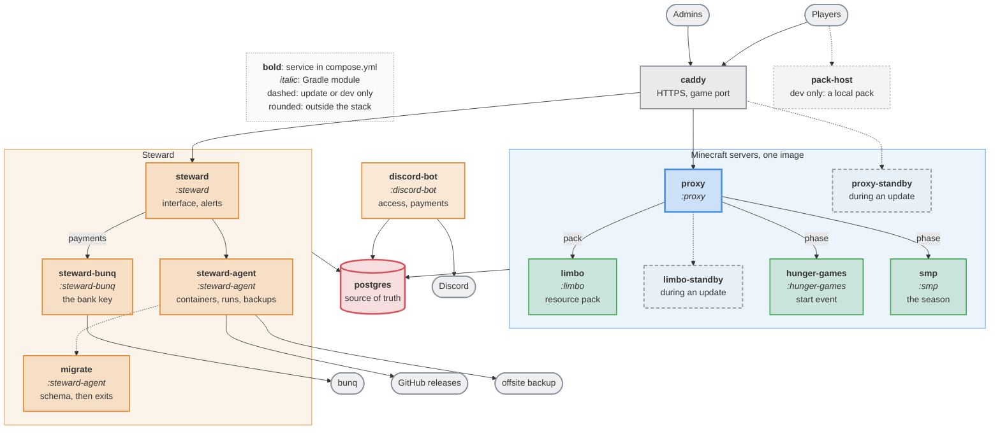

# season-2

The code and deployment of nordtal.eu season 2: four Minecraft plugins, a Discord bot, the three
Steward services and the resource pack. It is built with one Gradle build, versioned in
`gradle.properties` and run as one `docker compose` stack. [`CONVENTIONS.md`](CONVENTIONS.md) holds
the rules every change follows.

## What it is

A Velocity proxy fronts three Paper backends. Every player first lands in `limbo`, receives the
resource pack and is then sent on to the backend that the current season phase names. Access,
language, phase and event state live in one PostgreSQL database, and Discord roles follow it.
Steward is the admins' web interface and carries out every update, restart and backup.

## How it is built


```mermaid
%%{init: {'themeVariables': {'fontSize': '16px'}, 'flowchart': {'wrappingWidth': 240, 'diagramPadding': 8}}}%%
flowchart TB
    LEG["<b>bold</b>: service in compose.yml<br/><i>italic</i>: Gradle module<br/>dashed: update or dev only<br/>rounded: outside the stack"]:::key
    players(["Players"]):::ext
    admins(["Admins"]):::ext
    CADDY["<b>caddy</b><br/>HTTPS, game port"]:::entry
    PACK["<b>pack-host</b><br/>dev only: a local pack"]:::side

    subgraph mc["Minecraft servers, one image"]
        NC["<b>proxy</b><br/><i>:proxy</i>"]:::proxy
        NCS["<b>proxy-standby</b><br/>during an update"]:::standby
        LIMBO["<b>limbo</b><br/><i>:limbo</i><br/>resource pack"]:::paper
        LIMBOS["<b>limbo-standby</b><br/>during an update"]:::standby
        HG["<b>hunger-games</b><br/><i>:hunger-games</i><br/>start event"]:::paper
        SMP["<b>smp</b><br/><i>:smp</i><br/>the season"]:::paper
    end

    subgraph st["Steward"]
        UPD["<b>steward</b><br/><i>:steward</i><br/>interface, alerts"]:::app
        DEP["<b>steward-agent</b><br/><i>:steward-agent</i><br/>containers, runs, backups"]:::app
        BANK["<b>steward-bunq</b><br/><i>:steward-bunq</i><br/>the bank key"]:::app
        MIG["<b>migrate</b><br/><i>:steward-agent</i><br/>schema, then exits"]:::app
    end

    BOT["<b>discord-bot</b><br/><i>:discord-bot</i><br/>access, payments"]:::app
    PG[("<b>postgres</b><br/>source of truth")]:::db

    bunq(["bunq"]):::ext
    discord(["Discord"]):::ext
    gh(["GitHub releases"]):::ext
    offsite(["offsite backup"]):::ext

    players --> CADDY
    players -.-> PACK
    admins --> CADDY
    CADDY --> NC
    CADDY -.-> NCS
    CADDY --> UPD
    NC -->|"pack"| LIMBO
    NC -->|"phase"| HG
    NC -->|"phase"| SMP
    NC -.-> LIMBOS
    UPD --> DEP
    UPD -->|"payments"| BANK
    BANK --> bunq
    DEP -.-> MIG
    DEP --> gh
    DEP --> offsite
    LEG ~~~ BOT
    BOT --> discord
    mc --> PG
    BOT --> PG
    st --> PG

    classDef key fill:#8b949e0d,stroke:#8b949e,stroke-width:1px,stroke-dasharray:2 2
    classDef ext fill:#8b949e26,stroke:#8b949e,stroke-width:2px
    classDef entry fill:#8b949e33,stroke:#8b949e,stroke-width:2px
    classDef proxy fill:#4a90e233,stroke:#4a90e2,stroke-width:3px
    classDef paper fill:#46a75833,stroke:#46a758,stroke-width:2px
    classDef standby fill:#8b949e0d,stroke:#8b949e,stroke-width:2px,stroke-dasharray:6 4
    classDef app fill:#e08c3433,stroke:#e08c34,stroke-width:2px
    classDef db fill:#d2565b33,stroke:#d2565b,stroke-width:3px
    classDef side fill:#8b949e1a,stroke:#8b949e,stroke-width:1px,stroke-dasharray:3 3
    style mc fill:#4a90e21a,stroke:#4a90e2,stroke-width:1px
    style st fill:#e08c341a,stroke:#e08c34,stroke-width:1px
```

`compose.yml` ships inside the `steward-agent` image. The libraries below are compiled into the jars
above.

- **Networks.** The Minecraft servers share none with Steward, so no plugin reaches the agent.
  `steward-agent` and `steward-bunq` each share an internal network with `steward` and nobody else.
- **One door to Docker.** `steward` faces the internet and holds no Docker socket. `steward-agent`
  does, and carries out every run a row in `steward_inbox` asks for.
- **One holder of the bank key.** `steward-bunq` alone, and it decides nothing.
- **Standbys.** `proxy-standby` and `limbo-standby` hold the network while an update replaces the real
  service; Caddy hands port 25565 to whichever proxy is live.
- **Commands** are Brigadier per plugin. An admin command is typed on that server's console, and what
  Steward asks for is a typed request in that server's inbox, answered by the same action.
- **Text** a player reads is German or English, looked up once per join off the main thread.
- **Glyphs** are allocated in [`resource-pack/glyphs.json`](resource-pack/glyphs.json); the build writes
  the fonts, `Glyphs` and the advance tables from it.

### Modules

| module              | platform        | what it owns                                                                                                     |
| ------------------- | --------------- | ---------------------------------------------------------------------------------------------------------------- |
| `proxy`             | Velocity        | The login gate, the season phase, and which backend a player belongs on.                                         |
| `limbo`             | Paper           | The waiting room: applying and enforcing the resource pack before a player goes anywhere.                        |
| `hunger-games`      | Paper           | The start event: the game of the teams the bot registers, border, loot, HUD, winning.                            |
| `smp`               | Paper           | The SMP: Nordtal, the farm world, the Nether and the End, milestones, aura, prestige, duels, graves.             |
| `discord-bot`       | JVM app         | Sells access periods, books bunq payments, mirrors admins, registers teams for a game.                           |
| `steward`           | JVM app + React | The web interface and its API, payments, alerts and the clocks that ask for runs.                                |
| `steward-agent`     | JVM app         | The schema, every jar version and every run. The only service allowed to create a container.                     |
| `steward-bunq`      | JVM app         | The only service holding the bank key: creates and cancels tabs, lists payments. Decides nothing.                |
| `common`            | library         | The shared kernel: platform constants, the phase enum, languages, readiness. No database, no Adventure, no pack. |
| `database`          | library         | Access, phase, online, audit, the request inboxes, the signal hub and the migration SQL.                         |
| `messages`          | library         | The message system without Adventure: bundles, specs, contexts. The bot and Steward stop here.                   |
| `message-rendering` | library         | Messages as Adventure components, for Paper and Velocity code.                                                   |
| `pack-rendering`    | library         | Glyph constants, the `<glyph:name>` tag, boss bar and tab list rendering from the resource pack.                 |
| `limbo-protocol`    | library         | The wire protocol between the proxy and limbo.                                                                   |
| `internal-api`      | library         | The token-guarded HTTP wire between `steward` and the services only it may call, and the bank's wire records.    |
| `paper-common`      | library         | What the three Paper plugins share and Velocity cannot use.                                                      |
| `display-tags`      | library         | Every player's name tag as packet-only text displays, which smp hosts as its `nametags` settings group.          |
| `settings`          | library         | Where every process's settings come from, and the database and colour settings they share.                       |
| `spec`              | library         | The spec interfaces every settings group is written as, and the schema Steward draws its forms from.             |
| `resource-pack`     | assets          | The pack, the glyph allocation its fonts are written from, and the zip + SHA-1 a release ships.                  |
| `architecture`      | tests           | The ArchUnit rules over every module's compiled classes: the dependency lists and the wiring.                    |
| `shipped-jars`      | tests           | Every shipped jar loaded as its host loads it, and its database pool opened on a throwaway PostgreSQL.           |

[`architecture`](architecture/README.md) holds the dependency rules between them as tests.

## Operating it

On a host with Docker, in the directory the installation should live in:

```bash
curl -fsSL https://raw.githubusercontent.com/nordtal/season-2/main/deploy/nordtal.sh | bash
```

The installation is that directory: worlds, database, plugin configuration and backups are folders
in it. Secrets go to `/etc/nordtal/season-2.env`, mode 600, and one only a single service reads to
that service's own file under `/etc/nordtal-secrets/season-2/`. The script stays behind as `./nordtal.sh`:

```bash
./nordtal.sh                 # the menu: what is set, change one, then deploy
./nordtal.sh update          # update the whole network and wait for the report
./nordtal.sh update --backup # one backup run
```

[`deploy/README.md`](deploy/README.md) is the runbook: first deployment, updates, backups, restore,
firewall, troubleshooting.

## Working on it

Requires JDK 25. Build only the modules you touched.

```bash
./gradlew :smp:check                 # one module, with its tests and the convention checks
./gradlew releaseArtifacts           # exactly what a release ships
./gradlew :hunger-games:runServer    # a local Paper test server
./gradlew -q :dev:run --args="init"  # then --args="up": the whole network here
```

`dev deploy smp` rebuilds one module and restarts its container. `dev` is a Java program in `:dev`,
run from IntelliJ's _dev: stack_ folder or as `./gradlew -q :dev:run --args="<command>"`; it needs Java
and Docker on any operating system. [`deploy/README.md`](deploy/README.md#locally) lists the commands.

A release is a pushed tag on a commit of `main` whose `build` run is green:

```bash
git tag v0.1.0 && git push origin v0.1.0
```

The `release` workflow refuses a tag whose commit has no successful build on `main` or that is already
a release, and checks it against `gradle.properties`. It pushes every image tagged with the version
alone and publishes the GitHub release last, with the four plugin jars and the pack, so a failed run
publishes nothing. Run it again with `gh workflow run release.yml -f tag=v0.1.0`.

Every config file is commented YAML described by a `@ConfigSpec` interface, and credentials arrive as
environment variables; this public repository holds none. The one outbound call to a third party is
Steward drawing player heads from [mineatar](https://mineatar.io), sending it the `mc_uuid` (the `web`
group, `avatars.minecraft-head-base-url`; empty disables it).
