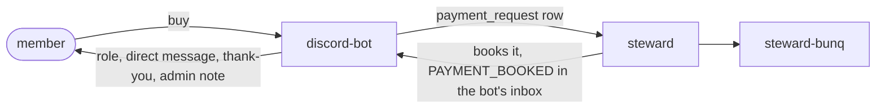

# discord-bot

The season 2 Discord bot: access purchases and grants, account linking, roles, the Hunger Games
registration, status channels and the admin log. It talks to PostgreSQL and the Discord gateway and to
nothing else, so it runs without any Minecraft server.



The bot holds no bunq key and books nothing; the prices are the network's `prices` group. It never
migrates: at startup Flyway's `validate()` refuses a database it was not built against, and compose
starts it only after the `migrate` service succeeded. An admin's preview of a text shown in Discord
(`PREVIEW_MESSAGE`) is a direct message to that admin; a closed direct message refuses the request
(`NOT_DELIVERED`).

## What it needs

- A Discord application with the `GUILD_MEMBERS` privileged intent.
- The guild id, which `deploy/nordtal.sh` asks for. Every channel is an id set in Steward, and an empty one switches its feature off.
- The permission to manage roles and channels: the bot finds or creates every role it uses and keeps the onboarding lock on every channel.

The languages are the network's (`language-and-time.languages`). The `access` group's `languages` holds one entry
for each tag, with its role name and channels, and no other: the bot refuses to take a list that differs.

The `access` and `onboarding` groups are edited in Steward. `compose.yml` passes the bot only its
token, the database and `NORDTAL_ACCESS_GUILD_ID`, which wins over what is stored; the startup log
lists every setting the environment overrode.

```bash
COMPOSE_PROFILES=db,bot docker compose --env-file /etc/nordtal/season-2.env up -d
./gradlew :discord-bot:imageContext && COMPOSE_PROFILES=db,bot docker compose up -d --build   # a local image
```

The container runs the jar baked into its image; the whole deployment is in [../deploy/README.md](../deploy/README.md).

## Where things live

- `access/`: purchases, grants, linking, the reaction to a booked payment and the managed messages.
- `registration/`: team registration for a game, named by its key; the Hunger Games is the one game so far.
- `onboarding/`: the language and region roles, the lock and the onboarding message.
- `roles/`: every role the bot uses (`GuildRoles`), found by name and then followed by its stored id.
- `status/`: the status channel names.
- `announce/`, `discord/`: announcements, admin commands and the update feed.
- `config/`: the config specs (`bot`, `access`, `onboarding`) and their defaults.
- `src/main/resources/messages/`: the translations.

## Roles

Steward holds a name for every role the bot uses: access, donor and admin, one per language, one per
region and the lock role. The bot takes the role of exactly that name or creates it, stores its id in
`discord_role` and follows the id, so an admin may rename the role; only when it is deleted does the
bot look by name again. Two roles of the name are taken by neither, and the admin channel is told.

## Onboarding

A member's language and region are Discord roles, and the roles are the source: every change is
carried into `discord_user.locale` and `time_zone`, where no role means the network's. Holding two of
a kind keeps the one just added. The onboarding channel holds one message with a button per language.

- With the lock on in Steward, a member missing either role holds the lock role, which sees only the
  onboarding channel; the bot keeps that on every channel and takes the role the moment both are held.
  Bots are never locked.
- While locked, the access and donor roles are withheld, so a role's allow cannot open a channel past
  the lock. When the lock goes both return as the database has them: access while a grant covers the
  member, donor while the flag is set. The game is unaffected, since the proxy reads the database.

## Registration

The bot owns `registration`, `team` and `team_member`, each round named by its game's key from `Game`
in `:database`. The flow and `Teams` take the game, so a second team mode is a constant there and its
own Register message. The game server creates a game from the round when it starts and alone moves the
round's state. A closed round refuses every change until its game is aborted (the round opens again
with its teams) or decided (it ends, and the next registration opens a new round).

## Texts

Every text the bot sends is a message of its bundle, rendered by `DiscordRenderer`, the Discord
target of `:messages`; `:architecture` refuses `Messages.format` here.

- In a markdown text each value is escaped with JDA's sanitizer, character by character, so a team
  called `Red_Fox**` reads as written; a link stays as it is. A moment is Discord's `<t:…:f>` and a
  member a mention. A text shown without markdown (a button, select, modal or channel name) is
  declared `PLAIN`.
- The admin channel reads the admin bundle, `messages/admin` of `:database`, which Steward's page
  renders too. A journal line goes through `AdminLog.record`: the row stores the message and the
  card is that same message rendered here, so the journal and the card cannot differ. Alerts, notes
  and the update feed are drawn from the same bundle, in English.
- Only what a member reads is in the bot's own bundle, in every language, except an announcement: a
  server or Steward writes it as messages of `:database`'s bundle, which the bot renders in each channel's language.
