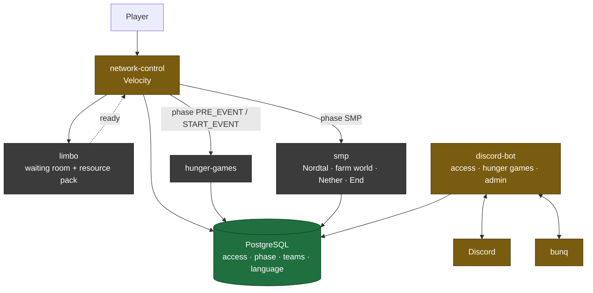

# season 2 — project knowledge base

The shared understanding of what season 2 is, how its pieces fit together and why they are the way
they are. Written for whoever — human or agent — picks up a piece of it next.

**Read this file first, then the one document that covers your task.** The documents are cut so
that a task needs one of them, not all of them.

## The system in one picture

The database is the source of truth for access, language, phase and event state. Discord roles are
a projection of it; LuckPerms is not involved anywhere.

## The documents

| document | what it answers |
|---|---|
| [architecture.md](architecture.md) | Which modules exist, what depends on what, who owns the schema, what the login path looks like end to end |
| [season-phases.md](season-phases.md) | The four phases, who gets in during each, where the phase lives and how a switch propagates |
| [i18n.md](i18n.md) | How German and English work everywhere, and how a third language is added without a release |
| [hunger-games.md](hunger-games.md) | The start event in full: registration, teams, border, loot, HUD, winning |
| [smp.md](smp.md) | The SMP in full: worlds, travel, milestones, aura, prestige, duels, graves, POIs |
| [operations.md](operations.md) | Deployment, secrets, pack hosting, the release path, and everything still unverified |
| [access-system.md](access-system.md) | The paid access concept: product, rules, payment matching, linking |
| [state-of-play.md](state-of-play.md) | Where the **code** stands against all of the above, what can be built today, and what still needs a decision |

Repository rules — build conventions, platform versions, package layout, what not to shade — live
in [../CLAUDE.md](../CLAUDE.md), and the cross-repository map lives in
[../../CLAUDE.md](../../CLAUDE.md). This knowledge base does not repeat them.

## What is built and what is not

| area | state |
|---|---|
| Access system: schema, `AccessDirectory`, purchase flow, bunq matching, linking, login gate | **built** — stages A–C, 2026-08-30 |
| Message system in `:common` (`Messages`, `Locales`) | **built** |
| Resource pack: glyphs, boss bar sprites, reproducible zip | **built**, carries season 1 leftovers |
| Phase model, phase-aware gate, phase propagation | **designed, not built** |
| `limbo` waiting room and pack enforcement | **designed, not built** — scaffold is still named `resource-pack-coercion` |
| Language config list, plugin-side locale lookup | **designed, not built** |
| Hunger games, both halves | **designed, not built** |
| SMP: worlds, travel, milestones, aura, prestige, duels, graves, POIs | **designed, not built** — 2026-08-31 |

That table is a summary. [state-of-play.md](state-of-play.md) is the same question answered from the
code, module by module, with the places where these documents and the code disagree.

`smp-farm-world` → `smp` was carried out on 2026-08-31. Three renames are still part of the plan
and are cheap only until something runs in production: `resource-pack-coercion` → `limbo`,
`access-bot` → `discord-bot`, and the `SeasonPhase` values. See
[architecture.md](architecture.md#modules).

## Decisions, and when they were taken

Everything below was decided **2026-08-30** unless noted. Where an alternative was rejected, the
reason is in the linked document — that is what stops it from being reopened by accident.

| decision | where |
|---|---|
| The database is the source of truth; Discord roles are a projection; no LuckPerms, no DiscordSRV | [access-system.md](access-system.md) |
| Exactly one process migrates — the bot. The migration SQL lives in `:common`; Flyway never leaves the bot (changed 2026-08-31) | [architecture.md](architecture.md#schema-ownership) |
| Four phases — `PRE_EVENT`, `START_EVENT`, `SMP`, `MAINTENANCE` — decide who gets in | [season-phases.md](season-phases.md) |
| Access is required only from `SMP`; the start event is free for every linked member | [season-phases.md](season-phases.md) |
| The phase is one database row, switched from Discord *and* from the proxy, propagated by `NOTIFY` with polling as a safety net | [season-phases.md](season-phases.md) |
| One Velocity plugin with `gate` / `pack` / `phase` / `routing` packages — not several small proxy plugins | [architecture.md](architecture.md#the-login-path-end-to-end) |
| The pack is enforced on a Paper waiting room, not by the proxy; proxy-only enforcement stays a later experiment | [operations.md](operations.md#open-verification) |
| Players download the pack from the GitHub release asset | [operations.md](operations.md#resource-pack-hosting) |
| Languages are a config list with `en` mandatory; no language role means English | [i18n.md](i18n.md) |
| A plugin reads a player's language from the database at join and holds it for the session | [i18n.md](i18n.md) |
| Hunger games: team **names**, generated colours, one winner, friendly fire always on | [hunger-games.md](hunger-games.md) |
| The border shrinks a fixed step per death **and** slowly with time, so the game cannot stall | [hunger-games.md](hunger-games.md#the-border) |
| A disconnected player's body stays and stays vulnerable | [hunger-games.md](hunger-games.md#disconnects) |
| Spectator and cross-teaming rules are announced, not enforced | [hunger-games.md](hunger-games.md#the-lobby) |
| **Decided 2026-08-31 — the SMP** | |
| The SMP is peaceful by agreement: PvP is on everywhere, but nothing is designed against griefing, raiding or theft | [smp.md](smp.md#what-kind-of-server-this-is) |
| No teleport commands at all — the balloon is the only fast travel, and it only reaches world spawns | [smp.md](smp.md#travel) |
| Nordtal portals never ignite and stronghold End portals stay inactive; every portal elsewhere leads to the spawn | [smp.md](smp.md#travel) |
| Aura is prestige and buys nothing; it may go negative | [smp.md](smp.md#aura--recognition-not-currency) |
| Prestige is a 13-tier crest earned by online time, AFK included; the tab list sorts by it | [smp.md](smp.md#prestige--a-crest-earned-by-time) |
| Milestones are defined in a reloadable YAML file, unlocked **only** by objectives, never by time | [smp.md](smp.md#milestones--the-community-objective-system) |
| The farm world is swapped, not rebuilt in place: tomorrow's world pre-generates in the background | [smp.md](smp.md#the-farm-world-reset) |
| Graves everywhere but the duel arena; they stand forever and anyone may open them | [smp.md](smp.md#death-and-graves) |
| No navigation to players; `/navigate` knows world spawns, the last death and public POIs | [smp.md](smp.md#navigate) |
| Spawn protection is a list of regions in our own plugin, not WorldGuard | [smp.md](smp.md#spawns) |
| No LuckPerms: the admin flag comes from the database, Bukkit permissions from a `PermissionAttachment` | [smp.md](smp.md#admins) |
| Chat is per Paper server; `limbo` has none, shows nothing and nobody, only a title | [smp.md](smp.md#chat) |
| Play time is counted by the proxy into `player_playtime`; the prestige tier is derived, never stored | [smp.md](smp.md#prestige--a-crest-earned-by-time) |
| No web map and no Discord map render | [smp.md](smp.md#discord) |
| There is no fixed season end date, so nothing may depend on one | [smp.md](smp.md#what-kind-of-server-this-is) |

## Working rules that apply to all of it

- **"It compiles" is not verification.** Anything touching packets, world state, player visibility
  or the login path needs a running server and real clients before it is called done.
- **Never assume a version, coordinate or protocol constant from memory** — check the repository
  metadata or the vendor's own artifacts, and note the date.
- **Nothing is ever migrated between seasons.** Each season is a full restart: new database, new
  Discord application, new configuration.
- **Ids never get real defaults.** Channel and role ids default to empty and the process refuses to
  start until they are filled in.
- When a document and the code disagree, **the code is the fact and the document is the bug** —
  unless the document says "designed, not built", in which case it is the plan.
