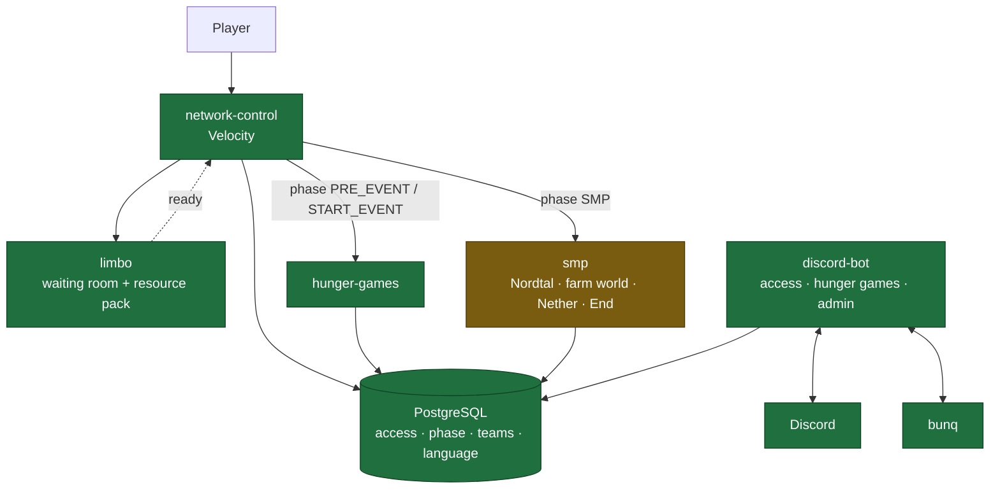

# season 2 — project knowledge base

The shared understanding of what season 2 is, how its pieces fit together and why they are the way
they are. Written for whoever — human or agent — picks up a piece of it next.

**Read this file first, then the one document that covers your task.** The documents are cut so
that a task needs one of them, not all of them.

## The system in one picture

The database is the source of truth for access, language, phase and event state. Discord roles are
a projection of it; LuckPerms is not involved anywhere.

## The documents

| document | what it answers |
|---|---|
| [architecture.md](architecture.md) | Which modules exist, what depends on what, who owns the schema, what the login path looks like end to end |
| [season-phases.md](season-phases.md) | The five phases, who gets in during each, where the phase lives and how a switch propagates |
| [i18n.md](i18n.md) | How German and English work everywhere, and how a third language is added without a release |
| [hunger-games.md](hunger-games.md) | The start event in full: registration, teams, border, loot, HUD, winning |
| [smp.md](smp.md) | The SMP in full: worlds, travel, milestones, aura, prestige, duels, graves, POIs |
| [presentation.md](presentation.md) | **What Nordtal looks like**, written 2026-09-04 because the decision behind it had never been written down: how a menu panel is built and with which measured numbers, where a glyph can and cannot appear, the nine sound categories, and what stays vanilla on purpose |
| [updater.md](updater.md) | **Designed 2026-09-01; all six steps built the same day.** How versions and the schema stop being hand edits: what the updater owns, where it reads versions from, the order a run happens in, and the two surfaces it is driven from — `/update` in Discord and `/smp update` in game, both reaching it through a row in the database |
| [../deploy/README.md](../deploy/README.md) | Everything about production: the runbook, why the stack has this shape, what was measured on it, and the third-party plugins the SMP server needs |
| [access-system.md](access-system.md) | The paid access concept: product, rules, payment matching, linking |
| [state-of-play.md](state-of-play.md) | Where the **code** stands against all of the above, what can be built today, and what still needs a decision |
| [../resource-pack/README.md](../resource-pack/README.md) | **The glyph code point allocation** — both fonts, one table, and the only place that owns it |

Repository rules — build conventions, platform versions, package layout, what not to shade — live
in [../CLAUDE.md](../CLAUDE.md), and the cross-repository map lives in
[../../CLAUDE.md](../../CLAUDE.md). This knowledge base does not repeat them.

## What is built and what is not

**Re-derived from the code 2026-09-01, and updated the same day when `limbo` was built.** An
earlier version of this table described three modules as unbuilt that had been built the evening
before; it was committed after the implementation it failed to describe. Numbers come from a
`./gradlew build` run — **887 tests in seven modules, none skipped, all green**, re-measured 2026-09-04 — not from the last plan.

| area | state |
|---|---|
| Access system: schema, `AccessDirectory`, purchase flow, bunq matching, linking, login gate | **built** |
| Message system in `:common` (`Messages`, `Locales`) and the join-time `PlayerLocales` | **built** |
| Language config list, plugin-side locale lookup | **built** 2026-08-31 |
| Phase model, phase-aware gate, `LISTEN`/`NOTIFY` propagation, the admin flag | **built** |
| Phase routing: re-route on a switch, `MAINTENANCE` into `limbo` | **built** |
| Limbo-first login route, the forced pack offer, `pack.yml`, the `nordtal:limbo` channel | **built** 2026-09-01 |
| Network-wide play time counter on the proxy | **built** |
| Hunger games, the Paper half: border, loot, HUD, lobby, bodies, colours, win and ceremony | **built** 2026-08-31 |
| Hunger games, the Discord half: registration, team names, partner invitations | **built** 2026-08-31 |
| Resource pack: three fonts, every code point allocated **and drawn** as placeholder or final-candidate art | **built** 2026-08-31 |
| Command surfaces: Brigadier directly, no framework | **built** where a module exists |
| SMP schema — `smp_*` tables, V6 | **built** 2026-09-01 |
| `limbo` waiting room and pack enforcement | **built** 2026-09-01 — and unrehearsed: three open verifications now have a written probe |
| SMP: the milestone track, aura, prestige, the milestone engine | **built** 2026-09-01 |
| SMP: worlds, travel, duels, graves, POIs, boards, the wheel | **built** 2026-09-01, in three blocks — and unrehearsed: nothing in it has been seen on a running server |
| PostgreSQL backup and restore | **built and measured 2026-09-01**, and this row said "not designed — the one open piece of concept work" until 2026-09-04. `postgres-backup` dumps daily with `pg_dump --format=custom`, verifies each dump by reading its own TOC back before renaming it, keeps `BACKUP_KEEP`, and stops on SIGTERM; the restore path, the reason Arcane must snapshot `postgres-dumps` and never `postgres-data`, and a table of what was actually measured are all in [../deploy/README.md](../deploy/README.md#backups). What is **not** proven is a restore of the real season database — a rehearsal step, not a design gap |
| Version and schema management (`updater`) | **all six steps built 2026-09-01** — resolves every version from GitHub, Modrinth and the Fill API, compares against the volumes, reports, and on `apply` migrates the schema, installs every jar (the bot's and its own included) and writes the proxy's `pack.yml`. Driven from `/update` in Discord and `/smp update` in game; restarts the stack through Arcane's API after a one-minute countdown every player sees. The one unfinished thing is Arcane's endpoint path, which is a setting — [updater.md](updater.md) |

**What is left is a rehearsal, not a feature.** Every module in this repository has behaviour as of
2026-09-01, the SMP's world half included. What none of them has is a witness: no world, no packet
and no player has been through any of it. The login path needs a real client, the pre-generation
needs the real host, and the SMP needs an evening with two clients in two languages. Each of those
is an [unverified assumption with a written fallback](state-of-play.md#the-unverified-assumptions),
and the steps that produce the answers live in a `todo.md` outside this repository.

That table is a summary. [state-of-play.md](state-of-play.md) is the same question answered from the
code, module by module, with the places where these documents and the code disagree. Of the nine
findings it carried on 2026-08-31, **eight are closed**; what is left is the boss bar font's
positive space advances sitting outside the private-use area, which breaks nothing and would cost a
change to HUD code that now exists. Thirteen more were found since, the last three of them on
2026-09-01 in a deployment audit — the sharpest being that the *published* release contained the
scaffold `smp` and `limbo` jars while `.env.example` pinned it.

**No concept work is open any more.** This paragraph named PostgreSQL backup and restore as the
one remaining piece until 2026-09-04, when the review read `deploy/README.md` and found it designed,
built and measured on 2026-09-01 — the sentence had outlived the work it described by three days.
Every gameplay decision is taken — the milestone track, the last and the season's spine,
was designed on 2026-08-31 and is in [smp.md](smp.md#the-track) — and everything else left in
[state-of-play.md §3](state-of-play.md#3-what-still-needs-a-decision) is a config default, a
drawing, a text, or a build. The whole season still lives in one database, which is the only
irreversible risk in the project — and [../deploy/README.md](../deploy/README.md#backups) now
closes it rather than recording it. The half that is left there is a rehearsal: nobody has restored
the *real* season database from a dump pulled back out of storage.

`smp-farm-world` → `smp`, `resource-pack-coercion` → `limbo` and `access-bot` → `discord-bot` were
all carried out by 2026-08-31. One rename is still part of the plan and is cheap only until
something runs in production: the `SeasonPhase` values. See
[architecture.md](architecture.md#modules).

## Every command in the network

**Written 2026-09-04, because eight of these appeared in no document at all** and `docs/smp.md`
describes its three escape hatches over two paragraphs without naming the command that operates any
of them (`state-of-play.md` finding 54). An admin who reads the concept still could not use the
feature it argues for.

There is no command framework: Brigadier directly on both platforms, and JDA's own builders in
Discord ([architecture.md](architecture.md#commands)).

### In game — `smp`

| command | who | what |
|---|---|---|
| `/navigate` | anyone | opens the navigation menu; the second boss bar line then tracks the target |
| `/poi add <name>` | anyone | a public point of interest at your position. Farm-world POIs die with the daily reset |
| `/poi remove <name>` | its creator, or an admin | admins may remove any POI, which is what `smp.md` means by "admins can manage and delete any of them" |
| `/smp reload` | admin | re-reads `milestones.yml` **and** the message bundles, and reports the two separately - they fail independently |
| `/smp farmreset now` | admin | resets the farm world immediately, skipping the 30/10/5/1-minute warnings |
| `/smp objective complete <key>` | admin | **escape hatch 1**: one objective, paid `pot × (reached ÷ target)` |
| `/smp milestone unlock <key>` | admin | **escape hatch 2**, the blunt one: every open objective pays proportionally |
| `/smp aura <player> <delta>` | admin | corrects a balance. Writes its reason, like every other aura change |
| `/smp update` | admin | asks the updater what differs, and reports its answer verbatim |
| `/smp update apply` | admin | installs what differs |
| `/smp update restart [cancel]` | admin | the countdown, and the way out of it |

**Escape hatch 3 is not a command**: it is lowering an objective's `target` in `milestones.yml`
below the progress already collected, which completes it on the next `/smp reload`.

### In game — `hunger-games`

| command | who | what |
|---|---|---|
| `/hg start [confirm]` | admin | starts the event. `confirm` is the second step below the recommended minimum |
| `/hg ready` | a registered participant | marks your team ready. The lobby broadcast's clickable link runs exactly this |
| `/hg ready-status` | a registered participant | which teams are ready |
| `/hg reload` | admin | the message bundles only - `config.yml` holds the border schedule, and a running game is a running clock |

### In game — `limbo`

| command | who | what |
|---|---|---|
| `/limbo reload` | console, or `limbo.admin` | the message bundles. This server's whole interface is eight titles, and a wording fix must not need a restart while somebody is waiting in it |

### On the proxy — `network-control`

| command | who | what |
|---|---|---|
| `/phase` | admin | the current phase and both season dates |
| `/phase set <phase>` | admin | switches it, and moves everybody online to where the new phase says |
| `/phase launch <when\|clear>` | admin | when the network opens - what the MOTD and the pre-opening screens count down to |
| `/phase smp-start <when\|clear>` | admin | when paid access starts running. Moving it shifts every grant that has not started yet |
| `/network reload` | admin, or the console | the message bundles. `gate.yml`, `pack.yml`, `network.yml` and `database.yml` are read once and stay read |

### In Discord

| command | who | what |
|---|---|---|
| `/grant-access <user> <days>` | admin | replaces season 1's `/manual-con` |
| `/revoke-access <user>` | admin | |
| `/access-status <user>` | admin | valid-until, history, open requests |
| `/settle <ref>` | admin | books a request by hand, autocompleting over open references |
| `/phase set\|show\|launch\|smp-start` | admin | the same four as on the proxy, with a confirmation naming who it moves |
| `/update` | admin | the updater, from Discord |
| `/messages reload` | admin | the bot's own bundles and the override in `config/messages/` |
| `/unlink` | anyone | self-service, no waiting period, always written to the admin channel |

**There is no `/home`, `/tpa`, `/back` or `/spawn`, and there never will be** — distance is the
season's design ([smp.md](smp.md)). The only fast travel that is given is the balloon.

### Permissions

The admin flag is **the Discord admin role mirrored into the database**, read from a cache; there is
no LuckPerms and no second admin list. `smp` attaches the configured permission nodes to an admin at
join and removes them at quit. `/limbo reload` is the one command gated on a Paper permission
(`limbo.admin`) rather than on that flag, because the database is exactly what a broken `limbo` may
not be able to reach — the console holds it unconditionally.

## Decisions, and when they were taken

Everything below was decided **2026-08-30** unless noted. Where an alternative was rejected, the
reason is in the linked document — that is what stops it from being reopened by accident.

| decision | where |
|---|---|
| The database is the source of truth; Discord roles are a projection; no LuckPerms, no DiscordSRV | [access-system.md](access-system.md) |
| Exactly one process migrates. The migration SQL lives in `:common`. It was the bot from 2026-08-31; **moved to the `updater` module on 2026-09-01 and carried out the same day**, which makes that module the bootstrap of every deployment. The bot validates the schema instead and refuses to start on one it was not built against | [architecture.md](architecture.md#schema-ownership), [updater.md](updater.md#what-it-owns) |
| Versions are not hand edits. An `updater` module resolves them from GitHub, Modrinth and the Fill API, swaps the jars, and redeploys through Arcane's API on a button — never on its own, and never on a crash restart (2026-09-01) | [updater.md](updater.md) |
| Four phases — `PRE_EVENT`, `START_EVENT`, `SMP`, `MAINTENANCE` — decide who gets in | [season-phases.md](season-phases.md) |
| Access is required only from `SMP`; the start event is free for every linked member | [season-phases.md](season-phases.md) |
| The phase is one database row, switched from Discord *and* from the proxy, propagated by `NOTIFY` with polling as a safety net | [season-phases.md](season-phases.md) |
| One Velocity plugin with `gate` / `pack` / `phase` / `routing` packages — not several small proxy plugins | [architecture.md](architecture.md#the-login-path-end-to-end) |
| The pack is enforced on a Paper waiting room, not by the proxy; proxy-only enforcement stays a later experiment | [state-of-play.md](state-of-play.md#the-unverified-assumptions) |
| Players download the pack from the GitHub release asset | [../resource-pack/README.md](../resource-pack/README.md#hosting) |
| Languages are a config list with `en` mandatory; no language role means English | [i18n.md](i18n.md) |
| A plugin reads a player's language from the database at join and holds it for the session | [i18n.md](i18n.md) |
| Hunger games: team **names**, generated colours, one winner, friendly fire always on | [hunger-games.md](hunger-games.md) |
| The border shrinks a fixed step per death **and** slowly with time, so the game cannot stall | [hunger-games.md](hunger-games.md#the-border) |
| A disconnected player's body stays and stays vulnerable | [hunger-games.md](hunger-games.md#disconnects) |
| Spectator and cross-teaming rules are announced, not enforced | [hunger-games.md](hunger-games.md#the-lobby) |
| **Decided 2026-08-31 — the SMP** | |
| The SMP is peaceful by agreement: PvP is on everywhere, but nothing is designed against griefing, raiding or theft | [smp.md](smp.md#what-kind-of-server-this-is) |
| No teleport commands at all — the only *given* fast travel is the balloon, and it only reaches world spawns | [smp.md](smp.md#travel) |
| Nordtal Nether portals stay dead until the Nether milestone, then link to the Nether exactly like vanilla, 1:8 mapping included; stronghold End portals stay inactive; farm-world portals lead to the spawn | [smp.md](smp.md#travel) |
| Aura is prestige and buys nothing; it may go negative | [smp.md](smp.md#aura--recognition-not-currency) |
| Prestige is a 13-tier crest earned by online time, AFK included; the tab list sorts by it | [smp.md](smp.md#prestige--a-crest-earned-by-time) |
| Milestones are defined in a reloadable YAML file, unlocked **only** by objectives, never by time | [smp.md](smp.md#milestones--the-community-objective-system) |
| The farm world is swapped, not rebuilt in place: tomorrow's world pre-generates in the background | [smp.md](smp.md#the-farm-world-reset) |
| Graves everywhere but the duel arena; they stand forever and anyone may open them | [smp.md](smp.md#death-and-graves) |
| No navigation to players; `/navigate` knows world spawns, the last death and public POIs | [smp.md](smp.md#navigate) |
| Spawn protection is a list of regions in our own plugin, not WorldGuard | [smp.md](smp.md#spawns) |
| No LuckPerms: the admin flag comes from the database, Bukkit permissions from a `PermissionAttachment` | [smp.md](smp.md#admins) |
| Chat is per Paper server; `limbo` has none, shows nothing and nobody, only a title | [smp.md](smp.md#chat) |
| Play time is counted by the proxy into `player_playtime`; the prestige tier is derived, never stored | [smp.md](smp.md#prestige--a-crest-earned-by-time) |
| No web map and no Discord map render | [smp.md](smp.md#discord) |
| There is no fixed season end date, so nothing may depend on one | [smp.md](smp.md#what-kind-of-server-this-is) |
| **Decided 2026-08-31 — the planning session on commands, glyphs, loose ends and verification** | |
| **No command framework.** Brigadier directly: Paper's `Commands` on the Lifecycle API, Velocity's `BrigadierCommand`. Cloud 2.0.0 and Lamp 4.0.0-rc.18 were both verified compatible and both rejected — on 879,377 shaded bytes per Paper jar and on eighteen release candidates respectively | [architecture.md](architecture.md#commands) |
| No shared Brigadier helper in `:common`: two different brigadier artefacts, neither on Maven Central, for one command on the proxy | [architecture.md](architecture.md#commands) |
| `BasicCommand` is not used — one command shape across the repository | [architecture.md](architecture.md#commands) |
| **One table owns every glyph code point**, in `resource-pack/README.md`, covering both fonts; `Glyphs`, `default.json` and `bossbar.json` are mirrors of it and the concept documents carry none | [resource-pack/README.md](../resource-pack/README.md#code-point-allocation) |
| HUD arrows and icons are allocated in `nordtal:bossbar`, not `default.json` — the two fonts have different metrics, and an arrow in the wrong one sits on the wrong baseline | [resource-pack/README.md](../resource-pack/README.md#nordtalbossbar) |
| **The HUD needs no digit glyphs**: the boss bar font already overrides printable ASCII at the bar's metrics | [resource-pack/README.md](../resource-pack/README.md#and-above--ascii-override) |
| `\uE000`–`\uE003`, freed by deleting season 1's role tags, are re-used rather than left empty — nothing persists a glyph, so a code point cannot be read back meaning the wrong thing | [resource-pack/README.md](../resource-pack/README.md#minecraftdefault) |
| A phase switch to `SMP` **disconnects** a player who now lacks access, with the login gate's own message — it does not push them to `limbo` | [season-phases.md](season-phases.md#routing) |
| **`MAINTENANCE` holds non-admins in `limbo` rather than disconnecting them**; admission during maintenance is the same rule as the event phases, and `discord_user.admin` decides only that an admin is *not* moved. An unlinked player is still refused with a link code | [season-phases.md](season-phases.md#the-phases) |
| A phase's backend is named in `gate.yml`, defaulting to the module directory name — nothing here says what `velocity.toml` calls them. A missing backend disconnects the player (the maintenance screen during `MAINTENANCE`, `gate.no-server` otherwise) rather than dropping them somewhere undefined | [season-phases.md](season-phases.md#routing) |
| Phase propagation polls every **30 s** on channel `nordtal_phase`, and `NOTIFY` is built in the first pass rather than deferred | [season-phases.md](season-phases.md#source-of-truth-and-propagation) |
| The proxy's emergency `/phase` is authorised by `discord_user.admin`, not by console — with the outage case written down rather than left to be rediscovered | [season-phases.md](season-phases.md#who-may-switch-it) |
| `access.yml#link-code-ttl-minutes` is retired; `gate.yml`'s copy is the only one | [../CLAUDE.md](../CLAUDE.md) |
| **`network-control` fails closed on a bad config**: a deny-all `LoginEvent` handler, which is the per-plugin disable Velocity does not give you | [architecture.md](architecture.md#failing-closed-on-a-bad-config) |
| Hunger games start: hard minimum 2 participants (the border step divides by `participants − 1`), soft minimum 4 behind a confirmation | [hunger-games.md](hunger-games.md#start) |
| Spectators may join at any time, and **there is no team chat** — one per-server chat, as everywhere else | [hunger-games.md](hunger-games.md#the-lobby) |
| **SimpleCloud runs Minecraft 26.2** — confirmed by the owner against the v3 dashboard; the platform question is closed and the API-artefact question is now its own row. **Superseded 2026-09-01**: season 2 does not run on SimpleCloud, so the answer no longer applies to anything | [../deploy/README.md](../deploy/README.md#why-it-looks-like-this) |
| Every unverified assumption carries **what happens if the answer is no** — an unverified assumption with no written fallback is a decision nobody has made. The *steps* that produce the answers are a checklist for the owner and live outside this repository; the fallbacks are design and stay in it | [state-of-play.md](state-of-play.md#the-unverified-assumptions) |
| **Decided 2026-08-31 — the milestone track and block logging** | |
| The track is **20 · 43 · 99 · 400 · Nether · End · 900 · 4000** — eight milestones, of which `departure` (43) is opened by an admin at the season's start and six are objective-driven. The Nether and the End are their own milestones and carry no border step | [smp.md](smp.md#the-track) |
| **Border 20 and 43 are a physical gate, not ceremony**: the balloon stands outside radius 10 and inside radius 21.5, so the opening expansion is what hands the community the farm world. This is a hard constraint on the spawn build | [smp.md](smp.md#spawns) |
| Objective **budgets are community play hours sized against a pessimistic population** — the final milestone is 8 players × 14 days × 1.5 h = 170 h. A strong turnout therefore finishes early, and the answer to that is to append a milestone, not to scale targets to the live player count | [smp.md](smp.md#how-every-number-in-that-table-was-derived) |
| `pot = round((budget ÷ objectives) × 5, to 10)`, **no minimum pot** — a minimum flattens the ramp the track exists to create | [smp.md](smp.md#how-every-number-in-that-table-was-derived) |
| **Every milestone carries exactly one `ADVANCEMENT` participation gate** (10 · 10 · 8 · 8 · 6 · 5 distinct players) — the only objective type three people cannot finish alone, and the only one whose progress survives a player leaving | [smp.md](smp.md#the-rules-the-content-has-to-obey) |
| `STATISTIC` objectives use **active statistics only** — never distance walked or time played, which would pay every present player a contribution share | [smp.md](smp.md#the-rules-the-content-has-to-obey) |
| `HAND_IN` **deliberately demands farmable materials in rising quantities** from M3 onward, so that building the farm becomes the content of the late game; the no-automation constraint is met by the budget, not by banning farms | [smp.md](smp.md#the-rules-the-content-has-to-obey) |
| Contribution payout is a **split of the pot — 30 % equally among qualifiers, 70 % by share** — with a 2 % qualifying threshold and a minimum of 1 aura per qualifier. The old absolute floor was replaced because it could exceed a small objective's whole pot | [smp.md](smp.md#contribution-payout) |
| Three escape hatches for an impossible objective — lower the target and reload, complete one objective, unlock the milestone — and **every admin completion pays `pot × (reached ÷ target)`**, so a rescue neither robs the contributors nor mints aura | [smp.md](smp.md#when-an-objective-turns-out-to-be-impossible) |
| **Deaths cost aura**: −5 ordinarily, −20 for a listed cause, nothing in the duel arena. No exemptions beyond the arena and no protection against a death drain — the same agreement that governs raiding governs this | [smp.md](smp.md#deaths-cost-aura) |
| Advancements grant **2–10** aura, not 5–25; a duel only ever moves ±10 between two players | [smp.md](smp.md#aura--recognition-not-currency) |
| **Nordtal is pre-generated once, to its final border of 4000, before the phase opens.** A milestone unlock moves a number and never starts a generator; the Nether and End borders are a fixed 2000 | [smp.md](smp.md#worlds) |
| Block logging is **CoreProtect on its own SQLite file**, and we wait for its 26.2 release — checked 2026-08-31: it has none, its `master` builds against 26.2-alpha, and Prism 4.4 is the only released 26.2 option and the documented fallback. Nothing blocks on it | [smp.md](smp.md#block-logging--checked-2026-08-31) |
| The claim that **grave-emptying is traceable through the block log was struck** — graves are plugin-managed inventories and there may be no logger running at all | [smp.md](smp.md#death-and-graves) |
| **Decided 2026-09-01 — after the first full re-derivation of the docs from the code** | |
| **`limbo` takes a database connection** and reads the player's language through `PlayerLocales`, like every other module. `architecture.md`'s guess that it "probably does not" need persistence lost against `i18n.md`'s rule, which had already rejected the proxy sending the language in a plugin message | [architecture.md](architecture.md#dependencies-and-the-rules-attached-to-them) |
| **Nametags come from `papermc-display-tags`' `:api` module** — `com.github.nordtal:papermc-display-tags` from JitPack, `compileOnly`, never shaded, declared in `paper-plugin.yml`. The consequence is that **PacketEvents becomes a required plugin on the SMP server**, the network's first mandatory third-party runtime dependency | [smp.md](smp.md#what-a-player-looks-like) |
| **The SMP grants the hunger games winner's head start on that player's first join**, deriving the winner from `hg_game.winner_member_id`; `hunger-games` writes nothing into the SMP's tables. `smp_player.hg_winner_reward_granted` exists only because "have I already paid out" is the one thing that cannot be derived | [smp.md](smp.md#the-hunger-games-winners-head-start) |
| **The `nordtal:` channel is `nordtal:limbo`, and it runs both ways.** `limbo` sends `READY` once per join; the proxy sends `WAIT <reason>` whenever what the player is waiting for changes. The codec lives in `:common`, because a wire format written twice is one that drifts — and a plugin message that does not parse is indistinguishable from one that was never sent | [architecture.md](architecture.md#the-login-path-end-to-end) |
| **No single plugin message may be able to strand a player** (2026-09-03, after finding 38). The proxy records the arrival, the pack status and `READY` against the *session* and re-asks the whole question on each, because Velocity orders none of them — and releases the player anyway once everything else has been settled for `gate.yml#limbo-ready-grace-seconds`, logging a warning that names the channel | [architecture.md](architecture.md#the-login-path-end-to-end) |
| **Three waiting reasons plus one**: `PACK`, `BACKEND`, `MAINTENANCE` — and `UNKNOWN` for the moment before the proxy has spoken, because a black screen with no text is what a crash looks like. The proxy decides which; two of the three are facts only it has | [i18n.md](i18n.md#bundles) |
| **The pack URL and hash live in `network-control`'s own `pack.yml`**, not in `gate.yml`: they change on every pack release and the file that decides who may join should not be edited on that rhythm. Both default to empty and the proxy fails closed | [../resource-pack/README.md](../resource-pack/README.md#hosting) |
| **The offer is forced, and our own decline screen works by disconnecting first.** On 1.17+ the client enforces a forced pack and Velocity kicks a decliner with its own text — `setOverwriteKick` throws rather than preventing it. Forcing is the only thing that shows the prompt to a player who has packs switched off, so it stays; whether our screen wins the race is a rehearsal step | [state-of-play.md](state-of-play.md#the-unverified-assumptions) |
| **A proxy with no `limbo` server refuses every login**, not only a `MAINTENANCE` one. The alternative is everybody joining without the resource pack, silently — a fault that reports itself on an event day rather than in seconds | [season-phases.md](season-phases.md#routing) |
| **A `READY` is believed only from a backend connection.** Registering a channel advertises it to the client too, so a forged `READY` would be a player releasing themselves from the waiting room — which is to say skipping the pack | [architecture.md](architecture.md#the-login-path-end-to-end) |
| **The milestone track is `milestones.yml`, its own file**, a list of milestones each carrying its own list of objectives. Two levels of nesting through jcore works, and each nested interface needs its own `@ConfigSpec` — without one it fails as a Gson error naming `Proxy#h` | [smp.md](smp.md#where-a-milestone-is-defined) |
| **The payout's proportional part divides by the total contributed, not by the target.** Read literally, "share of the target" overspends the pot on any objective finished with more than was asked for — which is the ordinary `HAND_IN` case | [smp.md](smp.md#contribution-payout) |
| **When a pot has fewer aura than it has qualifiers**, the one-aura guarantee is paid to as many as the pot reaches, largest contribution first, ties broken by id. The concept's worked example never left the pot, so it never had to say | [smp.md](smp.md#contribution-payout) |
| **`smp_grave.contents` is Paper's `ItemStack.serializeItemsAsBytes`** — NBT with the server's own data fixers behind it, so a grave written before a Minecraft update still opens after one | [smp.md](smp.md#death-and-graves) |
| **Spawn protection is `config.yml#spawn-regions`**: a list of boxes per world, inclusive corners, checked in order. No WorldGuard | [smp.md](smp.md#spawns) |
| **Chunky 1.5.3 is the pre-generation tool** — it tags Minecraft 26.2 for `paper` explicitly, checked against the Modrinth API. An operator's tool, never a dependency of this build | [smp.md](smp.md#worlds) |
| **A Paper plugin never queries the database from the main thread.** The join-time language lookup moved to `PlayerLocales#joinAsync` in both `limbo` and `hunger-games`, and every plugin `database.yml` gained a `query-timeout-seconds` that sets HikariCP's `connectionTimeout` *and* the driver's `socketTimeout`. The visible cost is that a German player may see one English line at the start of a session | [i18n.md](i18n.md#how-a-plugin-knows-a-players-language) |
| **GitHub release assets redirect to `release-assets.githubusercontent.com`, with a signed URL that expires within the hour** — measured with `curl`, and *not* `objects.githubusercontent.com` as this knowledge base used to say. The config carries the `github.com/...` URL and never the resolved one | [../resource-pack/README.md](../resource-pack/README.md#hosting) |
| **`app.simplecloud.api:api` was removed** from `network-control`, along with its two repositories and its catalog entry. Routing was written and imported none of it — the fallback that had been recorded for it is what happened | [state-of-play.md](state-of-play.md#where-the-documents-and-the-code-disagree) |
| A documentation commit that lands *after* an implementation commit is **not** evidence that it describes it. The 2026-08-31 knowledge base was committed at 23:33 against work done at 21:17 and described three built modules as scaffolds | [state-of-play.md](state-of-play.md) |
| **SimpleCloud is dropped; production is one `docker compose` stack on one host, driven through Arcane.** Season 2 uses none of its dynamic instances, templates or failover — every service is a permanent singleton, the hunger games run exactly once, and the farm-world reset never restarts a container. Its plugin management only handles Modrinth-hosted jars, so every release of ours was a manual copy anyway, and v3 exists only inside a hosted closed-beta programme with no releases channel. It cost nothing to leave because the runbook was never written | [../deploy/README.md](../deploy/README.md#why-it-looks-like-this) |
| **One `compose.yml` with `db`/`bot`/`mc` profiles, and named volumes only — no bind mounts.** The bot keeps its independent deployment through its own profile rather than its own file; hand-built worlds are uploaded into the volume once, which is a manual step by design | [../deploy/README.md](../deploy/README.md) |
| **All four Minecraft services share one image, and the console is a `tmux` session rather than stdin of PID 1.** Arcane's per-container shell is a `docker exec` and cannot reach PID 1's stdin. RCON was rejected because **Velocity has no RCON at all** (checked 2026-09-01) — it would mean a third-party plugin on the one process that decides who may join. PID 1 traps SIGTERM and `stop_grace_period` is 180 s, because the 10 s default does not save a border-4000 world | [../deploy/README.md](../deploy/README.md#why-it-looks-like-this) |
| **Every jar a server runs — plugins and the server jar itself — is in its volume, and the `updater` service owns them all.** The container fetches nothing at start except a server jar into an *empty* cache (from `PAPER_BUILD` / `VELOCITY_BUILD`, once), so neither a GitHub nor a Fill outage stops a restart; a volume with no plugins stops the container rather than starting a server with no season on it. Plugins since 2026-09-01, the server jar since 2026-09-02 — the day-late half of the same collision | [../deploy/README.md](../deploy/README.md#updating), [updater.md](updater.md) |
| **itzg/docker-minecraft-server was rejected**: it does not cover Velocity (that is a second image), it would not have solved the proxy console anyway, and we want the build to move through the updater rather than through an image's own resolution at start. Its 26.x support was never established and stopped mattering | [../deploy/README.md](../deploy/README.md#why-it-looks-like-this) |
| **Decided 2026-09-03 — the four items parked while `PRE_LAUNCH` was built** | |
| **A link code is four characters, and that is only safe because of the attempt cap.** 923 521 possibilities against five wrong guesses per Discord account per hour, counted in the bot's memory. The length and the cap were decided together; either one alone is a mistake | [access-system.md](access-system.md#linking) |
| **Paid access starts at `season_phase.smp_start`, a second date that is not `launch`.** The network opens into the hunger games, where nobody needs access, so anchoring a purchase to the opening would spend the whole event out of somebody's thirty days | [season-phases.md](season-phases.md#the-row-carries-two-dates-and-they-are-not-the-same-day) |
| Selling **is not blocked** while that date is unset — the period starts now, so the payment path can be exercised before the season is dated. Every such grant is a WARNING and a line in the admin channel, because otherwise "we are testing" and "somebody forgot" are the same silence | [season-phases.md](season-phases.md#the-row-carries-two-dates-and-they-are-not-the-same-day) |
| **Leaving the guild deletes the account link** — but the startup reconcile only does it when the member cache demonstrably holds the whole guild. Writing `LEFT` on a bad guess is repaired by the next run; deleting is not | [access-system.md](access-system.md#linking) |
| **The status channel is renamed only when its text changes**, and never more than once every six minutes. Discord allows two renames per ten minutes per channel, undocumented, and blocks the route hard on abuse — which is why every line it shows is deliberately coarse | [season-phases.md](season-phases.md#the-status-channel) |
| **The MOTD's counts moved to `:common`** rather than being copied into the bot. Two queries computing "the same" numbers is how two public surfaces end up disagreeing on a screenshot | [state-of-play.md](state-of-play.md#network-control) |

## Working rules that apply to all of it

- **"It compiles" is not verification.** Anything touching packets, world state, player visibility
  or the login path needs a running server and real clients before it is called done.
- **Never assume a version, coordinate or protocol constant from memory** — check the repository
  metadata or the vendor's own artifacts, and note the date.
- **Nothing is ever migrated between seasons.** Each season is a full restart: new database, new
  Discord application, new configuration.
- **Ids never get real defaults.** Channel and role ids default to empty and the process refuses to
  start until they are filled in.
- When a document and the code disagree, **the code is the fact and the document is the bug** —
  unless the document says "designed, not built", in which case it is the plan.
