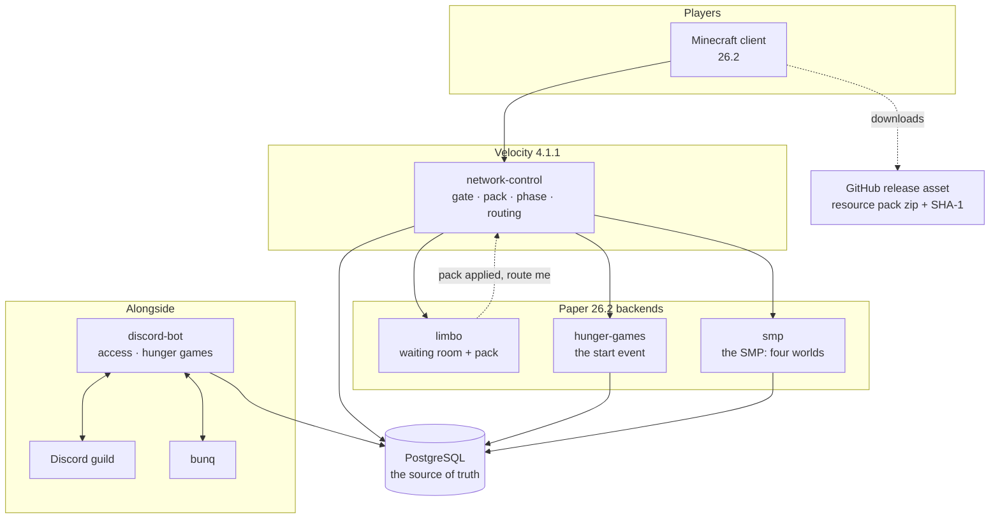
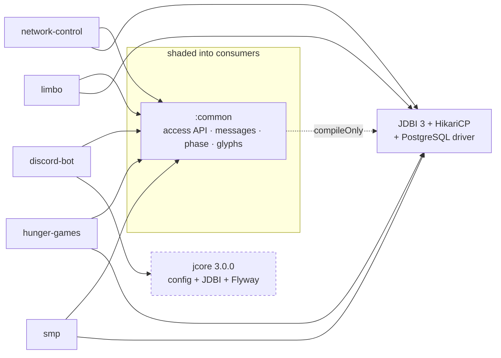
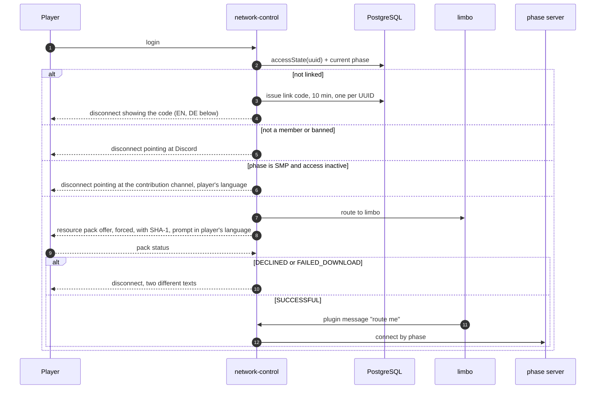

# Architecture

What season 2 is made of, how the pieces depend on each other, and which rules that dependency
graph enforces. Start at [README.md](README.md) if you have not read the index yet.

Status of every statement here: **design agreed 2026-08-30**, with the SMP module and the schema
location revised **2026-08-31**, the module table re-derived from the code **2026-09-01**, and the
login path built the same day. What
is already built is marked as such in the module table; everything else is a plan and nothing more.

## The network

Every login lands on `limbo` first, whatever the phase. `limbo` applies the resource pack and asks
the proxy to route on; the proxy decides where by [phase](season-phases.md).

## Modules

| module | platform | owns | state |
|---|---|---|---|
| `network-control` | Velocity | Login gate, pack enforcement decision, current phase, routing, **network-wide play time** | **built in full 2026-09-01** — the pack station (`pack/`, `pack.yml`, the `nordtal:limbo` channel) was the last piece |
| `limbo` | Paper | The waiting room: the empty world, the one title, and the "ready" message | **built 2026-09-01** — void world, blindness, hidden players, no chat, four waiting titles in two languages; renamed from `resource-pack-coercion` 2026-08-31 |
| `hunger-games` | Paper | The start event in full | **built 2026-08-31** — border, loot, HUD, lobby, bodies, colours, win, ceremony, `/hg`. Waiting on the hand-built world folder and the aerial images |
| `smp` | Paper | The SMP: Nordtal, farm world, Nether, End, milestones, aura, prestige, duels, POIs, graves | **half built 2026-09-01** — the milestone track, the aura payout, the prestige function and the milestone engine, with no world under any of them. Renamed from `smp-farm-world` 2026-08-31; schema in V6 |
| `discord-bot` | JVM app | Discord: access sales, account linking, HG registration, admin surface, **the schema** | **built** — access, `/phase set`, the admin mirror, the language list and HG registration (renamed from `access-bot` 2026-08-31) |
| `common` | library | `AccessDirectory`, message system, locale resolution, `SeasonPhase`, `Glyphs` | **built in full** — access API, messages, `PlayerLocales`, the phase directory, season 2's `Glyphs`, V1–V6 |
| `paper-common` | library | What the three Paper plugins do identically **with a Paper type** — `:common` is compiled against no platform, so this is where a Bukkit-facing helper lives instead of in three copies | **new 2026-09-04** — the operator adapter and the admin watcher, and the home for the Brigadier adapters `:commands` will need |
| `resource-pack` | assets | Glyphs, HUD sprites, menu panels, vanilla overrides, the released zip | **built** — four fonts, every code point allocated and drawn as placeholder or final-candidate art |

**All four planned renames are done**, the last of them the phase enum. They were cheap only until
something ran in production, and nothing has:

- `smp-farm-world` → **`smp`** (`eu.nordtal.s2.smp`, `SmpPlugin`, `name: smp`). Decided and
  **carried out 2026-08-31**: the module owns the build world, the spawn, milestones, aura,
  prestige, duels, POIs and graves — the farm world is one part of it, not the whole. See
  [smp.md](smp.md).
- `resource-pack-coercion` → **`limbo`** (`eu.nordtal.s2.limbo`). **Carried out 2026-08-31.** The
  module is a waiting room for every waiting state, not just the pack.
- `access-bot` → **`discord-bot`** (`eu.nordtal.s2.discordbot`, `ghcr.io/nordtal/discord-bot`).
  **Carried out 2026-08-31**, with `access/` and `hungergames/` as sibling feature packages
  planned. There is one Discord application, one token, one deployment — but the module must not
  be named after one of its features.
- `SeasonPhase.RESOURCE_PACK_INSTALL` → the phase enum is `PRE_EVENT`, `START_EVENT`, `SMP`,
  `MAINTENANCE`. **Carried out 2026-08-31**, with a database `CHECK` on `season_phase.phase`
  pinning the same four strings. Installing the pack is a station every login passes in every
  phase, not a period of the season. See [season-phases.md](season-phases.md).

A Paper plugin's `name:` is its runtime identity — the `plugins/<name>/` data folder and the
permission prefix. Renaming after deployment means moving data folders on the production host.

**What `limbo` shows, decided 2026-08-31:** nothing. Black, no visible world, no other players and
**no chat**. A title in the player's language says what they are waiting for, and that is the
entire interface. Every other server has ordinary per-server chat.

## Dependencies, and the rules attached to them

- **`jcore` belongs to the bot alone.** Its dependency block is what makes the bot's shaded jar
  ~30 MB. A Paper plugin that needs the *config* system takes `eu.nordtal.jcore.config` and shades
  only that; it never pulls the Flyway/PostgreSQL side.
- **`:common` declares JDBI, HikariCP and slf4j `compileOnly`.** Consumers shade their own copy.
  Nothing from JDBI appears on `AccessDirectory`'s signature — its factories take a
  `javax.sql.DataSource` or a JDBC URL — so a consumer never compiles against them.
- **Gson and SnakeYAML are never shaded into a Paper plugin.** Paper 26.2 provides both from
  `libraries/`; verified on a running server 2026-08-30. `nordtal.paper-plugin` excludes them.
  The bot has no platform to provide them and therefore does bundle them.
- **`app.simplecloud.api:api` is gone.** It was declared `compileOnly` in `network-control` as a
  placeholder for routing. Routing was written on 2026-08-31 and imported none of it — it resolves
  backends by the names in `gate.yml` through Velocity's own `ProxyServer.getServer(name)` — so the
  dependency, its two repositories and its version-catalog entry were removed on 2026-09-01. Four
  fixed servers lose nothing by being named instead of discovered.
- **Decide per module whether it needs persistence.** `hunger-games` does — its registrations arrive
  from Discord. `smp` does, heavily: aura, prestige, milestone progress, contributions, POIs, duels
  and graves all outlive a restart. Do not add a database because the neighbouring module has one.
- **`limbo` does too, and that corrected what this section used to say.** It was listed here as the
  module that "probably does not" need persistence, because it holds nobody's state — which is true
  and beside the point. `limbo`'s entire interface is a title in the player's language, and
  [i18n.md](i18n.md) settles where a language comes from: the plugin reads it from the database at
  join through `:common`'s `PlayerLocales`, and the alternative of having the proxy send it in a
  plugin message was rejected there on its own merits. Two documents disagreed and the one that had
  actually argued the point wins. **Settled and built 2026-09-01:** `limbo` takes the same
  dependency block `hunger-games` has, and its jar grew from 51 KB to **4,576,946 bytes** for the
  same reason. One indexed lookup per join, no writes, ever — a `maximum-pool-size` of 3 rather than
  the 5 every other module uses is the whole of what that costs.
- **`smp` additionally takes `papermc-display-tags`' `:api` module**, `compileOnly` and never
  shaded — see [smp.md](smp.md#what-a-player-looks-like). It is the one dependency in this build
  that implies a *server-side* third-party plugin: DisplayTags itself, and PacketEvents underneath
  it, must be installed on the SMP server. [../deploy/README.md](../deploy/README.md#third-party-plugins) is
  where that consequence is written down.

## Commands

**Decided 2026-08-31: no command framework. Brigadier directly, on each platform's own API.**

Season 1 used Incendo Cloud. Season 2 does not — and not because Cloud is unavailable. All three
candidates work; what decided it is that most of what a framework sells is already owned here.

### What was checked, and against what

Every candidate was resolved against the artefacts this build actually pins, on **2026-08-31**.
For each one, every `org/bukkit`, `io/papermc` and `com/velocitypowered` method reference was
extracted from its constant pool and resolved against `paper-api:26.2.build.121-stable` and
`velocity-api:4.1.1` — class *and* descriptor, with apparent misses traced to the supertype that
declares them. This is a static reference check, not a running server: it proves nothing about
behaviour, only that nothing has been renamed or removed underneath.

| candidate | published | Paper 26.2 | Velocity 4.1.1 | class file | shaded bytes |
|---|---|---|---|---|---|
| Incendo Cloud `2.0.0` (`cloud-core 2.1.0`) | 2026-07-20, **stable** | 63/63 refs resolve | 19/19 refs resolve | major 52 | **879,377** / **661,748** |
| Lamp `4.0.0-rc.18` | 2026-08-02, **release candidate** | 81/81 refs resolve | 12/12 refs resolve | major 52 | 463,503 / 399,470 |
| the platforms themselves | — | `Commands`, `BasicCommand` present | `BrigadierCommand`, `CommandManager.metaBuilder` present | — | **0** |

Class file major 52 is Java 8, so neither framework has a problem with the Java 25 toolchain. The
byte counts are the sum of the jars that would actually be shaded, annotation-only artefacts
(`checker-qual`, `org.immutables`, `apiguardian`) excluded.

### Why none of them

- **The surface is small and shallow.** Roughly twenty commands across `smp`, `hunger-games` and
  the proxy, with arguments that are strings, players, integers and enums. Brigadier parses and
  suggests all of them natively on both platforms, and the client gets syntax highlighting and
  real tab completion for free.
- **What a framework adds *on top of* Brigadier is mostly help text, error text and captions** —
  and every one of those has to come out of this repository's own `Messages` against the player's
  database locale ([i18n.md](i18n.md)). A framework's caption registry would be replaced rather
  than used.
- **The house rule already exists.** Jakarta Bean Validation was rejected for the config system at
  ~1.4 MiB for a handful of checks. This is the same trade with a bigger number.
- **Minecraft 26.2 changed the whole version scheme.** A dependency that has to track that line is
  a liability on a platform this fresh; the platform's own API cannot fall behind itself.

### Rejected, with the reason

- **Incendo Cloud 2.0.0.** The strongest candidate, stable, and the one season 1's authors already
  know. It costs **879,377 bytes in each of three Paper jars** and **661,748 on the proxy** for a
  surface Brigadier already covers, and its modern Paper path (`PaperCommandManager.Bootstrapped`)
  needs a `bootstrapper:` entry in every `paper-plugin.yml` — a change to the
  `nordtal.paper-plugin` convention for the sake of commands alone.
- **Lamp 4.0.0-rc.18.** Compatible and smaller, but still a release candidate after eighteen
  pre-releases, and written by the author of Spec — which this organisation vendored *precisely
  because it is unmaintained* (`jcore/NOTICE`). That is not a dependency to hand four modules.
- **A shared Brigadier helper in `:common`.** Rejected 2026-08-31. Paper resolves
  `com.mojang:brigadier:1.3.10`, Velocity resolves `com.velocitypowered:velocity-brigadier:
  1.0.0-SNAPSHOT`; the two are different artefacts, **neither is on Maven Central**, and `:common`
  is deliberately compiled against no platform at all. The abstraction would exist to serve *one*
  command on the proxy. What genuinely is shared is shared already: the message system.
- **`BasicCommand` on Paper.** Simpler per command, but it parses arguments as `String[]` and
  supplies its own suggestions, so the commands that carry arguments would need a Brigadier tree
  anyway — and then the repository has two shapes. One shape, learned once.

### The rules that follow

- **Paper:** Brigadier trees through `io.papermc.paper.command.brigadier.Commands`, registered on
  the Lifecycle API. `BasicCommand` is not used anywhere.
- **Velocity:** `BrigadierCommand`, registered through `CommandManager.metaBuilder`.
- **Brigadier is never shaded.** Both platforms provide `com.mojang.brigadier.*` at runtime, the
  same way they provide Gson and SnakeYAML. Declare it `compileOnly` if a module needs it on its
  own compile classpath at all; the platform API already exports it transitively.
- **Every string a command prints comes from `Messages`** and the player's locale. A command that
  hardcodes English is a bug, not a shortcut.
- **The proxy's emergency `/phase` is authorised by the database admin flag**, not by console and
  not by a permission node — see [season-phases.md](season-phases.md#who-may-switch-it) for what
  that costs when the database is the thing that is down.
- Bukkit permission nodes, where a vanilla or third-party command wants one, still come from the
  operator flag in [smp.md](smp.md#admins) — an admin is one on all three Paper servers, granted at
  join and removed at quit (it was a `PermissionAttachment` with a configured node list until
  2026-09-04). Brigadier's own `requires` predicate is what gates our commands.

## Schema ownership

**Exactly one process migrates: the `updater`.** It was the bot until **2026-09-01**; the call
moved, and the rule it preserves — that exactly one process runs Flyway, and that it is never
`:common` — is why the move was worth making. A release that adds a table is a release that adds a
migration, so the schema and the versions have one owner. The cost is deliberate and worth stating:
**the updater is the bootstrap of every deployment.** No updater run, no schema, no bot, no server.
See [updater.md](updater.md#what-it-owns).

What changed on **2026-08-31** is *where the SQL lives*: the migration files sit in
`common/src/main/resources/db/migration/`. That did not move again. jcore's `database.migrate()`
scans `classpath:db/migration` and `:common` is shaded into the updater's jar exactly as it is into
the bot's, so the files land at the same classpath location they always have.

**The bot now validates instead.** `SchemaCheck` runs Flyway's `validate()` at startup — the
migrations in its own jar against what the database says has been applied — and refuses to start on
a mismatch, with a message naming `updater migrate`. Without it, a bot started before the updater
would fail on its first query, inside a Discord interaction, minutes later. The plugins do *not* do
this and will not: validating needs Flyway, and Flyway must never be shaded into a Paper plugin. The
bot starts first and catches the situation for the whole stack — and since 2026-09-01 it cannot
start before the updater is healthy at all, because `compose.yml` says so.

The two questions are separate and were being answered as one:

- **Who runs Flyway?** Exactly one process, and since 2026-09-01 that is the `updater`. The reason
  the answer has to be "one" is unchanged: Flyway must never reach `:common`, or it lands in every
  plugin jar.
- **Where do the `.sql` files live?** In `:common`, alongside the APIs that read those tables. SMP
  DDL living inside a Discord bot module was an oddity nobody could justify on reading it.

The cost is that every plugin jar carries a few KB of SQL text it never reads. That is the whole
price, and it buys a schema that sits next to its reading API instead of inside an unrelated
module. `:common`'s tests apply `classpath:db/migration` off their own runtime classpath — the same
string the bot uses, so they also prove the location the bot depends on actually resolves. The
build wiring that used to hand the bot's directory to the test JVM as a system property is gone.

One table is written by the proxy rather than by a plugin: **`player_playtime`**. Play time is a
network-wide fact and only the proxy sees a whole session, so `network-control` accumulates it and
writes it on disconnect and periodically. It carries no `smp_` prefix for exactly that reason,
even though the SMP is what reads it — see [smp.md](smp.md#prestige--a-crest-earned-by-time).

That arrangement covers every table in this plan: the phase row
([season-phases.md](season-phases.md)), the hunger games tables
([hunger-games.md](hunger-games.md)) and the SMP tables ([smp.md](smp.md#data-model)) are all
migrated by the updater and read — and their game-state rows written — by the plugins.

One more table is written by everybody and owned by the updater: **`update_request`** (`V7`,
2026-09-01). It is not game state; it is how the bot, the SMP plugin and a person at a console ask
the updater for something, and how the answer comes back. The updater is a separate container with
no socket anybody can call, so a row plus a `pg_notify` is the whole of the wiring — the same
machinery the phase row already uses. See [updater.md](updater.md#how-it-is-operated).

## The login path, end to end

The order is the logic, which is why all of it lives in **one** Velocity plugin with separate
packages (`gate`, `pack`, `phase`, `routing`) rather than in several plugins whose event
priorities would have to encode it. Decided 2026-08-30.

**Built 2026-09-01, and the channel is now named.** The `nordtal:` channel the diagram draws is
**`nordtal:limbo`**, and it runs in both directions: `limbo` sends `READY` once per join, the proxy
sends `WAIT <reason>` whenever what the player is waiting for changes. The format is two bytes of
header and, for a `WAIT`, one UTF string; the codec lives in `:common`
(`eu.nordtal.s2.common.limbo.LimboProtocol`) because a wire format written twice is a wire format
that drifts, and a plugin message that does not parse is indistinguishable from one that was never
sent. The `READY` half is not redundant with the pack status: the proxy knows the pack is applied,
`limbo` knows the player has finished joining, and neither fact implies the other.

**The diagram's order is a description, not a guarantee — corrected 2026-09-03 after the first
deployment.** The arrival, the pack status and `READY` reach the proxy on three unrelated paths that
Velocity does not order against each other, and in practice `READY` routinely arrives *first*:
`TransitionSessionHandler` stops reading from the backend while it awaits `ServerConnectedEvent`,
resumes reading, and only then fires `ServerPostConnectEvent` — so a `READY` sent one tick after the
backend's `PlayerJoinEvent` is already buffered and is read before the arrival has been dispatched to
anybody. The proxy therefore records the three facts against the **session** (`WaitingBook`) and
re-asks the whole question on every one of them, so that every order produces the same answer. It
also **releases a player anyway** once everything else has been settled for
`gate.yml#limbo-ready-grace-seconds`, and logs a warning naming the channel when it does: `limbo`
sends `READY` exactly once, and Velocity has a path that loses it outright — a plugin message decoded
in the same read batch as the join is handled by that same transition handler, which writes it to the
client without ever asking whether a plugin wanted it. **No single message may be able to strand a
player**; before the grace existed, one lost `READY` was a black screen for the rest of the session
with nothing in any log. See [state-of-play.md](state-of-play.md) finding 38.

**A `READY` is only believed from a backend.** Registering a channel makes the proxy advertise it to
the *client*, so a modded client could otherwise write its own `READY` and release itself from the
waiting room — which is to say skip the resource pack. `PackStation` rejects any message whose
source is not a `ServerConnection`, and consumes every message on the channel either way.

**Still unverified, and load-bearing:** that a forced pack offer sent by the proxy behaves correctly
while the player is being moved to `limbo`, that our own decline screen wins the race against
Velocity's generic forced-pack kick, and that a Minecraft client follows GitHub's redirect when
downloading the pack. All three need a running proxy and a real client, and all three are rows in
[state-of-play.md](state-of-play.md#the-unverified-assumptions), each with a written fallback.

### Failing closed on a bad config

**On a config it cannot read, `network-control` refuses every login.** Settled 2026-08-31, built the
same day as `MisconfiguredGate`.

It used to log loudly and simply never register the gate — the proxy stayed up and kept accepting
logins **un-gated**. That is the wrong way round for a value whose whole job is deciding who may
join: *"the proxy is up but nobody can join"* announces itself within seconds of the first player
trying, while *"the proxy is up and the gate is off"* announces itself never, and one mistyped key
silently opens a network that sells access.

The objection it was originally justified with — Velocity has no per-plugin disable — is true and
beside the point: **a `LoginEvent` handler that refuses everybody with a bilingual "network
misconfigured" screen *is* that disable, built by hand**, and it costs one class. Letting admins
through was considered and is impossible, because the admin flag lives in the database that a bad
`database.yml` cannot reach — there is nobody to exempt.

The Paper plugins get this for free from the platform: a `ConfigException` in `onEnable` disables
that plugin and leaves the server running.

## Build and release

Unchanged by this plan, and documented in [../CLAUDE.md](../CLAUDE.md):

- `build-logic` holds the convention plugins; a module build file is a `plugins {}` block plus its
  own dependencies. Every external version lives in `gradle/libs.versions.toml`.
- One repo-wide version in `gradle.properties` drives every artifact. A `v*` tag that disagrees
  with it fails the release workflow.
- One GitHub release carries the plugin jars, the bot jar and the pack zip with its `.sha1`, and
  the workflow pushes the bot's container image.

The pack zip attached to that release is also **what players download** — see
[../resource-pack/README.md](../resource-pack/README.md#hosting).
