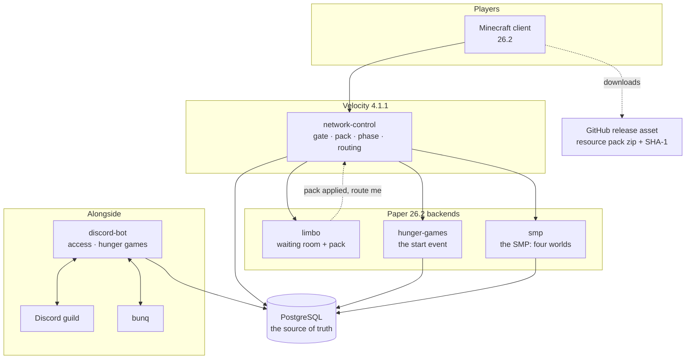
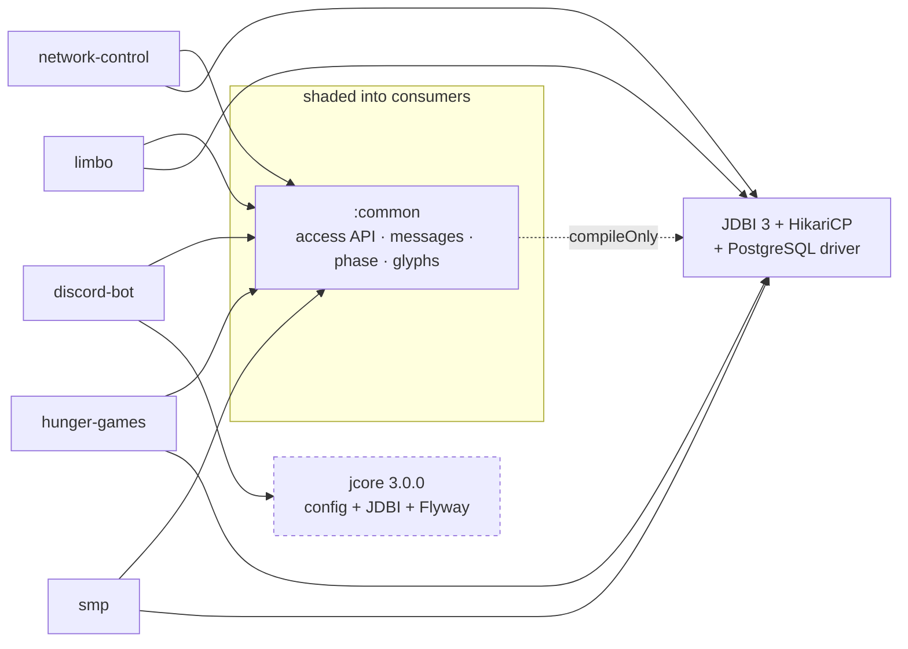
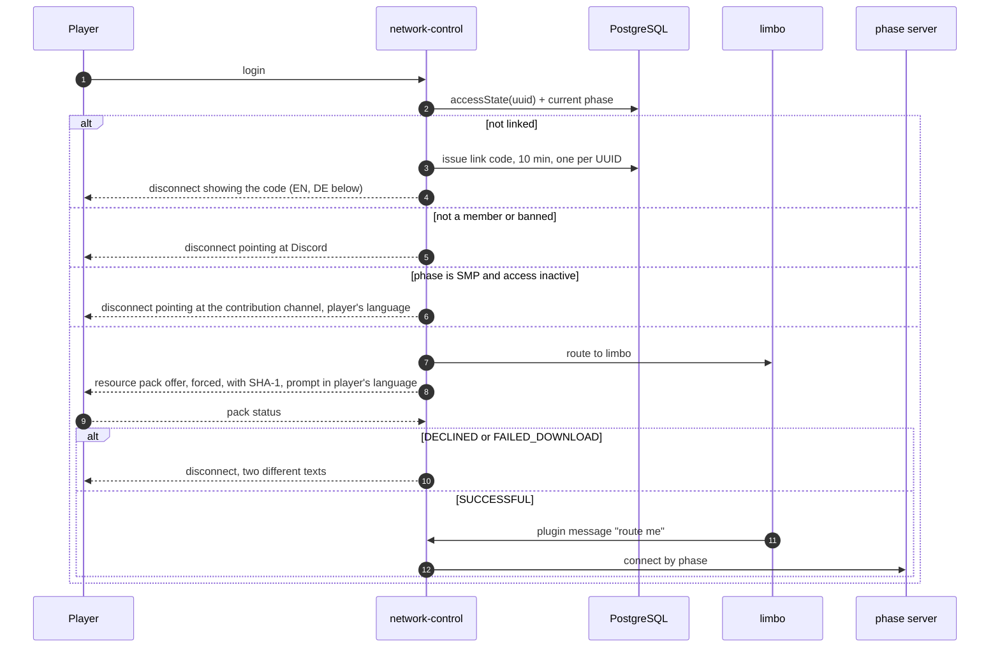

# Architecture

What season 2 is made of, how the pieces depend on each other, and which rules that dependency
graph enforces. Start at [README.md](README.md) if you have not read the index yet.

Status of every statement here: **design agreed 2026-08-30**, with the SMP module and the schema
location revised **2026-08-31**. What is already built is marked as such in the module table;
everything else is a plan and nothing more.

## The network

Every login lands on `limbo` first, whatever the phase. `limbo` applies the resource pack and asks
the proxy to route on; the proxy decides where by [phase](season-phases.md).

## Modules

| module | platform | owns | state |
|---|---|---|---|
| `network-control` | Velocity | Login gate, pack enforcement decision, current phase, routing, **network-wide play time** | login gate built (stage C), phase, pack and play time not built |
| `limbo` | Paper | The waiting room: pack application, and every state that means "wait" | not built; today's scaffold is named `resource-pack-coercion` and is to be renamed |
| `hunger-games` | Paper | The start event in full | not built, scaffold only |
| `smp` | Paper | The SMP: Nordtal, farm world, Nether, End, milestones, aura, prestige, duels, POIs, graves | not built, scaffold only; renamed from `smp-farm-world` 2026-08-31. [Concept agreed 2026-08-31](smp.md) |
| `discord-bot` | JVM app | Discord: access sales, account linking, HG registration, admin surface, **the schema** | built as `access-bot` (access half only); rename and HG half not done |
| `common` | library | `AccessDirectory`, message system, locale resolution, `SeasonPhase`, `Glyphs` | access API and messages built; phase and locale components not built |
| `resource-pack` | assets | Glyphs, HUD sprites, vanilla overrides, the released zip | built, carries season 1 leftovers to clean up |

One of the four planned renames is done; three are left, and they are cheap **only until something
runs in production**:

- `smp-farm-world` → **`smp`** (`eu.nordtal.s2.smp`, `SmpPlugin`, `name: smp`). Decided and
  **carried out 2026-08-31**: the module owns the build world, the spawn, milestones, aura,
  prestige, duels, POIs and graves — the farm world is one part of it, not the whole. See
  [smp.md](smp.md).
- `resource-pack-coercion` → **`limbo`** (`eu.nordtal.s2.limbo`). The module is a waiting room for
  every waiting state, not just the pack.
- `access-bot` → **`discord-bot`** (`eu.nordtal.s2.discordbot`, `ghcr.io/nordtal/discord-bot`),
  with `access/` and `hungergames/` as sibling feature packages. There is one Discord application,
  one token, one deployment — but the module must not be named after one of its features.
- `SeasonPhase.RESOURCE_PACK_INSTALL` → the phase enum becomes `PRE_EVENT`, `START_EVENT`, `SMP`,
  `MAINTENANCE`. See [season-phases.md](season-phases.md).

A Paper plugin's `name:` is its runtime identity — the `plugins/<name>/` data folder and the
permission prefix. Renaming after deployment means moving data folders on the production host.

**What `limbo` shows, decided 2026-08-31:** nothing. Black, no visible world, no other players and
**no chat**. A title in the player's language says what they are waiting for, and that is the
entire interface. Every other server has ordinary per-server chat.

## Dependencies, and the rules attached to them

- **`jcore` belongs to the bot alone.** Its dependency block is what makes the bot's shaded jar
  ~30 MB. A Paper plugin that needs the *config* system takes `eu.nordtal.jcore.config` and shades
  only that; it never pulls the Flyway/PostgreSQL side.
- **`:common` declares JDBI, HikariCP and slf4j `compileOnly`.** Consumers shade their own copy.
  Nothing from JDBI appears on `AccessDirectory`'s signature — its factories take a
  `javax.sql.DataSource` or a JDBC URL — so a consumer never compiles against them.
- **Gson and SnakeYAML are never shaded into a Paper plugin.** Paper 26.2 provides both from
  `libraries/`; verified on a running server 2026-08-30. `nordtal.paper-plugin` excludes them.
  The bot has no platform to provide them and therefore does bundle them.
- **`app.simplecloud.api:api` stays `compileOnly` and is never shaded.**
- **Decide per module whether it needs persistence.** `limbo` probably does not: it holds nobody's
  state. `hunger-games` does — its registrations arrive from Discord. `smp` does, heavily: aura,
  prestige, milestone progress, contributions, POIs, duels and graves all outlive a restart. Do not
  add a database because the neighbouring module has one.

## Schema ownership

**Exactly one process migrates: the bot.** That has not changed. What changed on **2026-08-31** is
*where the SQL lives*: the migration files move to `:common/src/main/resources/db/migration/`, and
the bot applies them at startup from there. **The move itself has not been carried out** — today
the files still sit under `access-bot/src/main/resources/db/migration/` and `:common`'s tests still
reach into that directory.

The two questions are separate and were being answered as one:

- **Who runs Flyway?** Only the bot — unchanged, and the reason is unchanged: Flyway must never
  reach `:common`, or it lands in every plugin jar.
- **Where do the `.sql` files live?** In `:common`, alongside the APIs that read those tables. SMP
  DDL living inside a Discord bot module was an oddity nobody could justify on reading it.

The cost is that every plugin jar carries a few KB of SQL text it never reads. That is the whole
price, and it buys a schema that sits next to its reading API instead of inside an unrelated
module. `:common`'s tests apply that directory directly — which is now simply a local path rather
than a documented reach into the bot module.

One table is written by the proxy rather than by a plugin: **`player_playtime`**. Play time is a
network-wide fact and only the proxy sees a whole session, so `network-control` accumulates it and
writes it on disconnect and periodically. It carries no `smp_` prefix for exactly that reason,
even though the SMP is what reads it — see [smp.md](smp.md#prestige--a-crest-earned-by-time).

That arrangement covers every table in this plan: the phase row
([season-phases.md](season-phases.md)), the hunger games tables
([hunger-games.md](hunger-games.md)) and the SMP tables ([smp.md](smp.md#data-model)) are all
migrated by the bot and read — and their game-state rows written — by the plugins.

## The login path, end to end

The order is the logic, which is why all of it lives in **one** Velocity plugin with separate
packages (`gate`, `pack`, `phase`, `routing`) rather than in several plugins whose event
priorities would have to encode it. Decided 2026-08-30.

**Unverified, and load-bearing:** that a forced pack offer sent by the proxy behaves correctly
while the player is being moved to `limbo`, and that a Minecraft client follows GitHub's redirect
to `objects.githubusercontent.com` when downloading the pack. Both need a running proxy and a real
client. See [operations.md](operations.md#open-verification).

## Build and release

Unchanged by this plan, and documented in [../CLAUDE.md](../CLAUDE.md):

- `build-logic` holds the convention plugins; a module build file is a `plugins {}` block plus its
  own dependencies. Every external version lives in `gradle/libs.versions.toml`.
- One repo-wide version in `gradle.properties` drives every artifact. A `v*` tag that disagrees
  with it fails the release workflow.
- One GitHub release carries the plugin jars, the bot jar and the pack zip with its `.sha1`, and
  the workflow pushes the bot's container image.

The pack zip attached to that release is also **what players download** — see
[operations.md](operations.md#resource-pack-hosting).
