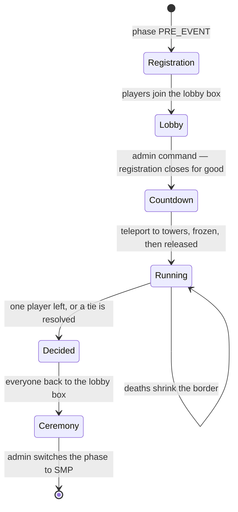
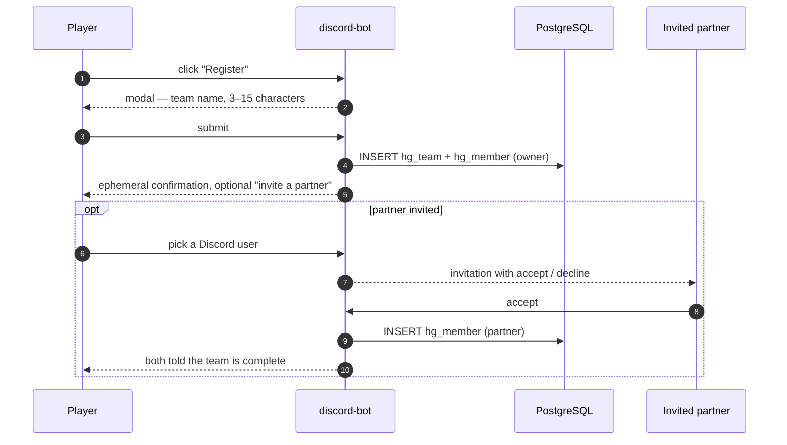
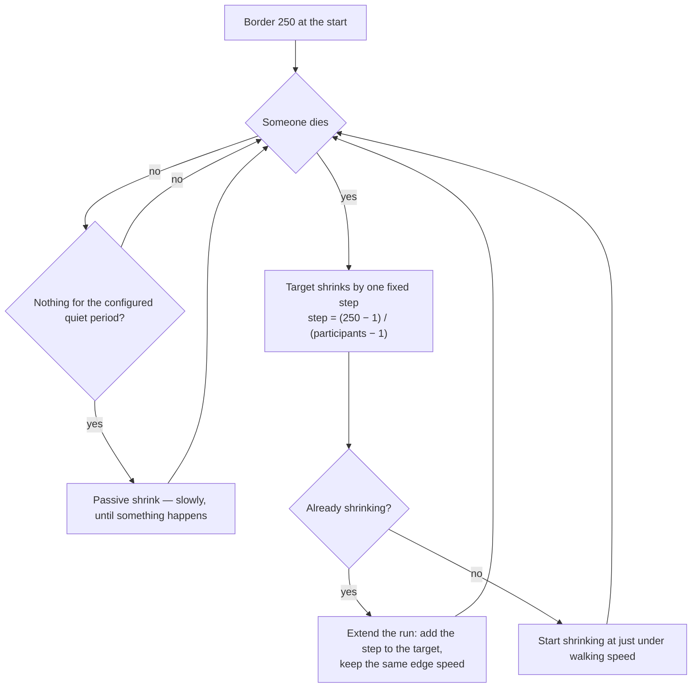
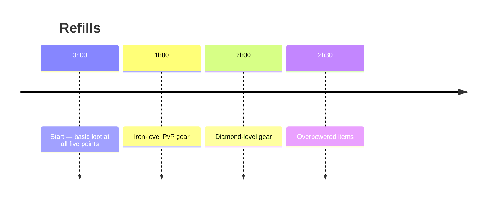
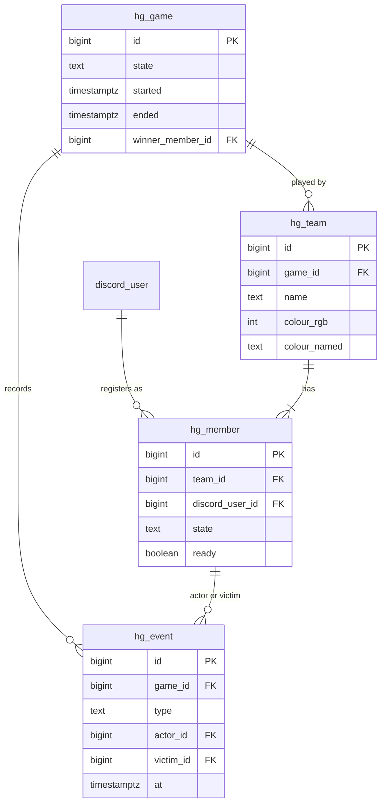

# Hunger Games — the season 2 start event

The event that opens season 2. One map, 15–30 players, teams of one or two, a border that closes in
with every death, and **exactly one winner** — teams are an alliance with an expiry date.

Status: **concept agreed 2026-08-30, built 2026-08-31 — both halves.** The `hunger-games` Paper
module implements the border, the loot refills, the HUD, the lobby, the disconnected bodies, the
generated team colours, the win and tie rules and the ceremony; `discord-bot`'s `hungergames`
package implements registration, team names and partner invitations. 41 tests.

**What is left is not code.** The hand-built world folder, the aerial and rules images (the shipped
`lobby/map-*.png` are dummy placeholders), and the full rehearsal under
[Verification](#verification), which nothing substitutes for. This document remains the reference for
what the code is supposed to do.

**Access is not required to play.** Anyone whose Minecraft account is linked to their Discord
account may join during `PRE_EVENT` and `START_EVENT`; paid access only starts to matter when the
phase turns to `SMP`. See [season-phases.md](season-phases.md).

## Lifecycle

## Registration

In Discord, run by the `hungergames` package of `discord-bot`. A managed message per language
channel carries a **Register** button.

- **Team name, not team colour.** 3–15 characters, unique, filtered for the obvious. Colour is
  assigned by us — see below.
- A partner may be invited **at creation or later**, and must accept. One partner maximum.
- Registration is open until the admin starts the countdown, **including during the lobby phase**.
  Once the countdown runs, it is closed for good.
- A linked player who never registers may still join and watch as a spectator, at any time.

## Teams, colours and hearts

Colours are **generated, not chosen** — with up to 30 mostly-solo teams, Minecraft's 16 named
colours cannot tell them apart.

- A palette is generated for exactly the number of teams that exist when the countdown starts:
  evenly spaced hues at a fixed saturation and lightness, which is the arrangement that separates
  *n* colours best.
- Each team draws one, and the assignment is **written to the database**. A server restart mid-event
  therefore repaints every team exactly as before.
- For the vanilla surfaces that only accept a named colour — scoreboard team, tab list — each
  generated colour is additionally mapped to its **nearest named colour**. Everything the plugin
  renders itself (nametags via display tags, HUD, chat prefixes, boards) uses the exact colour.

| team size | hearts each | total team health |
|---|---|---|
| solo | 10 | 20 HP |
| duo | 8 | 16 HP each |

A duo whose partner is **not present when the countdown starts** — never logged in, so not even a
dummy body — becomes a **solo team with full hearts**, keeping its name and colour. The reduced
hearts pay for a second body; without the body they would be a punishment for someone else's
absence.

## The lobby

A glass-floored box above the map, on the `hunger-games` server, standing throughout `PRE_EVENT`.

- **Under the glass floor: an aerial view of the map** with the points of interest marked. It is a
  hand-prepared image — one per language — displayed on a grid of Minecraft maps. The plugin's job
  is only to slice a PNG onto a map grid and show **each player the image for their language**;
  producing the image is design work, not code. Rendering the map automatically was considered and
  rejected: a top-down world renderer plus programmatic POI markers is more work than two image
  files for a one-off event.
- **Rules and info boards**, likewise one prepared image per language.
- A **periodic broadcast** — "the game starts once everybody is ready" — carrying a clickable
  *"I have read the rules and I am ready"*. Ready state is visible to everyone; it informs the
  admin's decision and does not start anything by itself.
- Spectators share the lobby. The rules stated there include the ones we deliberately do **not**
  enforce technically: no cross-teaming, and no coaching a living player from a spectator's view.
  Players have channels we cannot see anyway; this runs on trust, and the announcement is what
  makes it a rule rather than an assumption.

**Spectators may join at any time, including after the countdown — settled 2026-08-31.** That is
not a new rule, it is the one already stated under [registration](#registration) ("a linked player
who never registers may still join and watch as a spectator, at any time") applied to the moment it
was left ambiguous for. Freezing the spectator list at the countdown would buy nothing: this
document already accepts that coaching is announced rather than enforced, and a spectator who
cannot get in simply watches a stream instead.

**There is no team chat, and that is what resolves the second half of the question.** Chat here is
per Paper server, Minecraft's default, needing no plugin — the same rule as everywhere else
([smp.md](smp.md#chat)). A team is at most two people who are already together in Discord voice;
giving them a second chat surface would create the spectator question it would then have to answer.
Considered and dropped for that reason.

## Start

Triggered by an **admin command**. Registration closes at that moment.

**Minimum participants, settled 2026-08-31: a hard floor of 2 and a configurable soft floor of 4.**
Two is not taste, it is arithmetic — the border step is `(250 − 1) / (participants − 1)`, which
divides by zero at one participant, so the command refuses a start below two and says why. Four is
the point below which the game is not worth playing, and the command asks for a confirmation rather
than refusing: a rehearsal with two or three real clients is exactly what
[verification](#verification) demands, and it must not be blocked by a rule meant to catch a
mis-click. A hard floor of four or eight was rejected for that reason.

1. Every registered, present player is teleported onto a **spawn tower**, arranged in a circle
   around the spawn at equal distance from the centre loot.
2. They are **held in place** for the countdown — nobody creeps toward the chests early.
3. Release, and **one minute of PvP protection**.

A player who was ready in the lobby and then disconnected is **not** dropped: their body is
teleported onto its tower at the start and waits there for its owner.

## Disconnects

**The body stays, and it stays vulnerable.** It does not vanish, it can be killed, and if the
border reaches it, it dies. There is no safe way to leave a fight.

This is why the border must also shrink with time (below): a game whose last survivors are
disconnected bodies would otherwise never end.

## The border

Centred on the spawn, **250 blocks at the start, 1 at the end.**

- **Equal steps, not equal percentages.** Every death takes the same absolute amount, so the loot
  points at staggered distances are cut off one after another in a predictable order. With 20
  players that is roughly 13 blocks of diameter per death.
- **Speed: just under walking speed.** Note that Minecraft's border size is a *diameter* — the wall
  moves at half the rate the diameter shrinks, so the diameter must change at about twice the
  intended wall speed. A player can outwalk it, but only by walking.
- **A death during a shrink extends it** rather than restarting it: the target moves further in and
  the wall keeps its speed.
- **The passive shrink** is not a nicety. It resolves the two dead ends the rules otherwise create:
  a field of disconnected bodies nobody kills, and the last two members of one team refusing to
  fight each other.

## Loot

Five points: **the spawn plus four at staggered distances**, so the shrinking border removes them
in turn. Initial loot is deliberately basic and farming-oriented.

- Refills **restock the same chests at the same positions**. The fixed points are what makes them
  worth fighting over, and they are what the lobby map marks.
- Loot pools live in **configuration**; the schedule above is the default, not a constant.
- Every refill is announced, and the HUD carries a countdown and a direction to the nearest point.
- A point that has been cut off by the border is simply gone. That is the intended pressure.

## The HUD

A **stack of boss bars** with the vanilla bar made invisible by the resource pack — the technique
season 1 already ships: `minecraft/textures/gui/sprites/boss_bar/white_background.png` and
`white_progress.png` are overridden, and `nordtal/textures/ui/bossbar/bg/` holds background
segments in powers of two, so any width is composed from a handful of glyphs.

| line | shows |
|---|---|
| players | how many are alive, how many have died, and an arrow to the nearest living player |
| loot | time until the next refill, and a compass direction to the nearest loot point |
| border | countdown to the next shrink; while it runs, the time left and the distance still to close |

Per player, updated a few times a second, text from the message bundles like everything else
([i18n.md](i18n.md)).

**Code points are owned by** [`resource-pack/README.md`](../resource-pack/README.md#nordtalbossbar)
since 2026-08-31, not by this document. What this HUD draws with: the compass (`\uEF00`, already
in the pack), the alive / dead / loot-point / border icons (`\uEF09`–`\uEF0C`) and the sixteen
bearing arrows (`\uEF10`–`\uEF1F`) shared with the SMP's `/navigate`. **No digit glyphs are
needed** — `nordtal:bossbar` already overrides printable ASCII at the bar's own metrics, and the
"digits" this document used to ask for do not have to exist.

## World rules

| rule | setting |
|---|---|
| seed | `1837371427` |
| world | **hand-built and shipped as a world folder** — the lobby box, the spawn towers and the POIs are built in advance, and the aerial image must match the world that is actually played |
| nether / end | **disabled** — the border only constrains the overworld, so a portal would be a way out of the shrinking field |
| day cycle | natural |
| weather | natural |
| natural regeneration | on |
| difficulty | normal |
| friendly fire | **always on and expressly allowed** |
| PvP protection | one minute after the start |

## Winning

**One player wins, not one team.** Friendly fire is on from the first second, and when the last two
survivors belong to the same team the game says so plainly — an announcement tells them they must
now face each other, and the passive border shrink makes sure the question gets answered.

- Last player standing wins.
- **If the last two die at the same moment, the one with more kills wins.** Equal kills means
  nobody wins, and the broadcast says so.
- The kill count runs for the whole game, is shown in the evaluation, and is therefore a real
  tiebreaker rather than a hidden one.

## After the game

1. Everyone — survivors, dead players and spectators — is teleported **back into the lobby box**,
   where the evaluation hangs as a board: winner, kills, survival times.
2. Broadcasts and the ceremony happen there.
3. **The admin switches the phase to `SMP`** when the moment is right. The event server does not
   decide that.

The winner carries something into the SMP: **extra aura points** while everyone else starts at
zero, plus one or two special items. Both are settable through config rather than compiled in.

**This module does not grant it — the SMP does, on the winner's first join.** Decided 2026-09-01.
The winner is recorded here, once, in `hg_game.winner_member_id`; the SMP reads that row and pays
out from its own config, tracking that it has done so in `smp_player.hg_winner_reward_granted`. The
earlier plan had this plugin write into `smp_aura_event` at the moment of the decision, which would
have pointed a dependency from the event at a module that did not exist and would have paid a winner
who never turns up for the season. See [smp.md](smp.md#the-hunger-games-winners-head-start).

Aura is now designed ([smp.md](smp.md#aura--recognition-not-currency)) and the head start is worth
restating in its terms: aura is **prestige only and buys nothing**, so the winner's advantage is
recognition in the tab list and on the leaderboard, not purchasing power. It is a visible head
start on a number everyone else has to earn through duels, objective contributions and
advancements — which is exactly what winning the start event should be worth, and no more.

## Data model

Migrated by the bot like every other table ([architecture.md](architecture.md#schema-ownership));
written by both the bot (registration) and the plugin (game state).

The Minecraft UUID is not duplicated here: it hangs off `discord_user` through the existing
`account_link`, and duplicating it would create a second answer to "whose account is this".

## Still open

- ~~**Loot pool contents.**~~ **Proposed 2026-08-31** as four `DefaultRefillTiers` at 0 / 60 / 120 /
  150 minutes, from wooden axe and bread through to netherite and a totem. Config defaults, meant to
  be corrected in a diff.
- ~~**Quiet period and passive shrink rate.**~~ **Proposed 2026-08-31**: 600 seconds of quiet, then
  15 blocks of diameter per hour, both in `HungerGamesSpec`.
- **Simple Voice Chat** is planned as an optional extra **under reservation**: it requires a client
  mod, so vanilla players cannot use it at all, and whether a build for Minecraft 26.2 exists is
  unconfirmed. Check before the event; if there is none, it is dropped without replacement.

## Event-day runbook

A sketch, to be filled in when the module has been rehearsed:

1. Pack released, URL and hash in `pack.yml`, verified with a real client.
2. World folder in place; lobby, towers, POIs and loot points built; the aerial image prepared for
   every configured language.
3. Phase set to `PRE_EVENT`. Registration message posted in every language channel.
4. Rehearsal with real clients — the list below.
5. Event: an admin starts the countdown, which closes registration for good.
6. Winner, ceremony in the lobby box, evaluation.
7. An admin switches the phase to `SMP`. The winner's aura and items are applied on their first
   join — by the SMP plugin, which is the only thing that writes to the SMP tables.

## Verification

"It compiles" proves nothing here. Before this is called done: a full rehearsal on a real server
with several real clients, covering the countdown freeze, a disconnect mid-fight, a border run that
is extended by a death during it, a refill, the HUD on a client that has the pack, and the tie rule.
