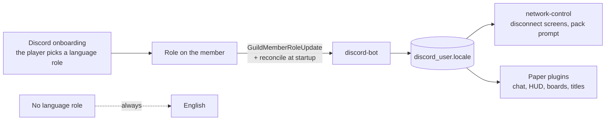

# Languages

Everything a player reads in season 2 exists in German and English, English is the fallback
everywhere, and a third language must be a configuration edit rather than a release.

Status: the message system in `:common` is **built** (`Messages`, `Locales`, 13 tests); the bot
mirrors the Discord role into `discord_user.locale` as part of the **built** access system. The
config model below is **built as of 2026-08-31** — `access.yml`'s `languages` list is the only
source for the language roles and the per-language channels, read through
`discord-bot`'s `eu.nordtal.s2.discordbot.config.Languages`. The plugin-side locale lookup is
**built too**: `:common`'s `eu.nordtal.s2.common.message.PlayerLocales` is the shared join-time
component this document asks for, and `hunger-games` already renders every string through it.

## Where a language comes from



The **role is the choice** and the bot owns none of it: onboarding is configured by hand in
Discord, the bot only reads. **No role means English** — decided 2026-08-30. The Minecraft client's
own language setting is deliberately *not* consulted, because Discord and the game showing
different languages is exactly what having one source avoids.

### The one exception — the resource pack's `lang` files

The pack's [`minecraft/lang/*.json`](../resource-pack/src/assets/minecraft/lang/) files are the one
place where the **client's own language setting** decides what a player sees — accepted 2026-08-31.

It is **unavoidable**. A resource pack is a static asset: the client picks `de_de.json` or
`en_us.json` by its own setting, and a JSON file in a zip cannot consult `discord_user.locale` or
reach a database at all. There is no version of this that obeys the rule above.

It is **acceptable** because of what lives there: three cosmetic vanilla overrides —
`menu.returnToGame`, `menu.game` (the logo glyph) and `menu.disconnect` — on the pause and
disconnect screens. Nothing about access, gameplay or any text the plugins or the bot send goes
through a lang file; all of that keeps reading `discord_user.locale` through the bundles below. The
exception stays cheap only as long as that remains true.

The consequence is real and **accepted rather than a bug to fix**: a player whose Discord language
is German but whose Minecraft client is English sees an English pause menu.

## The configuration model

`access.yml` used to have two fixed role fields (`roles.german`, `roles.english`) and four fixed
channels, which made a third language a code change. **They were deleted on 2026-08-31** and
replaced by a list — deleting a key is only free while nothing is deployed, because an undeclared
key stops the config load outright:

```yaml
languages:
  - tag: en                     # mandatory; the fallback for everything
    role: "000000000000000000"
    contribution-channel: "000000000000000000"
    link-channel: "000000000000000000"
  - tag: de
    role: "000000000000000000"
    contribution-channel: "000000000000000000"
    link-channel: "000000000000000000"
```

Rules the loader enforces, in the style of the existing tier list:

- **`en` must be present.** It is the fallback; a config without it fails to load with the YAML to
  write.
- **Tags are unique**, lowercase, and are the same strings used for bundle file names.
- **Ids default to empty and the bot refuses to start until they are filled in** — the standing
  rule for every id in this repository.
- A language entry is identified by its **tag**, so editing a tag retires that language the way
  editing a tier's day count retires that tier. The tag is also what `managed_message.kind` is
  built from (`CONTRIBUTION_<TAG>`, `LINK_<TAG>`), which is why a tag longer than 19 characters is
  refused: `kind` is `varchar(32)`.

### A member holding more than one language role

**The fallback loses to any other language.** Somebody holding `de` and `en` is recorded as `de`:
they picked a language and then also picked the thing everything already degrades to. That is the
generalisation of the rule the fixed keys had, which took German over English for the same reason.

Between two **non-fallback** languages — `de` and `fr` both held — the **configured order wins**,
first entry in `access.yml`. That case was **not decided by this document**; it was chosen in
`Languages#resolve` on 2026-08-31 because configured order is deterministic and is itself a config
edit. It is open to being overruled.

**A configured role id that matches no role in the guild is indistinguishable from one nobody
holds.** The bot is handed the ids a member has and nothing else, so a mistyped language role means
"that language is never mirrored", silently, forever. The config check only proves an id is a
snowflake. Nothing decides otherwise today.

jcore initialises a `List<NestedSpec>` to empty, which would ship a fresh install with no
languages at all. The tier list already solves this with `Specs.createUnsafe` in `DefaultTiers`
(verified 2026-08-30) — the language list follows that worked example, so a fresh `access.yml`
comes out carrying `en` and `de`.

## Bundles

One `.properties` file per language per module, read as UTF-8, exactly as `network-control` already
does:

```
network-control/src/main/resources/messages/network-control/{en,de}.properties
hunger-games/src/main/resources/messages/hunger-games/{en,de}.properties
discord-bot/src/main/resources/messages/access/{en,de}.properties
limbo/src/main/resources/messages/limbo/{en,de}.properties
smp/src/main/resources/messages/smp/{en,de}.properties
```

All five exist. `limbo`'s were written on 2026-09-01 and `smp`'s with the world half the same day -
this list said `smp`'s was "not yet" until 2026-09-05, which had been wrong since the afternoon the
HUD, the boards and the nametags were built. **`limbo`'s bundle is unusual and worth
looking at**: it is not one surface among many, it is that server's *entire* user interface — four
waiting reasons, a title and a subtitle each, and nothing else exists on the screen. A missing key
there does not degrade to English-looking text next to other text, it puts the literal string
`limbo.wait.backend.title` on an otherwise black screen, which is why that module's only test
asserts every reason is translated in both languages and that no title runs past forty characters.

**A command that exists on more than one surface has its own bundle, since 2026-09-04.**
`commands/src/main/resources/messages/commands/{en,de}.properties` holds every string a *shared*
command says, and a process loads it **underneath** its own through
`Messages.load(ClassLoader, List<String> roots, Path, Locale...)`. Later roots win, so a process can
reword a shared line for its own surface without editing the shared file.

The reason is the one this page keeps making: two copies of a sentence are one copy that is silently
out of date. `/phase` existed on the proxy and in the bot, and the bot's half was **eleven hardcoded
English sentences** — no bundle, no German, and no way for anybody to notice, because the two were
never rendered side by side. The proxy's `messages/network-control/{en,de}.properties` now carries
no `phase.*` key at all and says so where they used to be.

**The shared bundle carries no markup.** Paper and Velocity render MiniMessage; Discord renders its
own markdown; a string cannot carry both, and either one's syntax is literal text on the other
surface. The bot's `/phase` confirmation lost its `**bold**` to this rule, which is the price of one
sentence in two languages instead of two sentences in one. A key that genuinely needs styling on one
surface belongs in that process's own bundle, where it wins anyway. `MessageBundlesTest` in
`:commands` enforces both halves, plus one more that only matters here: **no command may name a key
no bundle declares**, checked by walking the module's own sources — a command holds no bundle, so a
typo in a key is invisible until somebody reaches that branch, and the interesting branches are the
failure ones.

Keys are dotted and lowercase, parameters are named and written in braces. Lookup is *language
match → English → the key itself*: a missing translation shows up on screen as
`disconnect.expired`, which is visible, reportable and harmless, and is logged once rather than
once per player per second. Never let a missing key throw on the login path.

## How a plugin knows a player's language

**The plugin reads it from the database at join and holds it for the session** — decided
2026-08-30, **built** as `:common`'s `PlayerLocales`. It does the loading, the caching and the
default, so all four modules behave identically and nobody invents a second rule. `of()` never
queries: for a player nobody called `join` for it answers English rather than blocking a render path.

**And it reads it off the main thread — settled 2026-09-01, after it had been built the other way.**
`hunger-games` called the blocking `join(uuid)` straight from its `PlayerJoinEvent` handler and
`limbo` was about to copy it. That is one round trip against an indexed lookup: a millisecond on a
healthy database, and the pool's entire connection timeout on a database that has stopped answering
— *per join*, with the server stopped behind it. On `limbo`, which every single login passes
through, that is the network freezing rather than one backend hesitating.

Both modules now call `PlayerLocales#joinAsync(uuid, executor)` with Bukkit's own async scheduler,
and every plugin's `database.yml` carries a `query-timeout-seconds` (default 3, the same value
`network-control` uses on the login path) setting both HikariCP's `connectionTimeout` and the
PostgreSQL driver's `socketTimeout` — because moving a wait off the main thread bounds *where* it
happens, not how long it lasts.

**The visible cost, which is small and is the point:** a render that fires before the answer arrives
gets English, so a German player may see one English line at the start of a session before the right
one replaces it. That is the same degradation a missing translation already has, and this document
is built on English being a correct answer everywhere. `limbo` redraws its title when the value
lands; `hunger-games` needs no redraw, because its HUD and boss bar re-render every tick anyway.

**This rule is why `limbo` has a database connection.** `limbo`'s whole interface is one translated
title, so it has to read a language like everybody else.
[architecture.md](architecture.md#dependencies-and-the-rules-attached-to-them) used to guess that
`limbo` needed no persistence because it holds nobody's state; that guess lost to this rule on
2026-09-01, and the module was built that day with a pool of three connections and exactly one
query in it.

Rejected alternatives, with the reason:

- *Proxy sends it in a plugin message.* Saves a query but introduces a message protocol and the
  question of what is true before the message arrives — on a path where something is always being
  rendered.
- *Client locale.* Free, but lets Discord and the game disagree.

One query per join against an indexed lookup is cheap. A language changed mid-session takes effect
on the next join, which is the correct trade for not re-querying on every message.

## What is translated

Everything a player can read:

- Proxy disconnect screens, the pack prompt, and the two pack-failure texts.
- Every plugin message, title, boss bar and board — including the hunger games HUD, whose text
  lives in bundles even though its decorations are glyphs.
- The lobby's rules and map boards, which exist as **one prepared image per language**
  ([hunger-games.md](hunger-games.md#the-lobby)).
- Bot embeds, DMs and managed messages, one managed message per language channel.

The **link-code disconnect screen is the one exception**: at that moment the account is unknown, so
it shows English first with German underneath in grey italics. With the language list this becomes
"every configured language, English first" — which is a reason to keep that screen short.

## Adding a language later

1. Add the role and the two channels in Discord, and the entry to `languages` in `access.yml`.
2. Add `<tag>.properties` to every module's `messages/` directory.
3. Add the language variant of the lobby images if the event is still ahead.
4. Restart the bot; the plugins pick the new tag up from the database with no change at all.

No release, no migration. Missing keys degrade to English on their own, so an incomplete
translation is safe to ship and finish later.
