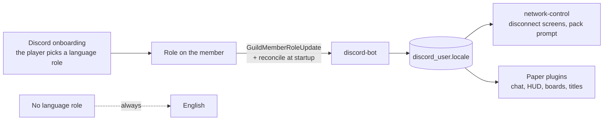

# Languages

Everything a player reads in season 2 exists in German and English, English is the fallback
everywhere, and a third language must be a configuration edit rather than a release.

Status: the message system in `:common` is **built** (`Messages`, `Locales`, 13 tests); the bot
mirrors the Discord role into `discord_user.locale` as part of the **built** access system. The
config model below and the plugin-side locale lookup are **agreed 2026-08-30 and not built**.

## Where a language comes from



The **role is the choice** and the bot owns none of it: onboarding is configured by hand in
Discord, the bot only reads. **No role means English** — decided 2026-08-30. The Minecraft client's
own language setting is deliberately *not* consulted, because Discord and the game showing
different languages is exactly what having one source avoids.

### The one exception — the resource pack's `lang` files

The pack's [`minecraft/lang/*.json`](../resource-pack/src/assets/minecraft/lang/) files are the one
place where the **client's own language setting** decides what a player sees — accepted 2026-08-31.

It is **unavoidable**. A resource pack is a static asset: the client picks `de_de.json` or
`en_us.json` by its own setting, and a JSON file in a zip cannot consult `discord_user.locale` or
reach a database at all. There is no version of this that obeys the rule above.

It is **acceptable** because of what lives there: three cosmetic vanilla overrides —
`menu.returnToGame`, `menu.game` (the logo glyph) and `menu.disconnect` — on the pause and
disconnect screens. Nothing about access, gameplay or any text the plugins or the bot send goes
through a lang file; all of that keeps reading `discord_user.locale` through the bundles below. The
exception stays cheap only as long as that remains true.

The consequence is real and **accepted rather than a bug to fix**: a player whose Discord language
is German but whose Minecraft client is English sees an English pause menu.

## The configuration model

Today `access.yml` has two fixed role fields (`roles.german`, `roles.english`) and four fixed
channels. That makes a third language a code change. It becomes **a list**:

```yaml
languages:
  - tag: en                     # mandatory; the fallback for everything
    role: "000000000000000000"
    contribution-channel: "000000000000000000"
    link-channel: "000000000000000000"
  - tag: de
    role: "000000000000000000"
    contribution-channel: "000000000000000000"
    link-channel: "000000000000000000"
```

Rules the loader enforces, in the style of the existing tier list:

- **`en` must be present.** It is the fallback; a config without it fails to load with the YAML to
  write.
- **Tags are unique**, lowercase, and are the same strings used for bundle file names.
- **Ids default to empty and the bot refuses to start until they are filled in** — the standing
  rule for every id in this repository.
- A language entry is identified by its **tag**, so editing a tag retires that language the way
  editing a tier's day count retires that tier.

jcore initialises a `List<NestedSpec>` to empty, which would ship a fresh install with no
languages at all. The tier list already solves this with `Specs.createUnsafe` in `DefaultTiers`
(verified 2026-08-30) — the language list follows that worked example, so a fresh `access.yml`
comes out carrying `en` and `de`.

## Bundles

One `.properties` file per language per module, read as UTF-8, exactly as `network-control` already
does:

```
network-control/src/main/resources/messages/network-control/{en,de}.properties
hunger-games/src/main/resources/messages/hunger-games/{en,de}.properties
discord-bot/src/main/resources/messages/access/{en,de}.properties
```

Keys are dotted and lowercase, parameters are named and written in braces. Lookup is *language
match → English → the key itself*: a missing translation shows up on screen as
`disconnect.expired`, which is visible, reportable and harmless, and is logged once rather than
once per player per second. Never let a missing key throw on the login path.

## How a plugin knows a player's language

**The plugin reads it from the database at join and holds it for the session** — decided
2026-08-30. A shared component in `:common` does the loading, the caching and the default, so all
four modules behave identically and nobody invents a second rule.

Rejected alternatives, with the reason:

- *Proxy sends it in a plugin message.* Saves a query but introduces a message protocol and the
  question of what is true before the message arrives — on a path where something is always being
  rendered.
- *Client locale.* Free, but lets Discord and the game disagree.

One query per join against an indexed lookup is cheap. A language changed mid-session takes effect
on the next join, which is the correct trade for not re-querying on every message.

## What is translated

Everything a player can read:

- Proxy disconnect screens, the pack prompt, and the two pack-failure texts.
- Every plugin message, title, boss bar and board — including the hunger games HUD, whose text
  lives in bundles even though its decorations are glyphs.
- The lobby's rules and map boards, which exist as **one prepared image per language**
  ([hunger-games.md](hunger-games.md#the-lobby)).
- Bot embeds, DMs and managed messages, one managed message per language channel.

The **link-code disconnect screen is the one exception**: at that moment the account is unknown, so
it shows English first with German underneath in grey italics. With the language list this becomes
"every configured language, English first" — which is a reason to keep that screen short.

## Adding a language later

1. Add the role and the two channels in Discord, and the entry to `languages` in `access.yml`.
2. Add `<tag>.properties` to every module's `messages/` directory.
3. Add the language variant of the lobby images if the event is still ahead.
4. Restart the bot; the plugins pick the new tag up from the database with no change at all.

No release, no migration. Missing keys degrade to English on their own, so an incomplete
translation is safe to ship and finish later.
