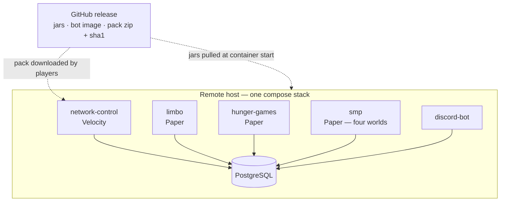

# Operations

How season 2 runs, gets deployed and gets released — and which parts of it nobody has verified yet.

## Deployment

**Season 2 does not run on SimpleCloud.** Decided 2026-09-01, before anything was deployed — the
reasoning is [below](#why-simplecloud-was-dropped). Production is **one `docker compose` stack on
one host**, driven through [Arcane](https://github.com/ofkm/arcane).



- **One `compose.yml`, three profiles** — `db`, `bot`, `mc`. The bot keeps the property this
  document has always claimed for it: it has no Minecraft dependency at all, and `--profile bot`
  brings it up without a proxy or a backend. What changed is that it no longer needs a compose file
  of its own to do that; `discord-bot/docker-compose.yml` is superseded. The bot's runbook and what
  cannot be tested without the network stay in [../discord-bot/README.md](../discord-bot/README.md).
- **Every service keeps its state in a named volume** — one per Minecraft server, one for the bot's
  config, one for the bunq context, one for PostgreSQL. **No bind mounts.** The stack is operated
  through Arcane, which can reach volumes directly, and a bind-mounted world folder is a
  uid/permission problem whose symptom is a corrupted save. Hand-built content — the hunger games
  map, the Nordtal spawn — is uploaded into the volume once per world; that is a deliberate manual
  step and is not part of any release.
- **The proxy needs database access.** PostgreSQL is a service in the same stack now, so this is a
  compose network rather than a firewall rule. The credentials still exist in more than one config
  file, because the database is the source of truth, and that is still accepted.
- **The bot is the only process that migrates.** Bring it up first after a schema change. Compose
  `depends_on` can express "PostgreSQL is healthy" and cannot express "the schema is current", so
  this stays an operator rule and not a dependency.
- **There is still no backup concept for that database, and it is still the gap in this document.**
  Access periods, payment records, aura, milestone progress and graves all live in one PostgreSQL,
  and nothing here says how it is backed up, how a restore is performed, or whether a restore has
  ever been tried. It remains the only irreversible risk in the project — everything else can be
  rebuilt from the repository. What the compose stack changes is only that the fix is now local and
  obvious, a `pg_dump` sidecar against the same volume. That is a reason to settle it before the SMP
  phase opens, in its own session; it is not a reason it is settled.

### The server containers

All four Minecraft services — the Velocity proxy and the three Paper backends — run the **same
image**, built from one Dockerfile in the style of `discord-bot/Dockerfile`: a JRE 25 base, the
server jar, and a wrapper as PID 1. itzg/docker-minecraft-server was considered and rejected; see
[below](#why-not-itzgdocker-minecraft-server).

- **The console is a `tmux` session, not stdin of PID 1.** Arcane's per-container shell is a
  `docker exec`, which by construction cannot reach PID 1's stdin — a server started as a plain
  `java -jar` would therefore have a console you can read and not write. The server instead runs
  inside a tmux session whose socket lives in the container, and the image ships two scripts:
  `console` attaches to it for full interactive read-and-write, and `mc <command>` sends a single
  command through `tmux send-keys` and needs no TTY at all. `tmux pipe-pane` mirrors the output to
  stdout, so `docker logs` and Arcane's log view keep showing everything they would have shown.
- **RCON is not used, because it would not be uniform.** Paper has it; **Velocity has no RCON at
  all** — checked 2026-09-01, the only option is the third-party Velocircon plugin. Choosing RCON
  would mean one mechanism for three servers, a different one for the proxy, and a third-party
  plugin on the single process whose whole job is deciding who may join. tmux costs two scripts and
  covers all four identically.
- **PID 1 traps SIGTERM**, sends `stop` into the session and waits for the JVM to exit. That is the
  price of putting tmux in the picture and it is not optional: without it, `docker stop` kills a
  wrapper and leaves the JVM to be SIGKILLed. **`stop_grace_period` is 180 s** on every Minecraft
  service — the compose default of 10 s does not save a Nordtal world at border 4000, and a save cut
  off halfway is the failure mode that stays invisible for days.
- **Plugin jars are pulled at container start from the GitHub release** named by one version in
  `.env`, into the server's own named volume. An update is a version bump and `up -d`; a rollback is
  the bump back. This is the job the SimpleCloud dashboard could not do at all, because its plugin
  management only understands Modrinth-hosted jars and every jar we deploy is either ours or a fork
  of ours.
- **The download policy is cache-first, with a hard failure only on a missing jar.** If the pinned
  version is already in the volume, nothing is fetched — a GitHub outage does not stop a restart. If
  a jar the pin requires is absent and cannot be fetched, the container **does not start**; it never
  silently falls back to an older jar, because "the server is up, running last week's plugin" is
  precisely the class of fault that is discovered late. Same doctrine as `network-control` failing
  closed on a bad config.
- **The Paper and Velocity server builds are pinned in `.env`**, matching the API versions in
  `gradle/libs.versions.toml`. Nothing resolves "latest" at runtime.
- **DisplayTags and PacketEvents arrive the same way**, onto the `smp` service only — see
  [Third-party plugins](#third-party-plugins).

### Why SimpleCloud was dropped

Recorded because this repository carried SimpleCloud as a premise for two weeks, and the reasons
should outlive the decision.

- **Its three selling points are dynamic instances, group templates and failover, and season 2 uses
  none of them.** Every service is a permanent singleton on one host. The one place templates would
  ordinarily still earn their keep — a fresh copy per game round — does not apply either: the hunger
  games run [exactly once](hunger-games.md#lifecycle), and the SMP's farm-world reset is an
  in-process unload/rename/load that never restarts a container.
- **Its plugin management only handles Modrinth-hosted jars**, so every release of ours was a manual
  file copy regardless. That was the daily cost, and it bought nothing back.
- **v3 is reachable only through a hosted closed-beta insider programme**, and
  `repo.simplecloud.app` has no releases channel at all — only `0.1.0-platform.NN-dev.*` snapshots
  (HTTP 404, checked 2026-08-31). A network that sells access for real money and is meant to run for
  about a year would have depended on a control plane we neither own nor can pin a version of, and
  nothing in this repository ever wrote a fallback for losing it.
- **It cost nothing to leave, today.** `app.simplecloud.api:api` was already gone, no line of code
  ever referenced SimpleCloud, and the runbook — groups, templates, how jars and configs reach the
  host — was still unwritten. This deleted an empty chapter instead of rewriting a full one, which
  is what it would have been a month later.

The two facts that were established about SimpleCloud remain true and stop mattering: it runs
Minecraft 26.2, and its API artefact is not something anyone can depend on.

### Why not itzg/docker-minecraft-server

The de-facto standard image and the obvious candidate. Checked 2026-09-01: it publishes `java25`
tags and `latest`/`stable` point at Java 25, but its documentation says nothing about 26.x version
numbering, so Paper on 26.2 would have had to be verified before trusting it. That question was
overtaken by three others:

- It does not cover Velocity. That is a **second** image, `itzg/bungeecord`, with its own
  conventions and its own env vocabulary.
- Neither image solves the console problem for the proxy, because Velocity has no RCON — so our own
  wrapper would have been layered on top either way.
- We want a **pinned** server build rather than runtime version resolution, and the pin already
  exists in the version catalog.

One Dockerfile of our own covers all four services identically, in the style the repository already
uses for the bot, and keeps third-party images out of the deployment path entirely.

## Configuration and secrets

This repository is public and contains **no secrets**. The Discord token, the bunq API key and the
database credentials arrive as environment variables at runtime; committed config files are
examples.

Every config file is commented YAML described by a `@ConfigSpec` interface and loaded through
`eu.nordtal.jcore.config`, each with its own environment namespace (`NORDTAL_<MODULE>_*`) so that
generic keys such as `password` cannot collide across files. A setting the interface does not
declare **stops the load** and names the key it probably meant; a Paper plugin catches that and
disables itself while the server keeps running.

`network-control` was the exception, and **it is now decided rather than flagged: on a bad config
the proxy fails closed.** Settled 2026-08-31.

It used to be that a bad `database.yml` or `gate.yml` was logged loudly and the login gate was
simply **never registered** — the proxy kept running and kept accepting logins un-gated. That is the
wrong way round for a value whose whole job is deciding who may join: *"the proxy is up but nobody can join"*
announces itself within seconds of the first player trying, while *"the proxy is up and the gate is
off"* announces itself never, and a single mistyped key silently opens the network.

The objection this was originally justified with — Velocity has no per-plugin disable — is true and
beside the point. **A `LoginEvent` handler that refuses everybody with a bilingual "network
misconfigured" screen is that disable, built by hand**, and it costs one class. Letting admins
through was considered and is impossible: the admin flag lives in the database that a bad
`database.yml` cannot reach, so there is nobody to exempt.

**Built 2026-08-31** as `network-control`'s `MisconfiguredGate`.

## Resource pack hosting

The release workflow builds the pack zip reproducibly — fixed file order, no timestamps, so the
same version always hashes the same — writes its SHA-1 next to it, and attaches both to the GitHub
release. **That release asset URL is what players download.** The client is sent the URL *and* the
hash and refuses the pack if they disagree; never hardcode a hash.

Consequences to keep in mind:

- A pack change means a new release, a new URL and a new hash in the proxy's configuration.
- The URL and hash are configuration, not code.
- **Both keys now exist, in `network-control`'s own `pack.yml`** — decided and built 2026-09-01.
  The file carries `enabled`, `url`, `sha1`, `force` and `apply-timeout-seconds`, with its own
  environment namespace `NORDTAL_NETWORK_CONTROL_PACK_*`. It is a separate file from `gate.yml`
  because these two values change on *every* pack release and `gate.yml` — which decides who may
  join a network that sells access — should not be edited on that rhythm. `url` and `sha1` default
  to empty and the proxy **fails closed** until they are filled in, the standing rule for every
  value nobody can guess; `enabled: false` is the escape hatch for a development proxy and for the
  hours between "the network is up" and "the first pack release exists".
- **`sha1` is validated as 40 hex characters and nothing more.** Whether it is the hash of the zip
  at `url` is a question only a client can answer, and it answers it with `FAILED_DOWNLOAD` — which
  reads as a network problem and is not one.
- **Put the `github.com/<owner>/<repo>/releases/download/<tag>/<file>` URL in the config, never the
  address it redirects to.** Measured with `curl` on **2026-09-01**: that URL answers exactly one
  `302`, and the `location:` is on **`release-assets.githubusercontent.com`** — *not*
  `objects.githubusercontent.com`, which is what this document used to name and is out of date. The
  target is a **signed URL carrying an expiry of well under an hour**, so a resolved address pasted
  into `pack.yml` gives a pack that works this afternoon and fails tonight. What that measurement
  does **not** settle is whether a Minecraft client follows the redirect; see the table below.

## Open verification

Nothing below has been confirmed. **Reordered and costed 2026-08-31**, with two columns the table
did not have: *when* the answer has to exist, and *what happens if it is no*. The second is the
one that was missing everywhere — an unverified assumption with no written fallback is a decision
nobody has made yet.

Read "when" as ownership: the session named there is the one that produces the answer, and no
earlier session should be blocked waiting for it.

| what | when | how to settle it | **if the answer is no** |
|---|---|---|---|
| **A Minecraft client follows GitHub's redirect** when downloading the pack | **the rehearsal below**, now that `limbo` is built | one real client against one real release asset | Host the zip on a small static HTTP host instead. The URL and the hash are already configuration and not code, so this is a config edit plus one thing more to keep alive and certificated on event day — cheap, but nobody should discover it that morning. |
| **A forced pack offer sent by the proxy while the player is being moved to `limbo`** behaves, and both refusal paths work — **including whether `PackStation`'s own `disconnect()` wins the race against Velocity's generic forced-pack kick**, which is the only way our `DECLINED` text reaches a 1.17+ client | **the rehearsal below** | running proxy, real client, decline and failed-download both | Offer the pack from `limbo` itself on join instead of from the proxy. That is what `resource-pack-coercion` was named for in the first place, so the fallback is the module doing its original job; the prompt simply appears one hop later. If only the *decline text* loses the race, the cheaper fallback is to accept Velocity's own wording for that one path and keep everything else — the player is still refused, just less kindly. |
| **`LISTEN`/`NOTIFY` through the pool** — a dedicated connection outside Hikari, a `getNotifications(timeout)` thread, and an unconditional re-read on every reconnect | *inside* the **phase-model** session, not before it — [it is built in the first pass](season-phases.md#source-of-truth-and-propagation) | integration test plus a restart drill with the connection killed underneath | Drop `NOTIFY` and keep the 30-second poll, which was always the actual guarantee. A switch then takes up to thirty seconds to propagate instead of feeling instant. No redesign, one paragraph deleted. |
| **Paper unloading and deleting a loaded world at runtime**, then loading a replacement under the same name | first days of the **`smp`** session — before the reset is built on top of it | a drill on `runServer` with players standing in the world | **Alternate two names instead of reusing one.** Pre-generate into `farm-world-b` while `farm-world-a` is live, load `-b`, move players, then unload and delete `-a`. That removes the same-name re-load, which is the part Paper is least likely to tolerate. Only if unloading *at all* fails does the reset need a server restart, and then it becomes an announced daily restart at the quiet hour. |
| **Background pre-generation of a 2000 × 2000 world without perceptible lag** | the **`smp`** session, measured on the real host with players online | tick-time measurement during a full pre-generation, not a guess | The farm world gets smaller — 2000 × 2000 is a config default and is [listed as a proposal](smp.md#numbers-that-are-proposals-not-decisions). If even a small world lags, pre-generate off-peak only, or generate on a separate process and copy the folder in. A config change, then an operational one; never a redesign. |
| **Simple Voice Chat on 26.2** | before the **event rehearsal** | check for a build | Dropped without replacement, as [hunger-games.md](hunger-games.md#still-open) already says. It needs a client mod, so vanilla players could never have used it anyway. Zero cost. |
| **Disconnecting a player from `PlayerChooseInitialServerEvent`** — what the missing-`limbo` fallback does. Since 2026-09-01 this covers **every** phase, not only `MAINTENANCE`: a proxy with no waiting room refuses every login rather than letting anybody past the pack station. `player.disconnect()` is the documented way to remove a player and the event is `@AwaitingEvent`, but a login-allowed player being kicked *during* initial server selection has not been seen happen | **the rehearsal below** | running proxy, real client, `gate.yml#server-limbo` pointed at a name `velocity.toml` does not have | Set the initial server to a server that does exist and disconnect from `ServerPostConnectEvent` instead, or move the whole check back into the `LoginEvent` gate as a maintenance refusal — which is the pre-2026-08-31 behaviour and is a one-line reversal |
| **`console` — the *interactive* attach — behaves inside Arcane's browser terminal.** `mc <command>` through a plain `docker exec` is already verified (below); what is untested is whether Arcane's xterm hands tmux a usable TTY, and whether detaching there really detaches | the **first deployment** session | open Arcane's shell on a running server container, run `console`, issue a command, then detach with `Ctrl-b d` and confirm the server is still up | Use `mc <command>` and the log view instead — that is send-and-read without a TTY and covers every command a runbook actually issues. Only the live scrollback is lost, and `docker exec -it <container> console` from an SSH session still gives it. |
| **Proxy-only pack enforcement**, making `limbo` unnecessary for packs | **after the event**, never on the critical path | an experiment on a running proxy | Nothing changes — `limbo` stays, which is the current design. This is the one row that can only *save* work, which is exactly why it is last. |

### Closed 2026-09-01

**The container design was built and measured, not just written.** A Velocity 4.1.1 build 24 and a
Paper 26.2 build 121 container were run from the image in `deploy/minecraft` on 2026-09-01:

- The **Fill API resolution works and is verified end to end** — the pinned build is fetched, its
  sha256 is checked against what the API reports, and a cached jar means no network call at all.
  Paper booted in 39 s from a cold volume, Velocity in 9 s.
- **The console is writable from a plain `docker exec`** — `mc "list"` and `mc "glist"` both
  executed and their output appeared in the container log. That is the mechanism Arcane's shell
  uses; only the interactive `console` attach inside its browser terminal is still untested.
- **`docker stop` shuts down gracefully and fast.** Paper: 3 s, exit 143, with
  `All dimensions are saved` and `All RegionFile I/O tasks to complete` in the log. Velocity: 2 s,
  exit 143, with `Shutting down the proxy...`. The 180 s `stop_grace_period` is headroom for a
  large world, not the expected duration.
- **The EULA gate fails closed** with the message that names it, before anything starts.

**The one that cost the session an hour: never mirror the console with
`tmux pipe-pane … > /proc/1/fd/1`.** It is the obvious way to get the tmux console into
`docker logs`, and it **wedges the container**. Measured on Docker 29.4.1: with that line, SIGTERM
never reaches PID 1, the shutdown trap never runs, the container survives the SIGKILL at the end of
the grace period, and `docker rm -f` then fails with *"tried to kill container, but did not receive
an exit event"* — a container that can only be cleared by restarting the Docker daemon. With the
same image and only that line removed, `docker stop` finishes in **one second**. A pipe-pane writer
holds a second handle on the container's stdout pipe from a process whose lifetime the shim does
not track; `tail -F` on the server's own `logs/latest.log` is a plain child of PID 1 inheriting its
stdout, does not do that, and additionally gives a container log free of terminal escape sequences.
An A/B of the identical image, one variable, both directions — this is written down because
rediscovering it costs the same hour.


**`app.simplecloud.api:api` is not needed and is gone.** This used to be the table's first row: the
artefact is published only as `0.1.0-platform.NN-dev.*` snapshots, with no releases channel on
`repo.simplecloud.app` at all. The row's own written fallback — "routing does not need it; Velocity
already knows its registered servers, and `ProxyServer.getServer(name)` is all the routing rules
use" — is exactly what happened when routing was written on 2026-08-31. The dependency, its two
repositories and its version-catalog entry were removed on 2026-09-01. **This is the row that
demonstrates why the "if the answer is no" column was added**: the question never had to be
answered, because the fallback was already a decision.

### Closed 2026-08-31

**Block logging on Minecraft 26.2 — searched, and the answer is "one, but not the one we want".**
Checked against the GitHub releases API, Modrinth v2, Hangar v1 and each project's own build files:
**CoreProtect's** last release (24.0, 2026-07-07) supports up to 26.1.2, but its `master` compiles
against `paper-api:26.2.build.48-alpha` and is actively committed; **Prism 4.4** already supports
26.2 explicitly and is MIT; **LogBlock's** source is on 26.2 and Java 25 but has had no release
since 2018. The decision is to **wait for CoreProtect** and give it its own SQLite file rather than
our PostgreSQL. The full comparison is in
[smp.md](smp.md#block-logging--checked-2026-08-31). If it is still missing when the phase is ready,
the phase opens without block logging — nothing in the design depends on it — and Prism is the
written fallback. The one sentence this *did* cost: smp.md no longer claims that emptying somebody
else's grave is traceable.

**SimpleCloud runs Minecraft 26.2.** Confirmed by the owner against SimpleCloud v3's dashboard.
*Superseded 2026-09-01 — season 2 does not run on SimpleCloud any more, so this answer no longer
applies to anything. It is kept because it is what the row asked and the answer was yes; see
[Why SimpleCloud was dropped](#why-simplecloud-was-dropped) for why the platform question stopped
being the interesting one.*
This was the first row in the table and the one everything else was told to wait behind; it no
longer blocks anything. What it does *not* settle is the API artefact, which is why that half is
now its own row above — the platform supporting 26.2 and the API being safe to compile against are
two different questions that the old single row ran together.

### Carried over from the access work

Nothing in the test suite touches bunq, Discord or a running proxy. Tab creation and settlement
need the **bunq sandbox**; buttons, modals, DMs and roles need the **real guild** in an admin-only
channel; a 3 € real purchase is the last step, never the development loop. Integration tests skip
themselves without Docker, so a green build on a machine without a Docker daemon proves less than
it looks.

## Rehearsal — the login path

**Written 2026-09-01, when `limbo` and the pack station were built, and not yet run.** Nothing in
this repository's 435 tests touches a proxy, a client or a packet: what they prove is the wire
format, the hold rule, the routing table and the config validation. Everything below is what those
tests cannot say anything about, and the three open verifications this session owns are steps 4, 6
and 8.

Take it in order. Each step names what has to be true before it, what to do, and **what a failure
means** — because on a black screen with one line of text, every failure looks the same.

### What has to exist first

| | |
|---|---|
| A **published GitHub release** carrying `resource-pack-<version>.zip` and its `.sha1` | The zip is what a client downloads and the `.sha1` is what goes in `pack.yml`. A release with no assets is what the pre-2026-08-31 workflow trigger produced — check the assets are actually attached |
| A **Velocity proxy** with `network-control`, and `velocity.toml` registering at least the server `gate.yml#server-limbo` names | The name is a deployment fact no document in this repository knows; the default is `limbo` |
| A **Paper 26.2 backend** running `limbo`, pointed at the same PostgreSQL | It needs the database for one thing only: the player's language |
| A **linked, non-banned Discord account** in the guild, and a second one for the two-player steps | The gate refuses everyone else before any of this is reached |
| The phase set to **`PRE_EVENT`** | The plainest case: no access required, and `hunger-games` may legitimately be down |

`pack.yml` for the run:

```yaml
enabled: true
url: 'https://github.com/nordtal/season-2/releases/download/v<version>/resource-pack-<version>.zip'
sha1: '<the content of the .sha1 asset, 40 hex characters>'
force: true
apply-timeout-seconds: 180
```

### The steps

1. **The proxy starts and says what it is doing.** Look for `Offering the resource pack from … (sha1 …, forced: true)`
   and `waiting room 'limbo' swept every 5s` in the start-up log. If instead every login is refused
   with the misconfigured screen, `pack.yml` failed validation — the message names the key.
2. **A wrong hash is refused before anybody joins.** Change one character of `sha1`, restart, and
   confirm the proxy fails closed rather than starting. Put it back. This is the only cheap proof
   that the check exists at all; every other way of discovering a bad hash costs a player.
3. **A first login lands in `limbo` and nowhere else.** Join. The screen must go black with a title
   — in the language of the Discord account, which is the first check on `PlayerLocales` from this
   module. `/glist` on the proxy must show the player on `limbo`, not on `hunger-games`.
4. **The pack downloads.** ← *open verification: does a client follow GitHub's redirect?* The prompt
   appears, the client downloads, and the player is moved to `hunger-games` within a second of the
   pack applying. **If the client reports `FAILED_DOWNLOAD` here, the redirect is the first suspect**
   and the fallback is a small static host — the URL is one config line. Distinguish it from a wrong
   hash by re-downloading the asset with `curl -L` and hashing it by hand: `shasum` of the
   downloaded zip must equal `pack.yml#sha1`.
5. **A second login is fast.** Rejoin. The client has the pack cached and should pass through the
   waiting room in well under a second. If it re-downloads every time, the id or the hash is not
   reaching the client.
6. **Declining is refused, with our text.** ← *open verification: does `PackStation`'s disconnect win
   the race?* Set the client's server-resource-pack setting to *Prompt*, join, and press the
   decline/escape key. Expected: the nordtal decline screen in the player's language. **Acceptable
   failure:** Minecraft's own "you must accept the resource pack" text — that means Velocity's
   forced-pack kick won the race, which is the case `pack.yml#force` documents. Either way the
   player must be **off the network**; a player left sitting in `limbo` after declining is a real
   failure and not a cosmetic one.
7. **A failed download is refused, with the other text.** Point `url` at a URL that returns 404,
   with the hash unchanged, restart, and join. Expected: the nordtal `pack.failed-download` screen.
   Then point `url` at something that is not a zip at all and confirm the `pack.invalid-url` screen
   — this is the one that would hit every player at once, so it is worth seeing once on purpose.
8. **A missing waiting room refuses the login.** ← *open verification: can a `LoginEvent`-allowed
   player be disconnected from `PlayerChooseInitialServerEvent`?* Point `gate.yml#server-limbo` at a
   name `velocity.toml` does not have, restart the proxy, and join. Expected: the `gate.no-server`
   screen, and **nothing else** — specifically not a silent landing on `velocity.toml`'s own `try`
   list, which is the outcome this refusal exists to prevent. If the disconnect does not take, the
   fallback in the table above is to do it from `ServerPostConnectEvent` instead.
9. **A backend that is not up holds rather than kicks.** Restore `server-limbo`, stop the
   `hunger-games` backend, and join. Expected: the pack applies, the title changes to *Waiting for
   the server*, and the player sits there. Start `hunger-games`; they must be moved within one sweep
   (five seconds) with nothing else touched.
10. **Maintenance holds, and a switch releases.** With a player waiting, run `/phase set MAINTENANCE`.
    The title must change to the maintenance one **without moving anybody**. Switch back to
    `PRE_EVENT`: the same player must be released onto `hunger-games`, again within one sweep.
11. **Two players cannot see or hear each other.** Join with both accounts at once — the phase's
    backend stopped, so both are held. Neither may see the other's skin, nameplate or chat, and
    neither may see a join message. This is the whole of docs/architecture.md's "no other players
    and no chat".
12. **An admin during maintenance is not moved.** With the phase in `MAINTENANCE`, join with an
    account carrying `discord_user.admin`. They must **not** land in `limbo` — and, as a known
    consequence, they are also the one player not offered the pack. See
    `PhaseRouting#decideInitial`.
13. **The timeout does something.** Not reproducible with a healthy client. Drop
    `apply-timeout-seconds` to `10`, join, and let the prompt sit unanswered: expected is the
    `pack.timeout` screen rather than an indefinite black screen. Put it back to `180`.

### What to write down afterwards

Steps 4, 6 and 8 each answer a row in [Open verification](#open-verification). Move the row out of
that table and into a "closed" section with the date and what was actually observed — including a
*no*, which is a result and not a failure: every one of those rows has a written fallback precisely
so that the answer can be no without anything being blocked.

## Event-day runbook — hunger games

A sketch to be filled in once the module exists:

1. Pack released, URL and hash in the proxy config, verified with a real client.
2. Hunger games world folder in place, lobby, towers, POIs and loot points built; aerial images
   prepared for every configured language.
3. Phase set to `PRE_EVENT`. Registration message posted in every language channel.
4. Rehearsal with real clients — see [hunger-games.md](hunger-games.md#verification).
5. Event: admin starts the countdown, which closes registration for good.
6. Winner, ceremony in the lobby box, evaluation.
7. Admin switches the phase to `SMP`. Winner's aura points and items applied.

## Running the SMP

The SMP's concept is [smp.md](smp.md); what it costs to operate is here.

### Measuring the pre-generation — do this first

**Written 2026-09-01, not yet run.** Two numbers gate the SMP and neither can be guessed: how long
Nordtal's one-off pre-generation to border 4000 takes in wall clock and how much disk it eats, and
what the farm world's *daily* pre-generation does to tick time while people are playing. The first
decides whether the season's last milestone is deliverable at all; the second is what
[smp.md](smp.md#the-farm-world-reset) calls the single biggest technical risk in the concept.

They are cheap, they are independent of every line of plugin code, and they have to happen **on the
real host** — a laptop measurement says something about disk and almost nothing about wall clock.

**The tool is [Chunky](https://modrinth.com/plugin/chunky).** Version **1.5.3**, published
2026-05-04, tags Minecraft **26.2** for the `paper` loader explicitly — checked against the Modrinth
v2 API on 2026-09-01, not from memory. It is not a dependency of this build and never will be: it is
an operator's tool that runs on the server for an afternoon and is then taken off again. The plugin
this repository ships neither knows nor cares that it was used.

#### A — Nordtal to border 4000, once, with nobody online

A radius of **2000** blocks (the border is a diameter of 4000) around the working centre
**X 106 / Z 88**.

```bash
chunky world nordtal && chunky center 106 88 && chunky radius 2000 && chunky start
```

Write down, in this order:

| | how |
|---|---|
| **when it started** | `date` before `chunky start` — Chunky's own ETA is a projection, not a measurement |
| **wall clock to completion** | `date` when it prints that it is done |
| **disk before and after** | `du -sh nordtal/` at both ends, and the delta |
| **the host** | CPU model, core count, RAM, and whether the disk is NVMe or spinning. A number with no machine attached to it cannot be compared to anything later |

**What each answer means.** Under about six hours and a few gigabytes: nothing changes, the phase
can be scheduled around one quiet night. A day or more, or tens of gigabytes: the final border of
4000 is the number to reconsider — it is a config default in the milestone file and lowering it is
one line, whereas discovering the problem the week the milestone is due is not.
[smp.md](smp.md#the-track) is explicit that every number in the track is a default and the *rules*
are the decision, so a smaller frontier is a retune and not a redesign.

**Do the Nether and the End in the same sitting**, radius 1000 each, and note them separately. They
are a fixed 2000 diameter and are generated once before their own milestones unlock, so a surprise
there is the same kind of surprise a month later.

#### B — the farm world's daily pre-generation, with players online

This is the one that is easy to get wrong by measuring the wrong thing. What matters is not how
long the generation takes but **what the server feels like while it runs**, because it runs every
day, throttled, alongside a live server.

1. Get the baseline first. With the usual number of players online and nothing generating, sample
   `tps` and, more importantly, the **millisecond tick time** — Paper's `/tps` rounds to a number
   that hides the problem, so use `/mspt` or `spark` if it is installed. Ten minutes is enough.
2. Start a farm-world pre-generation at the size the config actually uses (radius 1000 for the
   2000 × 2000 default), with Chunky throttled: `chunky quiet 5` and a low `chunky trim`/task rate
   are the levers.
3. Sample again for the same ten minutes, at the same time of day, with roughly the same player
   count.

Write down both distributions, not just the averages: **the 95th percentile of tick time is the
number players actually notice.** An average that moves from 20 ms to 24 ms with a p95 that moves
from 30 ms to 180 ms is a server that stutters, and the average would have said it was fine.

**What each answer means, and all three outcomes are already written down as decisions rather than
as problems:**

- **Imperceptible** — p95 barely moves. Nothing changes; the daily reset is built as
  [smp.md](smp.md#the-farm-world-reset) describes it.
- **Perceptible** — the farm world gets smaller. Its 2000 × 2000 is
  [a proposal, not a decision](smp.md#numbers-that-are-proposals-not-decisions), and halving the
  radius quarters the work.
- **Perceptible even when small** — pre-generate off-peak only, or generate into a folder on a
  separate process and move it in. That is an operational change, not a redesign: the reset is
  already a swap of folders, so where the folder came from is not something the plugin has an
  opinion about.

**Whatever the answer, the reset postpones itself rather than swapping in a half-built world.** That
rule is in the design already and does not depend on these numbers; what the numbers decide is how
often the postponement would fire.

#### C — while you are on the host anyway

Two more things that cost minutes and answer questions nothing else can:

- **`du -sh` the finished farm world**, so that "the daily reset writes and deletes this much" is a
  known quantity rather than a surprise on a full disk. Two farm worlds exist at once during the
  swap — today's and tomorrow's — so the headroom needed is twice this.
- **Confirm the world folders can be unloaded and deleted at runtime at all.** That is its own row
  in [the table above](#open-verification), owned by the `smp` session, and the drill is cheapest on
  a server that is already up for these measurements.

### The daily farm-world reset

The farm world is regenerated every day at a configured time, and the design is a **swap, not a
rebuild in place**: tomorrow's world is pre-generated in the background during the day into a
separate folder, and the reset itself is only an unload, a rename and a load.

What an operator needs to know:

- **The window is seconds, not the length of a pre-generation** — but only as long as the
  background job has finished. If it has not, the reset **postpones itself** rather than swapping
  in a half-built world. A repeatedly postponed reset means the pre-generation is too slow for the
  configured size and the farm world should get smaller.
- **No server restart is involved.** Paper loads and unloads worlds at runtime.
- **Only players standing in the farm world are moved**, and they go to the Nordtal spawn, not to
  `limbo`. Nordtal, Nether and End players never notice.
- **The pre-generation is the biggest operational risk in the SMP**, because it competes with a
  live server for CPU. It is throttled and off the main thread, and its effect on tick time has to
  be measured on the real host before the size is trusted.
- Everything in the farm world is destroyed by the reset, including graves and POIs. That is
  intended and is announced to players; it is not a fault report.

### Worlds and pre-generation

Every world is pre-generated to its border before players may enter, and players wait in `limbo`
until it is.

**Nordtal is the exception that removes a risk rather than adding one.** Since 2026-08-31 it is
pre-generated **once, to its final border of 4000**, before the SMP phase opens — no players
online, no throttling — and a milestone unlock then only moves the border number. An earlier
version of this paragraph said a border milestone implies pre-generating the new ring while players
are online; that would have run a second generator alongside the farm world's daily one and made
the season's last milestone depend on a background job finishing in time. What it costs instead is
a one-off of hours of wall clock and a few gigabytes of disk, **both of which have to be measured
on the real host before the phase is scheduled** — see
[smp.md](smp.md#worlds). The Nether and End borders are a fixed 2000 and are generated once,
before their own milestone unlocks.

### Third-party plugins

The SMP introduces the network's first third-party dependencies, and they are of two different
kinds — which is the distinction to keep, because one of them may be missing and the other may not.

**Required: DisplayTags, and PacketEvents underneath it.** Decided 2026-09-01. Nametags on the SMP
come from [`papermc-display-tags`](https://github.com/nordtal/papermc-display-tags), our own fork,
through its `:api` module ([smp.md](smp.md#what-a-player-looks-like)); the API is an interface over
the running plugin, so DisplayTags has to be installed, and DisplayTags needs PacketEvents. The SMP
plugin declares DisplayTags in `paper-plugin.yml` with `load: BEFORE` and `required: true`, so a
server missing either fails loudly at start rather than quietly rendering plain nametags. Two jars to
keep current with Minecraft 26.2 on the SMP server, and one of them is ours.

**Optional: CoreProtect**, kept purely as insurance. Nothing in the design depends on it, and it gets its own SQLite file rather
than a schema in our PostgreSQL, so that
"[exactly one process migrates](architecture.md#schema-ownership)" stays literally true.

**It has no Minecraft 26.2 release as of 2026-08-31**, only a `master` that builds against 26.2 —
see [closed 2026-08-31](#closed-2026-08-31) for the search and
[smp.md](smp.md#block-logging--checked-2026-08-31) for the comparison against Prism and LogBlock.
If it has not shipped by the time the phase is ready, the phase opens without it.

## Release

One repo-wide version in `gradle.properties` drives every artifact; a tag that disagrees with it
fails the workflow. One release carries the plugin jars, the bot jar and the pack zip with its
`.sha1`, and pushes the bot's container image. `season-2` produces no combined build and does not
republish jars built in other repositories.

**A release is a published GitHub release, not a pushed tag.** Tag the commit, then publish a
release for that tag - `git push --tags` alone builds nothing. This was `push: tags` until
2026-08-31, which meant a release published from an already-existing tag never fired the workflow
and ended up with no assets on it. A build that failed is re-run with `workflow_dispatch` and the
tag name; the release itself does not have to be touched.

The release job runs `./gradlew check releaseArtifacts`, so a red test stops a release, and it
verifies the pack zip against its own `.sha1` and checks that `pack.mcmeta` is at the root of the
zip - both are things a Minecraft client punishes by refusing the pack and a build does not notice.
The release notes are left alone; a human writes them.

`.github/workflows/build.yml` builds and tests every push to `main` and every pull request.

**Nothing here has ever run**: there are no tags and no releases on the remote as of 2026-08-31.
