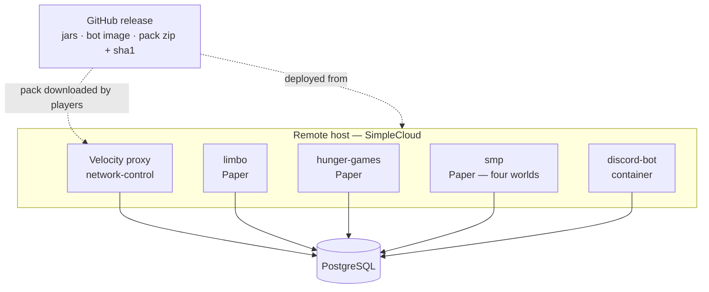

# Operations

How season 2 runs, gets deployed and gets released — and which parts of it nobody has verified yet.

## Deployment

- Production runs on [SimpleCloud](https://simplecloud.app) on a remote host.
- **The proxy needs database access.** PostgreSQL must be reachable from the proxy host, and the
  credentials therefore exist in more than one config file. That is a consequence of the database
  being the source of truth, and it is accepted.
- **The bot is the only process that migrates.** Every other process expects the schema to be
  current; bring the bot up first after a schema change.
- **The bot deploys on its own, and does so today.** It has no Minecraft dependency at all - its
  runtime dependencies are PostgreSQL, the Discord gateway and bunq - so it does not wait for the
  proxy or any backend. `discord-bot/docker-compose.yml` runs it, optionally with a PostgreSQL
  beside it, configured entirely through environment variables; the runbook and what cannot be
  tested without the network are in [../discord-bot/README.md](../discord-bot/README.md).

## Configuration and secrets

This repository is public and contains **no secrets**. The Discord token, the bunq API key and the
database credentials arrive as environment variables at runtime; committed config files are
examples.

Every config file is commented YAML described by a `@ConfigSpec` interface and loaded through
`eu.nordtal.jcore.config`, each with its own environment namespace (`NORDTAL_<MODULE>_*`) so that
generic keys such as `password` cannot collide across files. A setting the interface does not
declare **stops the load** and names the key it probably meant; a Paper plugin catches that and
disables itself while the server keeps running.

`network-control` was the exception, and **it is now decided rather than flagged: on a bad config
the proxy fails closed.** Settled 2026-08-31.

Today a bad `database.yml` or `gate.yml` is logged loudly and the login gate is simply **never
registered** — the proxy keeps running and keeps accepting logins un-gated. That is the wrong way
round for a value whose whole job is deciding who may join: *"the proxy is up but nobody can join"*
announces itself within seconds of the first player trying, while *"the proxy is up and the gate is
off"* announces itself never, and a single mistyped key silently opens the network.

The objection this was originally justified with — Velocity has no per-plugin disable — is true and
beside the point. **A `LoginEvent` handler that refuses everybody with a bilingual "network
misconfigured" screen is that disable, built by hand**, and it costs one class. Letting admins
through was considered and is impossible: the admin flag lives in the database that a bad
`database.yml` cannot reach, so there is nobody to exempt.

Not implemented yet — this is a decision waiting for the session that next opens
`NetworkControlPlugin`.

## Resource pack hosting

The release workflow builds the pack zip reproducibly — fixed file order, no timestamps, so the
same version always hashes the same — writes its SHA-1 next to it, and attaches both to the GitHub
release. **That release asset URL is what players download.** The client is sent the URL *and* the
hash and refuses the pack if they disagree; never hardcode a hash.

Consequences to keep in mind:

- A pack change means a new release, a new URL and a new hash in the proxy's configuration.
- The URL and hash are configuration, not code.

## Open verification

Nothing below has been confirmed. **Reordered and costed 2026-08-31**, with two columns the table
did not have: *when* the answer has to exist, and *what happens if it is no*. The second is the
one that was missing everywhere — an unverified assumption with no written fallback is a decision
nobody has made yet.

Read "when" as ownership: the session named there is the one that produces the answer, and no
earlier session should be blocked waiting for it.

| what | when | how to settle it | **if the answer is no** |
|---|---|---|---|
| **`app.simplecloud.api:api` is only published as `0.1.0-platform.NN-dev.*` snapshots** — there is no releases channel on `repo.simplecloud.app` at all (HTTP 404, checked 2026-08-31), and the catalog pins `platform.54-dev.1.1-770dcc6` from 2026-08-20 | before routing is written — the **`limbo`** session | watch whether the coordinate still resolves, and whether a stable channel appears | **Routing does not need it.** Velocity already knows its registered servers from `velocity.toml`; `ProxyServer.getServer(name)` and `getAllServers()` are all the routing rules use. Drop the `compileOnly` dependency and route by configured server name. Four fixed servers lose nothing by being named instead of discovered. |
| **A Minecraft client follows GitHub's redirect** to `objects.githubusercontent.com` when downloading the pack | before the **`limbo`** session, because `limbo` exists largely to apply the pack | one real client against one real release asset | Host the zip on a small static HTTP host instead. The URL and the hash are already configuration and not code, so this is a config edit plus one thing more to keep alive and certificated on event day — cheap, but nobody should discover it that morning. |
| **A forced pack offer sent by the proxy while the player is being moved to `limbo`** behaves, and both refusal paths work | the **`limbo`** session | running proxy, real client, decline and failed-download both | Offer the pack from `limbo` itself on join instead of from the proxy. That is what `resource-pack-coercion` was named for in the first place, so the fallback is the module doing its original job; the prompt simply appears one hop later. |
| **`LISTEN`/`NOTIFY` through the pool** — a dedicated connection outside Hikari, a `getNotifications(timeout)` thread, and an unconditional re-read on every reconnect | *inside* the **phase-model** session, not before it — [it is built in the first pass](season-phases.md#source-of-truth-and-propagation) | integration test plus a restart drill with the connection killed underneath | Drop `NOTIFY` and keep the 30-second poll, which was always the actual guarantee. A switch then takes up to thirty seconds to propagate instead of feeling instant. No redesign, one paragraph deleted. |
| **Paper unloading and deleting a loaded world at runtime**, then loading a replacement under the same name | first days of the **`smp`** session — before the reset is built on top of it | a drill on `runServer` with players standing in the world | **Alternate two names instead of reusing one.** Pre-generate into `farm-world-b` while `farm-world-a` is live, load `-b`, move players, then unload and delete `-a`. That removes the same-name re-load, which is the part Paper is least likely to tolerate. Only if unloading *at all* fails does the reset need a server restart, and then it becomes an announced daily restart at the quiet hour. |
| **Background pre-generation of a 2000 × 2000 world without perceptible lag** | the **`smp`** session, measured on the real host with players online | tick-time measurement during a full pre-generation, not a guess | The farm world gets smaller — 2000 × 2000 is a config default and is [listed as a proposal](smp.md#numbers-that-are-proposals-not-decisions). If even a small world lags, pre-generate off-peak only, or generate on a separate process and copy the folder in. A config change, then an operational one; never a redesign. |
| **Simple Voice Chat on 26.2** | before the **event rehearsal** | check for a build | Dropped without replacement, as [hunger-games.md](hunger-games.md#still-open) already says. It needs a client mod, so vanilla players could never have used it anyway. Zero cost. |
| **Disconnecting a player from `PlayerChooseInitialServerEvent`** — what the missing-`limbo` fallback does when `MAINTENANCE` has no waiting room to hold somebody in. `player.disconnect()` is the documented way to remove a player and the event is `@AwaitingEvent`, but a login-allowed player being kicked *during* initial server selection has not been seen happen | the **`limbo`** session, or the first time a proxy runs with a real client | running proxy, real client, `gate.yml#server-limbo` pointed at a name `velocity.toml` does not have | Set the initial server to a server that does exist and disconnect from `ServerPostConnectEvent` instead, or move the whole check back into the `LoginEvent` gate as a maintenance refusal — which is the pre-2026-08-31 behaviour and is a one-line reversal |
| **Proxy-only pack enforcement**, making `limbo` unnecessary for packs | **after the event**, never on the critical path | an experiment on a running proxy | Nothing changes — `limbo` stays, which is the current design. This is the one row that can only *save* work, which is exactly why it is last. |

### Closed 2026-08-31

**Block logging on Minecraft 26.2 — searched, and the answer is "one, but not the one we want".**
Checked against the GitHub releases API, Modrinth v2, Hangar v1 and each project's own build files:
**CoreProtect's** last release (24.0, 2026-07-07) supports up to 26.1.2, but its `master` compiles
against `paper-api:26.2.build.48-alpha` and is actively committed; **Prism 4.4** already supports
26.2 explicitly and is MIT; **LogBlock's** source is on 26.2 and Java 25 but has had no release
since 2018. The decision is to **wait for CoreProtect** and give it its own SQLite file rather than
our PostgreSQL. The full comparison is in
[smp.md](smp.md#block-logging--checked-2026-08-31). If it is still missing when the phase is ready,
the phase opens without block logging — nothing in the design depends on it — and Prism is the
written fallback. The one sentence this *did* cost: smp.md no longer claims that emptying somebody
else's grave is traceable.

**SimpleCloud runs Minecraft 26.2.** Confirmed by the owner against SimpleCloud v3's dashboard.
This was the first row in the table and the one everything else was told to wait behind; it no
longer blocks anything. What it does *not* settle is the API artefact, which is why that half is
now its own row above — the platform supporting 26.2 and the API being safe to compile against are
two different questions that the old single row ran together.

### Carried over from the access work

Nothing in the test suite touches bunq, Discord or a running proxy. Tab creation and settlement
need the **bunq sandbox**; buttons, modals, DMs and roles need the **real guild** in an admin-only
channel; a 3 € real purchase is the last step, never the development loop. Integration tests skip
themselves without Docker, so a green build on a machine without a Docker daemon proves less than
it looks.

## Event-day runbook — hunger games

A sketch to be filled in once the module exists:

1. Pack released, URL and hash in the proxy config, verified with a real client.
2. Hunger games world folder in place, lobby, towers, POIs and loot points built; aerial images
   prepared for every configured language.
3. Phase set to `PRE_EVENT`. Registration message posted in every language channel.
4. Rehearsal with real clients — see [hunger-games.md](hunger-games.md#verification).
5. Event: admin starts the countdown, which closes registration for good.
6. Winner, ceremony in the lobby box, evaluation.
7. Admin switches the phase to `SMP`. Winner's aura points and items applied.

## Running the SMP

The SMP's concept is [smp.md](smp.md); what it costs to operate is here.

### The daily farm-world reset

The farm world is regenerated every day at a configured time, and the design is a **swap, not a
rebuild in place**: tomorrow's world is pre-generated in the background during the day into a
separate folder, and the reset itself is only an unload, a rename and a load.

What an operator needs to know:

- **The window is seconds, not the length of a pre-generation** — but only as long as the
  background job has finished. If it has not, the reset **postpones itself** rather than swapping
  in a half-built world. A repeatedly postponed reset means the pre-generation is too slow for the
  configured size and the farm world should get smaller.
- **No server restart is involved.** Paper loads and unloads worlds at runtime.
- **Only players standing in the farm world are moved**, and they go to the Nordtal spawn, not to
  `limbo`. Nordtal, Nether and End players never notice.
- **The pre-generation is the biggest operational risk in the SMP**, because it competes with a
  live server for CPU. It is throttled and off the main thread, and its effect on tick time has to
  be measured on the real host before the size is trusted.
- Everything in the farm world is destroyed by the reset, including graves and POIs. That is
  intended and is announced to players; it is not a fault report.

### Worlds and pre-generation

Every world is pre-generated to its border before players may enter, and players wait in `limbo`
until it is.

**Nordtal is the exception that removes a risk rather than adding one.** Since 2026-08-31 it is
pre-generated **once, to its final border of 4000**, before the SMP phase opens — no players
online, no throttling — and a milestone unlock then only moves the border number. An earlier
version of this paragraph said a border milestone implies pre-generating the new ring while players
are online; that would have run a second generator alongside the farm world's daily one and made
the season's last milestone depend on a background job finishing in time. What it costs instead is
a one-off of hours of wall clock and a few gigabytes of disk, **both of which have to be measured
on the real host before the phase is scheduled** — see
[smp.md](smp.md#worlds). The Nether and End borders are a fixed 2000 and are generated once,
before their own milestone unlocks.

### Third-party plugins

The SMP introduces the network's first optional third-party dependency: **CoreProtect**, kept
purely as insurance. Nothing in the design depends on it, and it gets its own SQLite file rather
than a schema in our PostgreSQL, so that
"[exactly one process migrates](architecture.md#schema-ownership)" stays literally true.

**It has no Minecraft 26.2 release as of 2026-08-31**, only a `master` that builds against 26.2 —
see [closed 2026-08-31](#closed-2026-08-31) for the search and
[smp.md](smp.md#block-logging--checked-2026-08-31) for the comparison against Prism and LogBlock.
If it has not shipped by the time the phase is ready, the phase opens without it.

## Release

One repo-wide version in `gradle.properties` drives every artifact; a tag that disagrees with it
fails the workflow. One release carries the plugin jars, the bot jar and the pack zip with its
`.sha1`, and pushes the bot's container image. `season-2` produces no combined build and does not
republish jars built in other repositories.

**A release is a published GitHub release, not a pushed tag.** Tag the commit, then publish a
release for that tag - `git push --tags` alone builds nothing. This was `push: tags` until
2026-08-31, which meant a release published from an already-existing tag never fired the workflow
and ended up with no assets on it. A build that failed is re-run with `workflow_dispatch` and the
tag name; the release itself does not have to be touched.

The release job runs `./gradlew check releaseArtifacts`, so a red test stops a release, and it
verifies the pack zip against its own `.sha1` and checks that `pack.mcmeta` is at the root of the
zip - both are things a Minecraft client punishes by refusing the pack and a build does not notice.
The release notes are left alone; a human writes them.

`.github/workflows/build.yml` builds and tests every push to `main` and every pull request.

**Nothing here has ever run**: there are no tags and no releases on the remote as of 2026-08-31.
