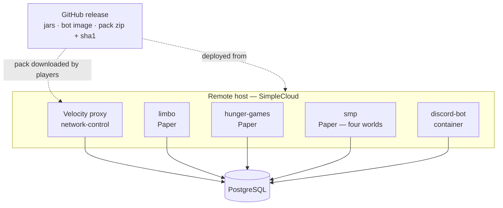

# Operations

How season 2 runs, gets deployed and gets released — and which parts of it nobody has verified yet.

## Deployment

- Production runs on [SimpleCloud](https://simplecloud.app) on a remote host.
- **The proxy needs database access.** PostgreSQL must be reachable from the proxy host, and the
  credentials therefore exist in more than one config file. That is a consequence of the database
  being the source of truth, and it is accepted.
- **The bot is the only process that migrates.** Every other process expects the schema to be
  current; bring the bot up first after a schema change.

## Configuration and secrets

This repository is public and contains **no secrets**. The Discord token, the bunq API key and the
database credentials arrive as environment variables at runtime; committed config files are
examples.

Every config file is commented YAML described by a `@ConfigSpec` interface and loaded through
`eu.nordtal.jcore.config`, each with its own environment namespace (`NORDTAL_<MODULE>_*`) so that
generic keys such as `password` cannot collide across files. A setting the interface does not
declare **stops the load** and names the key it probably meant; a Paper plugin catches that and
disables itself while the server keeps running.

`network-control` was the exception, and **it is now decided rather than flagged: on a bad config
the proxy fails closed.** Settled 2026-08-31.

Today a bad `database.yml` or `gate.yml` is logged loudly and the login gate is simply **never
registered** — the proxy keeps running and keeps accepting logins un-gated. That is the wrong way
round for a value whose whole job is deciding who may join: *"the proxy is up but nobody can join"*
announces itself within seconds of the first player trying, while *"the proxy is up and the gate is
off"* announces itself never, and a single mistyped key silently opens the network.

The objection this was originally justified with — Velocity has no per-plugin disable — is true and
beside the point. **A `LoginEvent` handler that refuses everybody with a bilingual "network
misconfigured" screen is that disable, built by hand**, and it costs one class. Letting admins
through was considered and is impossible: the admin flag lives in the database that a bad
`database.yml` cannot reach, so there is nobody to exempt.

Not implemented yet — this is a decision waiting for the session that next opens
`NetworkControlPlugin`.

## Resource pack hosting

The release workflow builds the pack zip reproducibly — fixed file order, no timestamps, so the
same version always hashes the same — writes its SHA-1 next to it, and attaches both to the GitHub
release. **That release asset URL is what players download.** The client is sent the URL *and* the
hash and refuses the pack if they disagree; never hardcode a hash.

Consequences to keep in mind:

- A pack change means a new release, a new URL and a new hash in the proxy's configuration.
- The URL and hash are configuration, not code.

## Open verification

Nothing below has been confirmed. Each one can invalidate a decision in this plan, and each needs a
running system, not a compiler.

| what | why it matters | how to settle it |
|---|---|---|
| **SimpleCloud supports Minecraft 26.2** | its docs name no supported versions and its API ships only as `0.1.0-platform.NN-dev.*` snapshots; if it does not, the platform choice reopens | try a 26.2 server group before anything else depends on it |
| **A Minecraft client follows GitHub's redirect** to `objects.githubusercontent.com` when downloading the pack | the whole hosting decision rests on it; the fallback is a small HTTP host | one real client against a real release asset |
| **Forced pack offer from the proxy while routing to `limbo`** | determines whether the pack prompt appears at the right moment and the two failure paths behave | running proxy, real client, both refusal cases |
| **Proxy-only pack enforcement** (making `limbo` unnecessary for packs) | would remove a server group; the API neither promises nor forbids it — `PlayerChooseInitialServerEvent` is awaited but explicitly asks for little work, with no documented timeout, and `sendResourcePackOffer` before a backend connection is undocumented | an experiment on a running proxy, after the event, never on the critical path |
| **Simple Voice Chat on 26.2** | an optional event feature that also needs a client mod | check for a build before the event |
| **`LISTEN`/`NOTIFY` through the pool** | the phase propagation design; a dedicated connection and reconnect handling are required | integration test plus a restart drill |
| **Background pre-generation of a 2000 × 2000 world without perceptible lag** | the whole daily-swap design rests on it; if it cannot be hidden, the farm world shrinks | measure tick time on the real host during a full pre-generation, with players online |
| **A block-logging plugin for Minecraft 26.2** | the SMP's only safety net against a bad day; nothing depends on it, but its absence should be a known fact | check availability before the SMP phase opens |
| **Paper unloading and deleting a loaded world at runtime**, then loading a replacement under the same name | the reset avoids a restart entirely on this assumption | a drill on `runServer` with players in the world |

Existing gaps carried over from the access work: nothing in the test suite touches bunq, Discord or
a running proxy. Tab creation and settlement need the **bunq sandbox**; buttons, modals, DMs and
roles need the **real guild** in an admin-only channel; a 3 € real purchase is the last step, never
the development loop. Integration tests skip themselves without Docker, so a green build on a
machine without a Docker daemon proves less than it looks.

## Event-day runbook — hunger games

A sketch to be filled in once the module exists:

1. Pack released, URL and hash in the proxy config, verified with a real client.
2. Hunger games world folder in place, lobby, towers, POIs and loot points built; aerial images
   prepared for every configured language.
3. Phase set to `PRE_EVENT`. Registration message posted in every language channel.
4. Rehearsal with real clients — see [hunger-games.md](hunger-games.md#verification).
5. Event: admin starts the countdown, which closes registration for good.
6. Winner, ceremony in the lobby box, evaluation.
7. Admin switches the phase to `SMP`. Winner's aura points and items applied.

## Running the SMP

The SMP's concept is [smp.md](smp.md); what it costs to operate is here.

### The daily farm-world reset

The farm world is regenerated every day at a configured time, and the design is a **swap, not a
rebuild in place**: tomorrow's world is pre-generated in the background during the day into a
separate folder, and the reset itself is only an unload, a rename and a load.

What an operator needs to know:

- **The window is seconds, not the length of a pre-generation** — but only as long as the
  background job has finished. If it has not, the reset **postpones itself** rather than swapping
  in a half-built world. A repeatedly postponed reset means the pre-generation is too slow for the
  configured size and the farm world should get smaller.
- **No server restart is involved.** Paper loads and unloads worlds at runtime.
- **Only players standing in the farm world are moved**, and they go to the Nordtal spawn, not to
  `limbo`. Nordtal, Nether and End players never notice.
- **The pre-generation is the biggest operational risk in the SMP**, because it competes with a
  live server for CPU. It is throttled and off the main thread, and its effect on tick time has to
  be measured on the real host before the size is trusted.
- Everything in the farm world is destroyed by the reset, including graves and POIs. That is
  intended and is announced to players; it is not a fault report.

### Worlds and pre-generation

Every world is pre-generated to its border before players may enter, and players wait in `limbo`
until it is. A milestone that expands the Nordtal border therefore implies a pre-generation of the
new ring — which happens while players are online and is subject to the same throttling.

### Third-party plugins

The SMP introduces the network's first optional third-party dependency: **a block-logging plugin**,
kept purely as insurance. Nothing in the design depends on it. **Whether one exists for Minecraft
26.2 is unverified** and belongs in the table below before anyone counts on it.

## Release

One repo-wide version in `gradle.properties` drives every artifact; a `v*` tag that disagrees with
it fails the workflow. One release carries the plugin jars, the bot jar and the pack zip with its
`.sha1`, and pushes the bot's container image. `season-2` produces no combined build and does not
republish jars built in other repositories.
