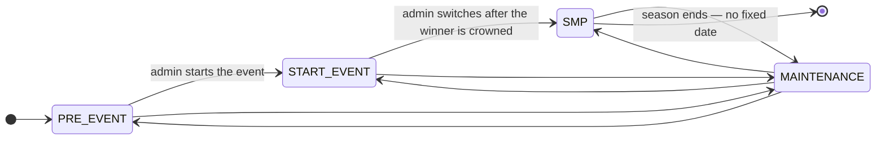
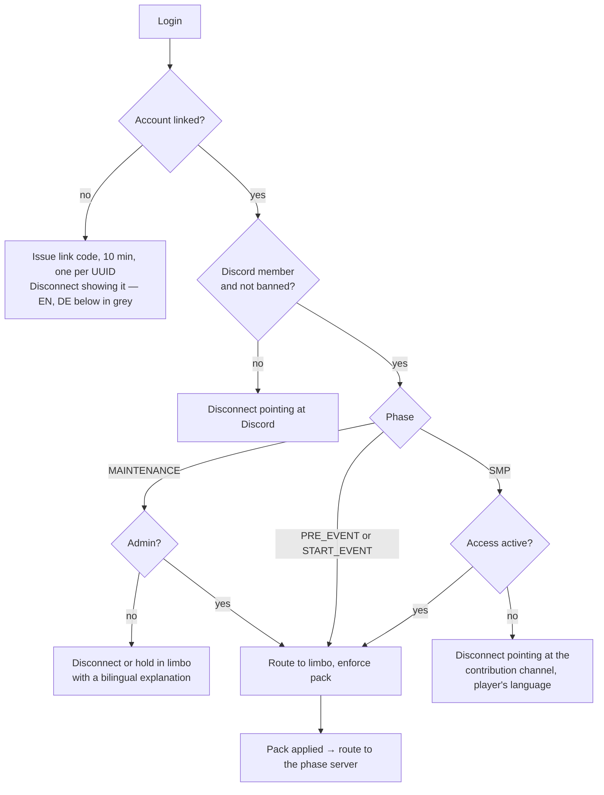
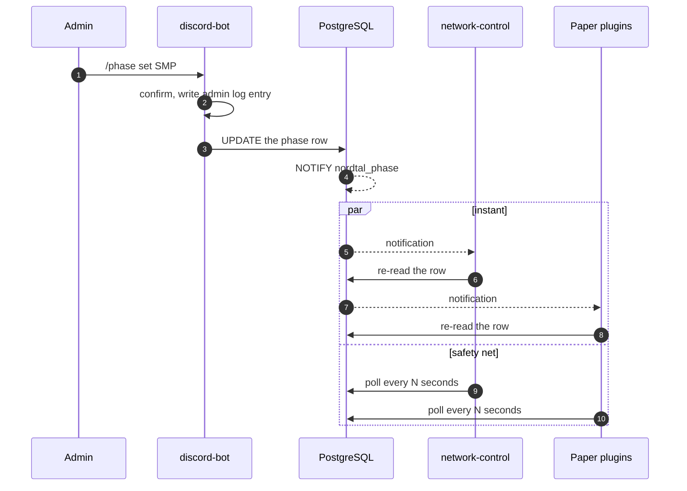

# Season phases

Season 2 moves through phases, and the phase decides **who may join** and **where they land**.
That makes it a security-relevant value, not a cosmetic one: the wrong phase either opens the SMP
to everyone or locks everybody out.

Status: **design agreed 2026-08-30, not built.** `SeasonPhase` exists in `:common` today and no
module reads it.

## The phases

| phase | who gets in | where they land | what it is |
|---|---|---|---|
| `PRE_EVENT` | linked Discord member, not banned | `hunger-games` lobby | Network is open, the lobby stands, teams register |
| `START_EVENT` | linked Discord member, not banned | `hunger-games` | The event itself, from countdown to winner |
| `SMP` | the above **plus active access** | `smp` | The season proper |
| `MAINTENANCE` | admins only | `limbo` | Planned work; everyone else waits or is refused |

**Access is only required from `SMP` onwards.** The start event is free for anyone who has linked
their Minecraft account to their Discord account — that is the decision the whole phase mechanism
exists to serve. Selling access before the SMP begins is still possible and simply banks days;
see [access-system.md](access-system.md) for the append rule.

`RESOURCE_PACK_INSTALL` is gone from the enum. Installing the pack is a station every login passes
in every phase, not a period of the season.

## The gate

One database round trip on the login path carries both the access state and the phase, and both
are read behind a short timeout. When the database is unreachable the existing fallback cache
rules apply unchanged ([access-system.md](access-system.md#joining-minecraft)); a phase that cannot
be read falls back to **the last known phase**, and if there is none, to `MAINTENANCE` — the state
that lets nobody in is the safe one to guess.

## Source of truth and propagation

The phase is **one row in PostgreSQL**, migrated by the bot like every other table
([architecture.md](architecture.md#schema-ownership)). Every process reads it; nobody caches it as
truth.

Propagation is **`NOTIFY` plus polling as a safety net** — decided 2026-08-30 with the trade-off
understood:

What that costs, stated plainly so nobody rediscovers it in production:

- `LISTEN` needs a **dedicated connection outside the Hikari pool** and a thread that calls
  `PGConnection.getNotifications(timeout)`; the pgjdbc driver has no callback API.
- **Notifications are lost while a process is disconnected.** Every reconnect must re-read the row
  unconditionally — the notification is an optimisation, never the state.
- The poll interval is therefore the real guarantee, and the `NOTIFY` path only makes a switch feel
  instant. Both live behind config.

**Settled 2026-08-31: poll every 30 seconds, on channel `nordtal_phase`, and build both paths in
the first pass.** Thirty seconds is the worst case a process can sit in the wrong phase after a
`LISTEN` connection has silently died; with five processes it is one query every six seconds
against an indexed single row. Ten seconds was rejected as triple the standing cost for a case
that happens three times a season, sixty as a full minute of players on the wrong server after a
switch to `SMP`.

`NOTIFY` is built alongside the poll rather than deferred, even though the poll alone is the
guarantee: the dedicated connection, the `getNotifications(timeout)` thread and the reconnect
re-read are easier to get right while the phase model is being written than to retrofit into it,
and leaving them out would keep
[operations.md](operations.md#open-verification)'s `LISTEN`/`NOTIFY` row open indefinitely.

## Who may switch it

Two paths write the same row, decided 2026-08-30:

1. **`/phase set <phase>` in Discord** — the normal path. Admin-only, with a confirmation step, and
   an entry in the admin channel like every other access-relevant action.
2. **A command on the Velocity proxy** — the emergency path, for when the bot or Discord is down.
   A Velocity `BrigadierCommand` ([architecture.md](architecture.md#commands)), **authorised by
   `discord_user.admin`** — the same flag, read with the same query the login gate already makes.
   Console was considered and rejected on 2026-08-31: it would be a second, different notion of
   who may do this, on a proxy that already knows exactly who is an admin.

   **What that costs, stated so nobody rediscovers it in an outage:** if the *database* is what is
   down, neither path works — the bot cannot write the row and the proxy cannot authorise anybody
   to. There is no third command that fixes that, because the phase lives in the database. The last
   resort is an `UPDATE` on the row by hand, and the proxy picks it up on its next poll within
   thirty seconds. That is a documented escape hatch, not a gap.

Both must write the audit entry. Two writers means two places where that is easy to forget; the
write and the audit belong in one method in `:common` that both call, not in two command handlers.

## Routing

The proxy owns routing; `limbo` never connects a player anywhere itself. When the pack has been
applied, `limbo` sends a plugin message on a `nordtal:` channel meaning *"this player is ready"*,
and the proxy connects them to the server for the current phase. A backend must not be able to
decide it wants a player somewhere — that would put the routing rules in two processes.

A phase switch while players are online moves everyone: the proxy re-routes connected players to
the new phase's server, holding them in `limbo` if it is not up yet.

**With one exception, settled 2026-08-31: a switch to `SMP` disconnects a player who has no active
access, with the same message the login gate uses.** It does not push them to `limbo`.

The reason is that the alternative gives one player state two different outcomes depending on
timing. The gate already refuses exactly this player at login, with a disconnect screen pointing at
the contribution channel in their language; bouncing the same player to `limbo` when the switch
catches them mid-session would say the same thing in a worse place. `limbo` is for waiting on
something that ends — a pack download, a server coming up — and "you have not bought access" does
not end by waiting. One rule, one message, one code path.

## How an admin is recognised

**Settled 2026-08-31, and LuckPerms is still not used.** The bot mirrors the Discord admin role
into the database as a flag, exactly the way it already mirrors language and access. Every process
reads it with the query it makes anyway — the proxy on the login path, the plugins at join. An
admin is appointed in Discord and is an admin everywhere; there is no second list to forget.

Rejected: a UUID list in `gate.yml` (it lives in several places and goes stale), and LuckPerms
(a third truth between the Discord role and its effect, with a sync cycle — the same chain the
access system deliberately avoids).

Bukkit permissions, where a vanilla or third-party command needs them, come from a
`PermissionAttachment` the SMP plugin applies at join and removes at quit. See
[smp.md](smp.md#admins).

## The end of the season

**There is no fixed end date.** The season runs until it stops, and nothing may depend on knowing
when that is — no countdown in the HUD, no ceremony wired into the code. The `SMP → [*]` edge above
is an admin switching the phase to `MAINTENANCE` on a day nobody has picked yet.

## Open questions

**None.** The last two — the poll interval with the `NOTIFY` channel name, and whether a switch
kicks or moves — were settled on 2026-08-31 and are written into the sections above. The
`PermissionAttachment` question that used to live here was settled on the same day by
[smp.md](smp.md#admins).
