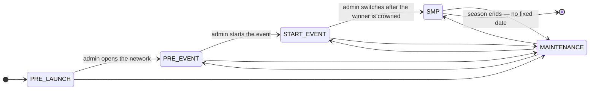
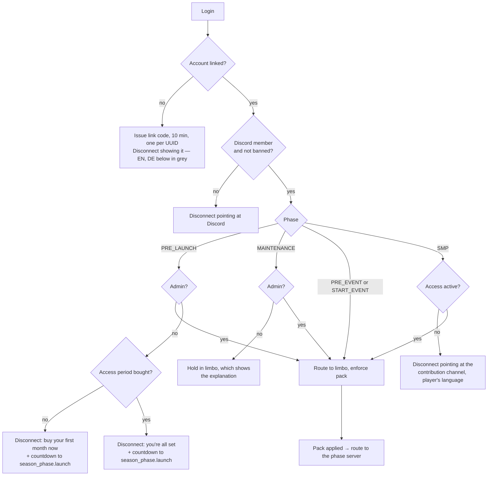
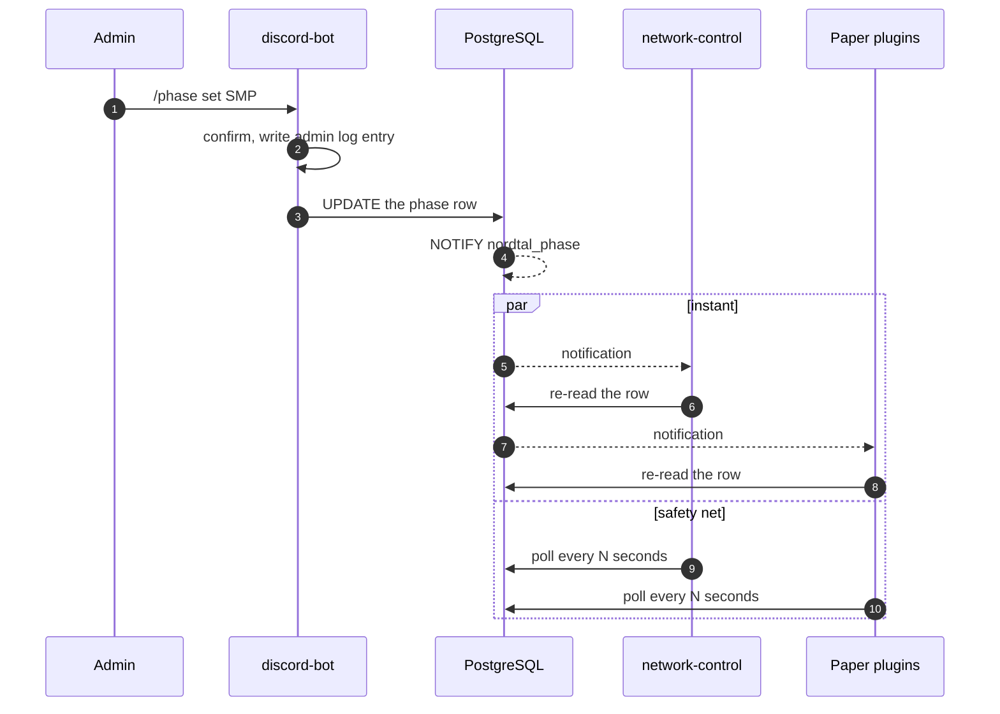

# Season phases

Season 2 moves through phases, and the phase decides **who may join** and **where they land**.
That makes it a security-relevant value, not a cosmetic one: the wrong phase either opens the SMP
to everyone or locks everybody out.

Status: **the phase model, the gate, routing and the resource-pack station are all built in
`network-control`** (2026-08-30, 2026-08-31 and 2026-09-01) — see [Routing](#routing).

## The phases



| phase | who gets in | where they land | what it is |
|---|---|---|---|
| `PRE_LAUNCH` | **admins only** | not moved | Before the network has ever opened; everybody else sees a countdown |
| `PRE_EVENT` | linked Discord member, not banned | `hunger-games` lobby | Network is open, the lobby stands, teams register |
| `START_EVENT` | linked Discord member, not banned | `hunger-games` | The event itself, from countdown to winner |
| `SMP` | the above **plus active access** | `smp` | The season proper |
| `MAINTENANCE` | linked Discord member, not banned | `limbo` (admins are not moved) | Planned work; everyone else waits in the waiting room |

**`PRE_LAUNCH` is the season's initial state, added 2026-09-03.** It is not `MAINTENANCE` with
another name: maintenance interrupts a season that is running and holds players in `limbo`, while
this precedes the season entirely, admits nobody but an admin, and is the only phase with a **date**
attached — `season_phase.launch`, added by `V8__pre_launch.sql`:

```
/phase launch 2026-10-01 18:00
```

**Nothing switches out of it when that instant passes.** The countdown reaching zero changes what
the server browser and the disconnect screens say, and nothing else; who may join stays an admin's
decision taken with `/phase`, not a value somebody set weeks earlier and forgot. A `NULL` launch is
a normal state — the screens then say no date has been announced.

### The row carries two dates, and they are not the same day

`V9__smp_start.sql` added a second one, `season_phase.smp_start`, and confusing the two would be
expensive in a way nothing would report:

| column | what it is | who reads it |
|---|---|---|
| `launch` | when the **network** opens, into `PRE_EVENT` | the MOTD, the three `PRE_LAUNCH` disconnect screens, the bot's status channel |
| `smp_start` | when **paid access starts running** | the append rule in `AccessDao`, and nothing else |

They differ because **access is only asked for in `SMP`** — `PRE_EVENT` and `START_EVENT` let every
linked, unbanned member in without it. Anchoring a purchase to `launch` would therefore spend the
whole hunger games event out of somebody's thirty days. Both keep their value once the season is
running: `smp_start` in the past simply loses to `now()` in the `GREATEST`, so nothing has to clear
it.

```
/phase smp-start 2026-10-08 18:00
```

A `NULL` `smp_start` does **not** stop the shop (decided 2026-09-03, so the payment path can be
exercised before the season is dated). A period sold in that state starts immediately, which is the
behaviour the anchor exists to remove — so every such grant is a WARNING in the log and a line in
the admin channel. Setting the date before the season opens is on the workspace checklist.

### Setting the two dates

Both dates were `UPDATE` statements typed into `psql` until 2026-09-03, which is the same as saying
nobody could set them: the SQL existed only inside a migration comment. There are now four
subcommands, in Discord and on the proxy, authorised by the same `discord_user.admin` flag as
`/phase set`:

| command | what it does |
|---|---|
| `/phase show` (Discord) or `/phase` (proxy) | the phase and both dates |
| `/phase launch <when>` | when the network opens |
| `/phase smp-start <when>` | when paid access starts running |
| `<when>` = `clear` | takes the date away again |

**A date is typed as `yyyy-MM-dd HH:mm` in `Europe/Berlin` and never with an offset.** The zone is
hard-coded in `SeasonDates`, because every container in the stack runs on UTC — an admin typing
`18:00` and getting 18:00 UTC is two hours out from the clock the season is announced on. Daylight
saving is applied for the date in question, so the same `18:00` is `+02:00` in October and `+01:00`
in November. The parser is `ResolverStyle.STRICT`: `2026-02-30` is refused rather than quietly
resolved to the end of February.

**Three things are refused outright**, each with nothing written:

- a date in the past,
- `smp_start` before `launch`, or `launch` after `smp_start` — nobody could use the days in between,
- **any change to `smp_start` once the phase is `SMP`.** From then on paid time is genuinely being
  consumed, and moving the anchor would hand somebody days they have already played or take away
  days they have not. Past that point it is an `UPDATE` by hand, deliberately.

#### Moving `smp_start` moves the access anchored to it

This is the half that is not just a column write. `AccessDao`'s append rule computes `valid_from`
from `smp_start` **at the moment of purchase**, weeks in advance, and a grant is never rewritten
afterwards — so a date that moves without its grants leaves everything sold so far running from a
day that no longer means anything.

`setSmpStart` therefore moves them, in the same statement, and the rule is **per Discord account**:
each account's earliest live grant is placed on the new date, and that account's remaining grants
keep their distance from it.

- Stacked purchases stay stacked — two thirty-day periods remain sixty consecutive days.
- Two people who bought on different days **both** start when the SMP opens. A single table-wide
  delta would get this wrong and leave the later buyer starting late, which is why the shift is
  grouped by account rather than computed once.
- Setting the date for the first time moves every live grant. That is the case the whole mechanism
  exists for: selling is deliberately allowed while the season has no date, and those periods start
  at `now()` until this repairs them.
- Revoked and already-expired grants are left where they are, and writing the same date twice moves
  nothing.
- **Clearing moves nothing** — there is no instant left to anchor to, so everybody keeps the window
  they have, and the command says so.

The shift is expressed in **seconds**, never in days. Subtracting two `timestamptz` values yields a
day-based interval, and adding one of those back is calendar arithmetic in the session's time zone —
so a thirty-day period moved across the October clock change would come out thirty days and one hour
long. `AccessDao` writes these windows with `make_interval(hours => ...)` for the same reason, and a
shift that did not match it would silently change what somebody paid for.

Each write files an `audit_log` row (`SET_LAUNCH` / `SET_SMP_START`) naming both values and how many
grants moved, and fires the same `nordtal_phase` notification a phase switch does, so the proxy's
MOTD countdown follows without waiting for its poll.

### The status channel

The bot renames one channel per language (`access.yml`, `languages[].status-channel`, optional and
empty by default) so the sidebar says what the network is doing: a countdown to `launch` during
`PRE_LAUNCH`, then the registered teams, the surviving teams and players, the registered SMP
players, and a maintenance line. The numbers come from the same query the MOTD uses, which moved
into `:common` for exactly that reason — two surfaces computing "the same" counts separately is how
they end up disagreeing on a screenshot.

Discord allows **two renames per ten minutes per channel** and blocks the route hard on abuse, so
every line above is deliberately coarse: the channel is renamed only when the rendered text actually
changes, and never more than once every six minutes.

**Its three refusals are the onboarding**, and which one a player sees depends only on how far they
already are. All three carry the countdown:

| state | screen |
|---|---|
| not linked | the link code, plus a pointer to `nordtal.eu` |
| linked, no access period bought | "you can buy your first month now, and the SMP is yours the moment the event ends" |
| linked, a period bought | "you're all set" |

The middle one asks whether a period was **bought**, not whether one is **running** — a period
bought before the opening is meant to wait rather than burn, which is [todo.md](../todo.md) §9's
second item and the reason `AccessState#accessBought()` exists next to `accessActive()`.

**Access is only required from `SMP` onwards.** The start event is free for anyone who has linked
their Minecraft account to their Discord account — that is the decision the whole phase mechanism
exists to serve. Selling access before the SMP begins is still possible and simply banks days;
see [access-system.md](access-system.md) for the append rule.

**`MAINTENANCE` holds players, it does not refuse them — settled 2026-08-31.** The flowchart below
used to say "disconnect **or** hold in limbo" while the table above already said non-admins land in
`limbo`; the owner settled it on holding them. Admission during maintenance is therefore exactly the
admission rule of the two event phases, and `discord_user.admin` no longer decides *whether* a
player gets in — only *where* they go, which is "not moved". Implemented 2026-08-31 in
`AccessState#mayJoin`, `GateOutcome` (whose `MAINTENANCE_CLOSED` value was deleted) and
`network-control`'s `routing` package.

An **unlinked** player is still refused with a link code during maintenance, and that half was not
reversed: linking happens in Discord, so there is nothing for them to wait for.

`RESOURCE_PACK_INSTALL` is gone from the enum. Installing the pack is a station every login passes
in every phase, not a period of the season.

## The gate



One database round trip on the login path carries both the access state and the phase, and both
are read behind a short timeout. When the database is unreachable the existing fallback cache
rules apply unchanged ([access-system.md](access-system.md#joining-minecraft)); a phase that cannot
be read falls back to **the last known phase**, and if there is none, to `MAINTENANCE` — the state
that lets nobody in is the safe one to guess.

## Source of truth and propagation

The phase is **one row in PostgreSQL**, migrated by the updater like every other table (it was the bot until 2026-09-01)
([architecture.md](architecture.md#schema-ownership)). Every process reads it; nobody caches it as
truth.

Propagation is **`NOTIFY` plus polling as a safety net** — decided 2026-08-30 with the trade-off
understood:



What that costs, stated plainly so nobody rediscovers it in production:

- `LISTEN` needs a **dedicated connection outside the Hikari pool** and a thread that calls
  `PGConnection.getNotifications(timeout)`; the pgjdbc driver has no callback API.
- **Notifications are lost while a process is disconnected.** Every reconnect must re-read the row
  unconditionally — the notification is an optimisation, never the state.
- The poll interval is therefore the real guarantee, and the `NOTIFY` path only makes a switch feel
  instant. Both live behind config.

**Settled 2026-08-31: poll every 30 seconds, on channel `nordtal_phase`, and build both paths in
the first pass.** Thirty seconds is the worst case a process can sit in the wrong phase after a
`LISTEN` connection has silently died; with five processes it is one query every six seconds
against an indexed single row. Ten seconds was rejected as triple the standing cost for a case
that happens three times a season, sixty as a full minute of players on the wrong server after a
switch to `SMP`.

`NOTIFY` is built alongside the poll rather than deferred, even though the poll alone is the
guarantee: the dedicated connection, the `getNotifications(timeout)` thread and the reconnect
re-read are easier to get right while the phase model is being written than to retrofit into it,
and leaving them out would keep
the `LISTEN`/`NOTIFY` row in
[state-of-play.md](state-of-play.md#the-unverified-assumptions) open indefinitely.

**The admin flag rides the same connection, on `nordtal_admin`, since 2026-09-02.** `LoginRoster`
was filled by the login query and never touched again, so an admin who lost the role in Discord
kept the proxy's `/phase` and the SMP's `/smp` until they disconnected — and an emergency
revocation is exactly the case where waiting for a reconnect is the wrong direction.
`AccessDao#setAdmin` now emits the notification inside its own write, so it fires only for a
change that committed, and it carries the Discord id.

Three properties are worth stating, because each of them is a decision:

- **One connection, two channels.** A parallel connector / notifications / listener / watch stack
  would be ~350 lines whose only difference is a string, and a second reconnect loop to keep alive.
  Both channels want the identical thing on a wake-up — re-read the authoritative state — so the
  listener does not inspect which one arrived. The cost is two small idempotent queries at moments
  that are rare by construction.
- **The payload is not trusted.** The proxy re-reads `AccessDirectory#admins()` in full and
  re-derives every connected session's flag from it, so a lost notification costs latency and not
  correctness — which is the same rule the phase states, and it is what lets the 30-second poll run
  the identical refresh with no bookkeeping of its own.
- **Only the admin flag is refreshed, not the language.** Language changes on a rhythm nobody needs
  to be told about within seconds, and it is read again on the next login.

## Who may switch it

Two paths write the same row, decided 2026-08-30:

1. **`/phase set <phase>` in Discord** — the normal path. Admin-only, with a confirmation step, and
   an entry in the admin channel like every other access-relevant action.
2. **A command on the Velocity proxy** — the emergency path, for when the bot or Discord is down.
   A Velocity `BrigadierCommand` ([architecture.md](architecture.md#commands)), **authorised by
   `discord_user.admin`** — the same flag, read with the same query the login gate already makes.
   Console was considered and rejected on 2026-08-31: it would be a second, different notion of
   who may do this, on a proxy that already knows exactly who is an admin.

   **What that costs, stated so nobody rediscovers it in an outage:** if the *database* is what is
   down, neither path works — the bot cannot write the row and the proxy cannot authorise anybody
   to. There is no third command that fixes that, because the phase lives in the database. The last
   resort is an `UPDATE` on the row by hand, and the proxy picks it up on its next poll within
   thirty seconds. That is a documented escape hatch, not a gap.

Both must write the audit entry. Two writers means two places where that is easy to forget; the
write and the audit belong in one method in `:common` that both call, not in two command handlers.

## Routing

The proxy owns routing; `limbo` never connects a player anywhere itself. When the pack has been
applied, `limbo` sends a plugin message on a `nordtal:` channel meaning *"this player is ready"*,
and the proxy connects them to the server for the current phase. A backend must not be able to
decide it wants a player somewhere — that would put the routing rules in two processes.

A phase switch while players are online moves everyone: the proxy re-routes connected players to
the new phase's server, holding them in `limbo` if it is not up yet.

**Built in full 2026-09-01.** `network-control`'s `routing` package re-reads each connected
player's access state when the phase changes and moves, leaves or disconnects them accordingly, and
`PlayerRouter#onChooseInitialServer` now sends **every** admitted login to `limbo`, whatever the
phase — [architecture.md](architecture.md#the-login-path-end-to-end)'s "every login lands on `limbo`
first". The channel is **`nordtal:limbo`**; `limbo` sends `READY` once per join, the proxy sends
`WAIT <reason>` whenever what the player is waiting for changes, and `PackStation` releases them
onto the phase's backend when the pack is applied and that backend is there — or once everything but
that `READY` has been settled for `gate.yml#limbo-ready-grace-seconds`, because the message is sent
exactly once and Velocity has a path that loses it (finding 38, 2026-09-03).

Two consequences worth stating plainly, because both are changes from the pre-2026-09-01 behaviour:

- **A proxy with no `limbo` server refuses every login**, not only a `MAINTENANCE` one. Falling
  through to `velocity.toml`'s own `try` list would put players on a backend *without the resource
  pack* — silently, because nothing about a plain-looking tab list announces that every glyph in the
  HUD, the nametags and the boards is missing. "Nobody can join" reports itself in seconds;
  "everybody joined without the pack" reports itself on an event day.
- **A player still in the waiting room is not connected by a phase change.** Their admission is
  re-checked like everybody's — a switch to `SMP` still disconnects them if they have no access —
  but the connection is left to the pack station, which is the only thing that knows whether their
  pack has arrived. The re-check does update the title they are looking at, so a switch into
  `MAINTENANCE` turns *downloading* into *maintenance* without moving anybody.

**Which servers, and what if one is missing.** The names are `gate.yml#server-limbo`,
`#server-hunger-games` and `#server-smp`, defaulting to the module directory names — nothing in
these documents says what `velocity.toml` calls them. The phase-to-server *mapping* is the table
above and is not configurable. A name this proxy has no registered server for is not a startup
failure, because the phase it belongs to may never be entered; it fails at the moment it is needed,
and the player is disconnected rather than dropped somewhere undefined. During `MAINTENANCE` that
disconnect is the old `gate.maintenance` screen — the "disconnect" half of the either/or above,
kept for exactly the case where holding them is impossible. In any other phase it is
`gate.no-server`. A server that is registered but *down* cannot be told apart until the connection
is attempted, and that failure ends the same way.

**With one exception, settled 2026-08-31: a switch to `SMP` disconnects a player who has no active
access, with the same message the login gate uses.** It does not push them to `limbo`.

The reason is that the alternative gives one player state two different outcomes depending on
timing. The gate already refuses exactly this player at login, with a disconnect screen pointing at
the contribution channel in their language; bouncing the same player to `limbo` when the switch
catches them mid-session would say the same thing in a worse place. `limbo` is for waiting on
something that ends — a pack download, a server coming up — and "you have not bought access" does
not end by waiting. One rule, one message, one code path.

## How an admin is recognised

**Settled 2026-08-31, and LuckPerms is still not used.** The bot mirrors the Discord admin role
into the database as a flag, exactly the way it already mirrors language and access. Every process
reads it with the query it makes anyway — the proxy on the login path, the plugins at join. An
admin is appointed in Discord and is an admin everywhere; there is no second list to forget.

Rejected: a UUID list in `gate.yml` (it lives in several places and goes stale), and LuckPerms
(a third truth between the Discord role and its effect, with a sync cycle — the same chain the
access system deliberately avoids).

Bukkit permissions, where a vanilla or third-party command needs them, come from **operator**: an
admin is one on all three Paper servers from join to quit, since 2026-09-04. It was a
`PermissionAttachment` with a configured node list until then, and only on the SMP. See
[smp.md](smp.md#admins).

## The end of the season

**There is no fixed end date.** The season runs until it stops, and nothing may depend on knowing
when that is — no countdown in the HUD, no ceremony wired into the code. The `SMP → [*]` edge above
is an admin switching the phase to `MAINTENANCE` on a day nobody has picked yet.

## Open questions

**None as a design question.** The poll interval with the `NOTIFY` channel name, whether a switch
kicks or moves, and whether `MAINTENANCE` disconnects or holds were all settled on 2026-08-31 and
are written into the sections above. The `PermissionAttachment` question that used to live here was
settled on the same day by [smp.md](smp.md#admins) — and re-settled on 2026-09-04, when the
attachment was replaced by operator for the reason recorded there.

Two things are unanswered **as facts about the deployment**, not as decisions, and both are named
here so nobody looks for them in prose:

- **What `velocity.toml` calls the three backends.** No document in this repository says. The three
  `gate.yml#server-*` keys default to the module directory names and are the single place to
  correct it. It will be answered by the first real deployment — which is now a `compose.yml` whose
  service names *are* those backend names, so the two stop being independent facts the moment the
  stack in [../deploy/README.md](../deploy/README.md) is written.
- **Whether a Velocity `LoginEvent`-allowed player can be disconnected from
  `PlayerChooseInitialServerEvent`**, which is what the missing-`limbo` fallback does — and since
  2026-09-01 that fallback covers every phase, not only `MAINTENANCE`. It is the documented way to
  remove a player and the event is `@AwaitingEvent`, but it has not been run against a real client.
  It is one of the three rows the login-path rehearsal closes —
  [state-of-play.md](state-of-play.md#the-unverified-assumptions).
