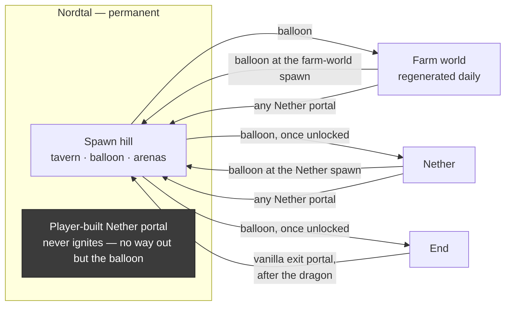
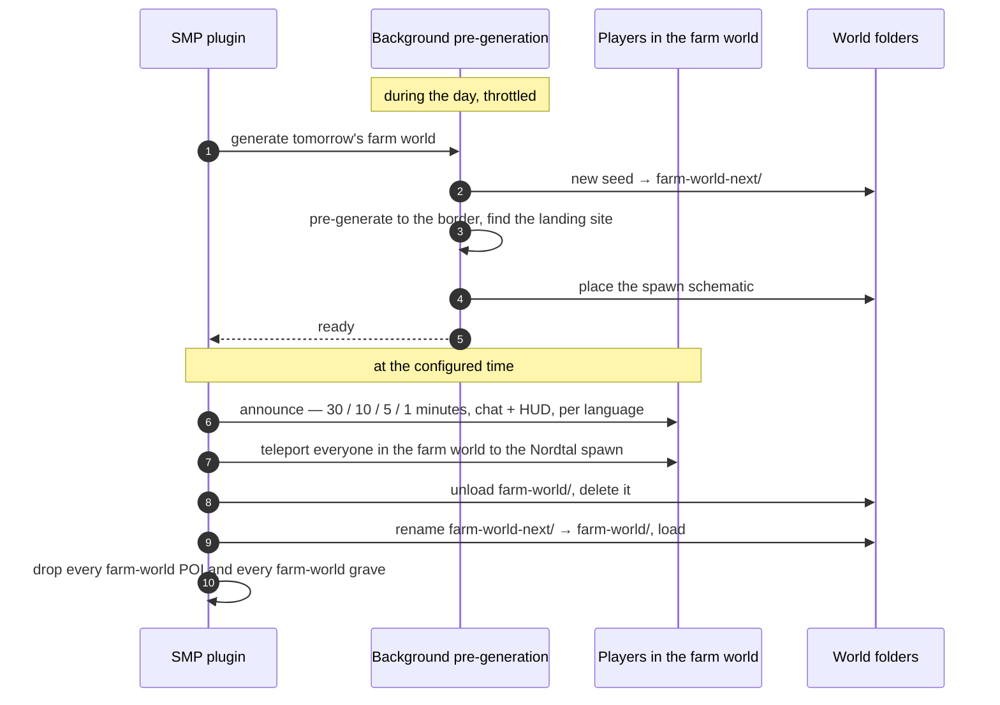
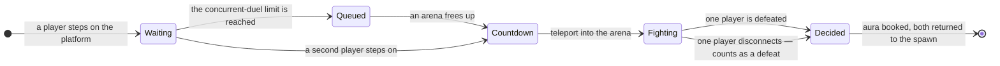

# The SMP — season 2's main phase

The phase season 2 spends its life in. One permanent build world, a farm world that is thrown away
and rebuilt every day, and a community that unlocks its own world step by step by finishing shared
objectives. Peaceful in tone, competitive at the edges: two duel platforms, one number in the tab
list, and a crest that only time can earn.

Status: **concept agreed 2026-08-31, nothing built.** The module is a scaffold. This document is
what an implementation session works from.

**Access is required from this phase onward** ([season-phases.md](season-phases.md)) — that is the
whole reason the phase model exists.

## What kind of server this is

Four statements that decide every detail below, and that should be argued with before anything
here is changed:

- **It is peaceful.** PvP is enabled everywhere except where it is explicitly boxed in, but nobody
  is designing against griefing, raiding or theft. Players may fight each other when they all want
  to; there is no roleplay framework and no faction system. Block logging exists as insurance, not
  as a mechanic.
- **Nothing is free.** Distance is real — there are no teleport commands, no `/home`, no `/back`,
  no `/spawn`. The only fast travel is the hot-air balloon, and it only ever goes to a world spawn.
- **The community unlocks its own world.** The border, the Nether and the End are not given; they
  are earned through shared objectives. That is the spine of the season.
- **There is no fixed end date.** The season runs until it stops. Nothing in the design may depend
  on knowing when that is — no countdown, no end-of-season ceremony baked into the code.

## Worlds

| world | permanent | how you get in | how you get out | border |
|---|---|---|---|---|
| **Nordtal** | yes — the build world, holds the spawn | you spawn here; every return lands here | the balloon at the spawn | grows with milestones |
| **Farm world** | **no — regenerated daily** | balloon at the Nordtal spawn | balloon at the farm-world spawn, or any Nether portal | fixed, 2000 × 2000 |
| **Nether** | yes | balloon, once unlocked | balloon at the Nether spawn, or any Nether portal | fixed, generous |
| **End** | yes | balloon, once unlocked | the vanilla exit portal — **only after the dragon** | fixed, generous |

Every world is pre-generated to its border before players may enter it; until then they wait in
[`limbo`](architecture.md#modules).

### Travel

The rules behind that picture, each of them deliberate:

- **The balloon is the only way out of Nordtal.** A Nether portal built in Nordtal does not ignite,
  and a stronghold's End portal stays inactive. Without that, a player with obsidian and a flint
  and steel walks straight past the milestone that is supposed to unlock the Nether.
- **Every portal in the Nether or the farm world leads to the Nordtal spawn**, regardless of where
  it stands. There is no 1:8 coordinate mapping and there are no Nether highways. The Nether is a
  place to go to, not a way to travel — and that is what keeps distance in Nordtal meaningful.
- **Arrival is always a world spawn.** The balloon never drops anyone anywhere else, so a world
  spawn is a landmark everybody knows.
- **The End is the one asymmetry, and it is intended.** There is no balloon there; the way back is
  the vanilla exit portal, which does not work until the dragon is dead. The End is unlocked by a
  milestone, so the community enters it together to fight the dragon — the trip is a one-way
  commitment by design, and everybody knows it before they board.

### Spawns

Nordtal, the farm world and the Nether each have a built spawn with a balloon; the End has the
vanilla obsidian arrival platform. **All four are protected zones** — no building, no breaking, no
interaction with blocks you do not own, no explosions.

Protection is **a list of configured regions in the SMP plugin itself**, not WorldGuard. What is
needed is a handful of event handlers over a few fixed boxes, not a region system with claims,
flags and ownership — and it avoids a large third-party dependency whose Minecraft 26.2
availability is unverified.

The Nordtal spawn is a **tavern on a hill** and carries everything social:

| structure | what it does |
|---|---|
| hot-air balloon | custom 3D model, barrier-block floor; stepping in opens the travel GUI |
| two 3 × 3 duel platforms | sword and bow, one each |
| objective board | the current milestone at a glance, rendered per player in their language |
| aura leaderboard board | likewise |
| NPC | click to open the full objective GUI and the hand-in interface |
| wheel of fortune | a GUI, one free spin per day |

The farm-world spawn is a small schematic — the balloon plus a little built around it — placed on a
**landing site found programmatically** after the pre-generation, so a fresh seed cannot put the
arrival point in lava or over a ravine.

### The farm world reset

The farm world is regenerated **daily** (time of day configurable; on command as well), with a new
random seed every time. The naive implementation — stop, regenerate, pre-generate, restart — has a
window as long as the pre-generation. This one does not:

- **Only players in the farm world are affected.** They are teleported to the Nordtal spawn — not
  to `limbo`, and the rest of the server never notices. *This corrects the earlier note that a
  reset sends every player, including AFK ones, to the waiting room; with the swap approach there
  is nothing for them to wait for.*
- **The pre-generation must be imperceptible.** It is throttled hard and runs off the main thread;
  if it cannot be made invisible, the farm world gets smaller rather than the players getting lag.
  A pre-generation that has not finished by the reset time **postpones the reset** — never swaps in
  a half-built world.
- **Nothing in the farm world survives.** Chests, graves and POIs are gone. That is the price of
  the daily reset and it is stated plainly to players rather than softened.
- No server restart is involved. Paper loads and unloads worlds at runtime.

## Milestones — the community objective system

One linear track. Each milestone carries several objectives, **all** of which must be finished
before the milestone unlocks and the next one begins.

```mermaid
flowchart LR
    M0["Border 20<br/>waiting for the start"] --> M1["Border 43<br/>opened by an admin"]
    M1 --> M2["Border 99"]
    M2 --> M3["Border 400<br/>base building"]
    M3 --> M4["Nether unlocked"]
    M4 --> M5["Border 800"]
    M5 --> M6["End unlocked"]
    M6 --> M7["Final border expansion<br/>deliberately a large effort"]
    M7 --> DONE["No further milestones<br/>— more can be added later"]

    classDef last fill:#7a5c11,stroke:#4a3708,color:#fff
    classDef none fill:#3b3b3b,stroke:#222,color:#fff
    class M7 last
    class DONE none
```

**The order and the numbers above are a starting proposal, not a decision.** What *is* decided:

- **Only objectives unlock a milestone.** There is no timer anywhere. The "pause durations" in the
  original notes are expectations for planning, not a rule in the code.
- **The Nether and the End should be reachable within the first days.** The track front-loads them
  deliberately; the season's long stretch is the *final* border expansion, which is meant to be a
  genuinely large effort — on the order of two weeks.
- **After the last milestone there simply are none.** The season carries on with building, duels,
  aura and prestige. New milestones can be appended at any time, which is exactly why they are not
  compiled in.
- An admin command can unlock a milestone manually — needed for testing, and for the day an
  objective turns out to be impossible.

### Where a milestone is defined

**In a YAML config file, reloadable with a command.** The definition is versioned in the
repository; the *progress* lives in the database. Adding a milestone is a file edit plus
`/smp reload` — no release, no restart.

The loader validates the file against the stored progress and refuses a change that would orphan
it, rather than silently discarding a finished milestone because somebody renamed its key.

### Objective types

Three, which cover every example in the original notes and are each unambiguously measurable:

| type | what it counts | how an individual's share is measured |
|---|---|---|
| `HAND_IN` | items delivered at the spawn | the amount that player delivered |
| `STATISTIC` | a vanilla statistic summed across all players (endermen killed, blocks mined, distance walked) | that player's own increase since the objective started |
| `ADVANCEMENT` | how many distinct players earned a given advancement | 1 or 0 |

Hand-in goes through **a GUI on the spawn NPC**, which shows what is currently needed and how much
is already there. Items are only consumed on an explicit confirmation — a misplaced shift-click
must not swallow an inventory — and nothing can be handed in that no objective wants. There is no
hopper-fed chest: automated delivery would turn contribution counting into a race between farms.

### The boards and the NPC

The **objective board** and the **aura leaderboard** stand at the spawn as Text Display entities
sent **per player**, so everyone reads the same board in their own language at the same spot. That
is the technique `papermc-display-tags` already uses on this network, so it costs a decision rather
than a new mechanism. Frames and decoration are resource-pack glyphs; the content is text.

Clicking the **NPC** opens the full objective GUI: the current milestone, every objective with its
progress, the player's own contribution, and the hand-in interface.

A milestone unlocking is a **server-wide event** — title and chat announcement in every player's
language, announced in Discord as well, and the moment the balloon's greyed-out entry lights up.

## The balloon GUI

A custom inventory GUI listing the destinations. A locked destination is greyed out and its tooltip
names the milestone that will unlock it. At the start only the farm world is available.

## Aura — recognition, not currency

**Aura is a single signed integer per player, and it buys nothing.** It is prestige and only
prestige: shown next to the name in the tab list and on the leaderboard board at the spawn.

Rejected on purpose: making aura spendable. With one number, every purchase sells rank, so the
shop dies and hoarding wins. Two numbers (lifetime and balance) would have kept both alive at the
cost of explaining two figures for one word. Aura is simply not a currency.

| source | default | note |
|---|---|---|
| duel win | **+10** | the loser pays the same |
| duel loss | **−10** | **aura may go negative** |
| objective contribution | a per-objective pot | see below |
| selected vanilla advancements | 5–25 each, once | a curated list in config, not all advancements |

**Play time is deliberately not an aura source.** It would turn the leaderboard into an attendance
list. Time is what earns *prestige* instead — a different signal in a different place.

**Contribution payout: a guaranteed floor plus a proportional share.** Each objective has a
configured aura pot. Everyone who contributed at all receives a small fixed floor; the rest of the
pot is split by share. The floor keeps a small contribution worth making, the proportional part
keeps the person who did the work visible. Payout happens **when the objective completes**, not
continuously — aura is recognition, not a running tally of diligence.

Every change is written to an aura ledger with its reason, so a leaderboard position can always be
explained.

## Prestige — a crest earned by time

A **coat-of-arms glyph in 13 design tiers**, assigned by total online time. AFK time counts, on
purpose: this is a measure of presence, not of effort, and it is the reason play time is not an
aura source.

Online time is counted **network-wide**, and **`network-control` is what counts it** — only the
proxy sees a session across servers, a backend sees just its own slice. It writes the total on
disconnect and periodically in between, so a crash costs minutes rather than a whole session. The
tab list is sorted by it.

That is why the counter lives in **`player_playtime`, not in `smp_player`**: it is a
network-wide fact written by the proxy, and a table with an `smp_` prefix that the SMP does not own
would be a lie about who it belongs to.

**The tier itself is derived, not stored.** It falls out of the seconds and the configured
thresholds every time it is rendered, so retuning the thresholds is a config edit rather than a
migration plus a backfill.

Proposed thresholds — configurable, and calibrated so tier 13 is reachable in two to three months
by somebody who plays regularly and leaves the client running some nights:

| tier | hours | tier | hours | tier | hours |
|---|---|---|---|---|---|
| 1 | 0 | 6 | 35 | 11 | 250 |
| 2 | 2 | 7 | 55 | 12 | 350 |
| 3 | 5 | 8 | 85 | 13 | 500 |
| 4 | 10 | 9 | 125 | | |
| 5 | 20 | 10 | 175 | | |

## What a player looks like

One composition, shown in full where there is room and trimmed where there is not.

| element | source |
|---|---|
| language flag | `discord_user.locale` ([i18n.md](i18n.md)) |
| player name, uniform light grey | — |
| admin `A` | the admin flag, mirrored from the Discord admin role |
| donor star | the permanent donor role from [access-system.md](access-system.md) |
| aura, green when positive, red at zero or below | `smp_player.aura` |
| prestige crest | `player_playtime.seconds` against the configured thresholds |

| surface | shows |
|---|---|
| **tab list** | all six, sorted by online time |
| **nametag** | flag, name, admin `A` / donor star, prestige crest — **no aura**, because it changes constantly and every change would be a nametag packet |
| **chat** | flag, name, prestige crest |

Nametags are owned by [`papermc-display-tags`](https://github.com/nordtal/papermc-display-tags),
which ships from its own repository.

**Season 1's role tags — settler, citizen, knight, lord — are gone** and must be removed from the
resource pack. The glyph inventory this concept needs:

- keep: the language flags, the admin `A`, the Nordtal logo
- **new**: the donor star, 13 prestige crests, HUD arrows and digits, board frame pieces
- delete: the four season-1 role tags

Every code point lives in `resource-pack/src/assets/minecraft/font/default.json`, is mirrored in
`:common`'s `Glyphs`, and is listed in the pack's README table. A change is a change in all three.

## The HUD

Two boss bar lines, using the same technique as the hunger games — the vanilla bar made invisible
by the resource pack, backgrounds composed from power-of-two glyph segments.

| line | when | shows |
|---|---|---|
| 1 | always | current dimension, and the current milestone with its progress — the dimension alone once the track has run out |
| 2 | only while `/navigate` is active | the target, an arrow to it, and the distance |

There is **no season countdown**, because there is no fixed end date.

## Chat

**Chat is per Paper server, which is Minecraft's default and needs no plugin.** The SMP is one
Paper server holding four worlds, so everyone in Nordtal, the farm world, the Nether and the End
shares one chat — which is what keeps a small community feeling like one place instead of four
empty ones. `hunger-games` has its own, likewise ordinary.

`limbo` is the exception and it is a deliberate one: **no chat at all, and nothing and nobody
visible.** A waiting player sees black and a title telling them what they are waiting for, in their
language. Nothing else. See [architecture.md](architecture.md#modules).

## `/navigate`

A GUI listing navigable targets. Picking one turns on the second HUD line; it is **off by
default** and the player switches it on.

| target | note |
|---|---|
| the current world's spawn | built in |
| the player's last death location | built in |
| any public POI | created by players |

**There is no navigation to players.** It was considered and dropped: with PvP enabled everywhere,
an arrow pointing at a person is a hunting tool, and a consent flow around it is more machinery
than the feature is worth.

POIs are **public and unlimited** — anyone may create one, everyone sees it, and admins can manage
and delete any of them. POIs may be created in any world; **farm-world POIs are deleted with the
daily reset**, along with everything else there.

## Duels

Two 3 × 3 platforms at the spawn: **sword** and **bow**. Two players stepping onto the same
platform at the same time are teleported into an arena that appears above the spawn area; further
concurrent duels stack their arenas above each other, up to a configured limit, and anyone beyond
that waits in a queue.

- **Separate everything.** Inventory, health, effects and experience inside the arena are the duel's
  own; the player's real state is untouched. **The one place with no grave**, because nothing real
  was ever at stake.
- **A single fight**, no best-of. Short, decisive, and nothing has to survive a restart.
- **Identical loadouts from config**, one per duel type. Nobody wins by being richer.
- **Disconnecting is a defeat and the aura is booked.** Otherwise logging out is a free escape from
  losing.
- **Arenas are visible and spectators are welcome.** Duels are the only competition on this server;
  hiding them would waste the one thing that gives the tab-list number a story.

## Death and graves

Everywhere except the duel arena, a death leaves a **grave**: a double dark oak chest with the
player's head on top, holding the full inventory. Opening it and taking the items **credits the
full experience** back.

- **The grave stands forever** and **anyone may open it.** No timer, no ownership lock. The tone is
  peaceful, and the point is that a death is a walk back, not a loss.
- The location of a player's last death is a built-in `/navigate` target.
- **A grave in the farm world dies with the daily reset.** That is the one real risk of going there.

**Stated plainly, because it follows from two decisions that were taken separately:** PvP is on
everywhere and a grave is open to everyone, so killing a player and then emptying their grave is
mechanically possible. That is accepted rather than closed off. This is a peaceful server by
agreement, that kind of thing is settled socially and not technically, and both the block log and
the duel history make it traceable anyway. Locking a grave to its owner was considered and
rejected: it would also stop a friend from bringing somebody's things back.

## The wheel of fortune

A GUI in the tavern. **One free spin per day**, plus extra spins earned by contributing to
objectives. It costs no aura — aura is not a currency.

The prize pool lives in config with weights. The intent, in three bands:

| band | examples | why |
|---|---|---|
| common | food, wood, coal, saplings, torches, building blocks in bulk | useful, never decisive |
| uncommon | low-level enchanted books, potions, iron, redstone components | pleasant, still ordinary |
| rare | wither stars, ancient debris, end crystals, shulker shells | things you occasionally need and hate farming |

The rare band is chosen to **encourage trade**: everybody eventually holds something good they do
not need and needs something they did not draw. The pool is a starting proposal and is meant to be
retuned from config without a release.

## World rules

| rule | setting |
|---|---|
| PvP | on everywhere; the arena is the only boxed-in form of it |
| keep inventory | off — graves handle it instead |
| griefing / raiding | not designed against; the server is peaceful by agreement |
| land claims | **none** |
| block logging | a third-party plugin as insurance only; nothing in this design depends on it. **Its Minecraft 26.2 availability is unverified.** |
| teleport commands | **none** — no `/home`, no `/tpa`, no `/back`, no `/spawn` |
| difficulty, weather, day cycle | vanilla |
| border centre | configurable; the working value is X 106 / Z 88 |
| border expansion speed | roughly a quarter to a half of walking speed, configurable |

Border sizes are **diameters**, because that is what Minecraft's world border takes. The values
from the original notes — 20, 43, 99, 400, 800, 1600 — are defaults in config and expected to
change.

## Admins

**No LuckPerms.** The Discord admin role is mirrored into the database as a flag by the bot, the
same way language and access already are, and every process reads it with the query it makes
anyway. One truth, no sync cycle, and one more reason the account link exists.

For anything that goes through Bukkit permissions — vanilla commands, third-party plugins — the SMP
plugin attaches a `PermissionAttachment` with a configured node list at join and removes it at
quit. That settles the open question in [season-phases.md](season-phases.md#open-questions).

## Data model

Migrated by the bot as always, and **the migration SQL now lives in `:common`**
([architecture.md](architecture.md#schema-ownership)) so that SMP DDL does not live inside a Discord
bot module. Flyway still runs in exactly one process.

Everything hangs off `discord_user`, not off the Minecraft UUID — the UUID reaches these tables
through the existing `account_link`, and duplicating it would create a second answer to "whose
account is this".

`smp_milestone` and `smp_objective` hold *progress*; the *definition* is the YAML file. A milestone
key that the config no longer declares is what the loader's validation exists to catch.

## Discord

The bot gets a narrow SMP surface — announcements, logs, and commands for admins and users. What it
must **not** get is authority: the SMP's world state is not steered from Discord beyond what an
admin command explicitly allows, and Discord roles remain a projection of the database as
everywhere else.

There is **no web map and no Discord map render.**

## Numbers that are proposals, not decisions

Everything in this section is a config default chosen to be reasonable, and every one of them is
expected to be retuned. They are gathered here so nobody mistakes them for agreed values.

- The 13 prestige thresholds
- The duel stake of 10 aura, the advancement values of 5–25, and the objective pot floor
- The border step sizes and the expansion speed
- The wheel's prize pool and its weights
- The concurrent-duel limit
- The farm world's 2000 × 2000 border and its reset time of day
- The reset announcement schedule (30 / 10 / 5 / 1 minutes)

## Still open

- **The milestone track itself** — which objectives sit on which milestone, in what order, with
  what targets. The mechanism is decided; the content is a design pass of its own.
- **The advancement list** that grants aura, and the amount per advancement.
- **The duel loadouts**, item by item, for both types.
- **Glyph code points** for the donor star, the 13 crests, the HUD arrows and digits, and the board
  frames — they must be added to `resource-pack` and mirrored in `:common`'s `Glyphs`.
- **A command framework.** Season 2 has not chosen one, and this module is the first with a real
  command surface (`/navigate`, POI management, admin commands, `/smp reload`).
- **Which block-logging plugin**, and whether one exists for Minecraft 26.2 at all.
- **The server rules as written for players.** Deliberately not settled yet: the working principle
  is that anything goes as long as everyone involved agrees to it. A rules text has to exist before
  the phase opens, in both languages, but it is not a design decision.
- **The spawn build itself** — tavern, balloon model, platforms, boards, NPC — is build work, not
  code, and it gates a rehearsal.

## Verification

"It compiles" proves nothing here; almost every feature in this document touches world state,
packets or player visibility. Before any of it is called done, on a running server with real
clients:

- A **full farm-world reset cycle** with players inside it, players elsewhere, and a player AFK —
  including a run where the pre-generation is deliberately not finished in time.
- The **pre-generation's effect on tick time**, measured, not assumed. This is the single biggest
  technical risk in the concept.
- **Every travel path**: each balloon, a player-built portal in the Nether and in the farm world,
  a player-built portal in Nordtal that must not ignite, and a stronghold portal that must stay
  inactive.
- A **duel** end to end, including a disconnect mid-fight and two concurrent duels in stacked
  arenas.
- **Per-player Text Display boards** seen simultaneously by two clients with different languages.
- A **milestone unlocking** while players are online: the border move, the balloon entry lighting
  up, the announcement in both languages, and the aura payout.
- A **grave** across a relog, and a grave opened by somebody other than its owner.
