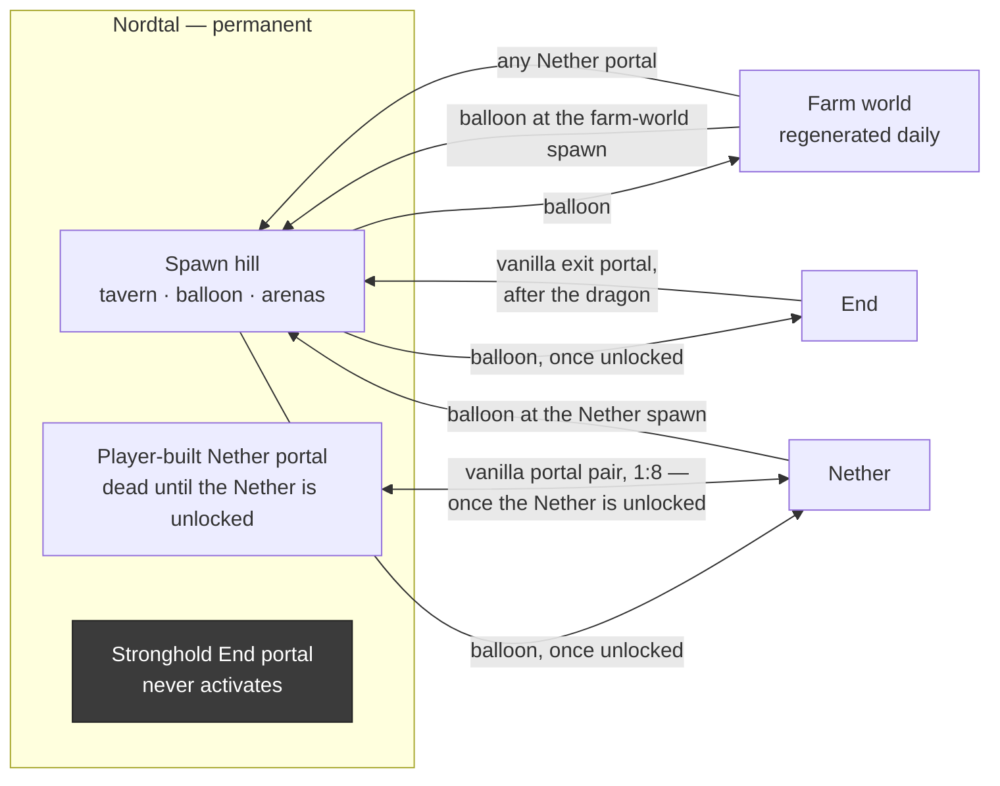
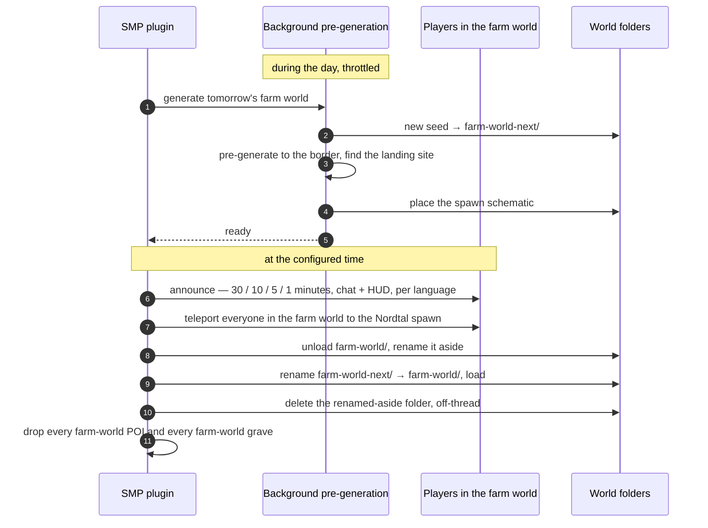
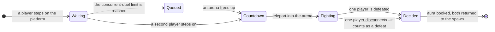
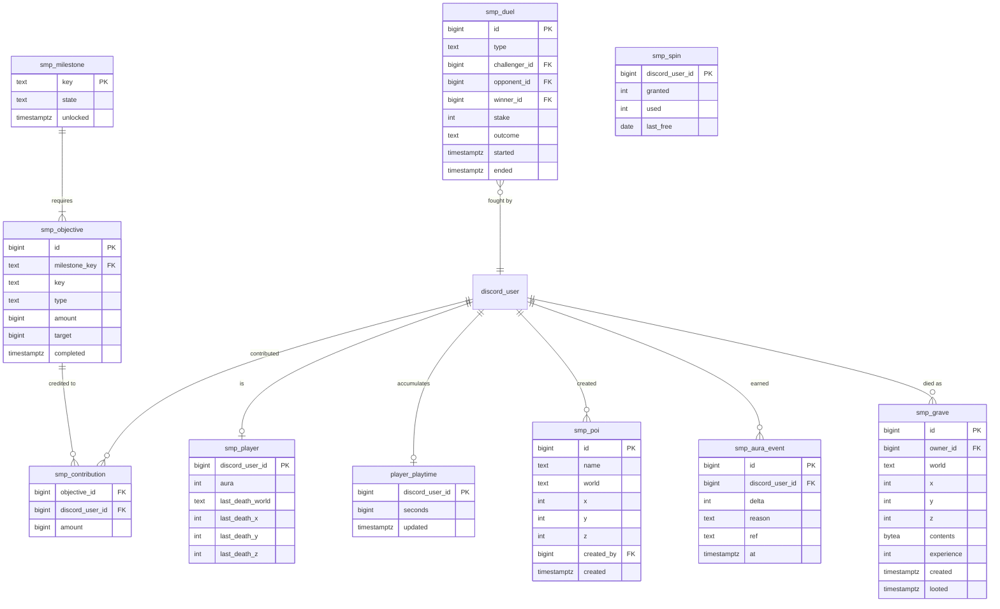

# The SMP — season 2's main phase

The phase season 2 spends its life in. One permanent build world, a farm world that is thrown away
and rebuilt every day, and a community that unlocks its own world step by step by finishing shared
objectives. Peaceful in tone, competitive at the edges: two duel platforms, one number in the tab
list, and a crest that only time can earn.

Status: **concept agreed 2026-08-31. The schema, the server-free half and the first third of the
world half are built.** `V6__smp.sql` landed in `:common` on 2026-09-01, and later the same day so
did `milestones.yml` and the three pure cores — aura, prestige and the milestone engine. On the
same day the worlds themselves followed: world bootstrap and datapack verification, the borders,
the balloon and its GUI, portal gating, spawn protection, and the daily farm-world swap, 81 tests
in the module. What is still missing is the player surfaces (HUD, boards, nametags, `/navigate`,
POIs, prestige rendering) and the activities (duels, graves, the wheel, milestone completion and
its payout, and `/smp`). See [state-of-play.md](state-of-play.md).

**Access is required from this phase onward** ([season-phases.md](season-phases.md)) — that is the
whole reason the phase model exists.

## What kind of server this is

Four statements that decide every detail below, and that should be argued with before anything
here is changed:

- **It is peaceful.** PvP is enabled everywhere except where it is explicitly boxed in, but nobody
  is designing against griefing, raiding or theft. Players may fight each other when they all want
  to; there is no roleplay framework and no faction system. Block logging exists as insurance, not
  as a mechanic.
- **Nothing is free.** Distance is real — there are no teleport commands, no `/home`, no `/back`,
  no `/spawn`. The only fast travel that is *given* is the hot-air balloon, and it only ever goes to
  a world spawn. Anything faster has to be built: once the Nether is unlocked, a Nether highway is
  the one shortcut the game itself offers, and it costs the tunnel to dig it.
- **The community unlocks its own world.** The border, the Nether and the End are not given; they
  are earned through shared objectives. That is the spine of the season.
- **There is no fixed end date.** The season runs until it stops. Nothing in the design may depend
  on knowing when that is — no countdown, no end-of-season ceremony baked into the code.

## Worlds

| world | permanent | how you get in | how you get out | border |
|---|---|---|---|---|
| **Nordtal** | yes — the build world, holds the spawn | you spawn here; every return lands here | the balloon at the spawn, or a Nether portal once unlocked | grows with milestones, 20 → **4000** |
| **Farm world** | **no — regenerated daily** | balloon at the Nordtal spawn | balloon at the farm-world spawn, or any Nether portal | fixed, 2000 × 2000 |
| **Nether** | yes | balloon or a Nether portal, both once unlocked | balloon at the Nether spawn, or a Nether portal back to Nordtal | fixed, **2000** |
| **End** | yes | balloon, once unlocked | the vanilla exit portal — **only after the dragon** | fixed, **2000** |

Every world is pre-generated to its border before players may enter it; until then they wait in
[`limbo`](architecture.md#modules).

**Nordtal is pre-generated once, to its *final* border of 4000, before the SMP phase opens** —
decided 2026-08-31. A milestone unlock then only moves a number and never starts a generator. The
alternative, generating each step in the background during the season, would have run a second
generator alongside the farm world's daily one — which this document already calls the single
biggest technical risk in the concept — and it would have made the season's crowning moment depend
on a background job finishing in time. Done once, with no players online and no throttling, it
costs hours of wall clock and disk space in the order of a few gigabytes. **Both figures have to be
measured on the real host, not assumed**, before the phase is scheduled — a laptop says something
about disk and almost nothing about wall clock. Chunky 1.5.3 is the tool (it tags 26.2 for `paper`
explicitly, checked against the Modrinth API on 2026-09-01).

**Chunky is a required plugin, decided 2026-09-01** — an earlier version of this line called it "an
operator's tool for an afternoon and never a dependency of this build", and that was wrong for the
farm world. Nordtal's one-off run really is an operator's afternoon, but the farm world is
pre-generated *every night*, roughly 15 000 chunks beside a live server, and something has to drive
that. Writing our own throttled generator was the alternative and was rejected: Chunky already
solves exactly this, its throttle is the one operators know how to turn down, and an in-house copy
would be a second thing to re-test on every Minecraft update. The SMP plugin drives it through
`ChunkyAPI` from Bukkit's `ServicesManager` and waits for its completion event before swapping
anything in.

### The world-generation datapacks

**Terralith and Dungeons and Taverns**, and they are not decoration: they are what the terrain
*is*. Neither appeared anywhere in this repository until 2026-09-01, which is the gap this section
closes. Pinned versions, checked against the Modrinth v2 API and verified against a real download
that day: **Terralith 2.6.4** (`Terralith_26.2_v2.6.4.zip`) and **Dungeons and Taverns 5.3.2**
(`Dungeons and Taverns v5.3.2.zip`), both with the `datapack` loader. D&T also publishes 26.2
Fabric, Forge and NeoForge jars of the same version; those are mod loaders and are useless on Paper.

**Datapacks are server-global, and that was measured rather than assumed.** On Paper 26.2 build
121: a probe pack in `<level-name>/datapacks/` was listed and enabled, while an identical probe in
a secondary world's own `datapacks/` folder was never seen — not at start, not after that world was
created, not after `refreshPacks()`. There is no per-world datapack API at all: `DatapackManager`
hangs off `Server` rather than `World`, and `WorldCreator` has no datapack option. So one folder
feeds every world this server generates, and **the farm world's nightly regeneration inherits both
packs with nothing copied**.

Two consequences worth stating plainly:

- **They have to be installed before the server starts.** Worldgen registries are read once, at
  start; a pack dropped in afterwards changes no terrain. `deploy/minecraft/entrypoint.sh` fetches
  them, pinned by sha512, into the `level-name` world's `datapacks/` folder before Java is
  launched.
- **A missing pack stops the SMP plugin.** Terrain is never re-rolled once it is on disk. A farm
  world generated without Terralith is one flat day; Nordtal generated without it is the whole
  season, on a world that has a spawn built on it and therefore cannot be thrown away. "The server
  did not come up" is the better of the two failures, and it is the one chosen.

**The Nether's 2000 is deliberately larger than the 1:8 mapping requires.** A 4000 overworld needs
only 500 blocks of Nether to be fully reachable, so 2000 is oversized several times over — which
costs nothing, because Minecraft already handles portal search and linking beyond a world border,
and it leaves room for any milestone appended above 4000 without a second pre-generation.

### Travel



The rules behind that picture, each of them deliberate:

- **Nether portals are gated by the milestone, not disabled.** Until the Nether milestone is
  unlocked, a Nether portal built in Nordtal does not ignite — without that, a player with obsidian
  and a flint and steel walks straight past the milestone that is supposed to unlock the Nether.
  Once it *is* unlocked, portals between Nordtal and the Nether behave exactly like vanilla: they
  link in pairs, in both directions, with the usual 1:8 coordinate mapping. Nether highways are
  therefore possible, and that is accepted — a highway is infrastructure the community digs, not a
  command it is handed.
- **A stronghold's End portal stays inactive for good.** The End is unlocked by a milestone and
  entered by balloon, never by portal.
- **Every portal in the farm world leads to the Nordtal spawn**, regardless of where it stands. The
  farm world is thrown away every day and must not become a permanent address, so it gets no portal
  network of its own — the balloon and that one-way portal are the whole of it.
- **Balloon arrival is always a world spawn.** The balloon never drops anyone anywhere else, so a
  world spawn is a landmark everybody knows. Portals are the exception, and the only one.
- **The End is the one asymmetry, and it is intended.** There is no balloon there; the way back is
  the vanilla exit portal, which does not work until the dragon is dead. The End is unlocked by a
  milestone, so the community enters it together to fight the dragon — the trip is a one-way
  commitment by design, and everybody knows it before they board.

### Spawns

Nordtal, the farm world and the Nether each have a built spawn with a balloon; the End has the
vanilla obsidian arrival platform. **All four are protected zones** — no building, no breaking, no
interaction with blocks you do not own, no explosions.

Protection is **a list of configured regions in the SMP plugin itself**, not WorldGuard. What is
needed is a handful of event handlers over a few fixed boxes, not a region system with claims,
flags and ownership — and it avoids a large third-party dependency whose Minecraft 26.2
availability is unverified.

**What is blocked was decided 2026-09-01, and the line is drawn at inventories, not at a material
list.** Blocked: placing, breaking, explosions, fire, fluid flow, and hanging things. Free: doors,
trapdoors, fence gates, buttons, levers and pressure plates — a tavern whose doors do not open is a
museum. Anything that *holds* an inventory is blocked, and that test is made against Bukkit's
`Container` rather than a list of block types: a list has to be extended by hand on every Minecraft
update that adds a storage block, and the update where somebody forgets is the update where the
spawn quietly becomes the community warehouse. Admins are exempt, from a cache filled at login
rather than a query per click.

The balloon, the NPC, the boards and the wheel are untouched by any of this — they are entities and
plugin surfaces, not blocks.

**The config shape was decided 2026-09-01 and is `config.yml#spawn-regions`:** a list of boxes, each
naming its world and two corners, inclusive on both, checked in order. The coordinates that ship are
placeholders, because the spawn build does not exist yet — the one hard constraint on that build
stays the balloon's radius, below.

The Nordtal spawn is a **tavern on a hill** and carries everything social:

| structure | what it does |
|---|---|
| hot-air balloon | custom 3D model, barrier-block floor; stepping in opens the travel GUI |
| two 3 × 3 duel platforms | sword and bow, one each |
| objective board | the current milestone at a glance, rendered per player in their language |
| aura leaderboard board | likewise |
| NPC | a `Mannequin`; click to open the full objective GUI and the hand-in interface |
| wheel of fortune | a GUI, one free spin per day |

**The balloon's position is load-bearing, not decorative.** It has to stand *outside* radius 10 and
*inside* radius 21.5 of the border centre, because that is what makes border 20 withhold the farm
world and the opening expansion to 43 hand it over — see
[the track](#milestones--the-community-objective-system). Everything else social — tavern, NPC,
both boards, both duel platforms — sits inside radius 10, so the only thing the opening minutes
withhold is travel. Get this wrong in the build and the season's first milestone means nothing.

The farm-world spawn is a small schematic — the balloon plus a little built around it — placed on a
**landing site found programmatically** after the pre-generation, so a fresh seed cannot put the
arrival point in lava or over a ravine.

### The farm world reset

The farm world is regenerated **daily** (time of day configurable; on command as well), with a new
random seed every time. The naive implementation — stop, regenerate, pre-generate, restart — has a
window as long as the pre-generation. This one does not:



- **Only players in the farm world are affected.** They are teleported to the Nordtal spawn — not
  to `limbo`, and the rest of the server never notices. *This corrects the earlier note that a
  reset sends every player, including AFK ones, to the waiting room; with the swap approach there
  is nothing for them to wait for.*
- **The swap itself was measured before it was built.** On Paper 26.2 build 121, 2026-09-01, with
  a throwaway plugin and three consecutive rounds — 27 checks, all green: `unloadWorld` really does
  release the folder, the folder can then be deleted, another renamed into its place, and the
  *same name* loaded again with no restart. The reloaded world carried the replacement's seed every
  time and no stale `session.lock` was left behind. **That is why this design keeps one farm-world
  name** instead of alternating `farm-world-a` / `farm-world-b`.
- **Yesterday's folder is renamed aside and deleted afterwards, off the main thread.** The drill's
  swap window was 15–18 ms, but on tiny flat test worlds where deleting happened to be instant. A
  real farm world is gigabytes, and deleting it *inside* the swap would freeze the server for the
  length of an `rm -rf` — which is exactly the window this design exists to avoid. Renaming a
  directory is one filesystem operation and costs the same whether it holds one file or a hundred
  thousand.
- **Where the folders are is not where the old Bukkit layout put them.** Measured in the same
  session: a world created through the Bukkit API lands at
  `<level-name>/dimensions/minecraft/<name>`, *inside* the primary world rather than beside it.
  Nothing in the implementation builds such a path by hand.
- **The pre-generation must be imperceptible.** It is throttled hard and runs off the main thread;
  if it cannot be made invisible, the farm world gets smaller rather than the players getting lag.
  A pre-generation that has not finished by the reset time **postpones the reset** — never swaps in
  a half-built world.
- **Nothing in the farm world survives.** Chests, graves and POIs are gone. That is the price of
  the daily reset and it is stated plainly to players rather than softened.
- No server restart is involved. Paper loads and unloads worlds at runtime.

What that means for whoever operates it:

- **The window is seconds, not the length of a pre-generation** — but only while the background job
  keeps finishing in time. A reset that postpones itself repeatedly is not a fault report, it is the
  configured farm world being too big for this host.
- **Two farm worlds exist at once during the swap**, so the disk headroom needed is twice one
  world's size.
- Everything in the farm world being destroyed, graves and POIs included, is **intended and
  announced**. It will be reported as a bug anyway.

## Milestones — the community objective system

One linear track. Each milestone carries several objectives, **all** of which must be finished
before the milestone unlocks and the next one begins.

**The track was designed on 2026-08-31** and is below in full. Every number in it is a config
default and expected to be retuned — but each one was derived from a rule rather than picked, and
the rules are written down underneath so that retuning is arithmetic instead of a fresh argument.


### The track

| # | key | unlocks | objectives | budget | pot each | participation gate | expected |
|---|---|---|---|---|---|---|---|
| M0 | `waiting` | border **20** | — | — | — | — | the phase switch |
| M1 | `departure` | border **43** | — | — | — | — | admin, at the opening |
| M2 | `foothold` | border **99** | 4 | 20 h | 30 | 10 players | day 1 |
| M3 | `settlement` | border **400** | 4 | 45 h | 60 | 10 players | day 1–2 |
| M4 | `nether` | **the Nether** | 4 | 60 h | 80 | 8 players | day 2–3 |
| M5 | `end` | **the End** | 5 | 75 h | 80 | 8 players | day 3–4 |
| M6 | `expanse` | border **900** | 5 | 110 h | 110 | 6 players | ~5 days |
| M7 | `frontier` | border **4000** | 5 | 170 h | 170 | 5 players | ~2 weeks |

Border numbers are **diameters**, because that is what Minecraft's world border takes. "Budget" is
*community* play hours — the whole server's effort, not one player's. There are 480 of them across
the track.

### How every number in that table was derived

Four rules. They are the reason the table can be retuned without reopening the design.

- **The budget is play hours against a pessimistic population.** The final milestone is sized as
  **8 active players × 14 days × 1.5 h = 170 hours**, deliberately *not* against the 15–30 who show
  up on day one. The season's most demanding stretch has to be finishable by whoever is still there
  in week three, not by the launch crowd.
- **The pot follows from the budget.** `pot = round((budget ÷ objectives) × 5, to 10)`. There is no
  minimum pot: a minimum flattens the ramp, which is exactly what the ramp is for. An opening
  objective pays 30 and a final one 170 — a ratio of 1 : 5.7 against a work ratio of about 1 : 7.
- **The front is short and the back is long.** 200 of the 480 hours sit before the End unlocks, so
  at 20 players × 2.5 h a day the End falls on day three. That is the "Nether and End in the first
  days" constraint, expressed as a number instead of a hope.
- **The gate falls as the population falls.** The participation gate is a count of *distinct*
  players, so it must stay under the number expected to be around at that point: 10 at the start,
  5 at the end.

**A strong turnout finishes early, and that is the accepted trade.** With 20 players still active
in week three the final milestone takes about six days rather than fourteen. Scaling targets to the
live population was rejected: a target that moves overnight reads as a shifted goalpost, not as
fair scaling, and a player cannot check it against the board. The answer to an early finish is to
**append another milestone** — which is precisely why milestones live in a reloadable file and are
not compiled in.

### What was decided, and what protects it

- **Only objectives unlock a milestone.** There is no timer anywhere in the track. The "pause
  durations" in the original notes are expectations for planning, not a rule in the code, and the
  "expected" column above is the same kind of estimate.
- **The Nether and the End are their own milestones and carry no border step.** The dimension *is*
  the reward and it is larger than any number; pairing it with a border step would chain the one to
  the other and give the track fewer occasions to celebrate over more surface to block on.
- **Border 20 and 43 are a real gate, not ceremony.** The balloon at the Nordtal spawn stands
  *outside* radius 10 and *inside* radius 21.5, so border 20 physically withholds the farm world and
  the opening expansion to 43 hands it over. That is the whole content of the season's first
  minutes, and it is why the spawn build has a hard geometric constraint — see [Spawns](#spawns).
- **The final expansion is worth two weeks because it is a frontier, not because it is bigger.**
  The intermediate steps stay tight on purpose (400, then 900) so that 4000 is genuinely new land
  with new biomes and structures. It also has to be worth two weeks *despite* Nether highways: with
  vanilla 1:8 linking, 4000 blocks of overworld is 500 blocks of tunnel, so a large border costs
  travel time only until somebody digs. That is intended — the highway is the payoff for the
  expansion, not its defeat.
- **After the last milestone there simply are none.** The season carries on with building, duels,
  aura and prestige. New milestones can be appended at any time, which is exactly why they are not
  compiled in — and appending one is the planned response to a track that finishes early.

### Where a milestone is defined

**In a YAML config file, reloadable with a command.** The definition is versioned in the
repository; the *progress* lives in the database. Adding a milestone is a file edit plus
`/smp reload` — no release, no restart.

**Built 2026-09-01 as `plugins/smp/milestones.yml`**, through `eu.nordtal.jcore.config` like every
other config in this repository — a list of milestones, each carrying its own list of objectives.
Two levels of nesting was one more than anything here had used, and it works: each nested interface
needs its own `@ConfigSpec`, which is easy to forget and fails as a Gson error about a `Proxy`
rather than as anything readable. `MilestonesTest` writes a fresh file, reads it back and asserts
the whole track survives, so the format is verified rather than assumed.

Three things about the format were this session's choice, because the table above is the *content*
and not a schema:

- **The objectives live inside their milestone**, rather than in a second flat list keyed by
  milestone name. The thing being edited is a milestone.
- **One record shape covers all three types**, with the fields that do not apply left empty — a
  jcore spec cannot be polymorphic. The loader says plainly when a field belongs to another type,
  because a leftover `items` list is what a half-finished type change looks like.
- **The pot is per milestone, not per objective.** It is derived rather than chosen, and a
  per-objective pot would let that derivation drift one objective at a time.

The loader validates the file against the stored progress and refuses a change that would orphan
it, rather than silently discarding a finished milestone because somebody renamed its key. It must
nonetheless **permit lowering the `target` of a live objective** — that is the finest of the three
escape hatches and it is worth nothing if the validation blocks it. See
[when an objective turns out to be impossible](#when-an-objective-turns-out-to-be-impossible).

### Objective types

Three, which cover every example in the original notes and are each unambiguously measurable:

| type | what it counts | how an individual's share is measured |
|---|---|---|
| `HAND_IN` | items delivered at the spawn | the amount that player delivered |
| `STATISTIC` | a vanilla statistic summed across all players — endermen killed, coal ore mined, items crafted; **active statistics only**, never distance walked or time played | that player's own increase since the objective started |
| `ADVANCEMENT` | how many distinct players earned a given advancement | 1 or 0 |

**`STATISTIC` is counted by polling the vanilla statistic and taking the difference**, decided
2026-09-01: a baseline per player when the objective becomes active, read again on an interval, and
the increase credited. The alternative was an event handler per kind of statistic — precise to the
second, and a new Java class plus a release for every objective that counts something new. Polling
means a new objective is a line in `milestones.yml` and nothing else, which is what makes the track
retunable mid-season. The cost is that progress moves in steps rather than instantly, and that is
a scoreboard, not a mechanic.

Hand-in goes through **a GUI on the spawn NPC**, which shows what is currently needed and how much
is already there. Items are only consumed on an explicit confirmation — a misplaced shift-click
must not swallow an inventory — and nothing can be handed in that no objective wants. There is no
hopper-fed chest: automated delivery would turn contribution counting into a race between farms.

### The objectives

One concrete example per objective, as a config default. What is *decided* is the shape: how many
objectives a milestone has, which type each is, which role it serves, and its share of the budget.
The items and advancements themselves are expected to be corrected in the config, and the roles are
what stops a correction from accidentally producing four mining objectives.

| milestone | role | type | example objective | target | hours |
|---|---|---|---|---|---|
| **M2** `foothold` | gathering | `HAND_IN` | logs, any kind | 2 048 | 5 |
| | mining | `STATISTIC` | `minecraft:mined` coal ore | 1 500 | 5 |
| | combat | `STATISTIC` | `minecraft:killed` zombie | 500 | 4 |
| | **participation** | `ADVANCEMENT` | `story/iron_tools` | **10 players** | 6 |
| **M3** `settlement` | production | `HAND_IN` | iron ingots | 512 | 12 |
| | mining | `HAND_IN` | diamonds | 64 | 12 |
| | combat | `STATISTIC` | `minecraft:killed`, hostile mobs | 2 000 | 10 |
| | **participation** | `ADVANCEMENT` | `story/mine_diamond` | **10 players** | 11 |
| **M4** `nether` | mining | `HAND_IN` | obsidian | 64 | 12 |
| | crafting | `HAND_IN` | stone bricks | 1 024 | 15 |
| | mining | `STATISTIC` | `minecraft:mined` gold ore | 512 | 15 |
| | **participation** | `ADVANCEMENT` | `story/form_obsidian` | **8 players** | 18 |
| **M5** `end` | combat | `HAND_IN` | blaze rods | 64 | 15 |
| | trade / combat | `HAND_IN` | ender pearls | 96 | 15 |
| | mining | `HAND_IN` | ancient debris | 32 | 18 |
| | combat | `STATISTIC` | `minecraft:killed` enderman | 400 | 12 |
| | **participation** | `ADVANCEMENT` | `nether/obtain_blaze_rod` | **8 players** | 15 |
| **M6** `expanse` | production | `HAND_IN` | iron ingots | 4 096 | 25 |
| | mining | `HAND_IN` | bulk building blocks | 16 384 | 25 |
| | mining | `HAND_IN` | diamonds | 128 | 20 |
| | combat | `STATISTIC` | `minecraft:killed` raider | 1 000 | 20 |
| | **participation** | `ADVANCEMENT` | `adventure/hero_of_the_village` | **6 players** | 20 |
| **M7** `frontier` | production | `HAND_IN` | iron ingots | 8 192 | 35 |
| | mining | `HAND_IN` | netherite scrap | 128 | 35 |
| | production | `HAND_IN` | bulk building blocks | 32 768 | 35 |
| | exploration | `HAND_IN` | shulker shells | 16 | 30 |
| | **participation** | `ADVANCEMENT` | `nether/netherite_armor` | **5 players** | 35 |

### The rules the content has to obey

Written down because they are what a later config edit can break without noticing.

- **Every milestone carries exactly one participation gate**, and it is always an `ADVANCEMENT`
  objective — the only type that counts *distinct players* rather than a total, and therefore the
  only one that three industrious people cannot finish alone. It is also the type that survives
  churn best: a player who earned the advancement and never logs in again **stays counted**, because
  progress lives in the database and is never recomputed.
- **`STATISTIC` objectives use active statistics only** — blocks of a given type mined, mobs of a
  given kind killed, items crafted, trades made. Never distance walked, time played, damage taken or
  anything else that accrues from being present. A passive statistic would hand every player the
  contribution share simply for being online, which is the free-riding the payout rules exist to
  prevent.
- **`HAND_IN` deliberately includes farmable materials, in rising quantities.** Nothing farmable
  appears before **M3**, because farms can only be built in Nordtal — the farm world deletes itself
  daily — and border 99 has no room for them. From M3 they appear; at M6 the quantities make a farm
  clearly worth building; at M7 they cannot be met by hand in two weeks. Building the farm is meant
  to *be* the content of the second week, not a way around it. The constraint that hand-in stays
  reachable without automation is met by the budget rule, not by banning farms.
- **The Nordtal border grows, but the world does not.** Nordtal is pre-generated to 4000 once,
  before the phase opens — see [Worlds](#worlds). A milestone unlock moves a number; it never starts
  a generator.

### When an objective turns out to be impossible

A linear chain in which every objective is mandatory has one failure mode, and it stops the whole
server: one wrong number, one seed without the right structure, or one departure of the only person
who could do it. Three escape hatches, from finest to bluntest:

| tool | what it does | what it pays |
|---|---|---|
| **lower the target** in the YAML, then `/smp reload` | if the progress already collected is at or above the new target, the objective completes at once and pays normally | the full pot |
| **admin completes one objective** | marks a single objective done without opening the milestone; its siblings still have to be finished | `pot × (reached ÷ original target)` |
| **admin unlocks the milestone** | the blunt tool, also used for testing | each open objective pays `pot × (reached ÷ original target)` |

**Every admin completion pays proportionally to the progress that was actually made.** People who
worked on an objective that turned out to be impossible are paid for the work they did — our
planning error is not theirs — and an admin command cannot mint aura out of nothing.

This has a consequence for the loader that is easy to get wrong: today's validation exists to
refuse a change that would **orphan** stored progress. It must **explicitly permit changing the
`target` of a live objective**, or the first and finest escape hatch does not exist at the config
level and every rescue becomes an admin command.

### The boards and the NPC

The **objective board** and the **aura leaderboard** stand at the spawn as Text Display entities
sent **per player**, so everyone reads the same board in their own language at the same spot. That
is the technique `papermc-display-tags` already uses on this network, so it costs a decision rather
than a new mechanism. Frames and decoration are resource-pack glyphs; the content is text.

Clicking the **NPC** opens the full objective GUI: the current milestone, every objective with its
progress, the player's own contribution, and the hand-in interface.

A milestone unlocking is a **server-wide event** — title and chat announcement in every player's
language, announced in Discord as well, and the moment the balloon's greyed-out entry lights up.

## The balloon GUI

**Settled 2026-09-01.** A 2 × 2 grid, and one arrangement that works at every balloon:

```
+---------------------------+
|   the OTHER overworld     |   one entry across both upper tiles
+-------------+-------------+
|   Nether    |     End     |   always in that order
+-------------+-------------+
```

"The other overworld" is what makes a single layout do: at Nordtal's balloon the wide entry is the
farm world, at every other balloon it is Nordtal. Nobody has to learn a second arrangement for the
trip home.

A destination that is not unlocked yet **keeps its place, greyed**, naming the milestone that opens
it and pointing at the objective board — rather than disappearing. Standing at the balloon is
exactly the moment somebody wants to know why the Nether is not available, and an entry that has
simply vanished answers nothing.

The farm world is never *locked* in this menu. It does not need to be: until the opening expansion
to 43, Nordtal's balloon stands outside the border and cannot be reached at all. That is the whole
mechanism, and it is why the balloon's position is load-bearing.

## Aura — recognition, not currency

**Aura is a single signed integer per player, and it buys nothing.** It is prestige and only
prestige: shown next to the name in the tab list and on the leaderboard board at the spawn.

Rejected on purpose: making aura spendable. With one number, every purchase sells rank, so the
shop dies and hoarding wins. Two numbers (lifetime and balance) would have kept both alive at the
cost of explaining two figures for one word. Aura is simply not a currency.

| source | default | note |
|---|---|---|
| duel win | **+10** | the loser pays exactly the same, so a duel only ever *moves* aura between two players |
| duel loss | **−10** | **aura may go negative** |
| ordinary death | **−5** | anywhere except the duel arena |
| death by a listed "embarrassing" cause | **−20** | a short curated list of damage types in config |
| objective contribution | a per-objective pot | see below |
| selected vanilla advancements | **2–10** each, once | a curated list in config, not all advancements |
| the hunger games winner's head start | config | once, on that player's first join — see below |

**Play time is deliberately not an aura source.** It would turn the leaderboard into an attendance
list. Time is what earns *prestige* instead — a different signal in a different place.

### The hunger games winner's head start

The winner of the start event carries something into the SMP: **extra aura, plus one or two special
items** ([hunger-games.md](hunger-games.md#after-the-game)). Aura buys nothing, so the advantage is
recognition in the tab list and on the leaderboard — a visible head start on a number everybody else
has to earn.

**Who grants it, decided 2026-09-01: the SMP does, on the winner's first join, and `hunger-games`
writes nothing.**

The winner is already recorded exactly once, in `hg_game.winner_member_id` of the `DECIDED` game.
The SMP reads it, resolves it to a `discord_id` through `hg_member`, and pays out the first time
that player joins. Both the aura amount and the item list are the SMP's own config.

The alternative — `hunger-games` booking the aura into `smp_aura_event` at the moment of the
decision — was considered and dropped for two reasons. It would have had the event plugin write into
the SMP's tables before the SMP existed, which is a dependency in the wrong direction between two
modules that otherwise share only `:common`. And it pays a winner who never turns up for the season
at all: the head start is meant to be seen by the people it is a head start over.

`smp_player.hg_winner_reward_granted` is the only state this needs, and it exists for the only thing
the SMP cannot derive — whether it has already paid.

**Still a config default:** how much aura, and which one or two items.

### Deaths cost aura

Decided 2026-08-31. Aura is meant to be a number with risk in it, not a collection meter that only
ever rises — otherwise carefulness counts for nothing and the leaderboard measures diligence alone.
Against a season total of roughly 2 480 aura in objective pots and a top contributor around 350,
fifty deaths at −5 are a meaningful drag without being able to bury a hard-working player.

- **The duel arena is the only exemption**, and it is not really an exemption: the ±10 stake already
  settles the fight, and adding a death penalty on top would make every duel a net loss for both
  sides. It is also already the one place with no grave, because nothing real was at stake.
- **Everything else costs**, including the world border, the void, and dying in the End during the
  dragon fight — where, until the dragon falls, dying is the only way home. Alternatives were
  considered and dropped: a list of exemptions is a list somebody has to maintain and argue about,
  and one rule that always applies is easier to explain to a player than four that sometimes do.
- **There is no protection against a death drain, and that is deliberate.** PvP is on everywhere,
  there are no claims, and repeatedly killing somebody now damages a number that is publicly visible
  in the tab list — so it is, for the first time, a form of griefing with a scoreboard attached.
  A daily cap and a per-killer cooldown were both considered and rejected: this server is peaceful
  by agreement, and the same agreement that governs raiding and grave-emptying governs this. The
  aura ledger records every change with its reason, so it is at least always explicable.

### Contribution payout

**Each objective's pot is split, never topped up.** The earlier "guaranteed floor plus proportional
share" was an absolute number sitting next to a relative pot, and it broke: a small objective's pot
could be smaller than the sum of its own floors. The rule that replaced it on 2026-08-31 cannot
overspend by construction:

| part | share of the pot | who gets it |
|---|---|---|
| the equal part | **30 %** | split evenly among everyone who qualified |
| the proportional part | **70 %** | split by each contributor's share of the target |

- **Qualifying takes 2 % of the target.** Below that, a contributor gets their proportional share
  only, which is negligible. The floor exists to make a *small* contribution worth making, not a
  symbolic one — without the threshold, dropping one item into every objective on the track would
  have paid hundreds of aura for a few clicks.
- **The equal part is at least 1 aura per qualifier**, taken out of the proportional part if the
  arithmetic demands it. At an early pot of 30 with twelve qualifiers, 30 % is nine aura, which in
  whole numbers rounds to nothing at all — and paying a participant zero is exactly what the equal
  part is there to prevent. Aura stays an `int`; a decimal column would be a schema change for a
  rounding problem.
- **`ADVANCEMENT` objectives split evenly.** A player's share is 1 or 0, so the proportional part
  divides equally too, and everybody who earned the advancement qualifies — including those beyond
  the target count.
- **Payout happens when the objective completes**, not continuously — aura is recognition, not a
  running tally of diligence. On an admin completion it is `pot × (reached ÷ original target)`.
- Shares are floored to whole aura; the remainder is simply not paid out.

Every change is written to an aura ledger with its reason, so a leaderboard position can always be
explained.

## Prestige — a crest earned by time

A **coat-of-arms glyph in 13 design tiers**, assigned by total online time. AFK time counts, on
purpose: this is a measure of presence, not of effort, and it is the reason play time is not an
aura source.

Online time is counted **network-wide**, and **`network-control` is what counts it** — only the
proxy sees a session across servers, a backend sees just its own slice. It writes the total on
disconnect and periodically in between, so a crash costs minutes rather than a whole session. The
tab list is sorted by it.

That is why the counter lives in **`player_playtime`, not in `smp_player`**: it is a
network-wide fact written by the proxy, and a table with an `smp_` prefix that the SMP does not own
would be a lie about who it belongs to.

**The tier itself is derived, not stored.** It falls out of the seconds and the configured
thresholds every time it is rendered, so retuning the thresholds is a config edit rather than a
migration plus a backfill.

Proposed thresholds — configurable, and calibrated so tier 13 is reachable in two to three months
by somebody who plays regularly and leaves the client running some nights:

| tier | hours | tier | hours | tier | hours |
|---|---|---|---|---|---|
| 1 | 0 | 6 | 35 | 11 | 250 |
| 2 | 2 | 7 | 55 | 12 | 350 |
| 3 | 5 | 8 | 85 | 13 | 500 |
| 4 | 10 | 9 | 125 | | |
| 5 | 20 | 10 | 175 | | |

## What a player looks like

One composition, shown in full where there is room and trimmed where there is not.

| element | source |
|---|---|
| language flag | `discord_user.locale` ([i18n.md](i18n.md)) |
| player name, uniform light grey | — |
| admin `A` | the admin flag, mirrored from the Discord admin role |
| donor star | the permanent donor role from [access-system.md](access-system.md) |
| aura, green when positive, red at zero or below | `smp_player.aura` |
| prestige crest | `player_playtime.seconds` against the configured thresholds |

| surface | shows |
|---|---|
| **tab list** | all six, sorted by online time |
| **nametag** | flag, name, admin `A` / donor star, prestige crest — **no aura**, because it changes constantly and every change would be a nametag packet |
| **chat** | flag, name, prestige crest |

Nametags are owned by [`papermc-display-tags`](https://github.com/nordtal/papermc-display-tags),
which ships from its own repository — and **how the SMP talks to it was settled 2026-09-01**,
because "owned by another repo" is not an interface.

That repository publishes an `:api` module through JitPack. The SMP takes
`com.github.nordtal:papermc-display-tags:<tag>` as **`compileOnly`** — never shaded, because the API
is an interface over the running plugin rather than a library — and declares DisplayTags in its
`paper-plugin.yml` under `dependencies.server` with `load: BEFORE`. `NameTagManager`, `PlayerNameTag`
and `NameTagData` are what the composition above is handed to.

**The operational consequence is the part worth stating.** DisplayTags needs
[PacketEvents](https://modrinth.com/plugin/packetevents) on the server, so installing it makes
PacketEvents a **required** plugin on the SMP server — the network's first mandatory third-party
runtime dependency, and since 2026-09-01 not the only one: [Chunky](#worlds) is the second, and it
is required for the farm world rather than for anything cosmetic. CoreProtect, the only other third-party plugin in this design, may be absent
without anything failing ([block logging](#block-logging--checked-2026-08-31)); this one may not.
Writing our own Text Display nametags instead was considered and rejected: it would reimplement
what our own fork already does, and leave two nametag implementations to keep in step.

**Season 1's role tags — settler, citizen, knight, lord — are gone** and must be removed from the
resource pack.

**Code points are not listed here any more.** Since 2026-08-31 the allocation is owned by one
table, [`resource-pack/README.md`](../resource-pack/README.md#code-point-allocation), which covers
both fonts; `default.json`, `bossbar.json` and `:common`'s `Glyphs` are mirrors of it. What this
concept needs from it: the donor star (`\uE000`, re-using the retired settler tag), the thirteen
prestige crests (`\uE030`–`\uE03C`), the board frame pieces (`\uE040`–`\uE04E`), the four
dimension icons (`\uEF05`–`\uEF08`) and the sixteen bearing arrows (`\uEF10`–`\uEF1F`) that
`/navigate` draws with.

Two corrections that came out of writing that table, both of which this document had wrong:

- **The HUD glyphs do not belong in `default.json`.** The boss bar is drawn in `nordtal:bossbar`,
  whose icons are height 10 / ascent 4 against `default.json`'s height 7 / ascent 7. An arrow
  allocated in the wrong font sits on the wrong baseline.
- **The HUD needs no digit glyphs at all.** `nordtal:bossbar` already overrides printable ASCII
  with `nordtal:font/ascii.png` at the bar's own metrics, digits included.

## The HUD

Two boss bar lines, using the same technique as the hunger games — the vanilla bar made invisible
by the resource pack, backgrounds composed from power-of-two glyph segments.

| line | when | shows |
|---|---|---|
| 1 | always | current dimension, and the current milestone with its progress — the dimension alone once the track has run out |
| 2 | only while `/navigate` is active | the target, an arrow to it, and the distance |

There is **no season countdown**, because there is no fixed end date.

## Chat

**Chat is per Paper server, which is Minecraft's default and needs no plugin.** The SMP is one
Paper server holding four worlds, so everyone in Nordtal, the farm world, the Nether and the End
shares one chat — which is what keeps a small community feeling like one place instead of four
empty ones. `hunger-games` has its own, likewise ordinary.

`limbo` is the exception and it is a deliberate one: **no chat at all, and nothing and nobody
visible.** A waiting player sees black and a title telling them what they are waiting for, in their
language. Nothing else. See [architecture.md](architecture.md#modules).

## `/navigate`

A GUI listing navigable targets. Picking one turns on the second HUD line; it is **off by
default** and the player switches it on.

| target | note |
|---|---|
| the current world's spawn | built in |
| the player's last death location | built in |
| any public POI | created by players |

**There is no navigation to players.** It was considered and dropped: with PvP enabled everywhere,
an arrow pointing at a person is a hunting tool, and a consent flow around it is more machinery
than the feature is worth.

POIs are **public and unlimited** — anyone may create one, everyone sees it, and admins can manage
and delete any of them. POIs may be created in any world; **farm-world POIs are deleted with the
daily reset**, along with everything else there.

## Duels

Two 3 × 3 platforms at the spawn: **sword** and **bow**. Two players stepping onto the same
platform at the same time are teleported into an arena the plugin builds above the spawn area;
further
concurrent duels stack their arenas above each other, up to a configured limit, and anyone beyond
that waits in a queue.



- **Separate everything.** Inventory, health, effects and experience inside the arena are the duel's
  own; the player's real state is untouched. **The one place with no grave**, because nothing real
  was ever at stake.
- **A single fight**, no best-of. Short, decisive, and nothing has to survive a restart.
- **Identical loadouts from config**, one per duel type. Nobody wins by being richer.
- **Disconnecting is a defeat and the aura is booked.** Otherwise logging out is a free escape from
  losing.
- **Arenas are visible and spectators are welcome.** Duels are the only competition on this server;
  hiding them would waste the one thing that gives the tab-list number a story.
- **The arena is placed by the plugin and taken away again**, decided 2026-09-01, including a sweep
  at start for anything an ill-timed crash left standing. The first version is a small glass box —
  enough to duel in, no build work, and the concurrent limit stays a number in `config.yml` rather
  than a number of arenas somebody built. A schematic replaces the glass later; it changes what the
  arena looks like and nothing about how a duel works.

## Death and graves

Everywhere except the duel arena, a death leaves a **grave**: it looks like a double dark oak chest
with the player's head on top and holds the full inventory. Opening it and taking the items
**credits the full experience** back.

**It is not made of blocks, decided 2026-09-01.** A grave is a `BlockDisplay` in the shape of a
chest, the head, and an `Interaction` to click; the contents live in `smp_grave` and open in a
plugin inventory. Real blocks were what this document said first, and working through the cases
sank it: a death in the void, in lava, under the Nether roof or inside your own wall would each
have to replace two blocks that belong to somebody, and graves stand forever, so over a season
Nordtal would accumulate a chest at every place anybody ever died. The display version cannot land
in a wall, cannot collide with a second grave, changes no built world, and is simply gone when it
is emptied. Nothing is lost by it: the custom inventory was needed anyway, because taking the items
is what credits the experience back.

- **The grave stands forever** and **anyone may open it.** No timer, no ownership lock. The tone is
  peaceful, and the point is that a death is a walk back, not a loss.
- **A death costs aura** — −5 ordinarily, −20 for a listed cause, nothing in the duel arena. See
  [Aura](#aura--recognition-not-currency).
- The location of a player's last death is a built-in `/navigate` target.
- **A grave in the farm world dies with the daily reset.** That is the one real risk of going there.

**`smp_grave.contents` is `ItemStack.serializeItemsAsBytes` — decided 2026-09-01.** The column is
`bytea` precisely so the format stays the plugin's choice, and Paper's own byte serialisation is the
one that survives a Minecraft update: it is NBT with the server's data fixers behind it, so a grave
written before an update still opens after one. Bukkit's `ConfigurationSerializable` map was
rejected because it loses data components that have no map representation, and a hand-rolled format
because it would have to be taught every new item component by hand. Nothing ever queries *into* a
grave — it is written once and read back whole — so there is nothing traded away.

**Stated plainly, because it follows from two decisions that were taken separately:** PvP is on
everywhere and a grave is open to everyone, so killing a player and then emptying their grave is
mechanically possible. That is accepted rather than closed off. This is a peaceful server by
agreement and that kind of thing is settled socially, not technically. Locking a grave to its owner
was considered and rejected: it would also stop a friend from bringing somebody's things back.

**No claim is made that grave-emptying is traceable.** An earlier version of this document said the
block log made it so; that was struck on 2026-08-31. Graves are plugin-managed inventories, so
whether a third-party logger sees a withdrawal at all depends on implementation details that do not
exist yet — and there may be no block-logging plugin running at all when the phase opens
([World rules](#world-rules)). A promise the design cannot keep is worse than the open gap it was
written to soften.

## The wheel of fortune

A GUI in the tavern. **One free spin per calendar day in the server's own time zone**, decided
2026-09-01 — midnight Europe/Berlin, which is what `smp_spin.last_free` being a `date` already
assumes. Predictable beats fair-to-the-second here: somebody who plays late and again the next
morning gets two spins close together, and that feels like a gift rather than a rule. A rolling
24 hours would have been strictly fairer and would have moved the time later every day, plus a
migration to `timestamptz`.

Plus extra spins earned by contributing to
objectives. It costs no aura — aura is not a currency.

**Extra spins are staggered by contribution share**, granted when the objective completes: one spin
at the 2 % qualifying threshold, two at 10 %, three at 25 %. The wheel is the only reward channel
that pays out actual items, so it is the one worth abusing — hanging it off the same threshold as
the aura share means there is one rule to understand and one place to change it. That the biggest
contributors collect both the aura and the most items is accepted: this is the only place in the
design where effort compounds, and it compounds into loot rather than into rank.

The prize pool lives in config with weights. The intent, in three bands:

| band | examples | why |
|---|---|---|
| common | food, wood, coal, saplings, torches, building blocks in bulk | useful, never decisive |
| uncommon | low-level enchanted books, potions, iron, redstone components | pleasant, still ordinary |
| rare | wither stars, ancient debris, end crystals, shulker shells | things you occasionally need and hate farming |

The rare band is chosen to **encourage trade**: everybody eventually holds something good they do
not need and needs something they did not draw. The pool is a starting proposal and is meant to be
retuned from config without a release.

## World rules

| rule | setting |
|---|---|
| PvP | on everywhere; the arena is the only boxed-in form of it |
| keep inventory | off — graves handle it instead |
| griefing / raiding | not designed against; the server is peaceful by agreement |
| land claims | **none** |
| block logging | **CoreProtect**, as insurance only; nothing in this design depends on it. Its own SQLite file, not our PostgreSQL. **No 26.2 release exists yet** — see below |
| teleport commands | **none** — no `/home`, no `/tpa`, no `/back`, no `/spawn` |
| difficulty, weather, day cycle | vanilla |
| border centre | configurable; the working value is X 106 / Z 88 |
| border expansion speed | roughly a quarter to a half of walking speed, configurable |

Border sizes are **diameters**, because that is what Minecraft's world border takes. The values are
20 · 43 · 99 · 400 · 900 · 4000 and they live in the milestone file, not here — they are config
defaults like everything else, and the reasoning that produced them is in
[the track](#the-track). At a quarter to a half of walking speed, the final expansion's edge takes
somewhere between a quarter of an hour and half an hour to travel its 1 550 blocks, which is a
ceremony rather than a hiccup and is meant to be.

### Block logging — checked 2026-08-31

Researched against the real artefacts rather than from memory: the GitHub releases API, the Modrinth
v2 and Hangar v1 APIs, and the `pom.xml` / `gradle.properties` on each project's default branch.

| plugin | Minecraft 26.2 | Java | database | how you get it |
|---|---|---|---|---|
| **CoreProtect 24.0** | **no.** Last release 2026-07-07, whose changelog reads "Added support for Minecraft 26.1"; Modrinth's version tags stop at `26.1.2`. `master` now compiles against `paper-api:26.2.build.48-alpha` and is actively committed (last on 2026-08-25), so a 26.2 release is coming without a date attached | `release 11` | SQLite, MySQL, ClickHouse, DuckDB — **no PostgreSQL** | Modrinth / Hangar / Patreon; no jars on GitHub |
| Prism 4.4 | **yes**, explicitly — the release notes carry a "26.2 Support" heading and PRs #357 and #363 name Paper 26.2 API changes; both Modrinth and Hangar tag `26.2` | 21 bytecode, runs on 25 | PostgreSQL, MySQL, MariaDB, H2 | GitHub release jar (2.35 MB), Modrinth, Hangar; MIT |
| LogBlock | source yes — commit "Update for Minecraft 26.2" on 2026-08-02, builds against `spigot-api [26.2.build,26.3-alpha)` with `<release>25</release>` | 25 | **MySQL only** | no GitHub release since 2018; builds only from a third-party Jenkins |

**The decision is CoreProtect, on its own SQLite file.** It is the plugin with the largest install
base and the least surprise potential, and there is time: the SMP is weeks of work away from
opening, so a release that is already being built against 26.2 is very likely to arrive first.
SQLite keeps it entirely out of our PostgreSQL, which matters because
[exactly one process migrates](architecture.md#schema-ownership) — a third-party plugin creating
its own tables in our database would make that sentence only nearly true.

**If it still is not there when the phase is ready, nothing blocks.** Block logging is insurance and
this document depends on none of it, so the phase opens without it and CoreProtect is added when it
ships. Prism 4.4 is the documented fallback if waiting stops being reasonable — it is the only
option today with a *released* 26.2 artefact — with the caveats that it compiles against
`paper-api:1.21.11` and only *tests* against 26.2, that it pulls `de.tr7zw:item-nbt-api-plugin` at a
**SNAPSHOT** version, and that its user base is a fraction of CoreProtect's.

None of the above was tested on a running server. It is metadata, and metadata is not verification.

## When the database is not there

**Decided 2026-09-01: the join is refused, the people already playing stay.** The SMP hangs off
PostgreSQL more than any other module — language, admin flag, aura, milestone progress,
contributions, POIs, graves and playtime all come from it — so a session that starts without it is
a session where none of those is known.

- **Nobody new gets in.** The check runs on the async pre-login thread, which is the one place a
  Paper server is allowed to wait on a database, and the same query that proves it is reachable
  also warms the admin flag the protection listener needs.
- **Nobody is thrown out.** A ten-second blip must not cost somebody a fight they were in the
  middle of.
- **Writes are refused rather than swallowed.** Aura, hand-ins, POIs and wheel spins say no. The
  alternative — buffering in memory and replaying on reconnect — loses the buffer to any crash and
  has no answer for two processes that buffered a change to the same row.

## Admins

**No LuckPerms.** The Discord admin role is mirrored into the database as a flag by the bot, the
same way language and access already are, and every process reads it with the query it makes
anyway. One truth, no sync cycle, and one more reason the account link exists.

For anything that goes through Bukkit permissions — vanilla commands, third-party plugins — the SMP
plugin attaches a `PermissionAttachment` with a configured node list at join and removes it at
quit. That settles the open question in [season-phases.md](season-phases.md#open-questions).

## Data model

Migrated by the bot as always, and **the migration SQL now lives in `:common`**
([architecture.md](architecture.md#schema-ownership)) so that SMP DDL does not live inside a Discord
bot module. Flyway still runs in exactly one process.

**Built as `V6__smp.sql` on 2026-09-01**, applied against a real PostgreSQL container by `:common`'s
own integration tests. Three things the file does that the sketch below does not show, each written
out in its own comment there: every key is `varchar(32) discord_id` rather than the sketch's
`bigint discord_user_id`, matching the schema's real key since V1; `smp_objective.type` is
CHECK-constrained while `smp_aura_event.reason` deliberately is not, because the three objective
types are a closed set by design and a new aura source must not need a migration; and
`smp_grave` carries a `looted_by` alongside `looted`.

Everything hangs off `discord_user`, not off the Minecraft UUID — the UUID reaches these tables
through the existing `account_link`, and duplicating it would create a second answer to "whose
account is this".



`smp_milestone` and `smp_objective` hold *progress*; the *definition* is the YAML file. A milestone
key that the config no longer declares is what the loader's validation exists to catch.

## Discord

The bot gets a narrow SMP surface — announcements, logs, and commands for admins and users. What it
must **not** get is authority: the SMP's world state is not steered from Discord beyond what an
admin command explicitly allows, and Discord roles remain a projection of the database as
everywhere else.

There is **no web map and no Discord map render.**

## Numbers that are proposals, not decisions

Everything in this section is a config default chosen to be reasonable, and every one of them is
expected to be retuned. They are gathered here so nobody mistakes them for agreed values.

- The 13 prestige thresholds
- The hunger games winner's head start: the aura amount and the item list
- The duel stake of 10 aura and the advancement values of 2–10
- The death penalties of −5 and −20, and **which damage types count as the "embarrassing" −20**
- The pot factor of 5, the 30 / 70 split, the 2 % qualifying threshold and the 1-aura minimum share
- Every budget, target and pot in [the track](#the-track) — the *rules* that produced them are the
  decision; the numbers they produced are defaults
- The participation-gate counts of 10 · 10 · 8 · 8 · 6 · 5
- The wheel's extra-spin thresholds of 2 / 10 / 25 %
- The border step sizes and the expansion speed
- The wheel's prize pool and its weights
- The concurrent-duel limit
- The farm world's 2000 × 2000 border and its reset time of day
- The reset announcement schedule (30 / 10 / 5 / 1 minutes)

## Still open

**All six config points that used to head this list were proposed as defaults on 2026-09-01** and
now live in `config.yml` and `milestones.yml`, each with its reasoning in the comment beside it —
the advancement list and its 2–10 values, the "embarrassing" damage types, both duel loadouts, the
winner's head start, the wheel's pool and weights, and the items and advancements behind every
objective. They are proposals, and the point of putting a proposal in a config file is that
correcting it is a diff rather than an argument.

**The spawn NPC was settled on 2026-09-01 and it needed no dependency at all.** It is a
`Mannequin` — a vanilla Paper 26.2 entity with a real player skin (`setProfile`, `setSkinParts`,
`setImmovable`, `setDescription`, equipment, poses) that is a `LivingEntity` rather than a `Mob`,
so it has no AI, never despawns and never wanders. The three options this list used to weigh —
a villager with its AI off, a custom entity, Citizens — were all worse than something the server
already ships. A later 3D model can replace how it is *drawn* without touching how it is clicked.

What is genuinely still open:

- **The contents of the hand-in and wheel GUIs** beyond what this document states. The balloon's
  was settled on 2026-09-01 and is [above](#the-balloon-gui).
- **The server rules as written for players.** Deliberately not settled yet: the working principle
  is that anything goes as long as everyone involved agrees to it. A rules text has to exist before
  the phase opens, in both languages, but it is not a design decision.
- **The spawn build itself** — tavern, balloon model, platforms, boards, NPC — is build work, not
  code, and it gates a rehearsal.

## Verification

"It compiles" proves nothing here; almost every feature in this document touches world state,
packets or player visibility. Before any of it is called done, on a running server with real
clients:

- A **full farm-world reset cycle** with players inside it, players elsewhere, and a player AFK —
  including a run where the pre-generation is deliberately not finished in time. *The mechanism
  underneath it no longer needs proving: unload, delete, rename, reload under the same name was
  measured green over three consecutive rounds on Paper 26.2 build 121 on 2026-09-01. What is left
  is what a headless drill cannot cover — real clients standing in the world as it goes.*
- The **pre-generation's effect on tick time**, measured, not assumed. This is the single biggest
  technical risk in the concept.
- **Every travel path**: each balloon, a player-built portal in the farm world, a Nordtal portal
  before the Nether milestone (must not ignite) and after it (must link vanilla in both directions,
  1:8 mapping included), and a stronghold portal that must stay inactive.
- A **duel** end to end, including a disconnect mid-fight and two concurrent duels in stacked
  arenas.
- **Per-player Text Display boards** seen simultaneously by two clients with different languages.
- A **milestone unlocking** while players are online: the border move, the balloon entry lighting
  up, the announcement in both languages, and the aura payout — including a payout where one
  qualifier sits exactly on the 2 % threshold and the equal part has to be rounded up to 1 aura.
- **Nordtal's one-off pre-generation to border 4000**: how long it takes and how much disk it eats,
  both measured, before the phase is scheduled. It is the cheapest measurement in this document and
  the one that decides whether the final milestone is deliverable at all.
- **The balloon standing between radius 10 and 21.5**, checked in the built spawn against border 20
  and then 43 — a player must be unable to reach it before the opening expansion and able to
  immediately after.
- Each **escape hatch**: a target lowered below its collected progress by `/smp reload` (the
  objective must complete and pay at once), a single objective completed by an admin, and a whole
  milestone unlocked by one — each paying `pot × (reached ÷ target)`.
- A **grave** across a relog, and a grave opened by somebody other than its owner.
- A **death aura penalty** in each of its cases: an ordinary death, a listed one, and a duel death
  that must cost nothing beyond the ±10 stake.
