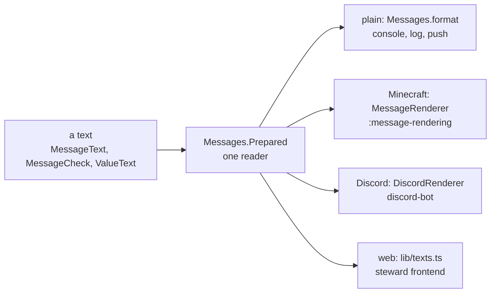

# messages

The message system without Adventure, so the bot and Steward can load it: bundles and the admins'
overrides over them (`Messages`), a message chosen and filled (`MessageRef`), the specs that declare
every key (`spec`), the contexts a message can name (`context`), and the refusal model (`Refusal`,
`Refused`) that an inbox, a command and an HTTP answer share. A process hands its
`MessageEnvironment` (service, season) to its bundles at startup with `Messages.within`.

One parser (`MessageText`), one validator (`MessageCheck`) and one formatter of values (`ValueText`)
stand behind every target; the browser walks that parser's tree and formats as `ValueText` does,
which the shared vectors hold.

## Writing a text

A value is `{role}` or `{role.attr}`, optionally with a kind and a style: `{left, duration, short}`.
`{n, plural, one {# day} other {# days}}` and `{open, select, true {open} other {closed}}` are ICU's,
and nothing else of MessageFormat is. The kinds are a closed set, each rendered once per target:

| kind       | Java type            | styles (the first is the default)                                                               |
| ---------- | -------------------- | ----------------------------------------------------------------------------------------------- |
| `text`     | a `CharSequence`     |                                                                                                 |
| `number`   | any `Number`         | grouped, `plain`; at most two fraction digits                                                   |
| `duration` | `Duration`           | `long` (its two largest units), `short` (`2h 5m`), `clock` (`2:05:00`), `minutes` (`1d 6h 30m`) |
| `instant`  | `Instant`            | `datetime`, `date`, `time`, `relative`, in the reader's zone                                    |
| `money`    | `Money`              | in the reader's language: `€3.00`, `3,00 €`                                                     |
| `list`     | a `List`             | `and`, `or`                                                                                     |
| `name`     | `DisplayName`        | with the process's name card, `plain` without                                                   |
| `mention`  | `Mention`            |                                                                                                 |
| `item`     | `GameContent`        |                                                                                                 |
| `glyph`    | `Glyph`              |                                                                                                 |
| `choice`   | `Boolean` or an enum | what `select` chooses on; an enum constant reads in kebab case                                  |
| `message`  | `MessageRef`         | another message, rendered for the same reader in the same target                                |

A Minecraft text is MiniMessage. A packaged text paints only with tones (`<good>`, `<bad>`, `<warn>`,
`<muted>`, `<accent>`, `<brand>`, `<emphasis>`, `<faint>`, `<neutral>`), which each process's `colours`
group maps to hex; an admin's override may also name colours and gradients. A value may stand in a
hover text and, quoted, in a click's target, and in no other tag argument. `<glyph:name>` draws a
glyph of the pack and `<action:name>…</action>` a click whose command the code binds.

## Values and contexts

A message declares its values in its spec (`@Arg`), and a value's kind follows its Java type. A
context (`MessageContext`) is a record annotated `@ContextType` in the module that owns it: each
component is an attribute with a kind and a static example, and a component that is itself a context
is expanded one level, as `{winner.team.name}`. `Contexts` is the registry. Every message also has
`server`, `season`, `network` and `viewer`, and every player role has `self`.

- A reader is a `Viewer`: a language, a zone and, in game, the player. An instant shows in the
  reader's zone, else the network's; in Discord it is Discord's own timestamp, and `relative` is
  the countdown Discord keeps current.
- A missing value shows its kind's replacement word from the `values` bundle (`someone`, `jemand`)
  and logs a warning; `{x}` is never printed. The build refuses a spec parameter of no kind.
- `GameContent` is the game's own line: a translatable component the client reads in its language,
  English elsewhere.
- A `message` value is a phrase written once and placed in many texts. It is never rendered ahead
  into a string: only the target knows the reader's language and how to draw the tones.

## A message as data

`MessageJson` writes a message as `{"key", "args"}`, each value `{"kind", "value"}`: a duration in
seconds, an instant as ISO text, money as `{"minor", "currency"}`, a name as `{"player", "name"}`, a
mention as `{"member", "name"}`, an item as `{"key", "english", "args"}`, a list as typed values. A
row that stores a message stores that, and a target renders it when somebody reads it.

`NodeJson` is a parsed text as the browser walks it: a literal is a string, a value `{"v", "k", "s"}`,
a choice `{"c", "plural", "cases"}`, a plural's `#` `{"pound"}`, a tag `{"tag", "shape", "args"}`.
`MessageJson.texts` is every key's variants as such trees, overrides layered. The browser reads message
syntax in one place only, Steward's translation editor (`lib/message-tree.ts`, this parser line by
line). The vectors in `src/test/resources/web-target.json` give a text, its tree, its values and the
plain text it shows; `WebTargetVectorsTest` holds this side to them, the frontend's
`message-tree.test.ts` and `texts.test.ts` the browser's.

## The check

`MessageSpecCheck` holds every spec against its bundles on the build's `messageSchema` task, in the
packaged mode; Steward runs the same `MessageCheck` on an admin's override, where what is an error in
a release is a warning. It refuses an undeclared value, a kind or style a value does not have, an
unclosed or unknown tag, a colour in a packaged text, a value in a tag argument that takes none and a
text longer than where it is shown; a text that never shows a value it is given is an error in a
bundle and a warning in an override.

Each problem is a message of the English-only `check` bundle (`CheckMessages`), never a sentence in
code, so an admin reads and changes it in the editor, and the build and a log say it in the packaged
English (`MessageCheck.english`). `GET /api/message-check` answers a text's problems for a key.

## Packaged texts and overrides

A bundle is packaged in the jar as `messages/<bundle>/<language>.properties`, read in `PackagedTexts`.
A key may hold several texts, one chosen at random each time: `key=`, then `key[1]=`, `key[2]=` without a gap.

An admin's change is rows of `message_override`, one per bundle, key, language and variant, which
Steward writes and every process reads at start and on the signal hub's `nordtal_messages`. A Paper
plugin reads them off the main thread and shows the packaged texts until the hub has connected.

- An override's texts replace the packaged ones of that language as a set. It keeps the packaged texts
  it replaced and their hash.
- A process sets aside an override whose hash no longer matches its jar (the admin wrote it over a
  text this release changed) or that the validator refuses; the packaged text shows until an admin
  saves the override again. Every process logs it, and Steward lists them at `GET /api/message-fallbacks`.
- A row for a key the bundle does not declare is left out.
- A renamed key names its former names with `@Formerly` (`key` or `bundle/key`), which the schema
  carries into the jar; an override under a former name follows the key, and one under the current name wins.
