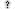

# resource-pack

The nordtal.eu resource pack. It ships glyphs in the Unicode private use area, HUD sprites, and a
handful of vanilla overrides.

**This file owns the code point allocation.** Decided 2026-08-31: one table, both fonts, here.
`minecraft/font/default.json`, `nordtal/font/bossbar.json` and `:common`'s `Glyphs` are all
*mirrors* of the table below — a change is a change in all of them, in one commit. Before this
decision the allocation was spread over four places that could and did drift; the wish lists in
[`docs/smp.md`](../docs/smp.md) and [`docs/hunger-games.md`](../docs/hunger-games.md) now point
here instead of carrying code points of their own.

## Building and deploying

This is a module of the [season-2](../) build. From the repository root:

```bash
./gradlew :resource-pack:packZip
```

produces `resource-pack/build/distributions/nordtal-resource-pack-<version>.zip` and a
`.sha1` file next to it. The zip's root is the contents of [`src/`](src/) — `pack.mcmeta` and
`assets/` must sit at the top level, not inside a `src/` folder.

The client is sent the zip's URL **and** its SHA-1, and refuses the pack if they disagree, which
is why the hash is generated on every build rather than written down. The zip and its hash are
attached to each GitHub release; `limbo` serves them to players.

To test locally, copy the contents of [`src/`](src/) into a folder in your game's
`resourcepacks/` directory.

`pack_format` is **88** (Minecraft 26.2).

# Code point allocation

Two fonts, and the difference matters: a glyph only lines up where its `height` and `ascent` match
the surface it is drawn on.

| font | file | used for | metrics |
|---|---|---|---|
| `minecraft:default` | [`minecraft/font/default.json`](src/assets/minecraft/font/default.json) | anything rendered as ordinary text — tab list, chat, nametags, Text Display boards | height 7 / ascent 7, except the logo |
| `nordtal:bossbar` | [`nordtal/font/bossbar.json`](src/assets/nordtal/font/bossbar.json) | the boss bar HUDs only, with the vanilla bar made invisible | height 14 / ascent 6 for bar segments, height 10 / ascent 4 for icons, height 8 / ascent 3 for text |

The two fonts allocate **independently**. `\uE001` is the citizen tag in `minecraft:default` and a
1-pixel bar segment in `nordtal:bossbar`; that is not a collision, because a component names the
font it is drawn in. It is still worth knowing before assigning anything new.

**Status of the columns below.** *keep* and *season 1* rows exist today, in the pack and in
`Glyphs`. ***new*** rows are decided and **not drawn yet** — neither the PNG, the font entry nor
the `Glyphs` constant exists. *retired* rows still exist in all three places and are to be removed.
Bringing the pack, `Glyphs` and the two font files in line with this table is the pack clean-up
session, not this one.

## `minecraft:default`

### `\uE000` – `\uE00F` — player badges

| Char code | File | Description | Status |
|---|---|---|---|
| `\uE000` | — | Donor star, from the permanent donor role | **new** |
| `\uE001` | — | *(free)* | retired — was the citizen tag |
| `\uE002` | — | *(free)* | retired — was the knight tag |
| `\uE003` | — | *(free)* | retired — was the lord tag |
| `\uE004` |  | Admin short tag `A`, 9 × 7 | keep |
| `\uE005` – `\uE00F` | — | reserved | — |

`\uE000` was the settler tag and is **re-used** rather than left empty. The four season-1 role
tags — settler, citizen, knight, lord — are gone from season 2; see
[smp.md](../docs/smp.md#what-a-player-looks-like). Re-use was chosen over leaving a hole on
2026-08-31: nothing anywhere persists a glyph character, so a code point cannot be read back and
mean the wrong thing.

### `\uE010` – `\uE01F` — language flags

| Char code | File | Description | Status |
|---|---|---|---|
| `\uE010` |  | Other / no language role | keep |
| `\uE011` |  | Germany | keep |
| `\uE012` |  | Netherlands | keep |
| `\uE013` |  | United Kingdom | keep |
| `\uE014` |  | United States | keep |
| `\uE015` – `\uE01F` | — | reserved — one per language added to `access.yml` | — |

The flag comes from `discord_user.locale` ([i18n.md](../docs/i18n.md)), so adding a language means
adding a flag here as well as an entry in the config.

### `\uE020` – `\uE02F` — brand

| Char code | File | Description | Status |
|---|---|---|---|
| `\uE020` |  | Nordtal long logo, height 24, ascent 0 | keep |
| `\uE021` |  | Nordtal long logo, height 32, ascent 25 | keep |
| `\uE022` – `\uE02F` | — | reserved | — |

### `\uE030` – `\uE03F` — prestige crests

Thirteen design tiers of one coat of arms, assigned by total online time
([smp.md](../docs/smp.md#prestige--a-crest-earned-by-time)). The tier is derived from
`player_playtime.seconds` at render time and never stored, so retuning the thresholds never
touches this table.

| Char code | Description | Status |
|---|---|---|
| `\uE030` – `\uE03C` | Prestige crest, tiers 1 – 13 in order | **new** |
| `\uE03D` – `\uE03F` | reserved | — |

### `\uE040` – `\uE04F` — board frame pieces

The objective board and the aura leaderboard are per-player Text Display entities
([smp.md](../docs/smp.md#the-boards-and-the-npc)). The content is text; the frame is glyphs. The
horizontal edge follows the same power-of-two tiling the boss bar already uses, so any width is
composed from at most eight glyphs.

| Char code | Description | Status |
|---|---|---|
| `\uE040` | Corner, top left | **new** |
| `\uE041` | Corner, top right | **new** |
| `\uE042` | Corner, bottom left | **new** |
| `\uE043` | Corner, bottom right | **new** |
| `\uE044` – `\uE04B` | Horizontal edge, 1 / 2 / 4 / 8 / 16 / 32 / 64 / 128 px | **new** |
| `\uE04C` | Vertical edge, left | **new** |
| `\uE04D` | Vertical edge, right | **new** |
| `\uE04E` | Divider, a horizontal rule inside the board | **new** |
| `\uE04F` | reserved | — |

### `\uE050` and above

Unallocated. The next block of sixteen goes to whatever needs one next.

## `nordtal:bossbar`

Everything in this font is HUD. The vanilla boss bar itself is made invisible by the two overrides
under [vanilla overrides](#vanilla-overrides); the visible bar is composed out of these glyphs.

**None of this font was documented anywhere before 2026-08-31** — not in this README, not in
`Glyphs`, not in the knowledge base. The first four subsections below are what the pack has been
shipping since season 1, written down for the first time.

### `\uF001` – `\uF128`, `\uFF01` – `\uFF32` — space advances

A `type: space` provider. Negative advances move the cursor back, which is how a composed bar is
drawn on top of itself without a second render pass.

| Char code | Advance | | Char code | Advance |
|---|---|---|---|---|
| `\uF001` | −1 | | `\uFF01` | +1 |
| `\uF002` | −2 | | `\uFF02` | +2 |
| `\uF004` | −4 | | ` ` (space) | +3 |
| `\uF008` | −8 | | `\uFF04` | +4 |
| `\uF016` | −16 | | `\uFF08` | +8 |
| `\uF032` | −32 | | `\uFF16` | +16 |
| `\uF064` | −64 | | `\uFF32` | +32 |
| `\uF128` | −128 | | | |

> **`\uFF01` – `\uFF32` are not private use.** They are `FULLWIDTH EXCLAMATION MARK`,
> `FULLWIDTH QUOTATION MARK`, `FULLWIDTH DOLLAR SIGN`, `FULLWIDTH LEFT PARENTHESIS`,
> `FULLWIDTH DIGIT SIX` and `FULLWIDTH LATIN CAPITAL LETTER R`. The override is confined to this
> font, so ordinary chat is unaffected and nothing is broken today — but it contradicts the range
> this pack claims to stay inside, and a positive-advance set inside `\uF000` – `\uF8FF` would
> cost nothing. Recorded rather than fixed: moving them is a change to whatever HUD code composes
> the bar, and no such code exists yet.

### `\uE000` – `\uE128` — bar background segments

Height 14, ascent 6. Source images are 1 × 14 and scaled by the width in the name.

| Char code | File | Width |
|---|---|---|
| `\uE000` | `ui/bossbar/bg/end.png` | end cap |
| `\uE001` | `ui/bossbar/bg/1.png` | 1 px |
| `\uE002` | `ui/bossbar/bg/2.png` | 2 px |
| `\uE004` | `ui/bossbar/bg/4.png` | 4 px |
| `\uE008` | `ui/bossbar/bg/8.png` | 8 px |
| `\uE016` | `ui/bossbar/bg/16.png` | 16 px |
| `\uE032` | `ui/bossbar/bg/32.png` | 32 px |
| `\uE064` | `ui/bossbar/bg/64.png` | 64 px |
| `\uE128` | `ui/bossbar/bg/128.png` | 128 px |

The code points are named after the pixel width in decimal, which is why they are not contiguous.

### ` ` – `~` and above — ASCII override

`nordtal:font/ascii.png`, 128 × 128, height 8, ascent 3. A full replacement grid for printable
ASCII plus box drawing and a few symbols, so HUD text sits on the bar's baseline instead of the
chat baseline.

**This is why the HUD needs no digit glyphs.** `0123456789` are already in this grid at the right
metrics. Both [smp.md](../docs/smp.md) and [hunger-games.md](../docs/hunger-games.md) listed
"digits" as something still to be added; they are not needed. `\uEF20` – `\uEF2F` is reserved in
case a larger display set is ever wanted.

### `\uEF00` – `\uEF0F` — status icons

Height 10, ascent 4.

| Char code | File | Description | Status |
|---|---|---|---|
| `\uEF00` | `ui/bossbar/icons/compass.png`, 10 × 10 | Compass | keep — season 1 |
| `\uEF01` | `ui/bossbar/icons/fblue.png`, 8 × 10 | Purpose undocumented | season 1 — **confirm before re-use** |
| `\uEF02` | `ui/bossbar/icons/fgreen.png` | Purpose undocumented | season 1 — **confirm before re-use** |
| `\uEF03` | `ui/bossbar/icons/fred.png` | Purpose undocumented | season 1 — **confirm before re-use** |
| `\uEF04` | `ui/bossbar/icons/fwhite.png` | Purpose undocumented | season 1 — **confirm before re-use** |
| `\uEF05` | — | Dimension: Nordtal (overworld) | **new** |
| `\uEF06` | — | Dimension: farm world | **new** |
| `\uEF07` | — | Dimension: Nether | **new** |
| `\uEF08` | — | Dimension: End | **new** |
| `\uEF09` | — | Players alive | **new** |
| `\uEF0A` | — | Deaths | **new** |
| `\uEF0B` | — | Loot point | **new** |
| `\uEF0C` | — | World border | **new** |
| `\uEF0D` – `\uEF0F` | — | reserved | — |

`fblue`, `fgreen`, `fred` and `fwhite` are four 8 × 10 sprites named after four of Minecraft's boss
bar colours. That they are coloured bar caps is a **guess**, not a fact — season 1's plugin is the
only thing that ever drew them and nothing in this repository does. Do not delete them and do not
re-use their code points until somebody has looked at the images.

### `\uEF10` – `\uEF1F` — bearing arrows

Height 10, ascent 4. Sixteen steps of 22.5°, `\uEF10` pointing straight ahead and running
clockwise to `\uEF1F` at 337.5°.

| Char code | Bearing | Status |
|---|---|---|
| `\uEF10` – `\uEF1F` | 0°, 22.5°, 45° … 337.5° | **new** |

One set serves all three users: `/navigate`'s arrow to the chosen target
([smp.md](../docs/smp.md#navigate)), the hunger games arrow to the nearest living player, and the
direction to the nearest loot point ([hunger-games.md](../docs/hunger-games.md#the-hud)).

### `\uEF20` and above

`\uEF20` – `\uEF2F` reserved for a large digit set, should the ASCII grid ever prove too small.
Nothing above that is allocated.

## Vanilla overrides

| file | what it does |
|---|---|
| `minecraft/textures/gui/sprites/boss_bar/white_background.png` | makes the vanilla boss bar frame invisible, so the composed HUD is all that shows |
| `minecraft/textures/gui/sprites/boss_bar/white_progress.png` | likewise, the progress fill |
| `minecraft/lang/en_us.json` | `menu.returnToGame`, `menu.game` (the logo glyph) and `menu.disconnect` |

`en_us.json` still reads "Return to nordtal smp" from season 1 and is part of the pack clean-up.
