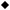
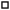

# resource-pack

The nordtal.eu resource pack. It ships glyphs in the Unicode private use area, HUD sprites, and a
handful of vanilla overrides.

**This file owns the code point allocation.** Decided 2026-08-31: one table, here, covering every
font. `minecraft/font/default.json`, `nordtal/font/bossbar.json`, `nordtal/font/board.json` (added
2026-08-31, see [`nordtal:board`](#nordtalboard) below) and `:common`'s `Glyphs` are all *mirrors*
of the table below — a change is a change in all of them, in one commit. Before this decision the
allocation was spread over four places that could and did drift; the wish lists in
[`docs/smp.md`](../docs/smp.md) and [`docs/hunger-games.md`](../docs/hunger-games.md) now point
here instead of carrying code points of their own.

## Building and deploying

This is a module of the [season-2](../) build. From the repository root:

```bash
./gradlew :resource-pack:packZip
```

produces `resource-pack/build/distributions/nordtal-resource-pack-<version>.zip` and a
`.sha1` file next to it. The zip's root is the contents of [`src/`](src/) — `pack.mcmeta` and
`assets/` must sit at the top level, not inside a `src/` folder.

The client is sent the zip's URL **and** its SHA-1, and refuses the pack if they disagree, which
is why the hash is generated on every build rather than written down. The zip and its hash are
attached to each GitHub release; `limbo` serves them to players.

To test locally, copy the contents of [`src/`](src/) into a folder in your game's
`resourcepacks/` directory.

`pack_format` is **88** (Minecraft 26.2).

## Dummy textures

Every glyph in the code point allocation below that this table used to mark **new** — fully
decided, not yet drawn — was given a generated placeholder or final-candidate PNG on 2026-08-31,
so the design pass has something concrete to replace rather than a blank space and a font that
would otherwise fail to load. `resource-pack/tools/generate_dummy_textures.py` is a dependency-free
Python script (no Pillow, no ImageMagick — neither is installed on the machine that wrote it) that
draws all of them deterministically from the metrics in this file:

```bash
python3 resource-pack/tools/generate_dummy_textures.py
```

Re-run it after changing a size, a shape, or an allocation here; it overwrites only the files it
generates. See each glyph's row below for whether its current art is `generated — placeholder`
(a stand-in, replace before shipping) or `generated — final candidate` (simple enough it might
just ship).

The same script also writes two things outside this table's scope:

- **The hot-air balloon's item-model scaffold** — `assets/nordtal/items/balloon.json`,
  `assets/nordtal/models/item/balloon.json` and two flat-colour placeholder textures
  (`assets/nordtal/textures/item/balloon_{envelope,basket}.png`). This is plumbing, not art: two
  placeholder cuboids standing in for the balloon docs/smp.md#the-nordtal-spawn calls a "custom 3D
  model". The real geometry is a Blockbench modelling task this script cannot do.
- **The hunger-games lobby map placeholders** — `hunger-games/src/main/resources/lobby/map-en.png`
  and `map-de.png`, 384 × 384 (a 3 × 3 grid of 128px Minecraft maps, matching
  `HungerGamesSpec.LobbySpec`'s default). These aren't resource-pack assets at all — `LobbyMaps`
  slices them onto item-frame maps at runtime — but they closed the same "code exists, art
  doesn't" gap, so the script covers them too. Flat backgrounds with visible grid lines and a
  language-accent swatch, not the real hand-prepared aerial image (docs/hunger-games.md#the-lobby).

# Code point allocation

Three fonts, and the difference matters: a glyph only lines up where its `height` and `ascent`
match the surface it is drawn on. `nordtal:board` was added 2026-08-31, alongside the board frame
pieces moving out of `minecraft:default` — see [`nordtal:board`](#nordtalboard) below for why.

| font | file | used for | metrics |
|---|---|---|---|
| `minecraft:default` | [`minecraft/font/default.json`](src/assets/minecraft/font/default.json) | anything rendered as ordinary text — tab list, chat, nametags, Text Display boards | height 7 / ascent 7, height 9 / ascent 8 for prestige crests, except the logo |
| `nordtal:bossbar` | [`nordtal/font/bossbar.json`](src/assets/nordtal/font/bossbar.json) | the boss bar HUDs only, with the vanilla bar made invisible | height 14 / ascent 6 for bar segments, height 10 / ascent 4 for icons, height 8 / ascent 3 for text |
| `nordtal:board` | [`nordtal/font/board.json`](src/assets/nordtal/font/board.json) | the objective board and aura leaderboard's frame only | height 9 / ascent 8 |

The three fonts allocate **independently**. `\uE001` is a reserved player-badge code point in
`minecraft:default`, a 1-pixel bar segment in `nordtal:bossbar`, and (as `\uF001` specifically, in
the space-advance block) a −1px tiling correction reused verbatim in `nordtal:board`; none of that
is a collision, because a component names the font it is drawn in. It is still worth knowing
before assigning anything new.

**Status of the columns below.** *keep* and *season 1* rows exist today, in the pack and in
`Glyphs`. ***new*** rows are decided and **not drawn yet** — neither the PNG, the font entry nor
the `Glyphs` constant exists. *retired* rows are gone from all three places as of the pack
clean-up session (2026-08-31).

**`generated` rows are new as of a 2026-08-31 dummy-texture pass**
(`resource-pack/tools/generate_dummy_textures.py`, a dependency-free Python script — Pillow and
ImageMagick are both absent from this machine) that closes the "code exists, art doesn't" gap for
every fully-allocated, still-undrawn glyph: the PNG, the font entry and the `Glyphs` constant all
exist as of that session. It does **not** mean the design pass is done —
`generated — final candidate` is programmatically-drawn geometry (a star, rotated arrows, straight
border lines) plausible as shipping art; `generated — placeholder` (the prestige crests, the
dimension icons, the hunger-games status icons) is a stand-in that only exists so the font, the
HUD and the board can be exercised on a running server before the real design happens. Re-run the
script whenever a metric in the tables below changes; it is deterministic and touches nothing it
doesn't own.

## `minecraft:default`

### `\uE000` – `\uE00F` — player badges

| Char code | File | Description | Status |
|---|---|---|---|
| `\uE000` |  | Donor star, from the permanent donor role, 7 × 7 | generated — final candidate |
| `\uE001` | — | *(free)* | removed — was the citizen tag |
| `\uE002` | — | *(free)* | removed — was the knight tag |
| `\uE003` | — | *(free)* | removed — was the lord tag |
| `\uE004` |  | Admin short tag `A`, 9 × 7 | keep |
| `\uE005` – `\uE00F` | — | reserved | — |

`\uE000` was the settler tag and is **re-used** rather than left empty. The four season-1 role
tags — settler, citizen, knight, lord — are gone from season 2 as of the pack clean-up
session (2026-08-31): their font entries, PNGs and `Glyphs` constants were removed; see
[smp.md](../docs/smp.md#what-a-player-looks-like). Re-use was chosen over leaving a hole:
nothing anywhere persists a glyph character, so a code point cannot be read back and mean the
wrong thing. `\uE000`'s donor star is a plain black five-point star drawn at the existing h7/a7 metrics (generated 2026-08-31, `resource-pack/tools/generate_dummy_textures.py`) — simple enough that it plausibly ships as-is rather than being a mere placeholder.

### `\uE010` – `\uE01F` — language flags

| Char code | File | Description | Status |
|---|---|---|---|
| `\uE010` |  | Other / no language role | keep |
| `\uE011` |  | Germany | keep |
| `\uE012` |  | Netherlands | keep |
| `\uE013` |  | United Kingdom | keep |
| `\uE014` |  | United States | keep |
| `\uE015` – `\uE01F` | — | reserved — one per language added to `access.yml` | — |

The flag comes from `discord_user.locale` ([i18n.md](../docs/i18n.md)), so adding a language means
adding a flag here as well as an entry in the config.

### `\uE020` – `\uE02F` — brand

| Char code | File | Description | Status |
|---|---|---|---|
| `\uE020` |  | Nordtal long logo, height 24, ascent 0 | keep |
| `\uE021` |  | Nordtal long logo, height 32, ascent 25 | keep |
| `\uE022` – `\uE02F` | — | reserved | — |

### `\uE030` – `\uE03F` — prestige crests

Thirteen design tiers of one coat of arms, assigned by total online time
([smp.md](../docs/smp.md#prestige--a-crest-earned-by-time)). The tier is derived from
`player_playtime.seconds` at render time and never stored, so retuning the thresholds never
touches this table.

9 × 9 was chosen over the existing 7 × 7 (decided 2026-08-31): 49 pixels cannot honestly
distinguish thirteen tiers, and height 9 / ascent 8 fills a 9 px text row without colliding with
the line above or below in the tab list or chat, unlike an 11 × 11 alternative that was also
considered.

| Char code | File | Description | Status |
|---|---|---|---|
| `\uE030` |  | Prestige crest, tier 1, 9 × 9, h9/a8 | generated — placeholder |
| `\uE031` – `\uE03B` | `prestige/crest_02.png` – `crest_12.png` | Prestige crest, tiers 2 – 12 | generated — placeholder |
| `\uE03C` |  | Prestige crest, tier 13, 9 × 9, h9/a8 | generated — placeholder |
| `\uE03D` – `\uE03F` | — | reserved | — |

The placeholder art is a shield outline with a bottom-up fill gauge proportional to the tier
(tier 13 nearly solid, tier 1 barely filled) — enough to order the thirteen tiers at a glance for
testing, not an attempt at the real coat-of-arms design.

## `nordtal:board`

**A dedicated font, decided 2026-08-31** — not part of `minecraft:default` as earlier drafts of
this table had it. The objective board and the aura leaderboard
([smp.md](../docs/smp.md#the-boards-and-the-npc)) are per-player Text Display entities whose frame
is glyphs; those glyphs need to tile edge-to-edge the same way `nordtal:bossbar`'s bar segments
do, which means their own negative-advance `space` provider to close the 1px trailing gap every
bitmap glyph gets (Minecraft's font renderer sets a glyph's width at "the last right-most column
of pixels containing any alpha value above 0", plus one — verified against
[minecraft.wiki/w/Font](https://minecraft.wiki/w/Font), 2026-08-31). That mechanic has no business
in the font ordinary chat and nametags render in, so it gets a font of its own instead of
crowding `minecraft:default`. It reuses `nordtal:bossbar`'s own `\uF001`–`\uF128` code points for
that space provider — not a collision, since fonts allocate independently (see the note under
`nordtal:bossbar` below).

Height 9 / ascent 8, matching the prestige crests above. Every corner and edge line is drawn
**centered** in its 9 px cell (row 4.5, not flush to the top or bottom): that is what lets the same
`edge_h` glyphs serve as both the top and the bottom border of the board, and it is a design
decision this table is making explicit, not an accident of the placeholder art — the alternative
(top-aligned or bottom-aligned lines) would need two separate glyph sets, one for each edge, which
the original allocation never budgeted for.

| Char code | File | Description | Status |
|---|---|---|---|
| `\uE040` |  | Corner, top left | generated — final candidate |
| `\uE041` |  | Corner, top right | generated — final candidate |
| `\uE042` |  | Corner, bottom left | generated — final candidate |
| `\uE043` |  | Corner, bottom right | generated — final candidate |
| `\uE044` – `\uE04B` | `ui/board/edge_h_{1,2,4,8,16,32,64,128}.png` | Horizontal edge, 1 / 2 / 4 / 8 / 16 / 32 / 64 / 128 px | generated — final candidate |
| `\uE04C` |  | Vertical edge, left | generated — final candidate |
| `\uE04D` |  | Vertical edge, right | generated — final candidate |
| `\uE04E` – `\uE055` | `ui/board/divider_{1,2,4,8,16,32,64,128}.png` | Divider, a horizontal rule inside the board, same eight widths as the outer edge | generated — final candidate |
| `\uE056` – `\uE05F` | — | reserved | — |

**The divider grew from one code point to eight on 2026-08-31.** It was originally a single glyph,
but a horizontal rule *inside* the board needs to span the board's width exactly like the outer
edge does, so it needs the same power-of-two tiling — a single glyph only works for one fixed
board width, which nothing here specifies. It is allocated separately from `edge_h` (rather than
reusing it) so the interior rule can look different from the border if the real design wants that;
the current placeholder art draws both identically.

Corners meet the edges at the exact center of the cell (4.5, 4.5): each corner is a single line
bent at that point, one stub reaching toward whichever edge continues from it (e.g. `corner_tl`'s
stub reaches right, toward the top edge, and down, toward the left edge). Placed side by side at
these metrics the whole set forms a seamless rectangle, verified against the generated PNGs.

## `nordtal:bossbar`

Everything in this font is HUD. The vanilla boss bar itself is made invisible by the two overrides
under [vanilla overrides](#vanilla-overrides); the visible bar is composed out of these glyphs.

**None of this font was documented anywhere before 2026-08-31** — not in this README, not in
`Glyphs`, not in the knowledge base. The first four subsections below are what the pack has been
shipping since season 1, written down for the first time. As of the same day's dummy-texture pass,
every code point below has a `nordtal/font/bossbar.json` entry and a `Glyphs` constant — the four
dimension icons, four status icons and sixteen bearing arrows that were `new` are now `generated`,
either placeholder or final-candidate art per their own row.

### `\uF001` – `\uF128`, `\uFF01` – `\uFF32` — space advances

A `type: space` provider. Negative advances move the cursor back, which is how a composed bar is
drawn on top of itself without a second render pass.

| Char code | Advance | | Char code | Advance |
|---|---|---|---|---|
| `\uF001` | −1 | | `\uFF01` | +1 |
| `\uF002` | −2 | | `\uFF02` | +2 |
| `\uF004` | −4 | | ` ` (space) | +3 |
| `\uF008` | −8 | | `\uFF04` | +4 |
| `\uF016` | −16 | | `\uFF08` | +8 |
| `\uF032` | −32 | | `\uFF16` | +16 |
| `\uF064` | −64 | | `\uFF32` | +32 |
| `\uF128` | −128 | | | |

> **`\uFF01` – `\uFF32` are not private use.** They are `FULLWIDTH EXCLAMATION MARK`,
> `FULLWIDTH QUOTATION MARK`, `FULLWIDTH DOLLAR SIGN`, `FULLWIDTH LEFT PARENTHESIS`,
> `FULLWIDTH DIGIT SIX` and `FULLWIDTH LATIN CAPITAL LETTER R`. The override is confined to this
> font, so ordinary chat is unaffected and nothing is broken today — but it contradicts the range
> this pack claims to stay inside, and a positive-advance set inside `\uF000` – `\uF8FF` would
> cost nothing. Recorded rather than fixed: moving them is a change to whatever HUD code composes
> the bar, and no such code exists yet.

### `\uE000` – `\uE128` — bar background segments

Height 14, ascent 6. Each file is pre-rendered at its own named pixel width — not a 1 × 14 source
scaled up; only `end.png` and `1.png` are actually 1 px wide (checked against the files on disk,
2026-08-31; an earlier version of this line was wrong).

| Char code | File | Width |
|---|---|---|
| `\uE000` | `ui/bossbar/bg/end.png` | end cap |
| `\uE001` | `ui/bossbar/bg/1.png` | 1 px |
| `\uE002` | `ui/bossbar/bg/2.png` | 2 px |
| `\uE004` | `ui/bossbar/bg/4.png` | 4 px |
| `\uE008` | `ui/bossbar/bg/8.png` | 8 px |
| `\uE016` | `ui/bossbar/bg/16.png` | 16 px |
| `\uE032` | `ui/bossbar/bg/32.png` | 32 px |
| `\uE064` | `ui/bossbar/bg/64.png` | 64 px |
| `\uE128` | `ui/bossbar/bg/128.png` | 128 px |

The code points are named after the pixel width in decimal, which is why they are not contiguous.

### ` ` – `~` and above — ASCII override

`nordtal:font/ascii.png`, 128 × 128, height 8, ascent 3. A full replacement grid for printable
ASCII plus box drawing and a few symbols, so HUD text sits on the bar's baseline instead of the
chat baseline.

**This is why the HUD needs no digit glyphs.** `0123456789` are already in this grid at the right
metrics. Both [smp.md](../docs/smp.md) and [hunger-games.md](../docs/hunger-games.md) listed
"digits" as something still to be added; they are not needed. `\uEF20` – `\uEF2F` is reserved in
case a larger display set is ever wanted.

### `\uEF00` – `\uEF0F` — status icons

Height 10, ascent 4.

| Char code | File | Description | Status |
|---|---|---|---|
| `\uEF00` | `ui/bossbar/icons/compass.png`, 10 × 10 | Compass | keep — season 1 |
| `\uEF01` | `ui/bossbar/icons/fblue.png`, 8 × 10 | Land flag, blue — inside a player's preserved area | keep — season 1 |
| `\uEF02` | `ui/bossbar/icons/fgreen.png`, 8 × 10 | Land flag, green — permanent land, untouched by the reset | keep — season 1 |
| `\uEF03` | `ui/bossbar/icons/fred.png`, 8 × 10 | Land flag, red — reset zone | keep — season 1 |
| `\uEF04` | `ui/bossbar/icons/fwhite.png`, 8 × 10 | Land flag, white — server-protected spawn area | keep — season 1 |
| `\uEF05` |  | Dimension: Nordtal (overworld), 10 × 10 | generated — placeholder |
| `\uEF06` |  | Dimension: farm world, 10 × 10 | generated — placeholder |
| `\uEF07` |  | Dimension: Nether, 10 × 10 | generated — placeholder |
| `\uEF08` |  | Dimension: End, 10 × 10 | generated — placeholder |
| `\uEF09` |  | Players alive, 10 × 10 | generated — placeholder |
| `\uEF0A` |  | Deaths, 10 × 10 | generated — placeholder |
| `\uEF0B` |  | Loot point, 10 × 10 | generated — placeholder |
| `\uEF0C` |  | World border, 10 × 10 | generated — placeholder |
| `\uEF0D` – `\uEF0F` | — | reserved | — |

`fblue`, `fgreen`, `fred` and `fwhite` are **land-status flags**, established 2026-08-31 by decoding
the four PNGs and reading season 1's plugin. The `f` is *flag*, not a boss bar colour: all four are
pixel-identical 8 × 10 sprites of a pennant on a dark-brown pole down the left edge, differing only
in the banner's colour ramp. The earlier note here — that they were coloured bar caps named after
Minecraft's boss bar colours — was a guess, and it was wrong.

What fixes each colour's meaning is `SmpWorldsService#getInfoIconText`, which picked exactly one of
them for the player's current position and paired it with a label:

| Sprite | Season 1 label | Position |
|---|---|---|
| `fwhite` | `Server-protected` | inside the spawn area |
| `fblue` | the area's display name and its owner | inside a player's preserved area |
| `fred` | `Reset zone` | land the farm-world reset clears |
| `fgreen` | `Permanent` | land the reset leaves alone |

`\uEF00`'s compass was the companion icon naming the world itself — `spawnAreaIcon`,
`preservedAreaIcon` and `resetAreaIcon` all defaulted to it. **Nothing in season 2 draws any of the
five season-1 land-status icons yet**, so the meanings above are recorded rather than in force:
they are what the sprites meant, so that whatever builds the SMP HUD inherits them instead of
re-inventing them. The eight rows above them (`\uEF05`–`\uEF0C`) are different: those are drawn now,
as simple placeholder pictograms (a disc, a sprout, a flame, a four-point sparkle for the four
dimensions; a filled dot, an X, a diamond and a square outline for the four status icons) —
distinguishable enough to test the HUD composition against, not the real icon design.

### `\uEF10` – `\uEF1F` — bearing arrows

Height 10, ascent 4. Sixteen steps of 22.5°, `\uEF10` pointing straight ahead and running
clockwise to `\uEF1F` at 337.5°.

| Char code | File | Bearing | Status |
|---|---|---|---|
| `\uEF10` | `ui/bossbar/arrows/arrow_000_0.png` | 0° | generated — final candidate |
| `\uEF11` – `\uEF1F` | `arrow_022_5.png` … `arrow_337_5.png` | 22.5° … 337.5°, 22.5° steps clockwise | generated — final candidate |

Drawn as sixteen rotations of one arrowhead-and-shaft polygon, rasterized directly from the angle
(`resource-pack/tools/generate_dummy_textures.py`) rather than freehand per step, so all sixteen
agree with each other exactly. Verified clockwise (0° up, 90° right, 180° down) against the
generated PNGs, 2026-08-31.

One set serves all three users: `/navigate`'s arrow to the chosen target
([smp.md](../docs/smp.md#navigate)), the hunger games arrow to the nearest living player, and the
direction to the nearest loot point ([hunger-games.md](../docs/hunger-games.md#the-hud)).

### `\uEF20` and above

`\uEF20` – `\uEF2F` reserved for a large digit set, should the ASCII grid ever prove too small.
Nothing above that is allocated.

## Vanilla overrides

| file | what it does |
|---|---|
| `minecraft/textures/gui/sprites/boss_bar/white_background.png` | makes the vanilla boss bar frame invisible, so the composed HUD is all that shows |
| `minecraft/textures/gui/sprites/boss_bar/white_progress.png` | likewise, the progress fill |
| `minecraft/lang/en_us.json` | `menu.returnToGame`, `menu.game` (the logo glyph) and `menu.disconnect` |
| `minecraft/lang/de_de.json` | the same three keys in German |

`en_us.json`'s `menu.returnToGame` was fixed in the pack clean-up session (2026-08-31); it no
longer reads "Return to nordtal smp" from season 1, and now reads "Continue playing Nordtal".

`de_de.json` was added 2026-08-31 and is **the one place in season 2 where the player's own client
language decides what they see** — a lang file is a static asset and cannot read `discord_user.locale`
the way everything else does. It is confined to these three cosmetic pause-menu strings for exactly
that reason; see [i18n.md](../docs/i18n.md#the-one-exception--the-resource-packs-lang-files).
