# resource-pack

The nordtal.eu resource pack. It ships glyphs in the Unicode private use area, HUD sprites, and a
handful of vanilla overrides.

**This file owns the code point allocation.** Decided 2026-08-31: one table, here, covering every
font. `minecraft/font/default.json`, `nordtal/font/bossbar.json`, `nordtal/font/board.json` (added
2026-08-31, see [`nordtal:board`](#nordtalboard) below) and `:common`'s `Glyphs` are all *mirrors*
of the table below — a change is a change in all of them, in one commit. Before this decision the
allocation was spread over four places that could and did drift; the wish lists in
[`docs/smp.md`](../docs/smp.md) and [`docs/hunger-games.md`](../docs/hunger-games.md) now point
here instead of carrying code points of their own.

## Building and deploying

This is a module of the [season-2](../) build. From the repository root:

```bash
./gradlew :resource-pack:packZip
```

produces `resource-pack/build/distributions/nordtal-resource-pack-<version>.zip` and a
`.sha1` file next to it. The zip's root is the contents of [`src/`](src/) — `pack.mcmeta` and
`assets/` must sit at the top level, not inside a `src/` folder.

The client is sent the zip's URL **and** its SHA-1, and refuses the pack if they disagree, which
is why the hash is generated on every build rather than written down. The zip and its hash are
attached to each GitHub release, and the **proxy** offers the pack while the player waits in
`limbo` — see [Hosting](#hosting).

To test locally, copy the contents of [`src/`](src/) into a folder in your game's
`resourcepacks/` directory.

`pack_format` is **88** (Minecraft 26.2).

## Hosting

**The GitHub release asset URL is what players download.** `packZip` builds reproducibly — fixed
file order, no timestamps — so the same version always hashes the same.

The URL and the hash are **configuration, never code**: they live in `network-control`'s own
`pack.yml`, in a file separate from `gate.yml` because these two values change on *every* pack
release and `gate.yml` decides who may join a network that sells access. Both default to empty and
the proxy fails closed until they are filled in. A pack change therefore means a new release, a new
URL and a new hash in the proxy's configuration — and never a hardcoded hash anywhere.

Two things worth knowing before the first release:

- **Put the `github.com/<owner>/<repo>/releases/download/<tag>/<file>` URL in the config, never the
  address it redirects to.** Measured with `curl` on 2026-09-01: that URL answers exactly one `302`
  and the `location:` is on **`release-assets.githubusercontent.com`**, carrying a signature that
  expires in well under an hour. A resolved address pasted into `pack.yml` gives a pack that works
  this afternoon and fails tonight. Whether a Minecraft *client* follows that redirect is still
  unverified — [`../../todo.md`](../../todo.md), section 1, step 4, with a static host as the
  written fallback.
- **`sha1` is validated as 40 hex characters and nothing more.** Whether it is the hash of the zip
  at `url` is a question only a client can answer, and it answers it with `FAILED_DOWNLOAD` — which
  reads as a network problem and is not one.

## Dummy textures

Every glyph in the code point allocation below that this table used to mark **new** — fully
decided, not yet drawn — was given a generated placeholder or final-candidate PNG on 2026-08-31,
so the design pass has something concrete to replace rather than a blank space and a font that
would otherwise fail to load. `resource-pack/tools/generate_dummy_textures.py` is a dependency-free
Python script (no Pillow, no ImageMagick — neither is installed on the machine that wrote it) that
draws all of them deterministically from the metrics in this file:

```bash
python3 resource-pack/tools/generate_dummy_textures.py
```

Re-run it after changing a size, a shape, or an allocation here; it overwrites only the files it
generates. See each glyph's row below for whether its current art is `generated — placeholder`
(a stand-in, replace before shipping) or `generated — final candidate` (simple enough it might
just ship).

The same script also writes two things outside this table's scope:

- **The hot-air balloon's item-model scaffold** — `assets/nordtal/items/balloon.json`,
  `assets/nordtal/models/item/balloon.json` and two flat-colour placeholder textures
  (`assets/nordtal/textures/item/balloon_{envelope,basket}.png`). This is plumbing, not art: two
  placeholder cuboids standing in for the balloon docs/smp.md#the-nordtal-spawn calls a "custom 3D
  model". The real geometry is a Blockbench modelling task this script cannot do.
- **The hunger-games lobby map placeholders** — `hunger-games/src/main/resources/lobby/map-en.png`
  and `map-de.png`, 384 × 384 (a 3 × 3 grid of 128px Minecraft maps, matching
  `HungerGamesSpec.LobbySpec`'s default). These aren't resource-pack assets at all — `LobbyMaps`
  slices them onto item-frame maps at runtime — but they closed the same "code exists, art
  doesn't" gap, so the script covers them too. Flat backgrounds with visible grid lines and a
  language-accent swatch, not the real hand-prepared aerial image (docs/hunger-games.md#the-lobby).

# Code point allocation

Four fonts and a family of six, and the difference matters: a glyph only lines up where its
`height` and `ascent` match the surface it is drawn on. `nordtal:board` was added 2026-08-31,
alongside the board frame pieces moving out of `minecraft:default` — see
[`nordtal:board`](#nordtalboard) below for why. `nordtal:gui` was added 2026-09-04 with the first
menu panel, and `nordtal:gui_r0`…`gui_r5` on 2026-09-09 with the first list menu.

| font | file | used for | metrics |
|---|---|---|---|
| `minecraft:default` | [`minecraft/font/default.json`](src/assets/minecraft/font/default.json) | anything rendered as ordinary text — tab list, chat, nametags, Text Display boards | height 7 / ascent 7, height 9 / ascent 8 for prestige crests, except the logo |
| `nordtal:bossbar` | [`nordtal/font/bossbar.json`](src/assets/nordtal/font/bossbar.json) | the boss bar HUDs only, with the vanilla bar made invisible | height 14 / ascent 6 for bar segments, height 10 / ascent 4 for icons, height 8 / ascent 3 for text |
| `nordtal:board` | [`nordtal/font/board.json`](src/assets/nordtal/font/board.json) | the objective board and aura leaderboard's frame only — drawn by `:common`'s `BoardFrame` since 2026-09-04 | height 9 / ascent 8 |
| `nordtal:gui` | [`nordtal/font/gui.json`](src/assets/nordtal/font/gui.json) | the menu panels, drawn out of a chest inventory's **title** | ascent 13, height = the window's own pixel height (132…222) |
| `nordtal:gui_r0` … `gui_r5` | [`nordtal/font/gui_r0.json`](src/assets/nordtal/font/gui_r0.json) … | everything drawn **on a chest row** — a list entry's plate, its icon, its label | six copies of one font, one per row; three ascents each (see below) |

The four fonts allocate **independently**. `\uFE001` is a reserved player-badge code point in
`minecraft:default`, a 1-pixel bar segment in `nordtal:bossbar`, and (as `\uFF001` specifically, in
the space-advance block) a −1px tiling correction reused verbatim in `nordtal:board` and
`nordtal:gui`; none of that is a collision, because a component names the font it is drawn in. It
is still worth knowing before assigning anything new — **and a component that names no font at all
draws whichever of the four `minecraft:default` happens to hold**, which is not a missing glyph but
a wrong one. That cost four days of screenshots on 2026-09-04; `BossBarFontTest` now asserts both
renderers name their font.

## The plane, and why it moved (2026-09-04)

**Every code point below lives in Supplementary Private Use Area-A, `U+F0000`–`U+FFFFD`.** It used
to live in the basic plane's private use area, `U+E000`–`U+F8FF`, and the move was mechanical: one
hex digit in front, `0xE004` → `0xFE004`, so every glyph kept its place in the tables below.

Two reasons, and the second is the uncomfortable one:

- **Every glyph plugin in the ecosystem auto-assigns from `U+E000` upward** — ItemsAdder, Oraxen,
  Nexo. Two of them on one server, or a pack merged with ours, collide there. A collision is
  **silent**: the higher-priority provider wins, and the glyph then renders at *another font's*
  ascent, which looks like a positioning bug rather than like a collision.
- **Minecraft has shipped a `unifont_pua` provider since 1.21.6 that nothing currently
  references.** Verified against the extracted 26.2 assets: neither `default.json` nor
  `uniform.json` includes it, so a basic-plane code point with no glyph renders as the
  missing-character box today. The day a future version or a client pack wires that provider in, an
  unmapped code point stops being *visibly* broken and starts being *quietly wrong* — a real
  Unifont glyph where our art should be. That is the worse half, and it is the half nobody would
  notice.

Plane 13 (`U+D0000`) is what the well-known negative-space packs use, and it is **unassigned code
space, not private use** — it works, but it is squatting. SPUA-A is the block Unicode actually
reserves for this.

The cost is that every code point is above `U+FFFF` and therefore a **surrogate pair** in UTF-16.
`Glyphs` writes them as `cp(0xFE004)` rather than as `"\uDBB8\uDC04"` for that reason, and the font
files write them as escaped pairs rather than as literal characters. Nothing else in the repository
names a code point: `TabListTest` asserts that no message bundle carries a private-use character in
either plane, and the glyph reaches a bundle as a `{parameter}` instead.

**Status of the columns below.** *keep* and *season 1* rows exist today, in the pack and in
`Glyphs`. ***new*** rows are decided and **not drawn yet** — neither the PNG, the font entry nor
the `Glyphs` constant exists. *retired* rows are gone from all three places as of the pack
clean-up session (2026-08-31).

**`generated` rows are new as of a 2026-08-31 dummy-texture pass**
(`resource-pack/tools/generate_dummy_textures.py`, a dependency-free Python script — Pillow and
ImageMagick are both absent from this machine) that closes the "code exists, art doesn't" gap for
every fully-allocated, still-undrawn glyph: the PNG, the font entry and the `Glyphs` constant all
exist as of that session. It does **not** mean the design pass is done —
`generated — final candidate` is programmatically-drawn geometry (a star, rotated arrows, straight
border lines) plausible as shipping art; `generated — placeholder` (the prestige crests, the
dimension icons, the hunger-games status icons) is a stand-in that only exists so the font, the
HUD and the board can be exercised on a running server before the real design happens. Re-run the
script whenever a metric in the tables below changes; it is deterministic and touches nothing it
doesn't own.

## `minecraft:default`

### `\uFE000` – `\uFE00F` — player badges

| Char code | File | Description | Status |
|---|---|---|---|
| `\uFE000` |  | Donor star, from the permanent donor role, 7 × 7 | generated — final candidate |
| `\uFE001` | — | *(free)* | removed — was the citizen tag |
| `\uFE002` | — | *(free)* | removed — was the knight tag |
| `\uFE003` | — | *(free)* | removed — was the lord tag |
| `\uFE004` |  | Admin short tag `A`, 9 × 7 | keep |
| `\uFE005` – `\uFE00F` | — | reserved | — |

`\uFE000` was the settler tag and is **re-used** rather than left empty. The four season-1 role
tags — settler, citizen, knight, lord — are gone from season 2 as of the pack clean-up
session (2026-08-31): their font entries, PNGs and `Glyphs` constants were removed; see
[smp.md](../docs/smp.md#what-a-player-looks-like). Re-use was chosen over leaving a hole:
nothing anywhere persists a glyph character, so a code point cannot be read back and mean the
wrong thing. `\uFE000`'s donor star is a plain black five-point star drawn at the existing h7/a7 metrics (generated 2026-08-31, `resource-pack/tools/generate_dummy_textures.py`) — simple enough that it plausibly ships as-is rather than being a mere placeholder.

### `\uFE010` – `\uFE01F` — language flags

| Char code | File | Description | Status |
|---|---|---|---|
| `\uFE010` |  | Other / no language role | keep |
| `\uFE011` |  | Germany | keep |
| `\uFE012` |  | Netherlands | keep |
| `\uFE013` |  | United Kingdom | keep |
| `\uFE014` |  | United States | keep |
| `\uFE015` – `\uFE01F` | — | reserved — one per language added to `access.yml` | — |

The flag comes from `discord_user.locale` ([i18n.md](../docs/i18n.md)), so adding a language means
adding a flag here as well as an entry in the config.

### `\uFE020` – `\uFE02F` — brand

| Char code | File | Description | Status |
|---|---|---|---|
| `\uFE020` |  | Nordtal long logo, height 24, ascent 0 | keep |
| `\uFE021` |  | Nordtal long logo, height 32, ascent 25 | keep |
| `\uFE022` – `\uFE02F` | — | reserved | — |

### `\uFE030` – `\uFE03F` — prestige crests

Thirteen design tiers of one coat of arms, assigned by total online time
([smp.md](../docs/smp.md#prestige--a-crest-earned-by-time)). The tier is derived from
`player_playtime.seconds` at render time and never stored, so retuning the thresholds never
touches this table.

9 × 9 was chosen over the existing 7 × 7 (decided 2026-08-31): 49 pixels cannot honestly
distinguish thirteen tiers, and height 9 / ascent 8 fills a 9 px text row without colliding with
the line above or below in the tab list or chat, unlike an 11 × 11 alternative that was also
considered.

| Char code | File | Description | Status |
|---|---|---|---|
| `\uFE030` |  | Prestige crest, tier 1, 9 × 9, h9/a8 | generated — placeholder |
| `\uFE031` – `\uFE03B` | `prestige/crest_02.png` – `crest_12.png` | Prestige crest, tiers 2 – 12 | generated — placeholder |
| `\uFE03C` |  | Prestige crest, tier 13, 9 × 9, h9/a8 | generated — placeholder |
| `\uFE03D` – `\uFE03F` | — | reserved | — |

The placeholder art is a shield outline with a bottom-up fill gauge proportional to the tier
(tier 13 nearly solid, tier 1 barely filled) — enough to order the thirteen tiers at a glance for
testing, not an attempt at the real coat-of-arms design.

### `\uFE080` – `\uFE08F` — system-line icons

The markers in front of the lines a player reads all day — chat, join, leave, death, advancement,
and the announcements the whole server is told
([presentation.md §5](../docs/presentation.md)). Added 2026-09-04 with the chat format.

**Why `\uFE080` and not `\uFE040`, the next free slot after the crests.** Fonts allocate
independently, so `\uFE040` in `minecraft:default` would be legal — and `nordtal:board` already
uses `\uFE040`–`\uFE055` for its frame, `nordtal:gui` reserves through `\uFE07F`, and the one
rendering bug this pack has actually produced was two fonts giving one number two pictures. Past
everything is worth sixty-four unused code points.

**The art is white, and that is the reason there is a note here at all.** Minecraft multiplies a
glyph's texture by the component's text colour, so white art can be tinted to whatever a message
bundle asks for and black art cannot be tinted lighter than black. Every one of these six sits in a
chat line whose colour an operator can change without a release — and the board frame spent four
days invisible because it was generated in the module's default black onto a dark surface.

| Char code | File | Description | Status |
|---|---|---|---|
| `\uFE080` |  | Chat separator, 3 × 7, h7/a7 — a hairline rule, not a character | generated — final candidate |
| `\uFE081` | 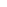 | Joined, 7 × 7 — a triangle pointing in | generated — placeholder |
| `\uFE082` | 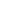 | Left, 7 × 7 — the same triangle, mirrored | generated — placeholder |
| `\uFE083` | 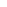 | Death, 7 × 7 — a headstone, because the season answers a death with a grave | generated — placeholder |
| `\uFE084` | 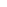 | Advancement, 7 × 7 — a four-point spark, four so it cannot be read as the five-point donor star beside it | generated — placeholder |
| `\uFE085` | 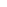 | Server-wide announcement, 7 × 7 — a horn | generated — placeholder |
| `\uFE086` – `\uFE08F` | — | reserved | — |

## `nordtal:board`

**A dedicated font, decided 2026-08-31** — not part of `minecraft:default` as earlier drafts of
this table had it. The objective board and the aura leaderboard
([smp.md](../docs/smp.md#the-boards-and-the-npc)) are per-player Text Display entities whose frame
is glyphs; those glyphs need to tile edge-to-edge the same way `nordtal:bossbar`'s bar segments
do, which means their own negative-advance `space` provider to close the 1px trailing gap every
bitmap glyph gets (Minecraft's font renderer sets a glyph's width at "the last right-most column
of pixels containing any alpha value above 0", plus one — verified against
[minecraft.wiki/w/Font](https://minecraft.wiki/w/Font), 2026-08-31). That mechanic has no business
in the font ordinary chat and nametags render in, so it gets a font of its own instead of
crowding `minecraft:default`. It reuses `nordtal:bossbar`'s own `\uFF001`–`\uFF128` code points for
that space provider — not a collision, since fonts allocate independently (see the note under
`nordtal:bossbar` below).

**It gained the six *positive* advances `\uFFF01`–`\uFFF32` on 2026-09-04, when the frame was
actually built** (`:common`'s `BoardFrame`), and the reason is the one thing about this frame worth
understanding before changing it. A board's content is text in `minecraft:default`, whose
per-character advances live in the client and nowhere in this repository — so **the width of a
rendered line is the one quantity nothing here can compute**. The frame therefore never places
anything *after* the content: a row draws its left edge, walks right to a position derived only
from the configured width, draws the right edge there, and walks back to the content column. That
walk out is what needs positive advances. There is no `+64` or `+128`, because the naming rule puts
the decimal advance in the low digits and `"FFF" + "128"` is six hex digits, past the end of
SPUA-A; wider shifts repeat the `+32`.

The consequence, decided by the owner on 2026-09-04: **the board's width is configuration**
(`smp`'s `config.yml`, `boards[].width`, 32–240 px), and a line that outgrows it draws over the
right-hand edge rather than wrapping. A wrapped line's continuation would carry no frame at all and
would land outside the box, which reads as a bug; an overrun reads as a board that wants to be
wider, and is fixed by editing one number.

**The frame is drawn in the menu panels' own two colours since 2026-09-04**, out of
`generate_gui_panels.py`'s `PALETTE`: the border, the corners and the verticals in `highlight`
(#4E5668), the interior divider in `accent` (#B08A4A). Two things changed there and only one of
them was style. The frame had been drawn **black** - the generator's default, never a decision -
and a board hangs in the world on a Text Display's dark translucent background, so a black frame is
a frame nobody can see; nothing had ever rendered one, so nothing had ever noticed. And the divider
now differs from the border, which is what allocating the two separately was reserved for: the menu
panel spends its one saturated colour on a single line under the title bar and nowhere else, and
the board follows the same rule.

Height 9 / ascent 8, matching the prestige crests above. Every corner and edge line is drawn
**centered** in its 9 px cell (row 4.5, not flush to the top or bottom): that is what lets the same
`edge_h` glyphs serve as both the top and the bottom border of the board, and it is a design
decision this table is making explicit, not an accident of the placeholder art — the alternative
(top-aligned or bottom-aligned lines) would need two separate glyph sets, one for each edge, which
the original allocation never budgeted for.

| Char code | File | Description | Status |
|---|---|---|---|
| `\uFE040` |  | Corner, top left | generated — final candidate |
| `\uFE041` |  | Corner, top right | generated — final candidate |
| `\uFE042` |  | Corner, bottom left | generated — final candidate |
| `\uFE043` |  | Corner, bottom right | generated — final candidate |
| `\uFE044` – `\uFE04B` | `ui/board/edge_h_{1,2,4,8,16,32,64,128}.png` | Horizontal edge, 1 / 2 / 4 / 8 / 16 / 32 / 64 / 128 px | generated — final candidate |
| `\uFE04C` |  | Vertical edge, left | generated — final candidate |
| `\uFE04D` |  | Vertical edge, right | generated — final candidate |
| `\uFE04E` – `\uFE055` | `ui/board/divider_{1,2,4,8,16,32,64,128}.png` | Divider, a horizontal rule inside the board, same eight widths as the outer edge | generated — final candidate |
| `\uFF001` – `\uFF128` | — | Space advances, −1 to −128. Verbatim `nordtal:bossbar`'s block; `ResourcePackTest` fails if the two drift | — |
| `\uFFF01` – `\uFFF32` | — | Space advances, +1 to +32, added 2026-09-04. No +64 or +128 — see above | — |
| `\uFE056` – `\uFE05F` | — | reserved | — |

**The divider grew from one code point to eight on 2026-08-31.** It was originally a single glyph,
but a horizontal rule *inside* the board needs to span the board's width exactly like the outer
edge does, so it needs the same power-of-two tiling — a single glyph only works for one fixed
board width, which nothing here specifies. It is allocated separately from `edge_h` (rather than
reusing it) so the interior rule can look different from the border if the real design wants that;
the current placeholder art draws both identically.

Corners meet the edges at the exact center of the cell (4.5, 4.5): each corner is a single line
bent at that point, one stub reaching toward whichever edge continues from it (e.g. `corner_tl`'s
stub reaches right, toward the top edge, and down, toward the left edge). Placed side by side at
these metrics the whole set forms a seamless rectangle, verified against the generated PNGs.

## `nordtal:bossbar`

Everything in this font is HUD. The vanilla boss bar itself is made invisible by the two overrides
under [vanilla overrides](#vanilla-overrides); the visible bar is composed out of these glyphs.

**None of this font was documented anywhere before 2026-08-31** — not in this README, not in
`Glyphs`, not in the knowledge base. The first four subsections below are what the pack has been
shipping since season 1, written down for the first time. As of the same day's dummy-texture pass,
every code point below has a `nordtal/font/bossbar.json` entry and a `Glyphs` constant — the four
dimension icons, four status icons and sixteen bearing arrows that were `new` are now `generated`,
either placeholder or final-candidate art per their own row.

### `\uFF001` – `\uFF128`, `\uFFF01` – `\uFFF32` — space advances

A `type: space` provider. Negative advances move the cursor back, which is how a composed bar is
drawn on top of itself without a second render pass.

| Char code | Advance | | Char code | Advance |
|---|---|---|---|---|
| `\uFF001` | −1 | | `\uFFF01` | +1 |
| `\uFF002` | −2 | | `\uFFF02` | +2 |
| `\uFF004` | −4 | | ` ` (space) | +3 |
| `\uFF008` | −8 | | `\uFFF04` | +4 |
| `\uFF016` | −16 | | `\uFFF08` | +8 |
| `\uFF032` | −32 | | `\uFFF16` | +16 |
| `\uFF064` | −64 | | `\uFFF32` | +32 |
| `\uFF128` | −128 | | | |

> **These used to be real characters, and are not any more (fixed 2026-09-04).** The positive
> advances sat on `U+FF01`–`U+FF32` — `FULLWIDTH EXCLAMATION MARK`, `FULLWIDTH QUOTATION MARK`,
> `FULLWIDTH DOLLAR SIGN`, `FULLWIDTH LEFT PARENTHESIS`, `FULLWIDTH DIGIT SIX`,
> `FULLWIDTH LATIN CAPITAL LETTER R` — which meant a boss bar line containing any of those six
> characters would have had it silently eaten and replaced by a space. This README recorded it
> rather than fixing it, on the grounds that "moving them is a change to whatever HUD code composes
> the bar, and no such code exists yet". That code has existed since 2026-08-31, which is exactly
> how a *recorded* problem outlives its own excuse. The plane move took them with it, one hex digit
> in front like everything else, and nothing in the HUD had to change because nothing outside
> `Glyphs` ever named them.

### `\uFE000` – `\uFE128`, `\uFE0FF` — bar background segments

Height 14, ascent 6. Each file is pre-rendered at its own named pixel width — not a 1 × 14 source
scaled up (checked against the files on disk, 2026-08-31; an earlier version of this line was
wrong).

**Since 2026-09-05 these compose a pill, not a bar.** A HUD line is one rounded pill per piece of
information — Origin Realms' shape, owner's call — and a pill is `START`, a body of segments, `END`,
sized to what it holds. Two things follow that were not true of the old bar. The body is dark and
**translucent** (about 77 %) with a one-pixel lighter rim, drawn by
[`tools/generate_hud.py`](tools/generate_hud.py). And **every segment is exactly as wide as its
name while the client advances a bitmap glyph by its width plus one**, so two segments butted
together leave a one-pixel gap unless the composer steps back after each — `BossBarWidth` does now,
and the old 182 px bar, which did not, had a seam at every boundary that nothing ever looked at.

| Char code | File | Width |
|---|---|---|
| `\uFE0FF` | `ui/bossbar/bg/start.png` | left cap, 4 px — allocated after `END` had taken `\uFE000` |
| `\uFE000` | `ui/bossbar/bg/end.png` | right cap, 4 px |
| `\uFE001` | `ui/bossbar/bg/1.png` | 1 px |
| `\uFE002` | `ui/bossbar/bg/2.png` | 2 px |
| `\uFE004` | `ui/bossbar/bg/4.png` | 4 px |
| `\uFE008` | `ui/bossbar/bg/8.png` | 8 px |
| `\uFE016` | `ui/bossbar/bg/16.png` | 16 px |
| `\uFE032` | `ui/bossbar/bg/32.png` | 32 px |
| `\uFE064` | `ui/bossbar/bg/64.png` | 64 px |
| `\uFE128` | `ui/bossbar/bg/128.png` | 128 px |

The code points are named after the pixel width in decimal, which is why they are not contiguous.

**The plugins know every advance in this font**, which is what lets them size a pill:
[`tools/export_bossbar_advances.py`](tools/export_bossbar_advances.py) derives the table from
`bossbar.json` and its PNGs the way the client does — a `space` provider's number, or a bitmap's
rightmost drawn column plus two — and writes it to
`common/src/main/resources/nordtal/hud/bossbar-advances.properties`. `BossBarAdvancesTest` derives
it again from the same files and fails `check` if the resource is stale, so **re-run the export
after redrawing anything in this font.**

### ` ` – `~` and above — ASCII override

`nordtal:font/ascii.png`, 128 × 128, height 8, ascent 3. A full replacement grid for printable
ASCII plus box drawing and a few symbols, so HUD text sits on the bar's baseline instead of the
chat baseline.

**This is why the HUD needs no digit glyphs.** `0123456789` are already in this grid at the right
metrics. Both [smp.md](../docs/smp.md) and [hunger-games.md](../docs/hunger-games.md) listed
"digits" as something still to be added; they are not needed. `\uFEF20` – `\uFEF2F` is reserved in
case a larger display set is ever wanted.

### `\uFEF00` – `\uFEF0F` — status icons

Height 10, ascent 4.

| Char code | File | Description | Status |
|---|---|---|---|
| `\uFEF00` |  | Compass, 10 × 10 — redrawn 2026-09-05 with a red needle, in the same style as the eight below | generated — final candidate |
| `\uFEF01` | `ui/bossbar/icons/fblue.png`, 8 × 10 | Land flag, blue — inside a player's preserved area | keep — season 1 |
| `\uFEF02` | `ui/bossbar/icons/fgreen.png`, 8 × 10 | Land flag, green — permanent land, untouched by the reset | keep — season 1 |
| `\uFEF03` | `ui/bossbar/icons/fred.png`, 8 × 10 | Land flag, red — reset zone | keep — season 1 |
| `\uFEF04` | `ui/bossbar/icons/fwhite.png`, 8 × 10 | Land flag, white — server-protected spawn area | keep — season 1 |
| `\uFEF05` |  | Dimension: Nordtal (overworld), 10 × 10 — a mountain with a snow cap | generated — final candidate (2026-09-05) |
| `\uFEF06` |  | Dimension: farm world, 10 × 10 — an ear of wheat | generated — final candidate (2026-09-05) |
| `\uFEF07` |  | Dimension: Nether, 10 × 10 — a flame | generated — final candidate (2026-09-05) |
| `\uFEF08` |  | Dimension: End, 10 × 10 — an ender eye | generated — final candidate (2026-09-05) |
| `\uFEF09` |  | Players alive, 10 × 10 — a heart | generated — final candidate (2026-09-05) |
| `\uFEF0A` |  | Deaths, 10 × 10 — a skull | generated — final candidate (2026-09-05) |
| `\uFEF0B` |  | Loot point, 10 × 10 — a chest | generated — final candidate (2026-09-05) |
| `\uFEF0C` |  | World border, 10 × 10 — a dashed square | generated — final candidate (2026-09-05) |
| `\uFEF0D` – `\uFEF0F` | — | reserved | — |

`fblue`, `fgreen`, `fred` and `fwhite` are **land-status flags**, established 2026-08-31 by decoding
the four PNGs and reading season 1's plugin. The `f` is *flag*, not a boss bar colour: all four are
pixel-identical 8 × 10 sprites of a pennant on a dark-brown pole down the left edge, differing only
in the banner's colour ramp. The earlier note here — that they were coloured bar caps named after
Minecraft's boss bar colours — was a guess, and it was wrong.

What fixes each colour's meaning is `SmpWorldsService#getInfoIconText`, which picked exactly one of
them for the player's current position and paired it with a label:

| Sprite | Season 1 label | Position |
|---|---|---|
| `fwhite` | `Server-protected` | inside the spawn area |
| `fblue` | the area's display name and its owner | inside a player's preserved area |
| `fred` | `Reset zone` | land the farm-world reset clears |
| `fgreen` | `Permanent` | land the reset leaves alone |

`\uFEF00`'s compass was the companion icon naming the world itself — `spawnAreaIcon`,
`preservedAreaIcon` and `resetAreaIcon` all defaulted to it. **Nothing in season 2 draws any of the
five season-1 land-status icons yet**, so the meanings above are recorded rather than in force:
they are what the sprites meant, so that whatever builds the SMP HUD inherits them instead of
re-inventing them. The eight rows above them (`\uFEF05`–`\uFEF0C`) are different: those are drawn now.
They were placeholder pictograms (a disc, a sprout, a flame, a sparkle; a dot, an X, a diamond, a
square) until 2026-09-05, when [`tools/generate_hud.py`](tools/generate_hud.py) replaced them with
10 × 10 pixel art in one style — a dark outline and one leading colour per world, so a glance at
the bar says where you are before the word beside it is read. The pixel maps in that script are
the art; edit them there.

### `\uFEF10` – `\uFEF1F` — bearing arrows

Height 10, ascent 4. Sixteen steps of 22.5°, `\uFEF10` pointing straight ahead and running
clockwise to `\uFEF1F` at 337.5°.

| Char code | File | Bearing | Status |
|---|---|---|---|
| `\uFEF10` | `ui/bossbar/arrows/arrow_000_0.png` | 0° | generated — final candidate |
| `\uFEF11` – `\uFEF1F` | `arrow_022_5.png` … `arrow_337_5.png` | 22.5° … 337.5°, 22.5° steps clockwise | generated — final candidate |

Drawn as sixteen rotations of one arrowhead-and-shaft polygon, rasterized directly from the angle
(`resource-pack/tools/generate_dummy_textures.py`) rather than freehand per step, so all sixteen
agree with each other exactly. Verified clockwise (0° up, 90° right, 180° down) against the
generated PNGs, 2026-08-31.

One set serves all three users: `/navigate`'s arrow to the chosen target
([smp.md](../docs/smp.md#navigate)), the hunger games arrow to the nearest living player, and the
direction to the nearest loot point ([hunger-games.md](../docs/hunger-games.md#the-hud)).

### `\uFEF20` and above

`\uFEF20` – `\uFEF2F` reserved for a large digit set, should the ASCII grid ever prove too small.
Nothing above that is allocated.

## `nordtal:gui`

**The menu panels, and they are drawn out of the inventory's title.** A menu on this server is an
ordinary chest inventory; its title carries a bitmap glyph big enough to cover the whole window,
sitting on a large positive `ascent` so it rises out of the title's baseline and fills the screen
behind the slots. The client renders labels *after* the background, which is the only reason this
works at all — the panel is painted on top of `generic_54.png` rather than instead of it. The
technique, its measurements and the three decisions that follow are in
[`docs/presentation.md`](../docs/presentation.md#2-menu-panels).

**The panel is opaque on purpose.** Making `generic_54.png` transparent is what the polished
servers do, and they can, because on those servers *every* inventory is opened by their own plugin
and brings its own panel. On an SMP whose whole concept is bases and chests that is not true: every
chest in the world would be frameless. So the vanilla background stays, and ours covers it.

### `\uFF001` – `\uFF128` — space advances

The same negative block `nordtal:board` uses, verbatim, and `ResourcePackTest` fails if the two
stop being identical. Composing a title needs exactly two offsets: **−8** to bring the cursor from
the title anchor to the window's left edge, and **−169** (as −128 −32 −8 −1) to walk back from the
panel's 177px advance to where the readable title belongs.

### `\uFF801` – `\uFF928` — positive space advances (2026-09-09)

The same eight steps the other way, at the same decimal-digit code points one bit higher: `+16` is
`\uFF816` beside `−16` at `\uFF016`. Declared in `nordtal:gui` **and in all six row fonts**, so a
row can be composed without leaving the font it is drawn in.

This paragraph said there were deliberately none, and the reasoning was sound for a panel: nothing
in a menu *title* moves right, because the panel is drawn from the left edge and the readable text
walks back behind it. A **row** does. Its plate has to be painted before the label on top of it and
its icon before the name beside it, so a row is composed left to right — and with only negative
advances a canvas can lay things down in one order, right to left, which paints every pill over its
own label.

### `\uFE060` – `\uFE065` — chest panels

| Char code | File | Description | Status |
|---|---|---|---|
| `\uFE060` | `ui/gui/panel_1.png` | 1-row chest panel, 176 × 132 | generated — placeholder |
| `\uFE061` | `ui/gui/panel_2.png` | 2-row chest panel, 176 × 150 | generated — placeholder |
| `\uFE062` | `ui/gui/panel_3.png` | 3-row chest panel, 176 × 168 | generated — placeholder |
| `\uFE063` | `ui/gui/panel_4.png` | 4-row chest panel, 176 × 186 | generated — placeholder |
| `\uFE064` | `ui/gui/panel_5.png` | 5-row chest panel, 176 × 204 | generated — placeholder |
| `\uFE065` | `ui/gui/panel_6.png` | 6-row chest panel, 176 × 222 | generated — placeholder |

### `\uFE066` – `\uFE06A` — the travel panel and its overlays

| Char code | File | Ascent | Description | Status |
|---|---|---|---|---|
| `\uFE066` | 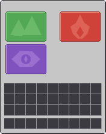 | 13 | The balloon's panel: a 6-row window with no title strip and the four world cards baked in — Nordtal, farm world / Nether, End — each 68 × 50 at x 9 or 99, y 19 or 73, covering slot columns 0–3 and 5–8 of rows 0–2 and 3–5 | generated — final candidate (2026-09-05) |
| `\uFE067` | 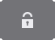 | −6 | Locked: a translucent shade with a padlock, the size of one card, landing on the **upper** row | generated — final candidate |
| `\uFE068` | the same file | −60 | Locked, landing on the **lower** row | — |
| `\uFE069` |  | −6 | "You are here": a 2 px white frame, transparent inside, upper row | generated — final candidate |
| `\uFE06A` | the same file | −60 | The same, lower row | — |

### `\uFE06B` – `\uFE070` — the same six panels without container recesses (2026-09-09)

| Char code | File | Description | Status |
|---|---|---|---|
| `\uFE06B` | `ui/gui/panel_1_plain.png` | 1-row chest panel, no chest-area slot recesses | generated — placeholder |
| `\uFE06C` | `ui/gui/panel_2_plain.png` | 2-row, the same | generated — placeholder |
| `\uFE06D` | `ui/gui/panel_3_plain.png` | 3-row, the same | generated — placeholder |
| `\uFE06E` | `ui/gui/panel_4_plain.png` | 4-row, the same | generated — placeholder |
| `\uFE06F` | `ui/gui/panel_5_plain.png` | 5-row, the same | generated — placeholder |
| `\uFE070` | `ui/gui/panel_6_plain.png` | 6-row, the same — what `/navigate` opens on | generated — placeholder |
| `\uFE071` – `\uFE07F` | — | reserved for this font's growth | — |

A list menu draws a pill across a whole row, and a recess under it shows above it, below it and on
both sides of it. **The player's own three rows and the hotbar keep their recesses in both
variants**, because those slots hold real items whatever the menu above them is.

**The header of all twelve is `F4b`** (owner, 2026-09-08): flat ground to the frame, the readable
title floating on it exactly as it does on the balloon, and one hairline at `y 16` in the pill's own
150-grey. The darker title strip and the gold accent line under it are gone — the strip was inset by
one pixel on every side, which left a margin of ground between it and the window's light edge and is
what made the header read as *floating*. The balloon never had either, so until this change the pack
shipped two header styles and nothing said which was intended.

**One panel and two overlays, not a panel per state.** All four cards are always shown in fixed
places, so the only thing that varies per player is a card's *state* — locked until its milestone
is done, or the world the player is standing in. Each state is one tile-sized glyph, declared once
per tile row with the ascent that lands it there (`13 − y`: a glyph's top sits at the title's
baseline minus its ascent, and the baseline is 13), and the title walks the cursor back to the
card's x before drawing it. `MenuTitle.Canvas` in `:common` is the composer; `MenuTitleTest` reads
these PNGs and `gui.json` back and asserts every overlay lands on the card it names. A fifth menu
in this style is one more panel, its overlays, and a slot map — no Java in `:common` changes.

**Six panels rather than one**, because a chest window is `114 + 18 × rows` pixels tall and a panel
drawn for six rows is 90px too tall for one. All six heights are even, which is what makes "a panel
per size" safe; the hopper (133, odd) is the one container where it would not be, and no menu opens
one.

Drawn by [`tools/generate_gui_panels.py`](tools/generate_gui_panels.py), which is anchored to the
**measurements** rather than to an image: a hand-drawn panel of the same dimensions drops in
without a line of Java changing, and the palette at the top of that script is the whole design
surface. **That palette went light on 2026-09-05** (owner's call, in the manner of Origin Realms):
vanilla's own 198-grey body so the frame and the player inventory beneath read as one window, a
near-black outer line, vanilla's three-pixel corner chamfer so nothing of the texture underneath
peeks out at the corners, and dark slot recesses. The boards deliberately did not follow — they
hang in the world on a Text Display's dark translucent ground — so the two surfaces now share a
shape and not a palette. The slot grid in it was read off the extracted 26.2 `generic_54.png` — with one correction a real client forced on 2026-09-05: the player's rows sit one pixel *higher* than the texture has them, because `ChestScreen` blits the texture's bottom part one row up and the slots follow the client's arithmetic, not the file (see `PLAYER_MAIN_FROM_BOTTOM` in the script) — the drawable cell
starts at **(7, 17)**, not at the (8, 18) every tutorial quotes, which is the item area inside it.
**Re-measure at every version bump:** 1.21.9 moved the villager trading result slot by one pixel.

### `\uFE200` – `\uFE2FF` — menu surfaces (2026-09-09)

Art that spans **more than one chest row**, and therefore cannot be a row glyph: a row font's whole
purpose is one ascent per layer per row, and a card two rows tall has no row. These live in
`nordtal:gui` with an ascent apiece, exactly as the balloon's overlays do — and, exactly as there, a
picture that can land on two different rows is **declared twice**, once per ascent.

Nothing forced a *new* block: fonts allocate independently and `\uFE090` was free in this one. The
numbers in this repository are kept globally distinct so that a code point read in a log or a
screenshot names one thing, and `\uFE080` is the system-line icons in `minecraft:default`.

| Char code | File | Ascent | Description | Status |
|---|---|---|---|---|
| `\uFE200` | 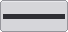 | −24 | An objective card, 68 × 32 — four slot columns and two slot rows, inset 2, with the progress bar's **track** sunk into it at (3, 14). The balloon's card at half the height. Upper card row, top y 37 | generated — placeholder |
| `\uFE201` | the same file | −60 | The same card on the lower card row, top y 73 | — |
| `\uFE202` |  | −24 | The green wash over a finished card. Laid over the bar too, on purpose: a finished objective's bar is full, and washing only its heading would say the card was half settled | generated — placeholder |
| `\uFE203` | the same file | −60 | The same wash, lower card row | — |
| `\uFE204` | 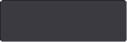 | −4 | The hand-in screen's tray, 162 × 54 — **one** sunken surface over three chest rows, drawn from the slot cell's own corner rather than inset, because it *is* the cells | generated — placeholder |
| `\uFE210` – `\uFE215` | `ui/gui/bar_fill_{1,2,4,8,16,32}.png` | −39 | The progress bar's **fill**, in powers of two, 3px tall. Upper card row | generated — placeholder |
| `\uFE218` – `\uFE21D` | the same six files | −75 | The same six, lower card row | — |
| `\uFE205` – `\uFE20F`, `\uFE216` – `\uFE217`, `\uFE21E` – `\uFE2FF` | — | | reserved for this block's growth | — |

**One tray and a recess per slot are two different statements, and the pack draws both on purpose.**
The hand-in screen is a thing you throw into — the whole area accepts items, and nine drawn cells
would suggest the cell you drop into means something, which it does not. A grave is an inventory you
*take out of*, and there the separate cells are the information: they say these are distinct stacks
and any one of them may be taken. Making the two look the same loses one of the two meanings
whichever way it goes (owner, 2026-09-08). The tray's cost is a ghost square — vanilla's 16 × 16
hover highlight still snaps to the 18px grid the surface is hiding — and that was the call taken with
the drawing in front of it.

**The track is baked in and the fill is six glyphs**, so an empty bar costs nothing at all and any
fill from 0 to 60 pixels is at most four glyphs — 60 is 32 + 16 + 8 + 4. That is the same
power-of-two tiling `nordtal:board`'s edges use, and for the same reason: a glyph has one width, and
a bar does not.

The alternative the design artifact offers — a text bar out of `ProgressBar`'s `████░░` — costs no
code points and is what the objective menu's **heading** row uses, where there is no room for a
painted bar beside the milestone's name and its counter. Both are in the same window on purpose:
the heading is a summary and the cards are the thing itself.

## `nordtal:gui_r0` – `nordtal:gui_r5`

**Six copies of one font, one per chest row.** A glyph's only vertical control is its font's
`ascent`, and a list menu wants the *same* picture — a plate, an icon, a line of text — on any of
the six rows. Carrying the row in the **code point** costs one code point per (picture, row) and is
impossible for text, whose code points are not ours to pick. Carrying it in the **font** costs one
font per row and nothing per picture: `nordtal:gui_r2` is "everything, drawn on chest row 2".

Each file declares exactly the same characters at three ascents, and all three are centred in the
same 18px cell:

| layer | height | top | ascent | what |
|---|---|---|---|---|
| furniture | 14 | `19 + 18r` | `−6 − 18r` | a plate: pill, active frame, button |
| icons | 8 | `22 + 18r` | `−9 − 18r` | an 8 × 8 pictogram, centred in the plate |
| text | 5 | `23 + 18r` | `−10 − 18r` | the five-pixel sheet, centred in the plate |

The one that surprises is the text: five rows centred in fourteen lands at **+4** and not +3, which
is the same "+1" the design artifact's own renderer carries. Getting it wrong puts every line one
pixel high in every list menu at once, which is exactly the kind of wrong that gets lived with.

`ResourcePackTest` asserts the six declare the same set of characters — a character in five of them
renders on five rows and draws a missing-glyph box on the sixth — and `MenuFontTest` in `:common`
asserts each of the eighteen ascents lands where `SlotGeometry` says that row's slot cell is.

### ` ` and `A` – `░` — the five-pixel sheet

`ui/gui/row_text.png`, an 8 × 7 grid of 5 × 5 cells: `A`–`Z`, `0`–`9`,
`. , : / - + % ( ) ! ? ' "`, `Ä Ö Ü ß`, `∙`, and `█` `░` for a text progress bar. A space is a
`space` provider at **+3** rather than a cell, because an empty cell has no rightmost drawn column
and the client would advance it one pixel.

**It is all capitals, and it is not new art — with three named exceptions.** The table is the
owner's design artifact's own `SMALL_SRC`, transcribed character for character (decision 2026-09-08:
*this* sheet, not a sheet in this style). The exceptions are **`0`, `O` and `8`**, redrawn on the
owner's instruction the same day: the artifact drew `0` and `O` with identical pixels and `8` one
pixel from both, which on a font whose whole job is coordinates, distances and `1240/2048` is not a
cosmetic problem.

| glyph | rows | what tells it apart |
|---|---|---|
| `O` | `.#. #.# #.# #.# .#.` | round, tapered top and bottom — the shape every other letter loop on this sheet has (`C G Q`). Unchanged from the artifact |
| `0` | `### #.# #.# #.# ###` | square, flat top and bottom — the shape the other digits have (`1 2 3 5 7`), so a zero reads as a digit rather than as the letter beside it |
| `8` | `### #.# .#. #.# ###` | square and **waisted**: two loops joined in the middle. Three pixels from the zero rather than one, and the waist is visible at 1× |

All three stay three pixels wide, so **every advance in this font is unchanged** and a column of
numbers still lines up — a four-pixel zero would have been easier to draw and would have made
`2048` and `1240` different widths. `MenuFontTest` asserts the three pairwise distances on the PNG
itself, and separately that no *other* two characters draw the same picture, with a named list of
the pairs that do: today that list is `U`/`V`, which the artifact also draws identically and which
the owner did not ask about.

At 8px almost every POI name was cut off on a card; at 5px thirty-eight characters fit
across a window, and five pixels only works without descenders. `:common`'s `MenuFont` folds lower
case onto the capitals on the way in — **except `ß`**, whose upper case is two letters and therefore
not a character — and turns anything the sheet has never heard of into `?`. A POI name is typed by a
player, so that is the ordinary case and not the exotic one; the alternative is the client's
missing-glyph box, which is six pixels wide, is in no table, and would make every position computed
after it wrong.

**The advances travel to the plugins.** `tools/generate_gui_rows.py` writes them to
`common/src/main/resources/nordtal/menu/gui-row-advances.properties`, the same arrangement
`nordtal:bossbar` has and for the same reason: the server composes the row, so the server has to
know how wide a name is. **Re-run that tool after redrawing anything in these fonts** —
`MenuFontTest` derives the table again from the pack and fails the build when the two disagree.

### `\uFE100` – `\uFE106` — row plates

| Char code | File | Size | Description | Status |
|---|---|---|---|---|
| `\uFE100` | 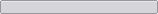 | 158 × 14 | A list entry's plate: the slot area inset 2 on each side, so it covers all nine cells of its row and ends two pixels inside the ninth | generated — placeholder |
| `\uFE101` |  | 158 × 14 | The active marker: a 2px white frame, hollow — the same white `travel_here` uses. Drawn **last** on its row | generated — placeholder |
| `\uFE102` | 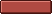 | 52 × 14 | A refusing button plate, three slot cells wide — `/navigate`'s "stop" | generated — placeholder |
| `\uFE103` |  | 14 × 14 | A square button plate, one slot cell inset 2 | generated — placeholder |
| `\uFE104` |  | 14 × 14 | The same, greyed — a page button with no page on the other side of it | generated — placeholder |
| `\uFE105` | 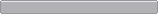 | 158 × 14 | The same plate in a darker grey — a **heading** row rather than an entry. The objective menu's top row names the milestone the cards below belong to, and drawn in the entry grey it reads as a fifth thing to click | generated — placeholder |
| `\uFE106` | 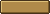 | 50 × 14 | A button plate in the **affirming** style — gold, the brand's own, three slot cells inset 2. The only plate here that is not neutral grey or refusing red, because it is the only button in these menus whose click cannot be undone by clicking again | generated — placeholder |
| `\uFE107` – `\uFE10F` | — | | reserved | — |

### `\uFE110` – `\uFE11A` — row icons

One 88 × 8 sheet, `ui/gui/row_icons.png`, eleven cells. **Drawn white and tinted by the component**,
the same rule the system-line icons follow: the client multiplies a glyph by its component's
colour, so white art can be painted any colour and dark art cannot be painted lighter.

| Char code | Cell | Description | Status |
|---|---|---|---|
| `\uFE110` | 0 | A house — a world's spawn | generated — placeholder |
| `\uFE111` | 1 | A skull — where you last died | generated — placeholder |
| `\uFE112` | 2 | A map pin — a player-made POI | generated — placeholder |
| `\uFE113` | 3 | A cross — stop | generated — placeholder |
| `\uFE114` | 4 | A left arrow — the previous page | generated — placeholder |
| `\uFE115` | 5 | A right arrow — the next page | generated — placeholder |
| `\uFE116` | 6 | A hand — a `HAND_IN` objective, the one kind you can click | generated — placeholder |
| `\uFE117` | 7 | A pickaxe — a `STATISTIC` objective, which counts itself | generated — placeholder |
| `\uFE118` | 8 | A medal — an `ADVANCEMENT` objective, earned somewhere else entirely | generated — placeholder |
| `\uFE119` | 9 | A tick — a finished objective, whichever kind it was | generated — placeholder |
| `\uFE11A` | 10 | An experience orb — the objective menu's share line | generated — placeholder |
| `\uFE11B` – `\uFE1FF` | — | reserved for this block's growth | — |

The four at `\uFE116`–`\uFE119` are one set and never stand beside each other: the icon on an
objective card **is** that objective's state, so exactly one of them is drawn per card.

Drawn by [`tools/generate_gui_rows.py`](tools/generate_gui_rows.py), which also writes the six font
files themselves — they are generated and checked in, like the PNGs, because six files of eight
providers each hand-edited is six chances for one of them to disagree with the other five.

## Vanilla overrides

| file | what it does |
|---|---|
| `minecraft/textures/gui/sprites/boss_bar/white_background.png` | makes the vanilla boss bar frame invisible, so the composed HUD is all that shows |
| `minecraft/textures/gui/sprites/boss_bar/white_progress.png` | likewise, the progress fill |
| `minecraft/lang/en_us.json` | `menu.returnToGame`, `menu.game` (the logo glyph) and `menu.disconnect` |
| `minecraft/lang/de_de.json` | the same three keys in German |

`en_us.json`'s `menu.returnToGame` was fixed in the pack clean-up session (2026-08-31); it no
longer reads "Return to nordtal smp" from season 1, and now reads "Continue playing Nordtal".

`de_de.json` was added 2026-08-31 and is **the one place in season 2 where the player's own client
language decides what they see** — a lang file is a static asset and cannot read `discord_user.locale`
the way everything else does. It is confined to these three cosmetic pause-menu strings for exactly
that reason; see [i18n.md](../docs/i18n.md#the-one-exception--the-resource-packs-lang-files).

## A code point in a language file is a code point

`minecraft/lang/*.json` may name a glyph - `menu.game` draws the logo instead of the word "Game
Menu". That makes a language file a **fourth mirror** of the allocation table below, and it drifted
out of line the moment the pack moved into the Supplementary Private Use Area-A on 2026-09-04: the
logo went to `U+FE021`, `menu.game` kept `\uE021`, and for five days the one screen every player
opens drew a missing-glyph box in both languages. It looks exactly like art nobody has drawn yet,
which is why nobody reported it.

`ResourcePackTest` holds the language files against `minecraft:default` now, and it **parses** them
rather than reading them as text - a JSON file stores `\uE021` as an escape, so a text search for the
character finds nothing and passes on the very file it was written for.

