# resource-pack

The nordtal.eu resource pack: glyphs in the Unicode private use area, HUD sprites, menu panels and a
few vanilla overrides.

**This file owns the code point allocation.** The font files under `src/assets/*/font/`,
[`templates/gui_row.json`](templates/gui_row.json) and `:common`'s `Glyphs` mirror the tables below, so a change goes into all of them in one commit.
`ResourcePackTest` holds them against each other.

A glyph of `minecraft:default` also has a name, written as `<glyph:name>` in a message. The names
are in `common/src/main/resources/eu/nordtal/s2/common/glyph-names.txt`, and `GlyphNamesTest` fails
on a glyph without a name or a name without a glyph.

## Editing the art

Everything runs from IntelliJ's Run menu, folder **resource pack**, on any operating system. You
need Minecraft 26.2.

1. Run **pack: 1. choose Minecraft instance** once and pick the folder holding `options.txt` and
   `resourcepacks`.
2. Edit an image under `src/assets/nordtal/textures` and save it in place.
3. Run **pack: 2. install into Minecraft**. It names every image it cannot use, copies the pack in
   as `nordtal-dev` and enables it if the game is closed; otherwise enable it once under Options >
   Resource Packs.
4. Press **F3+T** in the game.

A server's pack covers every local one. To see yours on the network, an admin chooses **Skip
resource pack** on your row under Users in Steward; from your next login you get no pack, until
**Enforce resource pack** on the same row.

## Building

```bash
./gradlew :resource-pack:packZip
```

writes `resource-pack/build/distributions/nordtal-resource-pack-<version>.zip` and its `.sha1`. The
zip's root is the assembled pack in `build/pack`: [`src/`](src/) plus what the build derives.
`pack_format` is **88** (Minecraft 26.2). `dev pack` points a local stack at a fresh build.

## Hosting

The zip and its hash are attached to each GitHub release, and the proxy offers the pack while the
player waits in `limbo`. The build is reproducible, so a version always has the same hash.

URL and hash are configuration in the proxy's `pack.yml`; both default to empty, and the proxy fails
closed until they are set.

- Use the `github.com/<owner>/<repo>/releases/download/<tag>/<file>` URL, never the signed
  `release-assets.githubusercontent.com` address it redirects to, which expires within the hour.
- `sha1` is only checked to be 40 hex characters. A wrong hash shows in the client as
  `FAILED_DOWNLOAD`.

## What the build derives

Nothing derived from the art is committed.

- `generateRowFonts` writes the six row fonts `nordtal/font/gui_r0.json` to `gui_r5.json` from
  [`templates/gui_row.json`](templates/gui_row.json), row 0, moving each bitmap 18 pixels per row.
  `assemblePack` puts them beside `src/` in `build/pack`, which the zip, `installPack` and the tests
  read.
- `:common` derives the glyph widths the plugins need to compose pills and rows,
  `nordtal/hud/bossbar-advances.properties` and `nordtal/menu/gui-row-advances.properties`, by the
  client's rule. `BossBarAdvancesTest` and `MenuFontTest` derive them again independently.

The tables ship inside the plugin jars, so a changed width reaches a server with the next plugin
rollout, not with the pack alone.

# Code point allocation

A glyph only lines up where its `height` and `ascent` match the surface it is drawn on.

| font                        | file                                                                    | used for                                                                                 | metrics                                                                                             |
| --------------------------- | ----------------------------------------------------------------------- | ---------------------------------------------------------------------------------------- | --------------------------------------------------------------------------------------------------- |
| `minecraft:default`         | [`minecraft/font/default.json`](src/assets/minecraft/font/default.json) | anything rendered as ordinary text: tab list, chat, nametags, Text Display boards        | height 7 / ascent 7, height 9 / ascent 8 for prestige crests, except the logo                       |
| `nordtal:bossbar`           | [`nordtal/font/bossbar.json`](src/assets/nordtal/font/bossbar.json)     | the boss bar HUDs only, with the vanilla bar made invisible                              | height 14 / ascent 6 for bar segments, height 10 / ascent 4 for icons, height 8 / ascent 3 for text |
| `nordtal:board`             | [`nordtal/font/board.json`](src/assets/nordtal/font/board.json)         | the objective board and aura leaderboard's frame only: drawn by `:common`'s `BoardFrame` | height 9 / ascent 8                                                                                 |
| `nordtal:gui`               | [`nordtal/font/gui.json`](src/assets/nordtal/font/gui.json)             | the menu panels, drawn out of a chest inventory's **title**                              | ascent 13, height = the window's own pixel height (132…222)                                         |
| `nordtal:gui_r0` … `gui_r5` | [`templates/gui_row.json`](templates/gui_row.json), generated per row   | everything drawn **on a chest row**: a list entry's plate, its icon, its label           | six copies of one font, one per row; three ascents each (see below)                                 |

The fonts allocate **independently**: `︀1` means something different in `minecraft:default`
and in `nordtal:bossbar`. A component that names no font draws whatever `minecraft:default` holds at
that code point, so every component carrying a `nordtal:` glyph names its font; `BossBarFontTest`
checks the boss bar renderers.

## The plane

Every code point lives in Supplementary Private Use Area A, `U+F0000` to `U+FFFFD`. The basic
plane's `U+E000` to `U+F8FF` is where other glyph plugins auto-assign, and Minecraft's unused
`unifont_pua` provider would draw real glyphs there. `minecraft:default`, `nordtal:board`, `nordtal:gui` and
the row fonts keep their numbers distinct, so a code point in a log names one thing.

Every code point is a surrogate pair in UTF-16. `Glyphs` writes them as `cp(0xFE004)`, the font
files as escaped pairs, and no message bundle carries one (`TabListTest`); a glyph reaches a bundle
as a `{parameter}`.

**Status:** _keep_ is shipping art; _final candidate_ is drawn geometry good enough to ship;
_placeholder_ exists for testing until the real design.

## `minecraft:default`

### `︀0` to `︀F`: player badges

| Char code              | File                                                         | Description                                      | Status                       |
| ---------------------- | ------------------------------------------------------------ | ------------------------------------------------ | ---------------------------- |
| `\uFE000`              |  | Donor star, from the permanent donor role, 7 × 7 | final candidate              |
| `\uFE001`              |                                                              | _(free)_                                         | removed, was the citizen tag |
| `\uFE002`              |                                                              | _(free)_                                         | removed, was the knight tag  |
| `\uFE003`              |                                                              | _(free)_                                         | removed, was the lord tag    |
| `\uFE004`              |             | Admin short tag `A`, 9 × 7                       | keep                         |
| `\uFE005` to `\uFE00F` |                                                              | reserved                                         |                              |

Reusing a freed code point is safe, since nothing persists a glyph character.

### `︁0` to `︁F`: language flags

| Char code              | File                                                           | Description                                      | Status |
| ---------------------- | -------------------------------------------------------------- | ------------------------------------------------ | ------ |
| `\uFE010`              | 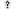         | Other / no language role                         | keep   |
| `\uFE011`              |        | Germany                                          | keep   |
| `\uFE012`              |    | Netherlands                                      | keep   |
| `\uFE013`              |  | United Kingdom                                   | keep   |
| `\uFE014`              |   | United States                                    | keep   |
| `\uFE015` to `\uFE01F` |                                                                | reserved: one per language added to `access.yml` |        |

The flag comes from `discord_user.locale`, so a new language needs a flag here too.

### `︂0` to `︂F`: brand

| Char code              | File                                                   | Description                             | Status |
| ---------------------- | ------------------------------------------------------ | --------------------------------------- | ------ |
| `\uFE020`              |  | Nordtal long logo, height 24, ascent 0  | keep   |
| `\uFE021`              |  | Nordtal long logo, height 32, ascent 25 | keep   |
| `\uFE022` to `\uFE02F` |                                                        | reserved                                |        |

### `︃0` to `︃F`: prestige crests

Thirteen tiers of one coat of arms, derived from `player_playtime.seconds` at render time. Height 9
and ascent 8 fill a text row without touching the lines above and below.

| Char code              | File                                                         | Description                           | Status      |
| ---------------------- | ------------------------------------------------------------ | ------------------------------------- | ----------- |
| `\uFE030`              |  | Prestige crest, tier 1, 9 × 9, h9/a8  | placeholder |
| `\uFE031` to `\uFE03B` | `prestige/crest_02.png` to `crest_12.png`                    | Prestige crest, tiers 2 to 12         | placeholder |
| `\uFE03C`              |  | Prestige crest, tier 13, 9 × 9, h9/a8 | placeholder |
| `\uFE03D` to `\uFE03F` |                                                              | reserved                              |             |

### `︈0` to `︈F`: system-line icons

The markers in front of chat, join, leave, death, advancement and announcement lines. **The art is
white**, because the client multiplies a glyph by its text colour and the colours are configurable.

| Char code              | File                                                          | Description                                                                                              | Status          |
| ---------------------- | ------------------------------------------------------------- | -------------------------------------------------------------------------------------------------------- | --------------- |
| `\uFE080`              |    | Chat separator, 3 × 7, h7/a7: a hairline rule, not a character                                           | final candidate |
| `\uFE081`              | 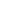        | Joined, 7 × 7: a triangle pointing in                                                                    | placeholder     |
| `\uFE082`              | 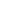       | Left, 7 × 7: the same triangle, mirrored                                                                 | placeholder     |
| `\uFE083`              | 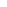       | Death, 7 × 7: a headstone, because the season answers a death with a grave                               | placeholder     |
| `\uFE084`              | 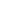 | Advancement, 7 × 7: a four-point spark, four so it cannot be read as the five-point donor star beside it | placeholder     |
| `\uFE085`              | 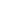    | Server-wide announcement, 7 × 7: a horn                                                                  | placeholder     |
| `\uFE086` to `\uFE08F` |                                                               | reserved                                                                                                 |                 |

## `nordtal:board`

The frame of the objective board and the aura leaderboard, which are Text Display entities. Height
9, ascent 8; every line is centred in its cell, so the same edges serve as top and bottom.

The frame never draws after the content, because the client alone knows how wide a text line is. A
row draws its left edge, walks right by the configured width (`boards[].width` in `smp`'s
`config.yml`, 32 to 240 px), draws the right edge, and walks back. A line longer than that overdraws
the edge. The frame uses the menu panels' `highlight` and `accent` colours, since it hangs on a dark
background.

| Char code              | File                                                          | Description                                                                      | Status          |
| ---------------------- | ------------------------------------------------------------- | -------------------------------------------------------------------------------- | --------------- |
| `\uFE040`              |  | Corner, top left                                                                 | final candidate |
| `\uFE041`              |  | Corner, top right                                                                | final candidate |
| `\uFE042`              |  | Corner, bottom left                                                              | final candidate |
| `\uFE043`              |  | Corner, bottom right                                                             | final candidate |
| `\uFE044` to `\uFE04B` | `ui/board/edge_h_{1,2,4,8,16,32,64,128}.png`                  | Horizontal edge, 1 / 2 / 4 / 8 / 16 / 32 / 64 / 128 px                           | final candidate |
| `\uFE04C`              |   | Vertical edge, left                                                              | final candidate |
| `\uFE04D`              |   | Vertical edge, right                                                             | final candidate |
| `\uFE04E` to `\uFE055` | `ui/board/divider_{1,2,4,8,16,32,64,128}.png`                 | Divider, a horizontal rule inside the board, same eight widths as the outer edge | final candidate |
| `\uFF001` to `\uFF128` |                                                               | Space advances, −1 to −128, as in `nordtal:bossbar`                              |                 |
| `\uFFF01` to `\uFFF32` |                                                               | Space advances, +1 to +32                                                        |                 |
| `\uFE056` to `\uFE05F` |                                                               | reserved                                                                         |                 |

The divider is separate from `edge_h` so the inner rule can look different from the border.

## `nordtal:bossbar`

HUD only. The vanilla boss bar is made invisible by the [vanilla overrides](#vanilla-overrides) and
the visible bar is composed from these glyphs.

### `＀1` to `２8`, `￰1` to `￳2`: space advances

A `space` provider; negative advances let a line draw over itself. The code point's low digits are
the advance in decimal, so there is no +64 or +128: `FFF128` would leave the plane.

| Char code | Advance |     | Char code   | Advance |
| --------- | ------- | --- | ----------- | ------- |
| `\uFF001` | −1      |     | `\uFFF01`   | +1      |
| `\uFF002` | −2      |     | `\uFFF02`   | +2      |
| `\uFF004` | −4      |     | ` ` (space) | +3      |
| `\uFF008` | −8      |     | `\uFFF04`   | +4      |
| `\uFF016` | −16     |     | `\uFFF08`   | +8      |
| `\uFF032` | −32     |     | `\uFFF16`   | +16     |
| `\uFF064` | −64     |     | `\uFFF32`   | +32     |
| `\uFF128` | −128    |     |             |         |

Never allocate an advance onto an assigned character: the client would replace it.

### `︀0` to `︒8`, `️F`: bar background segments

Height 14, ascent 6. A HUD line is one rounded pill per piece of information: `START`, a body of
segments, `END`. The body is translucent with a lighter rim. The client advances a bitmap glyph by its width
plus one, so `BossBarWidth` steps back after each segment.

| Char code | File                      | Width           |
| --------- | ------------------------- | --------------- |
| `\uFE0FF` | `ui/bossbar/bg/start.png` | left cap, 4 px  |
| `\uFE000` | `ui/bossbar/bg/end.png`   | right cap, 4 px |
| `\uFE001` | `ui/bossbar/bg/1.png`     | 1 px            |
| `\uFE002` | `ui/bossbar/bg/2.png`     | 2 px            |
| `\uFE004` | `ui/bossbar/bg/4.png`     | 4 px            |
| `\uFE008` | `ui/bossbar/bg/8.png`     | 8 px            |
| `\uFE016` | `ui/bossbar/bg/16.png`    | 16 px           |
| `\uFE032` | `ui/bossbar/bg/32.png`    | 32 px           |
| `\uFE064` | `ui/bossbar/bg/64.png`    | 64 px           |
| `\uFE128` | `ui/bossbar/bg/128.png`   | 128 px          |

The code points are named after the width in decimal. The build derives every advance in this font
the way the client does, for the plugins.

### ASCII override

`nordtal:font/ascii.png`, 128 × 128, height 8, ascent 3: printable ASCII, box drawing and a few
symbols on the bar's baseline. It carries the digits, so the HUD needs no digit glyphs.

### `ﻰ0` to `ﻰF`: status icons

Height 10, ascent 4.

| Char code              | File                                                                      | Description                                                          | Status          |
| ---------------------- | ------------------------------------------------------------------------- | -------------------------------------------------------------------- | --------------- |
| `\uFEF00`              |        | Compass, 10 × 10: a red needle, in the same style as the eight below | final candidate |
| `\uFEF01`              | `ui/bossbar/icons/fblue.png`, 8 × 10                                      | Land flag, blue: inside a player's preserved area                    | keep, season 1  |
| `\uFEF02`              | `ui/bossbar/icons/fgreen.png`, 8 × 10                                     | Land flag, green: permanent land, untouched by the reset             | keep, season 1  |
| `\uFEF03`              | `ui/bossbar/icons/fred.png`, 8 × 10                                       | Land flag, red: reset zone                                           | keep, season 1  |
| `\uFEF04`              | `ui/bossbar/icons/fwhite.png`, 8 × 10                                     | Land flag, white: server-protected spawn area                        | keep, season 1  |
| `\uFEF05`              | 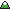 | Dimension: Nordtal (overworld), 10 × 10: a mountain with a snow cap  | final candidate |
| `\uFEF06`              |                                                                           | _free_, was the farm world icon                                      |                 |
| `\uFEF07`              |     | Dimension: Nether, 10 × 10: a flame                                  | final candidate |
| `\uFEF08`              |        | Dimension: End, 10 × 10: an ender eye                                | final candidate |
| `\uFEF09`              |   | Players alive, 10 × 10: a heart                                      | final candidate |
| `\uFEF0A`              |  | Deaths, 10 × 10: a skull                                             | final candidate |
| `\uFEF0B`              | 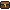   | Loot point, 10 × 10: a chest                                         | final candidate |
| `\uFEF0C`              | 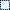 | World border, 10 × 10: a dashed square                               | final candidate |
| `\uFEF0D` to `\uFEF0F` |                                                                           | reserved                                                             |                 |

The `f` sprites are land-status flags, identical but for the banner colour. Season 2 draws none of
them yet; their season 1 meaning was:

| Sprite   | Season 1 label                        | Position                         |
| -------- | ------------------------------------- | -------------------------------- |
| `fwhite` | `Server-protected`                    | inside the spawn area            |
| `fblue`  | the area's display name and its owner | inside a player's preserved area |
| `fgreen` | `Permanent`                           | land the reset leaves alone      |

### `ﻱ0` to `ﻱF`: bearing arrows

Height 10, ascent 4. Sixteen clockwise steps of 22.5°, rasterized from the angle so they agree
exactly. They serve `/navigate`, the hunger games' nearest player and the nearest loot point.

| Char code              | File                                  | Bearing                               | Status          |
| ---------------------- | ------------------------------------- | ------------------------------------- | --------------- |
| `\uFEF10`              | `ui/bossbar/arrows/arrow_000_0.png`   | 0°                                    | final candidate |
| `\uFEF11` to `\uFEF1F` | `arrow_022_5.png` … `arrow_337_5.png` | 22.5° … 337.5°, 22.5° steps clockwise | final candidate |

### `ﻲ0` and above

`ﻲ0` to `ﻲF` are reserved for a larger digit set. Nothing above is allocated.

## `nordtal:gui`

**Menu panels, drawn from the inventory title.** A menu is a chest inventory whose title carries a
bitmap as large as the window on a high `ascent`; labels render after the background, so the panel
covers `generic_54.png`. The panel is opaque because the vanilla background has to stay for every
ordinary chest.

### `＀1` to `２8`: space advances

The same negative block as `nordtal:board` (`ResourcePackTest` keeps them identical). A title needs
**−8** to reach the window's left edge and **−169** (−128 −32 −8 −1) to walk back from the panel's
177 px advance.

### `ﾀ1` to `ﾒ8`: positive space advances

The same steps positive, one bit higher: `+16` is `ﾁ6`. Declared here and in all six row fonts,
since a row is composed left to right.

### `︆0` to `︆5`: chest panels

| Char code | File                 | Description                  | Status      |
| --------- | -------------------- | ---------------------------- | ----------- |
| `\uFE060` | `ui/gui/panel_1.png` | 1-row chest panel, 176 × 132 | placeholder |
| `\uFE061` | `ui/gui/panel_2.png` | 2-row chest panel, 176 × 150 | placeholder |
| `\uFE062` | `ui/gui/panel_3.png` | 3-row chest panel, 176 × 168 | placeholder |
| `\uFE063` | `ui/gui/panel_4.png` | 4-row chest panel, 176 × 186 | placeholder |
| `\uFE064` | `ui/gui/panel_5.png` | 5-row chest panel, 176 × 204 | placeholder |
| `\uFE065` | `ui/gui/panel_6.png` | 6-row chest panel, 176 × 222 | placeholder |

### `︆6` to `︆A`: the travel panel and its overlays

| Char code | File                                                            | Ascent | Description                                                                                                                           | Status          |
| --------- | --------------------------------------------------------------- | ------ | ------------------------------------------------------------------------------------------------------------------------------------- | --------------- |
| `\uFE066` | 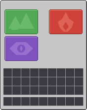        | 13     | The balloon's panel: a 6-row window with the three world cards (Nordtal, Nether, End) baked in, each 68 × 50 at x 9 or 99, y 19 or 73 | final candidate |
| `\uFE067` | 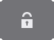 | −6     | Locked: a translucent shade with a padlock, the size of one card, landing on the **upper** row                                        | final candidate |
| `\uFE068` | the same file                                                   | −60    | Locked, landing on the **lower** row                                                                                                  |                 |
| `\uFE069` |    | −6     | "You are here": a 2 px white frame, transparent inside, upper row                                                                     | final candidate |
| `\uFE06A` | the same file                                                   | −60    | The same, lower row                                                                                                                   |                 |

### `︆B` to `︇0`: the same six panels without container recesses

| Char code              | File                       | Description                                    | Status      |
| ---------------------- | -------------------------- | ---------------------------------------------- | ----------- |
| `\uFE06B`              | `ui/gui/panel_1_plain.png` | 1-row chest panel, no chest-area slot recesses | placeholder |
| `\uFE06C`              | `ui/gui/panel_2_plain.png` | 2-row, the same                                | placeholder |
| `\uFE06D`              | `ui/gui/panel_3_plain.png` | 3-row, the same                                | placeholder |
| `\uFE06E`              | `ui/gui/panel_4_plain.png` | 4-row, the same                                | placeholder |
| `\uFE06F`              | `ui/gui/panel_5_plain.png` | 5-row, the same                                | placeholder |
| `\uFE070`              | `ui/gui/panel_6_plain.png` | 6-row, the same: what `/navigate` opens on     | placeholder |
| `\uFE071` to `\uFE07F` |                            | reserved for this font's growth                |             |

A list menu draws a pill across a row, which a recess would show around. The player's inventory
keeps its recesses in both variants. All twelve panels share one header: flat ground and one
hairline at `y 16`.

**One panel and overlays, not a panel per state.** Each card state is a card-sized glyph declared
once per card row with the ascent that lands it there (`13 − y`); the title walks back to the card's
x before drawing it. `MenuTitle.Canvas` in `:common` composes it and `MenuTitleTest` checks every
overlay lands on its card.

A chest window is `114 + 18 × rows` pixels tall, hence six panels. A hand-drawn panel of the same
size drops in without Java changes. The drawable cell starts at **(7, 17)**, not (8, 18), because
`ChestScreen` draws the player rows one pixel higher than the texture. Re-measure at every version
bump.

### `︠0` to `︯F`: menu surfaces

Art spanning more than one chest row, so it cannot be a row glyph. Art that can land on two rows is
declared twice, once per ascent.

| Char code                                                              | File                                                                  | Ascent | Description                                                                                                 | Status      |
| ---------------------------------------------------------------------- | --------------------------------------------------------------------- | ------ | ----------------------------------------------------------------------------------------------------------- | ----------- |
| `\uFE200`                                                              | 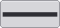      | −24    | An objective card, 68 × 32, with the progress bar's **track** at (3, 14). Upper card row, top y 37          | placeholder |
| `\uFE201`                                                              | the same file                                                         | −60    | The same card on the lower card row, top y 73                                                               |             |
| `\uFE202`                                                              |  | −24    | The green wash over a finished card, bar included                                                           | placeholder |
| `\uFE203`                                                              | the same file                                                         | −60    | The same wash, lower card row                                                                               |             |
| `\uFE204`                                                              | 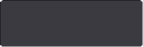         | −4     | The hand-in screen's tray, 162 × 54: **one** sunken surface over three chest rows                           | placeholder |
| `\uFE205` to `\uFE209`                                                 | `ui/gui/grave_slab_{1..5}.png`                                        | −4     | The grave's slab: a recess **per slot**, one glyph per row count; five is the most a grave needs            | placeholder |
| `\uFE210` to `\uFE215`                                                 | `ui/gui/bar_fill_{1,2,4,8,16,32}.png`                                 | −39    | The progress bar's **fill**, in powers of two, 3px tall. Upper card row                                     | placeholder |
| `\uFE218` to `\uFE21D`                                                 | the same six files                                                    | −75    | The same six, lower card row                                                                                |             |
| `\uFE20A`                                                              | 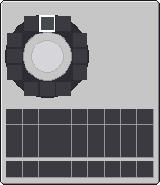          | 13     | The wheel's panel, 176 × 204: a band round twelve prize cells, a hub, and a white frame on the winning cell | placeholder |
| `\uFE20B` to `\uFE20F`, `\uFE216` to `\uFE217`, `\uFE21E` to `\uFE2FF` |                                                                       |        | reserved for this block's growth                                                                            |             |

The wheel sits two columns left of centre to free columns 5 to 8 for its button and text. The hand-in
tray is one surface because any cell accepts items; the grave draws a recess per slot because each
stack is taken separately. The bar's track is baked into the card and the fill is at most four
power-of-two glyphs.

## `nordtal:gui_r0` to `nordtal:gui_r5`

**Six copies of one font, one per chest row.** A font's `ascent` is a glyph's only vertical control,
and text code points are not ours to pick, so the row lives in the font: `nordtal:gui_r2` draws
everything on chest row 2. Each file declares the same characters at three ascents, centred in the
18 px cell:

| layer     | height | top        | ascent      | what                                       |
| --------- | ------ | ---------- | ----------- | ------------------------------------------ |
| furniture | 14     | `19 + 18r` | `−6 − 18r`  | a plate: pill, active frame, button        |
| icons     | 8      | `22 + 18r` | `−9 − 18r`  | an 8 × 8 pictogram, centred in the plate   |
| text      | 5      | `23 + 18r` | `−10 − 18r` | the five-pixel sheet, centred in the plate |

Text lands at **+4**, not +3. `ResourcePackTest` checks the six declare the same characters, and
`MenuFontTest` checks each ascent against `SlotGeometry`.

### The five-pixel sheet

`ui/gui/row_text.png`, an 8 × 7 grid of 5 × 5 cells: `A` to `Z`, `0` to `9`,
`. , : / - + % ( ) ! ? ' "`, `Ä Ö Ü ß`, `∙`, and `█` `░` for a text bar. A space is a `space`
provider at **+3**, since an empty cell would advance one pixel.

It is all capitals: `:common`'s `MenuFont` folds lower case onto them (except `ß`) and maps unknown
characters to `?`, because a missing-glyph box is six pixels wide and would shift everything after
it. `0`, `O` and `8` are drawn apart:

| glyph | rows                  | what tells it apart                                                                                                                        |
| ----- | --------------------- | ------------------------------------------------------------------------------------------------------------------------------------------ |
| `O`   | `.#. #.# #.# #.# .#.` | round, tapered top and bottom: the shape every other letter loop on this sheet has (`C G Q`)                                               |
| `0`   | `### #.# #.# #.# ###` | square, flat top and bottom: the shape the other digits have (`1 2 3 5 7`), so a zero reads as a digit rather than as the letter beside it |
| `8`   | `### #.# .#. #.# ###` | square and **waisted**: two loops joined in the middle. Three pixels from the zero rather than one, and the waist is visible at 1×         |

All three stay three pixels wide, so columns of numbers line up. `MenuFontTest` checks their
distances and that no other two characters match, except the listed `U`/`V`.

The build generates the six font files from the template and the advances into
`gui-row-advances.properties`.

### `︐0` to `︐7`: row plates

| Char code              | File                                                                   | Size     | Description                                                                             | Status      |
| ---------------------- | ---------------------------------------------------------------------- | -------- | --------------------------------------------------------------------------------------- | ----------- |
| `\uFE100`              | 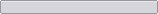             | 158 × 14 | A list entry's plate, covering all nine cells of its row, inset 2                       | placeholder |
| `\uFE101`              |             | 158 × 14 | The active marker: a hollow 2 px white frame, drawn **last** on its row                 | placeholder |
| `\uFE102`              | 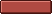      | 52 × 14  | A refusing button plate, three cells wide: `/navigate`'s "stop"                         | placeholder |
| `\uFE103`              |      | 14 × 14  | A square button plate, one slot cell inset 2                                            | placeholder |
| `\uFE104`              |  | 14 × 14  | The same, greyed: a page button with no page behind it                                  | placeholder |
| `\uFE105`              | 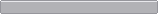        | 158 × 14 | The plate in a darker grey, for a **heading** row                                       | placeholder |
| `\uFE106`              | 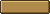   | 50 × 14  | An **affirming** gold button plate, three cells wide, for a click that cannot be undone | placeholder |
| `\uFE107`              | 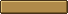      | 68 × 14  | The same, four cells wide: the grave's "take everything"                                | placeholder |
| `\uFE108` to `\uFE10F` |                                                                        |          | reserved                                                                                |             |

### `︑0` to `︑A`: row icons

One 88 × 8 sheet, `ui/gui/row_icons.png`, drawn white and tinted by the component.

| Char code              | Cell | Description                                                         | Status      |
| ---------------------- | ---- | ------------------------------------------------------------------- | ----------- |
| `\uFE110`              | 0    | A house: a world's spawn                                            | placeholder |
| `\uFE111`              | 1    | A skull: where you last died                                        | placeholder |
| `\uFE112`              | 2    | A map pin: a player-made POI                                        | placeholder |
| `\uFE113`              | 3    | A cross: stop                                                       | placeholder |
| `\uFE114`              | 4    | A left arrow: the previous page                                     | placeholder |
| `\uFE115`              | 5    | A right arrow: the next page                                        | placeholder |
| `\uFE116`              | 6    | A hand: a `HAND_IN` objective, the one kind you can click           | placeholder |
| `\uFE117`              | 7    | A pickaxe: a `STATISTIC` objective, which counts itself             | placeholder |
| `\uFE118`              | 8    | A medal: an `ADVANCEMENT` objective, earned somewhere else entirely | placeholder |
| `\uFE119`              | 9    | A tick: a finished objective, whichever kind it was                 | placeholder |
| `\uFE11A`              | 10   | An experience orb: the objective menu's share line                  | placeholder |
| `\uFE11B` to `\uFE1FF` |      | reserved for this block's growth                                    |             |

`︑6` to `︑9` are an objective's state, so exactly one is drawn per card.

## Vanilla overrides

| file                                                           | what it does                                                                      |
| -------------------------------------------------------------- | --------------------------------------------------------------------------------- |
| `minecraft/textures/gui/sprites/boss_bar/white_background.png` | makes the vanilla boss bar frame invisible, so the composed HUD is all that shows |
| `minecraft/textures/gui/sprites/boss_bar/white_progress.png`   | likewise, the progress fill                                                       |
| `minecraft/lang/en_us.json`                                    | `menu.returnToGame`, `menu.game` (the logo glyph) and `menu.disconnect`           |
| `minecraft/lang/de_de.json`                                    | the same three keys in German                                                     |

`de_de.json` is the one place where the client's language decides what a player sees, since a lang
file cannot read `discord_user.locale`; it is limited to these three pause-menu strings.

## A code point in a language file is a code point

`minecraft/lang/*.json` may name a glyph (`menu.game` draws the logo), which makes it another mirror
of these tables. `ResourcePackTest` parses those files against `minecraft:default`; a text search
would miss the `\u` escapes.
