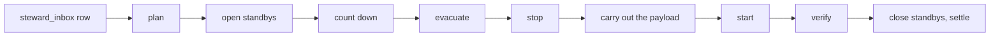

# steward-agent

The one door to Docker and to the volumes, and the process that carries out every run. It holds the
Docker socket and carries `compose.yml` inside its own image, so a change to the deployment is a new
image of this service. The same image is the `migrate` service, the only process that runs Flyway's
`migrate`: it creates every role, applies the schema and exits, and every service with a database
login waits for it. `steward` mounts no socket and reaches all of it through `:internal-api`'s
`AgentClient`; `:architecture` refuses `java.net.UnixDomainSocketAddress` anywhere else.

```bash
steward-agent up                          # the setup script: pull, then up, wait, exit with the code
steward-agent serve                       # the API, then runs (default in the container)
steward-agent migrate                     # the migrate service: roles, schema, exit code
steward-agent run ID                      # the one-shot: the run handed to it, then exit
steward-agent request KIND [a,b] [MIN]    # ask for a run, as a button would; prints its id
steward-agent status ID                   # the run's status, a tab and its report
```

`serve` serves the API, installs whatever slot is empty, reports ready and then claims runs from
`steward_inbox`; the Minecraft services wait for it to be healthy. The host reaches `request` and
`status` through `docker exec <project>-steward-agent-1`, writing and reading the row a button does.

## What it will not do

- **Recreate itself.** `steward-agent` is refused wherever a service name is accepted; a one-shot renews it.
- **Run another release.** An update to a newer release goes to a one-shot at that release.
- **Pull dependencies along.** Every `up` carries `--no-deps`.
- **Schedule.** A run starts only from a row in `steward_inbox`: a button, `/update`, a clock in
  steward or `steward-agent request`. The sampler is the one thing on its own clock, and it only reads.
- **Hand out secrets.** Nothing on the wire carries a container's environment or the env file.

## Runs



Every kind is this one sequence, `Run`; `Kinds` holds one planner per kind, and a plan that stops
nothing counts nobody down. The payload is the request's, typed in `StewardRequest`.

| kind            | payload                                                                                                                                                                       |
| --------------- | ----------------------------------------------------------------------------------------------------------------------------------------------------------------------------- |
| `UPDATE`        | resolve what is newer, stage it, migrate, move the jars, recreate moved images, prune unused ones                                                                             |
| `RESTART`       | restart the named services, install nothing                                                                                                                                   |
| `BACKUP`        | refused when the disk lacks room, else dump and tar the backup set, then copy the newest archives offsite                                                                     |
| `DOWN`, `START` | stop a service and hold it down, release a hold                                                                                                                               |
| `RECREATE`      | make the named containers again from the images on this host; `DEPLOY` pulls first                                                                                            |
| `RESTORE`       | put one archive back after a fresh backup; a dump replaces `public` in one transaction, then `migrate` runs; a volume that fails once emptied keeps its servers down and held |
| `REMOVE_PLUGIN` | stop one server, delete the plugin's jar and data folder, start it                                                                                                            |

Caddy, pack-host and postgres are made again only once the rest is back, in a run that counts down.
A run's report is messages of the admin bundle (`report.*` in `:database`'s `ReportTexts`): every note,
line detail and change but an installed version's is a message reference with typed values, which
Steward's page and the bot's update feed render for their reader, and `status ID` prints in English.
What a subsystem answered (a Docker or `pg_dump` error, a source's answer) is a value of the message
that names it, or `report.words`.

### Another release

`serve` carries out runs of its own release. An update to a newer release, or one that finds the
agent's own container out of date, goes to a one-shot:

1. `serve` writes `<project>-steward-agent-run` into the row's `runner` column; the row stays
   `RUNNING` and is the lock.
2. It pulls `steward-agent` at that release, copies that image's `compose.yml` out and starts the
   one-shot from it with `compose run --rm`.
3. The one-shot (`steward-agent run ID`) plans again, counts down, stops what changes, runs `migrate`,
   installs, starts and verifies.
4. Last it makes the long-running agent again at its release, waits for it to be healthy and settles the row.

From the hand-over until the row is settled the agent is up but paused: it serves state, logs, the
console and the plan, and claims no request. A row whose one-shot is gone without settling it is
failed at the next wake-up. An older release is refused. The one-shot copies its output into
`steward-backups/runs/<id>.log` (the newest ten stay); archive listing and retention read only the
files directly in the backups.

## Where a version comes from

| what                                                 | source                                                                                                                |
| ---------------------------------------------------- | --------------------------------------------------------------------------------------------------------------------- |
| the season-2 jars, the resource pack and its `.sha1` | GitHub releases, `nordtal/season-2`, through `/releases/latest`; a jar is checked against its asset's sha256 `digest` |
| PacketEvents                                         | Modrinth v2, filtered to the Minecraft version and `paper`                                                            |
| Paper, Velocity                                      | PaperMC Fill v3, newest `STABLE` build                                                                                |
| what is installed                                    | the volumes under `volumes-root`                                                                                      |
| what pack the proxy offers                           | the proxy's `pack` settings, `url` and `sha1`                                                                         |

## Rules

- `serve` acts only on rows in its inbox and never migrates. Its one other job is item icons: with
  `mojang-assets` on and a server exporting a Minecraft version without icons, it fetches that
  client jar, checks its sha1, draws every item at 32 pixels into one sheet in `game_assets` and
  deletes the jar. Nothing of Mojang's is kept.
- An update stops the services whose jars or containers change, runs `migrate`, installs, starts
  them and waits for healthy. `bootstrap` fills empty slots and restarts nothing. A report writes nothing.
- Two steward processes cannot serve or move jars at once (advisory locks).
- Artefacts are staged in `.nordtal-staging` inside the server's volume and move only when all are
  present; nothing it does not account for is deleted, and only after the new jar is in place.
- Every file a run moves into place is noted in `plugin_file` with the agent's release, which is how
  Steward's plugins tab names the release that installed a jar.
- A version not tagged for the platform is refused. "Skipped" is distinct from success and failure.
- A deployment pulls every image before it stops anything; a failed pull is tolerated only when the
  image is already on the host.

## The contract

`AgentWire` holds the paths and records and `AgentClient` the client, both in `:internal-api`.
`{service}` is a compose service name.

| Route                                             | Answer                                                                                 |
| ------------------------------------------------- | -------------------------------------------------------------------------------------- |
| `GET /api/health`                                 | the only route without the token                                                       |
| `GET /api/topology`                               | `Topology`: every service in the baked file, its image and its labels' meaning         |
| `GET /api/containers`                             | `Containers`: every container of the project with the sampler's last `Reading`         |
| `GET /api/containers/{service}`                   | one `Container`, with the registry digests of its image; `404` when there is none      |
| `GET /api/images`                                 | `ImageResult`: each running image against its registry, slow on purpose                |
| `GET /api/containers/{service}/logs`              | SSE: `line` and `run` events, the backlog first; `end` or `gone` when it stops         |
| `GET /api/containers/{service}/log-capacity?max=` | `LogCapacity`: how many lines the backlog can fill                                     |
| `POST /api/containers/{service}/console`          | `ConsoleLine` (`command`, `actor`); `202`, the answer lands in the log                 |
| `GET /api/host`                                   | `Host`: `/proc`, the root filesystem and Docker's disk use                             |
| `GET /api/volumes/{service}/disk`                 | `Disk`: `du` of that service's volume; `404` for one not mounted here                  |
| `GET /api/bundles`                                | `BundleRef`s: every message bundle a jar carries, before it is opened                  |
| `GET /api/bundles/{service}?module=`              | one `MessageBundle`, the packaged texts                                                |
| `GET /api/descriptors`                            | `Descriptor`s: what each jar of ours says of itself, one per id                        |
| `GET /api/samples?after=`                         | the sampler's `Round`s after an ISO instant, oldest first                              |
| `GET /api/backups`                                | `Archive`s, newest first                                                               |
| `GET /api/backups/{name}`                         | one finished archive's bytes; `400` for a name that is not one, `404` when it is gone  |
| `GET /api/plan`                                   | what the next update would change, resolved now; changes nothing                       |
| `GET /api/plugins/{service}`                      | the managed plugins of one server                                                      |
| `GET /api/plugins/{service}/search?q=`            | Modrinth's answer for that server's platform                                           |
| `POST /api/plugins/{service}?by=`                 | adds a plugin to the list the next run installs; removing one is a `REMOVE_PLUGIN` run |

Every route but `/api/health` needs `X-Steward-Token`, and the service refuses to start without it;
the gate is `:internal-api`'s, shared with `steward-bunq`. A refusal is a `Refusal` (`error`, the
sentence to show, `where`): `502` with `docker` or `compose` when the daemon or a Compose command
failed, `400` with `steward-agent` for a request it will not run. `steward` passes `where` through.

A descriptor is the `nordtal-plugin.json` the `nordtal.plugin-descriptor` convention writes into every
jar of ours: the id its settings are published under, the name and logo for Steward's sidebar and
the custom editor per group. A plugin's jar is found beside its data under `/configs/<service>`.

**Networks.** `steward` reaches the agent on the internal `agent` network. The agent reaches postgres
on `agent-database` and GitHub, Modrinth and PaperMC through `agent-egress`, which nobody else is on.

**Console.** The set is the label `eu.nordtal.console: "true"`, read through `docker compose config`.
A line goes to `mc` as one argument, never through a shell, and the log names who typed it by the
`Actor` the wire carries. An added plugin's row holds the same actor as `actor_kind` and `actor_id`,
taken from the session and never from the browser.

**Backup set and stop set.** The agent's own mounts under `/backup-sources` and the label
`eu.nordtal.backup: stop`; `/api/topology` serves both, and steward keeps no list of either.

**Labels** drive the servers and the network page, and nothing in Java or TypeScript mirrors them:

| label                   | on                               | says                                                                         |
| ----------------------- | -------------------------------- | ---------------------------------------------------------------------------- |
| `eu.nordtal.server`     | the four Minecraft servers       | `paper` or `velocity`; the service has a plugins folder                      |
| `eu.nordtal.plugins`    | the same                         | `artifact[=jar prefix][?]` per plugin, `?` where it may be missing           |
| `eu.nordtal.standby-of` | `proxy-standby`, `limbo-standby` | the service it stands in for, whose `plugins/` it gets a copy of             |
| `eu.nordtal.renew`      | every service a run makes again  | `run` (stopped, renewed, started), `after` (once the rest is back) or `last` |
| `eu.nordtal.section`    | every service Steward draws      | the heading the network page groups it under; without it, it is not drawn    |
| `eu.nordtal.entry`      | `proxy`, `caddy`                 | `true`: players reach it from outside                                        |
| `eu.nordtal.reaches`    | `proxy`, `steward`, `caddy`      | the services it sends requests to, space separated                           |
| `eu.nordtal.stores-in`  | every service with a login       | the services it keeps its data in, space separated                           |

The entrypoint reads `eu.nordtal.server` and `eu.nordtal.plugins` as `SERVER_KIND` and
`SERVER_PLUGINS`, YAML aliases of the labels, so the guard and the agent read one string. The sampler
reads `docker stats` and `/proc` every 30 seconds and keeps the last hour; `steward` copies new
rounds into `metric_sample`, asking after the newest it holds.

## Settings

The connection comes from the environment (`NORDTAL_STEWARD_AGENT_DATABASE_*`, with one
`..._<ROLE>_PASSWORD` per service role it creates before migrating). Everything a run reads is the
`runs` group in the database, edited in Steward: release sources, volumes root, timeouts, backup
retention and how long a backup waits for a server to stop.

| Setting (`NORDTAL_STEWARD_AGENT_*`) | Default                | What                                                                |
| ----------------------------------- | ---------------------- | ------------------------------------------------------------------- |
| `TOKEN`                             | none, required         | the secret steward sends                                            |
| `PORT`                              | `8081`                 |                                                                     |
| `DOCKER_SOCKET`                     | `/var/run/docker.sock` |                                                                     |
| `CONFIGS`                           | `/configs`             | each service's plugins folder, whose jars carry the message bundles |
| `VOLUMES_ROOT`                      | `/volumes`             | the `runs` group's `volumes-root`: what a run installs into         |
| `BACKUP_SOURCES`                    | `/backup-sources`      | one mount per volume a backup saves and a restore writes back       |
| `BACKUPS`                           | `/backups`             | the archives, the same volume postgres dumps into                   |

## Building and testing

```bash
./gradlew :steward-agent:test           # no network; fixtures in src/test/resources/fixtures/ are recorded API answers
./gradlew :steward-agent:imageContext   # the jar and compose.yml, staged into build/image/
docker build -f deploy/jvm/Dockerfile --build-arg MODULE=steward-agent -t ghcr.io/nordtal/steward-agent:dev .
```

`TopologyTest` reads the real `compose.yml`.

## Where things live

- `Compose`: every `docker compose` command line, this service's and `dev`'s, so the local stack and
  the deployment call Compose alike; `:architecture` lets `dev` take nothing else of this module.
- `StewardAgent`: the entry points; `HostRequests` is `request` and `status`.
- `run`: the inbox loop (`UpdateServer`, `Runner`), the sequence (`Run`, `Choreography`, `UpdateRun`)
  and the kinds (`Kinds`). `LocalStack` and `LocalSnapshots` are the containers and archives a run acts on.
- `plan`, `apply`, `source`, `plugin`: resolving what is current, placing it, where versions come
  from, and the managed plugins. `schema`: the migration and the roles.
- `gamedata`: the icons (`MojangClient`, `IconPainter`, `IconSheet`, `GameAssets`).
- `AgentApi`: every other route, composed in one place: `docker`, `logs`, `measure`, `backup`, `topology`.
- Test fixtures: `FakeDaemon`, a socket that answers like Docker, and `AgentStandIn`, this API over
  it, which steward's own tests talk to through the real client.
