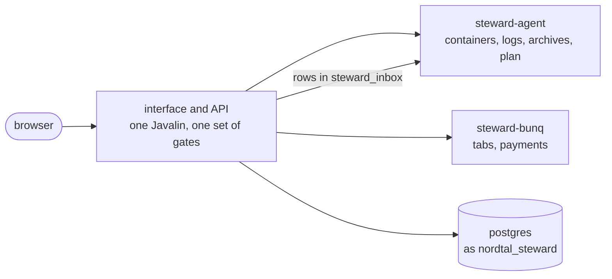

# steward

Steward's web interface and its API, payments, metrics, alerts and the clocks that ask for runs. It
carries out no run itself: a button, a clock or `/update` writes a row into `steward_inbox`, and
`steward-agent` carries it out. It starts once `steward-agent` is healthy, which is when the schema
is current.

```bash
docker compose up -d steward                                           # serve
docker exec nordtal-s2-steward-1 steward forget-factors <discord-id>   # a lost security key
docker run --rm ghcr.io/nordtal/steward generate-vapid-keys            # a Web Push keypair
```

Any other word is refused, so a typo never starts a second interface beside the running one.



## One process

The interface, the stack routes (`stack/Routes`) and the runs' view share one Javalin and one set of
gates: a read needs a signed-in admin with a key (`KEY_HELD`), a change a fresh one (`KEY_FRESH`).
The plugin "added by" comes from the session, and a long log follow re-checks it once a second.

The process on the internet holds no Docker socket and mounts no volume; everything Docker knows
comes from `steward-agent` through `AgentClient`. It logs in as `nordtal_steward`
(`DatabaseRole.STEWARD`), and its tests open the database under that role too, so a statement it was
never granted fails in `check`.

## What it does

- **Runs.** Every button that stops something, and the two clocks, write a row into `steward_inbox`;
  the agent writes the report back into it and the interface follows it on `nordtal_update`.
- **Containers and images.** State, health and the last sample come from the agent, as does writing
  into a console, naming who typed the line. The console suggests from each server's `command_tree`
  and reads it again as soon as a server publishes a changed one.
  An image the registry could not be asked about shows as unchecked, never as current.
- **Metrics.** Every 30 seconds the agent's new sampler rounds are copied into `metric_sample` and
  folded into hourly means after 30 days.
- **Backups.** The nightly clock writes a request row; steward lists and downloads archives through the agent.
- **Journal.** Every route that changes something writes a line through `:database`'s `Journal` with
  the signed-in admin as a structured actor and the line as a message of the admin bundle; the
  Journal page renders it through the web target.
- **Alerts.** A row in `admin_alert`, raised by whoever saw it: steward measures the stack every 30
  seconds against the `web` group's thresholds and raises failed runs and unbookable payments; the bot
  raises what it could not do in Discord. Steward routes each row once, per alert type and admin, to
  Web Push (title and level rendered in plain text) and to the admin channel through the bot's inbox.
- **Payments.** Steward books them and holds no bank credential. A booking is one transaction in
  `:database`'s `Bookings`: the request paid, the access appended, the donor flag set, the journal
  line written and the bot told, or none of it. The poll books what it matched at the `prices` of the
  start; a booking by hand from the Access page is the same booking with the admin as actor. Every
  question to bunq goes to `steward-bunq`; at start it asks for the account for up to thirty seconds,
  and when none answers the log says so at ERROR and payments stay off until the next start.

### The live stream

A signed-in browser holds one `GET /api/live` (`KEY_HELD`), an SSE stream of `change` events whose
data is `{topic, version}`: a `live.Topic` and a short hash of its new answer, never the answer. The
browser refetches what the topic covers from the route that owns it. `LiveFeed` re-reads a topic in
full from the same reads those routes answer with and announces it when the hash moves; it reads only
while somebody listens. The hub rings it on the channels in `Web.LIVE_CHANNELS` and on its minute;
topics only the agent knows (containers, host, topology) are read every ten seconds as well.
`nordtal_smp` is not among the channels, since play moves the track many times a minute. A request in
a server's or the bot's inbox moves its topic by `Inbox.version()`. Logs are their own follow,
relayed from the agent once.

### The API's types

Every route answers and reads records, declared in the route's feature package. The frontend's types
in `frontend/src/lib/api.gen.ts` are written from them by `./gradlew :steward:generateApiTypes`, and
`ApiTypesTest` fails on `check` while the committed file differs. `ApiTypes` (test sources) is a small
reflection over record components, since no maintained generator reads JSpecify's type-use
`@Nullable`. `StewardWire` (test sources) lists the top-level records and `ApiRoots` gathers them. A
`@Nullable` component is an absent field, never `null`. `WireJson` is the one codec of the routes.
Three types stay hand-written in `lib/api.ts`: the bodies of a settings save and a message save
(where `null` resets and absent leaves) and the glyph manifest.

### Texts

Every word the page shows is a key of the `steward` bundle, English only, declared by
`texts.StewardTexts` and overridable like any other.

- `GET /api/texts` serves every key's variants as parsed trees with overrides layered, open before
  sign-in. `lib/texts.ts` is the web target: it fills a tree into text nodes, never markup, and
  formats values in `en-GB` and the browser's zone. `t(key, values)` is typed by `texts.gen.ts`, and
  `texts.gen.json` is the packaged English; `generateApiTypes` writes both and `TextTypesTest` fails
  while either differs.
- A refusal a person meets is a `texts.RequestRefused`: the status, a message of the bundle and the
  code the page branches on. A refused write of `:database` (`Refused`) reaches the same handlers.
  What answers a malformed request is a literal, like a log line.
- A page's own words are a section of their own, one interface per page beside `StewardTexts`; the
  words every settings dialog shares are `texts.Forms`. What Steward says back as data is a message
  the page renders; a server's own answer passes through `steward.said.words`.

### Game data, pickers, editors

- `GET /api/game-data` serves the union of the servers' catalogues for the newest version with the
  icon sheet's index; the sheet is cached per version. The settings form draws one picker per field
  a schema marks with `refers`, from the catalogue, the guild or the people Steward knows, and falls
  back to the typed field where nothing can be listed. The guild's channels are the list discord-bot
  publishes into `guild_channels`, so Steward never holds the bot's token and shows the last list
  while the bot is down.
- The milestone track joins the database's progress to the group's own sections by their `key`, so
  nothing in it knows what a milestone holds.
- A plugin's descriptor may name a custom editor per group; the registry draws it only when the editor
  reads the document it got. An editor knows its structure, never a label or a reference. A design proposal is a page under `/designs/` until it is built.

### Texts

The Texts page (`/texts`) edits every text of every bundle, Steward's own among them, from
`GET /api/messages`: each text once, as `<bundle>/<key>`, with the services whose jar ships it, the
places a preview reaches, the network's `languages`, each service's tone `colours` and where each
place is (`places`). The texts are grouped by where their first place is (in game, Discord, Steward
& Admin), the `values` bundle apart as the building blocks, then by topic; a filter keeps one
service's texts and draws them in its palette, and pills name the places a text appears in, a whole
surface as one. A bundle that ships English only is edited in English only. One key is open at a
time. Its text is edited as it looks (runs of styled text with values as pills, `lib/rich-text.ts`)
or as it is written (the source coloured from the marks of the one parser in `lib/message-tree.ts`).
The tools above the field offer what the key's format allows: its values with their examples
(`GET /api/message-examples`), glyphs, tones, colours, styles, hover, click and actions. Whether a
text is right is only ever `MessageCheck`: the editor asks `GET /api/message-check` once typing
pauses, and the save refuses what it errs on. An override no process shows
(`GET /api/message-fallbacks`) opens with what it was written over and what the jar has now. Below
the field is one preview per place, as the game, Discord, Steward's page or a notification shows
it; a building block gets one plain preview. The counter is the key's `limit`, the strictest of its
places. A place a preview reaches has a send button, which asks `POST /api/message-preview`: a
Discord place arrives as a direct message from the bot, a game place on the admin's linked player's
server, filled with the editor's examples, in the filtered service's palette if there is one. One
`PUT /api/messages` saves the changes of every bundle, keyed by bundle and key.

## Configuration

The connection and every secret come from the environment; everything else is three groups in the
database, which Steward publishes at start and edits on its settings pages. `StewardSettings` checks
them before the web starts. A change to `steward` re-arms both clocks without a restart, one to
`alerts` applies at the next reading. Where a run's versions come from is `steward-agent`'s `runs` group.

| group      | environment                  | holds                                                             |
| ---------- | ---------------------------- | ----------------------------------------------------------------- |
| `steward`  | `NORDTAL_STEWARD_*`          | the clocks, the agent's and steward-bunq's addresses              |
| `web`      | `NORDTAL_STEWARD_WEB_*`      | the port, the public address, Discord sign-in, WebAuthn, Web Push |
| `alerts`   | `NORDTAL_STEWARD_ALERTS_*`   | the thresholds steward's measured alerts fire on                  |
| `database` | `NORDTAL_STEWARD_DATABASE_*` | the connection, from the environment alone                        |

## Tests

```bash
./gradlew :steward:test       # no network; stack tests talk to AgentStandIn, the agent's API over a fake daemon
./gradlew :steward:preview    # the real interface on http://localhost:18180 over stand-ins and a scratch database
```

`preview` signs in as an invented admin whose key counts as just held, until it is stopped, so a page
is looked at without a security key. `--args="--dump FILE"` restores a `pg_dump` first, and the
session cookie is written to `build/preview/state.json` as Playwright's `storageState`.
